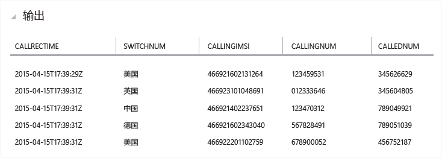

<properties
	pageTitle="流分析入门：实时检测欺诈行为 | Azure"
	description="了解如何通过流分析创建实时欺诈行为检测解决方案。使用事件中心进行实时事件处理。"
	keywords="异常检测、欺诈检测、实时异常检测"
	services="stream-analytics"
	documentationCenter=""
	authors="jeffstokes72"
	manager="paulettm"
	editor="cgronlun" />

<tags
	ms.service="stream-analytics"
	ms.date="05/03/2016"
	wacn.date="06/20/2016"/>

# Azure 流分析入门：实时检测欺诈行为

了解如何创建端到端解决方案，以便通过 Azure 流分析实时检测欺诈行为。将事件引入 Azure 事件中心、编写用于聚合或提醒的流分析查询，以及将结果发送到输出接收器，以便通过实时处理来分析数据。虽然介绍的是电信方面的实时异常检测，但作为示例的技术同样适用于其他类型的欺诈检测，例如盗窃信用卡或身份的情况。

流分析是一种完全托管的服务，可以在云中通过流式数据进行低延迟、高度可用、可伸缩且复杂的事件处理。有关详细信息，请参阅 [Azure 流分析简介](/documentation/articles/stream-analytics-introduction/)。

## 方案：实时进行远程通信和 SIM 欺诈行为检测

电信公司的传入呼叫数据量很大。公司需要从其数据中获取以下信息：
* 将此数据削减到一个可管理的数量，然后分析特定时间和特定地理区域客户的使用情况。
* 实时检测 SIM 欺诈行为（在差不多同一时间出现多个同一身份发起的呼叫，但这些呼叫却位于不同的地理区域），以便快速进行应对，向客户发送通知或关闭相应的服务。

在标准的物联网 (IoT) 方案中，会生成大量的遥测或传感器数据，客户需要对这些数据进行聚合分析，或者需要在出现异常情况时对其用户实时进行提醒。

## 先决条件

- 从 Microsoft 下载中心下载 [TelcoGenerator.zip](http://download.microsoft.com/download/8/B/D/8BD50991-8D54-4F59-AB83-3354B69C8A7E/TelcoGenerator.zip) 
- 或者，从 [GitHub](https://github.com/Azure/azure-stream-analytics/tree/master/DataGenerators/TelcoGenerator) 获取事件生成器的源代码

## 创建 Azure 事件中心输入和使用者组

示例应用程序将会生成事件并将其推送到进行实时处理的事件中心实例。为流分析引入事件时，Service Bus 事件中心是首选的方法。你可以在 [Azure Service Bus 文档](/documentation/services/service-bus/)中了解有关事件中心的更多信息。

创建事件中心的步骤：

1.	在 [Azure 门户](https://manage.windowsazure.cn/)中单击“新建”>“应用程序服务”>“Service Bus”>“事件中心”>“快速创建”。提供创建新的事件中心所需的名称、区域以及新的或现有的命名空间。  
2.	最佳做法是让每个流分析作业都从单个事件中心使用者组进行读取。我们将在下面向你详细介绍创建使用者组的过程，你可以[了解有关使用者组的详细信息](/documentation/articles/event-hubs-overview/)。若要创建使用者组，请导航到新创建的事件中心并单击“使用者组”选项卡，然后单击页面底部的“创建”，为使用者组提供一个名称。
3.	若要授予对事件中心的访问权限，需创建共享访问策略。单击事件中心的“配置”选项卡。
4.	在“共享访问策略”下，使用“管理”权限创建一个新策略。

	

5.	单击页面底部的“保存”。
6.	导航到“仪表板”，单击页面底部的“连接信息”，然后复制并保存连接信息。

## 配置并启动事件生成器应用程序

我们提供了一个客户端应用程序，该程序会生成示例性的传入呼叫元数据并将其推送到事件中心。按照以下步骤来设置此应用程序。

1.	下载 [TelcoGenerator.zip 文件](http://download.microsoft.com/download/8/B/D/8BD50991-8D54-4F59-AB83-3354B69C8A7E/TelcoGenerator.zip)
2.	将 **telcodatagen.exe.config** 中的 Microsoft.ServiceBus.ConnectionString 和 EventHubName 值替换为事件中心的连接字符串和名称。
3.	启动应用程序。用法如下：

   telcodatagen.exe [#NumCDRsPerHour] [SIM Card Fraud Probability] [#DurationHours]

以下示例将生成 1000 个事件，在为时 2 小时的过程中，有 20% 的可能性会出现欺诈行为。

    telcodatagen.exe 1000 .2 2

你会看到记录被发送到事件中心。将在此实时欺诈检测应用程序中使用的某些关键字段定义如下：

| 记录 | 定义 |
| ------------- | ------------- |
| CallrecTime | 调用开始时间的时间戳。 |
| SwitchNum | 用于连接呼叫的电话交换机。 |
| CallingNum | 呼叫方的电话号码。 |
| CallingIMSI | 国际移动用户标识 (IMSI)。呼叫方的唯一标识符。 |
| CalledNum | 呼叫接收人的电话号码。 |
| CalledIMSI | 国际移动用户标识 (IMSI)。呼叫接收人的唯一标识符。 |

## 创建流分析作业
现在，我们已获得远程通信事件流，因此可以设置一个流分析作业来实时分析这些事件。

### 预配流分析作业

1.	在 Azure 门户中，单击“新” > “数据服务” > “流分析” > “快速创建”。
2.	指定以下值，然后单击“创建流分析作业”：

	* **作业名称**：输入作业名称。

	* **区域**：选择要在其中运行作业的区域。考虑将作业和事件中心放在同一区域，以确保获得更好的性能，并确保在不同区域之间传输数据时不需付费。

	* **存储帐户**：选择要使用的 Azure 存储帐户，以便为所有在此区域运行的流分析作业存储监视数据。你可以选择现有存储帐户，也可以创建新的存储帐户。

3.	单击左窗格中的“流分析”，列出流分析作业。

	

4.	新作业在显示时的状态为“已创建”。请注意，页面底部的“启动”按钮已禁用。你必须先配置作业输入、输出和查询，然后才能启动作业。

### 指定作业输入
1.	在流分析作业中，单击页面顶部的“输入”，然后单击“添加输入”。此时会打开一个对话框，引导你完成设置输入所需的一系列步骤。
2.	选择“数据流”，然后单击右侧的按钮。
3.	选择“事件中心”，然后单击右侧的按钮。
4.	在第三页中键入或选择以下值：

	* **输入别名**：输入此作业输入的友好名称，如 *CallStream*。请注意，你需要在后面的查询中使用此名称。
	* **事件中心**：如果你创建的事件中心与流分析作业属于同一订阅，请选择事件中心所在的命名空间。

	如果你的事件中心属于其他订阅，请选择“使用其他订阅的事件中心”，然后手动输入以下项目的相关信息：**Service Bus 命名空间**、**事件中心名称**、**事件中心策略名称**、**事件中心策略密钥**以及**事件中心分区计数**。

	* **事件中心名称**：选择事件中心的名称。

	* **事件中心策略名称**：选择此前在本教程中创建的事件中心策略。

	* **事件中心使用者组**：键入此前在本教程中创建的使用者组。
5.	单击右侧按钮。
6.	指定以下值：

	* **事件序列化程序格式**：JSON
	* **编码**：UTF8
7.	单击相应勾选按钮以添加此源，并确保流分析可以成功连接到事件中心。

### 指定作业查询

流分析支持简单的声明性查询模型，用于描述实时处理的转换。若要了解有关语言的详细信息，请参阅 [Azure 流分析查询语言参考](https://msdn.microsoft.com/zh-cn/library/dn834998.aspx)。本教程将帮助你创作和测试多个可通过实时调用数据流完成的查询。

#### 可选：示例输入数据
若要针对实际的作业数据来验证查询，可使用“示例数据”功能从流中提取事件，然后创建包含要测试事件的 .JSON 文件。以下步骤演示了如何执行此操作，我们还提供了一个用于测试的示例性 [telco.json](https://github.com/Azure/azure-stream-analytics/blob/master/Sample%20Data/telco.json) 文件。

1.	选择事件中心输入，然后单击页面底部的“示例数据”。
2.	在出现的对话框中，指定开始收集数据的“开始时间”，以及使用额外数据的“持续时间”。
3.	单击相应的勾选按钮，开始对输入中的数据取样。生成数据文件可能需要一到两分钟。完成此过程以后，单击“详细信息”，然后即可下载和保存所生成的 .JSON 文件。

	

#### 传递查询

如果你想要将每个事件存档，则可使用传递查询来读取事件或消息负载中的所有字段。开始时，可以进行简单的传递查询来投射事件中的所有字段。

1.	单击流分析作业页顶部的“查询”。
2.	将以下内容添加到代码编辑器：

		SELECT * FROM CallStream

	> 请确保输入源的名称与你此前指定的输入的名称相匹配。

3.	单击查询编辑器下的“测试”。
4.	提供测试文件，可以使用在前面的步骤中创建的文件，也可以使用 [telco.json](https://github.com/Azure/azure-stream-analytics/blob/master/Sample%20Data/telco.json)。
5.	单击勾选按钮，然后就会看到结果显示在查询定义下方。

	

### 列投影

现在，我们需要将返回的字段缩减成较小的集合。

1.	在代码编辑器中将查询更改为：

		SELECT CallRecTime, SwitchNum, CallingIMSI, CallingNum, CalledNum
		FROM CallStream

2.	单击查询编辑器下的“重新运行”以查看查询结果。

	

### 按区域计算传入呼叫数：带聚合功能的翻转窗口

为了比较每个区域的传入呼叫数，我们将利用 [TumblingWindow](https://msdn.microsoft.com/zh-cn/library/azure/dn835055.aspx) 来获取每 5 秒钟就按 SwitchNum 进行分组的传入呼叫的计数。

1.	在代码编辑器中将查询更改为：

		SELECT System.Timestamp as WindowEnd, SwitchNum, COUNT(*) as CallCount
		FROM CallStream TIMESTAMP BY CallRecTime
		GROUP BY TUMBLINGWINDOW(s, 5), SwitchNum

	此查询使用 **Timestamp By** 关键字在要用于临时计算的负载中指定时间戳字段。如果未指定此字段，将根据每个事件到达事件中心的时间执行开窗操作。请参阅[流分析查询语言参考中的“到达时间与应用程序时间”](https://msdn.microsoft.com/zh-cn/library/azure/dn834998.aspx)。

	请注意，你可以使用 **System.Timestamp** 属性访问每个窗口结束时的时间戳。

2.	单击查询编辑器下的“重新运行”以查看查询结果。

	

### 使用自联接进行 SIM 欺诈行为检测

为了确定可能存在的欺诈性使用情况，我们需要查找从同一个用户发出但发出位置却位于不同的地区且间隔时间不到 5 秒钟的呼叫。我们会让呼叫事件流进行自我[联接](https://msdn.microsoft.com/zh-cn/library/azure/dn835026.aspx)，看是否存在此类情况。

1.	在代码编辑器中将查询更改为：

		SELECT System.Timestamp as Time, CS1.CallingIMSI, CS1.CallingNum as CallingNum1,
		CS2.CallingNum as CallingNum2, CS1.SwitchNum as Switch1, CS2.SwitchNum as Switch2
		FROM CallStream CS1 TIMESTAMP BY CallRecTime
		JOIN CallStream CS2 TIMESTAMP BY CallRecTime
		ON CS1.CallingIMSI = CS2.CallingIMSI
		AND DATEDIFF(ss, CS1, CS2) BETWEEN 1 AND 5
		WHERE CS1.SwitchNum != CS2.SwitchNum

2.	单击查询编辑器下的“重新运行”以查看查询结果。

	

### 创建输出接收器

现在，我们已经定义了事件流、用于引入事件的事件中心输入，以及用于通过流执行转换的查询，最后一步是为作业定义输出接收器。我们会针对欺诈行为将事件写入 Blob 存储。

按照下面的步骤为 Blob 存储创建容器（如果还没有）。

1.	使用现有存储帐户，或者通过单击“新建” > “数据服务” > “存储” > “快速创建”并遵循相关说明进行操作来创建新的存储帐户。
2.	选择存储帐户，单击页面顶部的“容器”，然后单击“添加”。
3.	指定容器的“名称”，然后将其“访问权限”设置为“公共 Blob”。

## 指定作业输出

1.	在流分析作业中，单击页面顶部的“输出”，然后单击“添加输出”。此时会打开一个对话框，引导你完成设置输出所需的一系列步骤。
2.	选择“Blob 存储”，然后单击右侧的按钮。
3.	在第三页中键入或选择以下值：

	* **输出别名**：输入此作业输出的友好名称。
	* **订阅**：如果你创建的 Blob 存储与流分析作业属于同一订阅，请选择“使用当前订阅中的存储帐户”。如果你的存储属于其他订阅，请选择“使用其他订阅中的存储帐户”，然后针对“存储帐户”、“存储帐户密钥”、“容器”手动输入相关信息。
	* **存储帐户**：选择存储帐户的名称。
	* **容器**：选择容器的名称。
	* **文件名前缀**：键入写入 blob 输出时要使用的文件前缀。

4.	单击右侧按钮。
5.	指定以下值：

	* **事件序列化程序格式**：JSON
	* **编码**：UTF8

6.	单击相应勾选按钮以添加此源，并确保流分析可以成功连接到存储帐户。

## 启动要进行实时处理的作业

由于作业输入、查询和输出均已指定，因此我们可以启动流分析作业来实时检测欺诈行为。

1.	在作业“仪表板”上，单击页面底部的“启动”。
2.	在出现的对话框中，选择“作业开始时间”，然后单击对话框底部的勾选按钮。作业状态将更改为“正在启动”，然后很快会转变为“正在运行”。

## 查看欺诈检测输出

在将欺诈性事件实时写入到输出中时，使用 [Azure 存储资源管理器](https://azurestorageexplorer.codeplex.com/)或 [Azure 资源管理器](http://www.cerebrata.com/products/azure-explorer/introduction)之类的工具查看这些事件。

## 获取支持
如需进一步的帮助，请尝试我们的 [Azure 流分析论坛](https://social.msdn.microsoft.com/Forums/zh-cn/home?forum=AzureStreamAnalytics)。

## 后续步骤

- [Azure 流分析简介](/documentation/articles/stream-analytics-introduction/)
- [Azure 流分析入门](/documentation/articles/stream-analytics-get-started/)
- [缩放 Azure 流分析作业](/documentation/articles/stream-analytics-scale-jobs/)
- [Azure 流分析查询语言参考](https://msdn.microsoft.com/zh-cn/library/azure/dn834998.aspx)
- [Azure 流分析管理 REST API 参考](https://msdn.microsoft.com/zh-cn/library/azure/dn835031.aspx)

<!---HONumber=Mooncake_0411_2016-->