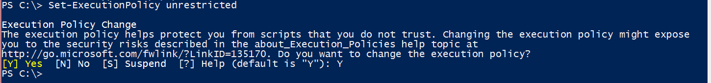
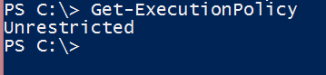
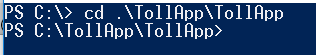

<properties
    pageTitle="使用流分析生成 IoT 解决方案 | Azure"
    description="使用收费站方案了解流分析 IoT 解决方案的入门教程"
    keywords="iot 解决方案, 开窗函数"
    documentationcenter=""
    services="stream-analytics"
    author="jeffstokes72"
    manager="jhubbard"
    editor="cgronlun" />
<tags
    ms.assetid="a473ea0a-3eaa-4e5b-aaa1-fec7e9069f20"
    ms.service="stream-analytics"
    ms.devlang="na"
    ms.topic="article"
    ms.tgt_pltfrm="na"
    ms.workload="data-services"
    ms.date="01/24/2017"
    wacn.date="03/10/2017"
    ms.author="jeffstok" />  

# 使用流分析生成 IoT 解决方案
## 介绍
在本教程中，会学习如何使用 Azure 流分析从数据获得实时见解。开发人员可以轻松地将数据流（例如点击流、日志和设备生成的事件）与历史记录或参考数据结合，从中获得业务见解。由 Azure 托管的 Azure 流分析是可完全托管的实时流计算服务，它具有内置的复原性、低延迟及可缩放性，可让你在几分钟内就上手。

完成本教程之后，你将能够：

* 熟悉 Azure 流分析门户。
* 配置和部署流式处理作业。
* 使用流分析查询语言来表达实际问题并解决这些问题。
* 自信地使用流分析为客户开发流式处理解决方案。
* 使用监视和日志记录体验来排解问题。

## 先决条件

若要完成本教程，需要满足以下先决条件：

* 最新版本的 [Azure PowerShell](https://docs.microsoft.com/zh-cn/powershell/azureps-cmdlets-docs)
* Visual Studio 2015 或免费的 [Visual Studio Community](https://www.visualstudio.com/products/visual-studio-community-vs.aspx)
* [Azure 订阅](/pricing/1rmb-trial/)
* 计算机的管理员权限
* 从 Microsoft 下载中心下载 [TollApp.zip](http://download.microsoft.com/download/D/4/A/D4A3C379-65E8-494F-A8C5-79303FD43B0A/TollApp.zip)
* 可选：[GitHub](https://aka.ms/azure-stream-analytics-toll-source) 中 TollApp 事件生成器的源代码

## 场景介绍：“你好，收费站！”
收费站是常见设施。在世界各地的许多高速公路、桥梁和隧道中都可以看到它们的身影。每个收费站有多个收费亭。在人工收费亭中，需要停车来向服务员付费。在自动收费亭中，位于每个收费亭顶部的传感器会在车辆通过收费亭时扫描挡风玻璃上贴附的 RFID 卡。我们可以轻松地将车辆通过这些收费站的情况想象成能够执行许多有趣操作的事件流。

## 传入的数据
本教程处理两个数据流。安装在收费站入口和出口处的传感器会生成第一个流。第二个流是具有车辆登记数据的静态查找数据集。

### 入口数据流
入口数据流包含车辆进入收费站的相关信息。

| TollID | EntryTime | LicensePlate | 状态 | 制造商 | 模型 | VehicleType | VehicleWeight | 收费站 | 标记 |
| --- | --- | --- | --- | --- | --- | --- | --- | --- | --- |
| 1 |2014-09-10 12:01:00.000 |JNB 7001 |NY |Honda |CRV |1 |0 |7 | |
| 1 |2014-09-10 12:02:00.000 |YXZ 1001 |NY |Toyota |Camry |1 |0 |4 |123456789 |
| 3 |2014-09-10 12:02:00.000 |ABC 1004 |CT |Ford |Taurus |1 |0 |5 |456789123 |
| 2 |2014-09-10 12:03:00.000 |XYZ 1003 |CT |Toyota |Corolla |1 |0 |4 | |
| 1 |2014-09-10 12:03:00.000 |BNJ 1007 |NY |Honda |CRV |1 |0 |5 |789123456 |
| 2 |2014-09-10 12:05:00.000 |CDE 1007 |NJ |Toyota |4x4 |1 |0 |6 |321987654 |

下面是每个列的简短说明：

| 列 | 说明 |
| --- | --- |
| TollID | 唯一标识收费亭的收费亭 ID |
| EntryTime | 车辆进入收费亭的日期和时间（世界协调时） |
| LicensePlate | 车辆的牌照号码 |
| 状态 | 某个地区 |
| 制造商 | 汽车制造商 |
| 模型 | 车辆的型号 |
| VehicleType | 1 代表客车，2 代表商用车 |
| WeightType | 汽车的重量，单位为吨；0 代表客车 |
| 收费站 | 通行费，单位为元 |
| 标记 | 车辆上可用于自动付费的电子标签；空白代表手动付费 |

### 出口数据流
出口数据流包含车辆离开收费站的相关信息。

| **TollId** | **ExitTime** | **LicensePlate** |
| --- | --- | --- |
| 1 |2014-09-10T12:03:00.0000000Z |JNB 7001 |
| 1 |2014-09-10T12:03:00.0000000Z |YXZ 1001 |
| 3 |2014-09-10T12:04:00.0000000Z |ABC 1004 |
| 2 |2014-09-10T12:07:00.0000000Z |XYZ 1003 |
| 1 |2014-09-10T12:08:00.0000000Z |BNJ 1007 |
| 2 |2014-09-10T12:07:00.0000000Z |CDE 1007 |

下面是每个列的简短说明：

| 列 | 说明 |
| --- | --- |
| TollID |唯一标识收费亭的收费亭 ID |
| ExitTime |车辆离开收费亭的日期和时间（世界协调时） |
| LicensePlate |车辆的牌照号码 |

### 商用车登记数据
本教程使用商用车登记数据库的静态快照。

| LicensePlate | RegistrationId | Expired |
| --- | --- | --- |
| SVT 6023 |285429838 |1 |
| XLZ 3463 |362715656 |0 |
| BAC 1005 |876133137 |1 |
| RIV 8632 |992711956 |0 |
| SNY 7188 |592133890 |0 |
| ELH 9896 |678427724 |1 |

下面是每个列的简短说明：

| 列 | 说明 |
| --- | --- |
| LicensePlate |车辆的牌照号码 |
| RegistrationId |车辆的登记 ID |
| Expired |车辆的登记状态：0 代表车辆登记仍有效，1 代表车辆登记已过期 |

## 设置 Azure 流分析的环境

需要 Azure 订阅才能完成此教程。Microsoft 提供了 Azure 服务的试用版。

如果没有 Azure 帐户，可以[请求试用版](/pricing/1rmb-trial/)。

> [AZURE.NOTE]
> 若要注册试用版，必须有可接收短信的移动设备和有效的信用卡。
> 
> 

## 预配本教程所需的 Azure 资源
本教程需要两个事件中心来接收*入口*和*出口*数据流。Azure SQL 数据库会输出流分析作业的结果。Azure 存储会存储有关车辆登记的参考数据。

可以使用 GitHub 上 TollApp 文件夹中的 Setup.ps1 脚本来创建所有必要的资源。为了节省时间，我们建议运行此脚本。如果想要详细了解如何在 Azure 门户中配置这些资源，请参阅“在 Azure 门户中配置教程资源”附录。

下载并保存 [TollApp](http://download.microsoft.com/download/D/4/A/D4A3C379-65E8-494F-A8C5-79303FD43B0A/TollApp.zip) 支持文件夹和文件。

*以管理员身份*打开 **Azure PowerShell** 窗口。如果还没有 Azure PowerShell，请根据[安装和配置 Azure PowerShell](https://docs.microsoft.com/zh-cn/powershell/azureps-cmdlets-docs) 中的说明进行安装。

Windows 会自动阻止 .ps1、.dll 和 .exe 文件，因此需要在运行该脚本之前设置执行策略。确保*以管理员身份*运行 Azure PowerShell 窗口。运行 **Set-ExecutionPolicy unrestricted**。出现提示时键入 **Y**。

  

运行 **Get-ExecutionPolicy** 以确保命令正常工作。

  

转到包含脚本和生成器应用程序的目录。

  

键入 **.\\Setup.ps1** 以设置 Azure 帐户，创建并配置所有必需的资源，然后开始生成事件。脚本会随机挑选一个区域来创建资源。若要显式指定一个区域，可以传递 **-location** 参数，如以下示例所示：

**.\\Setup.ps1 -location "China North"**

  

脚本随即打开 Azure 的**登录**页。输入你的帐户凭据。

> [AZURE.NOTE]
> 如果帐户有权访问多个订阅，系统将要求输入想要用于本教程的订阅名称。
> 
> 

脚本可能需要几分钟的时间来运行。完成后，输出应类似如下屏幕截图。

  

还会看到类似如下屏幕截图的另一个窗口。此应用程序将事件发送到 Azure 事件中心，需要使用该应用程序来完成教程。因此，在完成本教程前，请不要停止该应用程序或关闭此窗口。

  

现在，Azure 门户中应会显示资源。转到 <https://portal.azure.cn>，使用帐户凭据登录。请注意，当前某些功能使用经典管理门户。相关步骤将清晰标出。

### Azure 事件中心
在 Azure 门户的左侧管理窗格底部，单击“更多服务” 。在提供的字段中键入**事件中心**，然后单击“事件中心”。此时将启动新的浏览器窗口，显示**经典管理门户**的**服务总线**区域。可在此处查看由 Setup.ps1 脚本创建的事件中心。

  

单击以 *tolldata* 开头的项。单击“事件中心”选项卡。你将在此命名空间中看到 2 个已创建的事件中心，分别名为 *entry* 和 *exit*。

  

### Azure 存储容器
1. 返回到浏览器中打开指向 Azure 门户的选项卡。单击 Azure 门户左侧的“存储”，查看本教程中使用的 Azure 存储容器。

	  

2. 单击以 *tolldata* 开头的项。单击“容器”选项卡，查看创建的容器。
   
	  

3. 单击“tolldata”容器，查看已上传的、包含车辆登记数据的 JSON 文件。
   
	  

### Azure SQL 数据库
1. 返回在浏览器中打开的第一个选项卡上的 Azure 门户。单击 Azure 门户左侧的“SQL 数据库”，查看要在本教程中使用的 SQL 数据库，然后单击“tolldatadb”。
   
      

2. 复制服务器名称但省略端口号（例如 *servername*.database.chinacloudapi.cn）。
    

## 从 Visual Studio 连接到数据库
使用 Visual Studio 来访问输出数据库中的查询结果。

从 Visual Studio 连接到 SQL 数据库（目的地）：

1. 打开 Visual Studio，然后单击“工具”>“连接到数据库”。
2. 出现提示时，选择“Microsoft SQL Server”作为数据源。
   
	  

3. 在“服务器名称”字段中，粘贴在上一部分从 Azure 门户复制的名称（即，*服务器名称*.database.chinacloudapi.cn）。
4. 单击“使用 SQL Server 身份验证”。
5. 在“用户名”字段中输入 **tolladmin**，在“密码”字段中输入 **123toll!**。
6. 单击“选择或输入数据库名称”，然后选择“TollDataDB”作为数据库。
   
	  

7. 单击**“确定”**。
8. 打开 Server Explorer。
   
	  

9. 在 TollDataDB 数据库中可以看到四个表。
   
	  

## 事件生成器：TollApp 示例项目
PowerShell 脚本使用 TollApp 示例应用程序自动开始发送事件。你不需要执行任何其他步骤。

但是，如果对实现的细节有兴趣，可以在 GitHub [samples/TollApp](https://github.com/Azure/azure-stream-analytics/tree/master/Samples/TollApp) 中找到 TollApp 应用程序的源代码。

  

## 创建流分析作业
1. 在 Azure 门户中，单击页面左上角的绿色加号，创建新的流分析作业。选择“智能+分析”，然后单击“流分析作业”。
   
	  

2. 请提供作业名称，验证订阅是否正确，然后在事件中心存储所在的区域中创建新的资源组（对于此脚本，默认值为“中国东部”）。
3. 在页面底部单击“固定到仪表板”，然后单击“创建”。
   
	  

## 定义输入源
1. 将创建作业并打开作业页面。还可在门户仪表板上单击已创建的分析作业。

2. 单击“输入”选项卡，定义源数据。
   
	  

3. 单击“添加输入”。

	  

4. 输入 **EntryStream** 作为“输入别名”。
5. 源类型是**数据流**
6. 源是**事件中心**。
7. **服务总线命名空间**应是下拉列表中的 TollData。
8. **事件中心名称**应设置为**条目**。
9. **事件中心策略名称*是 **RootManageSharedAccessKey**（默认值）。
10. 选择“JSON”作为“事件序列化格式”，选择“UTF8”作为“编码”。
   
    设置看起来类似于：
   
	  

10. 单击页面底部的“创建”完成向导。
    
    现在，已创建入口流，可执行相同的步骤来创建出口流。请确保输入如以下屏幕截图所示的值。
    
	  

    
    已定义两个输入流：
    
      

    接下来，为包含车辆登记数据的 blob 文件添加参考数据输入。
    
11. 单击“添加”，然后执行与流输入相同的过程，但不同的是要选择“引用数据”而不是“数据流”，并且**输入别名**是**注册**。

12. 存储帐户以 **tolldata** 开头。容器名称应为 **tolldata**，**路径模式**应为 **registration.json**。此文件名区分大小写且应为**小写**。
    
      

13. 单击“创建”完成向导。

现在，已定义所有输入。

## 定义输出
1. 在“流分析作业概述”窗格中，选择“输出”。
   
      

2. 单击“添加”。
3. 将**输出别名**设置为“output”，然后将**接收器**设置为 **SQL 数据库**。
3. 选择本文“从 Visual Studio 连接到数据库”部分中使用的服务器名称。数据库名称为 **TollDataDB**。
4. 在“用户名”字段中输入 **tolladmin**，在“密码”字段中输入 **123toll!**，在“表”字段中输入 **TollDataRefJoin**。
   
      

5. 单击“创建”。

## Azure 流分析查询
“查询”选项卡包含转换传入数据的 SQL 查询。

  

本教程尝试回答几个与通行费数据相关的业务问题，并构造可在 Azure 流分析中使用的流分析查询来提供相关的答案。

在开始第一个流分析作业前，让我们来探讨几种场景和查询语法。

## Azure 流分析查询语言简介

假设需要统计进入某个收费亭的车辆数目。这是连续的事件流，因此必须定义“时段”。 让我们将问题修改为“每 3 分钟有多少辆车进入收费亭？”。这通常称为轮转计数。

让我们看看能回答此问题的 Azure 流分析查询：

    SELECT TollId, System.Timestamp AS WindowEnd, COUNT(*) AS Count
    FROM EntryStream TIMESTAMP BY EntryTime
    GROUP BY TUMBLINGWINDOW(minute, 3), TollId

如你所见，Azure 流分析会使用类似 SQL 的查询语言，并添加几个扩展来指定与时间相关的查询方面。

有关更多详细信息，请参阅 MSDN 中的 [Time Management](https://msdn.microsoft.com/zh-cn/library/azure/mt582045.aspx)（时间管理），以及查询中所用的 [Windowing](https://msdn.microsoft.com/zh-cn/library/azure/dn835019.aspx)（窗口化）构造。

## 测试 Azure 流分析查询
现在已编写第一个 Azure 流分析查询，可以使用位于 TollApp 文件夹中以下路径的示例数据文件来进行测试：

**..\\TollApp\\TollApp\\Data**

此文件夹包含以下文件：

* Entry.json
* Exit.json
* Registration.json

## 问题 1：进入某个收费亭的车辆数目

1. 打开 Azure 门户，转到创建的 Azure 流分析作业。单击“查询”选项卡，粘贴前一部分中的查询。

2. 若要根据示例数据验证此查询，请单击 ... 符号，再选择“上传文件中的示例数据”，将数据上传到 EntryStream 输入。

      

3. 在显示的窗格中，选择本地计算机上的文件 (Entry.json)，然后单击“确定”。“测试”图标现将变亮且可单击。
   
      

3. 验证查询的输出是否与以下预期结果相同：
   
      

## 问题 2：报告每辆车通过收费亭的总时间
一辆车通过收费亭所需的平均时间可帮助评估流程的效率和客户体验。

若要查找总时间，需要联接 EntryTime 流和 ExitTime 流。需要联接 TollId 和 LicencePlate 列中的流。**JOIN** 运算符要求指定弹性时间，说明联接事件之间可接受的时间差。使用 **DATEDIFF** 函数来指定事件之间的时间差不能超过 15 分钟。还会将 **DATEDIFF** 函数应用到出口和入口时间，以计算车辆通过收费站所需的实际时间。请注意在 **SELECT** 语句中（而非在 **JOIN** 条件中）使用 **DATEDIFF** 时，其使用方式的差异。

    SELECT EntryStream.TollId, EntryStream.EntryTime, ExitStream.ExitTime, EntryStream.LicensePlate, DATEDIFF (minute , EntryStream.EntryTime, ExitStream.ExitTime) AS DurationInMinutes
    FROM EntryStream TIMESTAMP BY EntryTime
    JOIN ExitStream TIMESTAMP BY ExitTime
    ON (EntryStream.TollId= ExitStream.TollId AND EntryStream.LicensePlate = ExitStream.LicensePlate)
    AND DATEDIFF (minute, EntryStream, ExitStream ) BETWEEN 0 AND 15

1. 若要测试此查询，请在作业的**查询**上更新该查询。按上文输入 **EntryStream** 的方式为 **ExitStream** 添加测试文件。
   
2. 单击“测试”。

3. 选中测试查询的复选框，然后查看输出：
   
	  

## 问题 3：报告登记已过期的所有商用车
Azure 流分析可以使用静态数据快照来与临时数据流联接。若要演示此功能，请使用以下示例问题。

如果某辆商用车已向收费公司登记，则可以直接通过收费亭，而不用停车接受检查。使用商用车登记查找表来识别登记已过期的所有商用车。

	SELECT EntryStream.EntryTime, EntryStream.LicensePlate, EntryStream.TollId, Registration.RegistrationId
	FROM EntryStream TIMESTAMP BY EntryTime
	JOIN Registration
	ON EntryStream.LicensePlate = Registration.LicensePlate
	WHERE Registration.Expired = '1'

若要使用参考数据测试查询，需要定义参考数据的输入源（已完成定义）。

若要测试此查询，请将查询粘贴到“查询”选项卡，单击“测试”并指定两个输入源和注册示例数据，然后单击“测试”。
   
  

## 启动流分析作业
现在可以完成配置并启动作业。保存问题 3 中的查询，此操作会生成与 **TollDataRefJoin** 输出表的架构匹配的输出。

转到作业“仪表板”并单击“启动”。

  

在随后打开的对话框中，将“开始输出”时间更改为“自定义时间”。将小时更改为当前时间的前一小时。此更改可确保从本教程开始生成事件后，来自事件中心的所有事件都得到处理。现单击“开始”按钮以开始作业。

  

启动作业可能需要几分钟时间。可以在流分析的顶级页中查看状态。

  

## 在 Visual Studio 中检查结果
1. 打开 Visual Studio 服务器资源管理器，然后右键单击“TollDataRefJoin”表。
2. 单击“显示表数据”，查看作业的输出。

	  

## 扩大 Azure 流分析作业
Azure 流分析设计为能够弹性缩放，以便处理大量数据。Azure 流分析查询可以使用 **PARTITION BY** 子句来告诉系统此步骤将会扩展。**PartitionId** 是系统添加的特殊列，它与输入（事件中心）的分区 ID 匹配。

	SELECT TollId, System.Timestamp AS WindowEnd, COUNT(*)AS Count
	FROM EntryStream TIMESTAMP BY EntryTime PARTITION BY PartitionId
	GROUP BY TUMBLINGWINDOW(minute,3), TollId, PartitionId

1. 停止当前作业，更新“查询”选项卡中的查询，然后打开作业仪表板中的“设置”齿轮。单击“缩放”。
   
    **流单元**定义作业能够接收的计算能力大小。
	
2. 将下拉菜单中的 1 更改为 6。
   
      

3. 转到“输出”选项卡，然后将 SQL 表名称更改为 **TollDataTumblingCountPartitioned**。

如果现在启动作业，Azure 流分析可将工作分发到更多计算资源，实现更高的吞吐量。请注意，TollApp 应用程序还会发送已按 TollId 分区的事件。

## 监视
“监视器”区域包含正在运行的作业的相关统计信息。首次需要配置，才能使用同一区域中的存储帐户（按本文档其余部分命名收费站）。

  

还可通过作业仪表板的“设置”区域访问“活动日志”。

## 结束语
本教程介绍 Azure 流分析服务。其中演示如何为流分析作业配置输入和输出。本教程还使用收费站数据方案来解释数据空间不断变化时所引发的常见问题类型，以及如何在 Azure 流分析中使用类似于 SQL 的简单查询来解决这些问题。本教程介绍用于处理临时数据的 SQL 扩展构造。其中说明如何联接不同的数据流、如何使用静态参考数据来扩充数据流，以及如何扩大查询来获得更高的吞吐量。

尽管本教程提供详细的简介，但它绝对不是完整的说明。有关使用 SAQL 语言的更多查询模式，可在[常用流分析使用模式的查询示例](/documentation/articles/stream-analytics-stream-analytics-query-patterns/)中找到。若要了解有关 Azure 流分析的详细信息，请参阅[联机文档](/documentation/services/stream-analytics/)。

## 清理 Azure 帐户
1. 在 Azure 门户中停止流分析作业。
   
    Setup.ps1 脚本创建两个事件中心以及一个 SQL 数据库。以下说明帮助在本教程结束时清理资源。
	
2. 在 PowerShell 窗口中键入 **.\\Cleanup.ps1**，启动用于删除本教程所用资源的脚本。
   
    > [AZURE.NOTE]
    > 资源按名称标识。在确认删除之前，请确保仔细检查每个项。
    > 
    >

<!---HONumber=Mooncake_0306_2017-->
<!--Update_Description:update meta properties;wording update-->