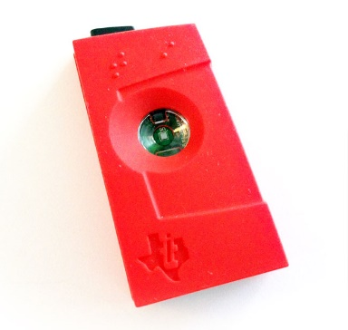
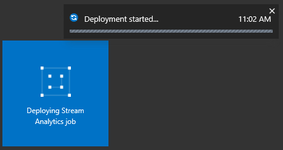
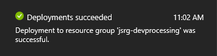
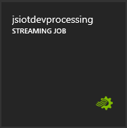
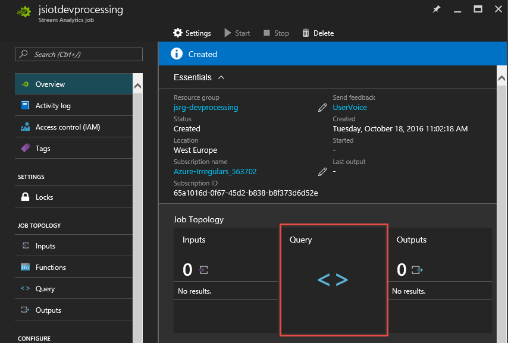
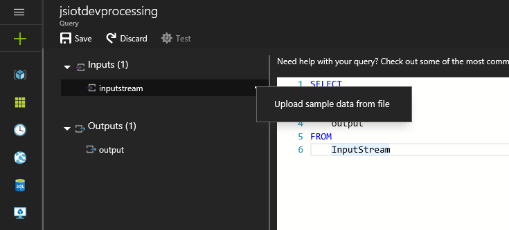
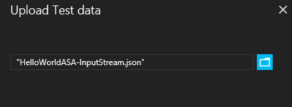
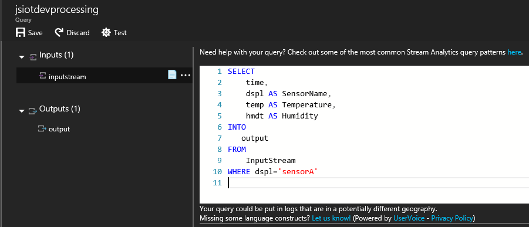
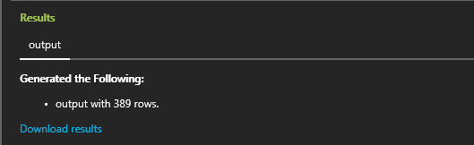
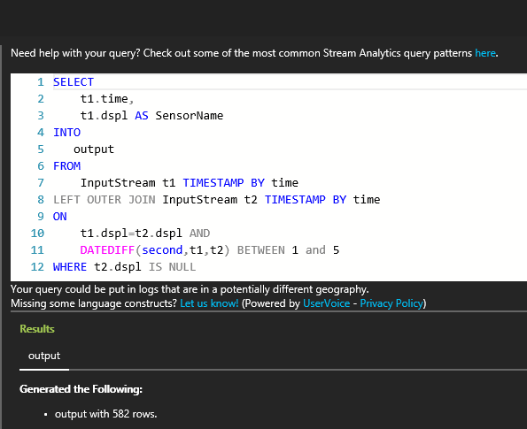

<properties
    pageTitle="IoT 实时数据流和 Azure 流分析 | Azure"
    description="带流分析和实时数据处理的 IoT 传感器标记和数据流"
    keywords="iot 解决方案, iot 入门"
    services="stream-analytics"
    documentationcenter=""
    author="jeffstokes72"
    manager="jhubbard"
    editor="cgronlun" />
<tags
    ms.assetid="3e829055-75ed-469f-91f5-f0dc95046bdb"
    ms.service="stream-analytics"
    ms.devlang="na"
    ms.topic="hero-article"
    ms.tgt_pltfrm="na"
    ms.workload="data-services"
    ms.date="03/28/2017"
    wacn.date="05/15/2017"
    ms.author="jeffstok"
    ms.translationtype="Human Translation"
    ms.sourcegitcommit="457fc748a9a2d66d7a2906b988e127b09ee11e18"
    ms.openlocfilehash="9308050193b97f44be859914af908599af067701"
    ms.contentlocale="zh-cn"
    ms.lasthandoff="05/05/2017" />

# 开始使用 Azure 流分析处理来自 IoT 设备的数据
在本教程中，会学习如何创建流处理逻辑，以从物联网 (IoT) 设备收集数据。 我们会使用真实的物联网 (IoT) 用例来演示如何经济实惠地快速生成解决方案。

## 先决条件
* [Azure 订阅](/pricing/1rmb-trial/)
* 可从 [GitHub](https://github.com/Azure/azure-stream-analytics/tree/master/Samples/GettingStarted) 下载示例查询和数据文件

## 方案
Contoso 是一家工业自动化公司，该公司已将其制造流程完全自动化。这家工厂中的设备配有可实时发送数据流的传感器。在此方案中，产品车间经理希望通过传感器数据获得实时见解，从而找到规律并采取措施。我们将对传感器数据使用流分析查询语言 (SAQL)，查找传入数据流的有趣规律。

下图中，Texas Instruments SensorTag 设备正在生成数据。

数据的有效负载是 JSON 格式，如下所示：

    {
        "time": "2016-01-26T20:47:53.0000000",  
        "dspl": "sensorE",  
        "temp": 123,  
        "hmdt": 34  
    }  

在实际情况下，其中可能有数百个传感器以流的形式生成事件。 理想情况下，网关设备会运行代码，将这些事件推送到 [Azure 事件中心](/home/features/event-hubs/)或 [Azure IoT 中心](/home/features/iot-hub/)。 流分析作业将从事件中心引入这些事件，并针对流运行实时分析查询。 然后，可以将结果发送到[支持的输出](/documentation/articles/stream-analytics-define-outputs/)之一。

为了方便使用，本入门指南提供从实际 SensorTag 设备中捕获的示例数据文件。可以对示例数据运行查询并查看结果。在后续教程中，你将学习如何将你的作业连接到输入和输出并将其部署到 Azure 服务。

## 创建流分析作业
1. 在 [Azure 门户](http://portal.azure.cn)中，单击加号，再在右侧的文本窗口中键入**流分析**。然后在结果列表中选择“流分析作业”。

      
2. 输入唯一作业名并验证订阅是否与作业对应。然后新建资源组或选择订阅中的现有资源组。
3. 接着选择作业位置。为了加快处理速度并降低数据传输成本，建议选择与资源组和预期存储帐户相同的位置。

      

    > [AZURE.NOTE]
    > 只应为每个区域创建此存储帐户一次。跨该区域中创建的所有流分析作业共享此存储。
    > 
    > 
4. 勾选框以将作业放在仪表板上，然后单击“创建”。

      
5. 你应看到“已启动部署...” 显示在浏览器窗口的右上角。 很快它会变为已完成的窗口，如下所示。

      

### 创建 Azure 流分析查询
创建作业后，接着需要打开并生成查询。 可单击相应磁贴轻松访问作业。

  

在“作业拓扑”窗格中，单击“查询”框以转到查询编辑器。 “查询”编辑器允许输入针对传入事件数据执行转换的 T-SQL 查询。

### 查询：存档原始数据
查询的最简单形式是传递查询，该查询会将所有输入数据存档到其指定的输出。 将 [GitHub](https://aka.ms/azure-stream-analytics-get-started-iot) 中的示例数据文件下载到计算机中的某个位置。 

1. 从 PassThrough.txt 文件粘贴查询。

    
2. 单击输入旁边的三个点，然后选择“上传文件中的示例数据”框。

    
3. 会在右侧打开一个窗格，请在此处选择下载位置中的 HelloWorldASA InputStream.json 数据文件，然后在窗格底部单击“确定”。

    
4. 然后在窗口左上方单击“测试”齿轮，接着根据示例数据集处理测试查询。处理完成后，查询下方会打开一个结果窗口。
   
      

### 查询：根据条件筛选数据
让我们尝试基于条件筛选结果。我们希望仅显示来自“sensorA”的事件的结果。 查询在 Filtering.txt 文件中。

请注意，查询区分大小写，并且会比较字符串的值。单击“测试”齿轮执行查询。查询应返回 1,860 个事件中的 389 行。

### 查询：触发业务工作流的警报
让我们创建更详细的查询。 对于每个类型的传感器，我们想要每 30 秒监视一次平均温度，且仅在平均温度高于 100 度的情况下显示结果。 我们会写入以下查询，然后单击“测试”  查看结果。 查询在 ThresholdAlerting.txt 文件中。

  

现在，会看到结果只包含 245 行，以及平均温度高于 100 度的传感器的名称。 此查询按 **dspl**（传感器名称）以 30 秒的**轮转窗口**对事件流进行分组。 临时查询必须声明我们所希望的时间进展方式。 通过使用 **TIMESTAMP BY** 子句，我们已指定 **OUTPUTTIME** 列用于将时间与所有临时计算关联。 有关详细信息，请阅读有关 [Time Management](https://msdn.microsoft.com/zh-cn/library/azure/mt582045.aspx)（时间管理）和 [Windowing functions](https://msdn.microsoft.com/zh-cn/library/azure/dn835019.aspx)（窗口化函数）的 MSDN 文章。

### 查询：检测事件缺失
如何编写查询来确定是否缺少输入事件？ 让我们找出传感器最后一次发送数据且下一分钟未发送事件的情况。查询在 AbsenseOfEvent.txt 文件中。

  

此时使用 **LEFT OUTER** 联接到相同的数据流（自联接）。 对于 **INNER** 联接，仅当找到匹配项时才返回结果。  对于 **LEFT OUTER** 联接，如果联接左侧的事件不匹配，则返回右侧所有列的带 NULL 的行。 这种方法对于查找事件缺失很有用。 有关详细信息，请参阅 MSDN 文档 [JOIN](https://msdn.microsoft.com/zh-cn/library/azure/dn835026.aspx)（联接）。

## 结束语
本教程旨在演示如何编写不同的流分析查询语言查询，并在浏览器中查看结果。但是，这仅仅是一个开始。使用流分析还可以完成许多其他操作。流分析支持多种输入和输出，甚至可以使用 Azure 机器学习中的函数，因而是用于分析数据流的可靠工具。可以通过[学习路线图](https://azure.microsoft.com/documentation/learning-paths/stream-analytics/)开始详细了解流分析。有关如何编写查询的详细信息，请阅读有关[常用查询模式](/documentation/articles/stream-analytics-stream-analytics-query-patterns/)的文章。

<!--Update_Description: update meta properties; wording update-->