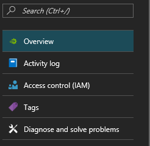
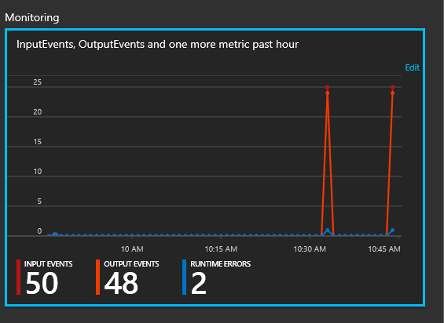
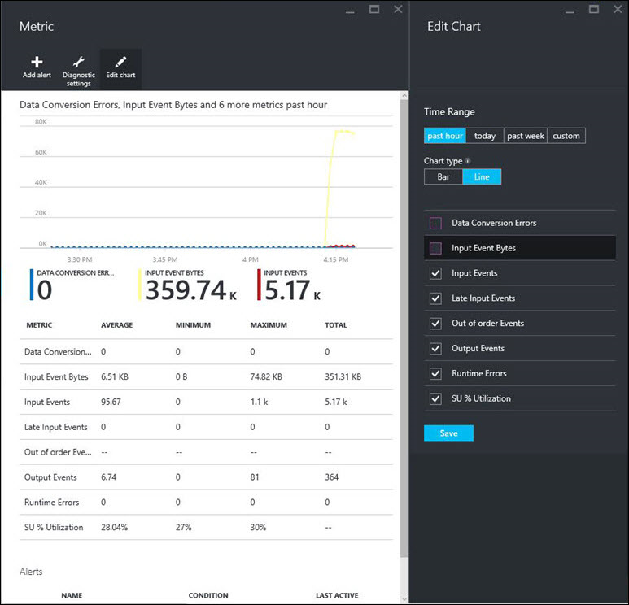

<properties
    pageTitle="了解流分析作业监视 | Azure"
    description="了解流分析作业监视"
    keywords="查询监视器"
    services="stream-analytics"
    documentationcenter=""
    author="jeffstokes72"
    manager="jhubbard"
    editor="cgronlun" />
<tags
    ms.assetid="5f5cc00f-4a7b-491e-89e1-dbafea46d399"
    ms.service="stream-analytics"
    ms.devlang="na"
    ms.topic="article"
    ms.tgt_pltfrm="na"
    ms.workload="data-services"
    ms.date="01/05/2017"
    wacn.date="02/24/2017"
    ms.author="jeffstok" />

# 了解流分析作业监视以及如何监视查询
## 简介：“监视”页
Azure 门户提供了可用于监视和排查查询和作业性能问题的关键性能指标。若要查看这些指标，请浏览到想要查看其指标的流分析作业并查看“概览”页上的“监视”部分。

  

此窗口如下所示：

  

## 可用于流分析的指标
| 度量值 | 定义 |
| ---------------------- | ---------------------------------------- |
| 流单元利用率 % | 从作业的“比例”选项卡向一个作业分配的流单元利用率。如果此指标达到 80% 或以上，则很可能会出现事件处理延迟或停止处理的情况。 |
| 输入事件数 | 流分析作业收到的数据量，以事件计数来衡量。这可以用于验证正在发送到输入源的事件。 |
| 输出事件数 | 流分析作业发送到输出目标的数据量，以事件计数来衡量。 |
| 无序事件数 | 收到的无序事件的数目，系统根据事件排序策略来删除这些事件，或者为其提供一个经过调整的时间戳。这可能会受“无序容错时段”设置的影响。 |
| 数据转换错误数 | 流分析作业导致的数据转换错误的数目。 |
| 运行时错误 | 执行流分析作业的过程中发生的错误总数。 |
| 延迟输入事件数 | 延迟到达的事件的数目，系统根据延迟到达容错时段设置的事件排序策略配置删除这些事件，或者调整其时间戳。 |
| 函数请求数 | Azure 机器学习函数（如果存在）的调用数。 |
| 失败的函数请求数 | 失败的 Azure 机器学习函数（如果存在）调用数。 |
| 函数事件数 | 发送到 Azure 机器学习函数（如果存在）的事件数。 |
| 输入事件字节数 | 流分析作业收到的数据量（以字节为单位）。这可以用于验证正在发送到输入源的事件。 |

## 在 Azure 门户中自定义监视
可以在“编辑图表”设置中调整图表类型、显示的指标和时间范围。有关详细信息，请参阅[如何自定义监视](/documentation/articles/insights-how-to-customize-monitoring/)。

  

## 获取帮助
如需进一步的帮助，请尝试我们的 [Azure 流分析论坛](https://social.msdn.microsoft.com/Forums/zh-cn/home?forum=AzureStreamAnalytics)。

## 后续步骤
* [Azure 流分析简介](/documentation/articles/stream-analytics-introduction/)
* [Azure 流分析入门](/documentation/articles/stream-analytics-get-started/)
* [缩放 Azure 流分析作业](/documentation/articles/stream-analytics-scale-jobs/)
* [Azure 流分析查询语言参考](https://msdn.microsoft.com/zh-cn/library/azure/dn834998.aspx)
* [Azure 流分析管理 REST API 参考](https://msdn.microsoft.com/zh-cn/library/azure/dn835031.aspx)

<!---HONumber=Mooncake_0220_2017-->
<!-- Update_Description: update meta properties; wording update -->