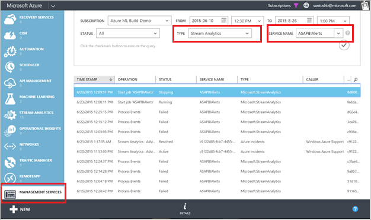
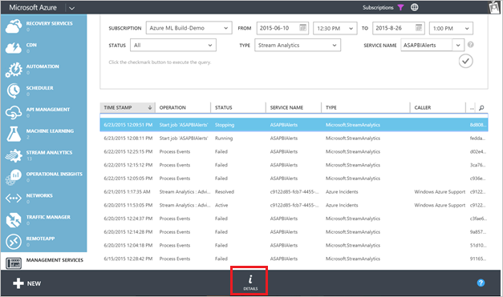
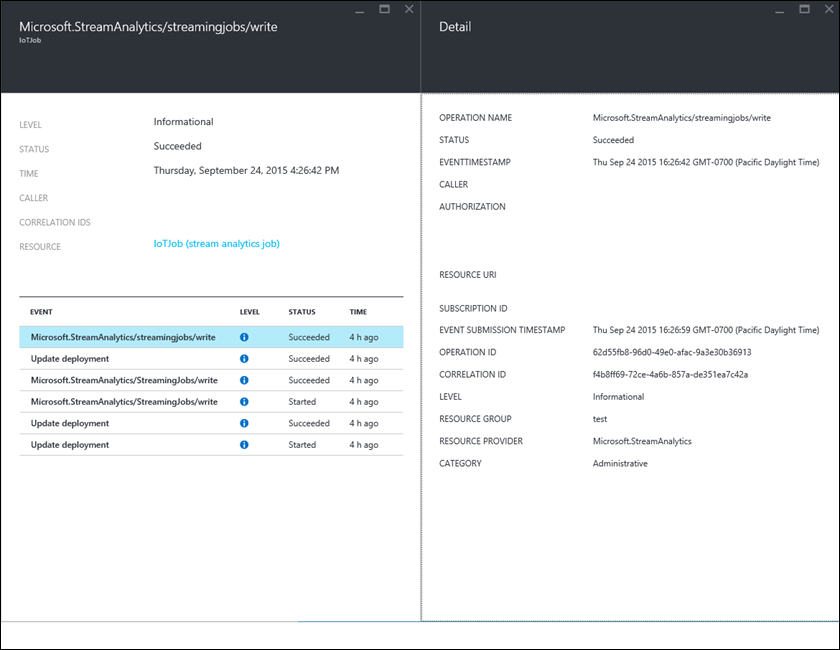
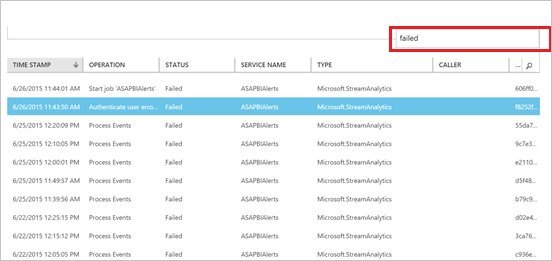

<properties 
	pageTitle="使用流分析中的操作和服务日志进行调试 | Azure" 
	description="如何使用流分析操作日志" 
	keywords="服务日志"
	services="stream-analytics" 
	documentationCenter="" 
	authors="jeffstokes72" 
	manager="jhubbard" 
	editor="cgronlun"/>  

<tags 
	ms.service="stream-analytics" 
	ms.devlang="na" 
	ms.topic="article" 
	ms.tgt_pltfrm="na" 
	ms.workload="data-services" 
	ms.date="09/26/2016" 
	wacn.date="11/14/2016" 
	ms.author="jeffstok"/>  

# 使用服务和操作日志调试流分析作业

所有 Azure 服务都向用户提供操作日志消息以记录与管理操作有关的详细信息。在 Azure 流分析中，此信息用可于调试目的，例如查看作业状态、作业进度和失败消息，跟踪作业在一段时间内的进度（从开始、处理直到输出）。

## 在 Azure 经典管理门户中查找操作日志

可以通过两种方式访问操作日志：

- 流分析作业的仪表板  
- Azure 经典管理门户中的管理服务  

## 流分析作业的仪表板

指向流分析作业相应日志的链接显示在该作业的“仪表板”选项卡上。如果单击该链接，它会按显示该特定作业的最新日志的方式来设置筛选器。

  

## 管理服务

在 Azure 经典管理门户中手动导航到流分析和其他服务的操作日志：

1.	在 **Azure 经典管理门户** 中单击“管理服务”。
2.	在“类型”中选择“流分析”，在“服务名称”中选择作业的名称。  

  

## 在 Azure 门户预览中查找审核日志 ##

若要在 Azure 门户预览中查找流分析作业的操作日志，请单击“浏览”，然后选择“审核日志”。

    

此操作将打开边栏选项卡，其中显示了订阅中所有资源在过去 7 天内的事件。你可以通过单击“筛选器”命令进行筛选，以查看特定类型或时间范围的事件。

    

## 获取日志详细信息

可以按时间范围和状态进行筛选，来查看你的作业的日志。

在 Azure 经典管理门户中，单击窗口底部的“详细信息”按钮可查看选定事件的更多信息。

    

在 Azure 门户预览中，单击日志条目可查看其包含的详细事件。

    

在这里，你可以通过单击事件来打开“详细信息”边栏选项卡。

    

## 调试失败的作业

在 Azure 经典管理门户中，单击“搜索”图标并键入“failed”。这样，系统将显示包含失败状态的所有日志。

  

在 Azure 门户预览中，可以按消息级别进行筛选，以查看“关键”事件。

    

你可以选择任何一个失败，并单击“详细信息”以查看有关错误的更多信息。某些错误消息还提供有关如何解决此问题的信息。

    

如果你需要联系[支持团队](/support/contact/)或通过 [MSDN 论坛](https://social.msdn.microsoft.com/Forums/zh-CN/home?forum=AzureStreamAnalytics)向团队提供信息，请注明操作详细信息，尤其是**相关 ID**。

## 获取帮助
如需进一步的帮助，请尝试我们的 [Azure 流分析论坛](https://social.msdn.microsoft.com/Forums/zh-cn/home?forum=AzureStreamAnalytics)

## 后续步骤

- [Azure 流分析简介](/documentation/articles/stream-analytics-introduction/)
- [Azure 流分析入门](/documentation/articles/stream-analytics-get-started/)
- [缩放 Azure 流分析作业](/documentation/articles/stream-analytics-scale-jobs/)
- [Azure 流分析查询语言参考](https://msdn.microsoft.com/zh-cn/library/azure/dn834998.aspx)
- [Azure 流分析管理 REST API 参考](https://msdn.microsoft.com/zh-cn/library/azure/dn835031.aspx)

<!---HONumber=Mooncake_1107_2016-->