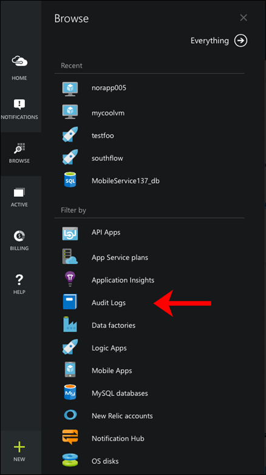
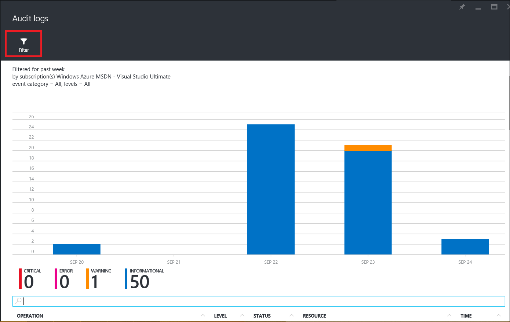

<properties
    pageTitle="使用流分析中的操作和服务日志进行调试 | Azure"
    description="如何使用流分析操作日志"
    keywords="服务日志"
    services="stream-analytics"
    documentationcenter=""
    author="jeffstokes72"
    manager="jhubbard"
    editor="cgronlun" />
<tags
    ms.assetid="a2ed9676-f0bd-4398-87c8-a592779ac728"
    ms.service="stream-analytics"
    ms.devlang="na"
    ms.topic="article"
    ms.tgt_pltfrm="na"
    ms.workload="data-services"
    ms.date="03/28/2017"
    wacn.date="05/15/2017"
    ms.author="jeffstok"
    ms.translationtype="Human Translation"
    ms.sourcegitcommit="457fc748a9a2d66d7a2906b988e127b09ee11e18"
    ms.openlocfilehash="30359c50e881c8d369e02f62409c8fd1bbd49a38"
    ms.contentlocale="zh-cn"
    ms.lasthandoff="05/05/2017" />

# 使用服务和操作日志调试流分析作业
所有 Azure 服务都向用户提供操作日志消息以记录与管理操作有关的详细信息。 在 Azure 流分析中，此信息用可于调试目的，例如查看作业状态、作业进度和失败消息，跟踪作业在一段时间内的进度（从开始、处理直到输出）。

## 在 Azure 管理门户中查找操作日志
可以通过两种方式访问操作日志：  

* 流分析作业的仪表板  
* Azure 经典管理门户中的管理服务。  

## 流分析作业的仪表板
指向流分析作业相应日志的链接显示在该作业的“仪表板”选项卡上。 如果单击该链接，它会按显示该特定作业的最新日志的方式来设置筛选器。

  

## 管理服务
在 Azure 经典管理门户中手动导航到流分析和其他服务的操作日志：

1. 单击 [Azure 经典管理门户](https://manage.windowsazure.cn)中的“管理服务”。
2. 为“类型”选择“流分析”，并为“服务名称”选择作业名称。  

    

## 在 Azure 门户中查找审核日志
若要在 Azure 门户中查找流分析作业的操作日志，请单击“浏览”，然后选择“审核日志”。

    

这将打开边栏选项卡，它将针对订阅中的所有资源显示最近 7 天内的事件。  你可以通过单击“筛选器”命令进行筛选，以查看特定类型或时间范围的事件。

    

## 获取日志详细信息
可以按时间范围和状态进行筛选，来查看你的作业的日志。

在 Azure 管理门户中，单击窗口底部的“详细信息”按钮可查看选定事件的更多信息。 

    

在 Azure 门户中，单击日志条目可查看其包含的详细事件。

    

在这里，可以通过单击事件来打开“详细信息”边栏选项卡。

    

## 调试失败的作业
在 Azure 管理门户中，单击“搜索”图标并键入“failed”。 这样，系统将显示包含失败状态的所有日志。 

  

在 Azure 门户中，可以按消息级别进行筛选，以查看“关键”事件。

    

你可以选择任何一个失败，并单击“详细信息”以查看有关错误的更多信息。某些错误消息还提供有关如何解决此问题的信息。

    

如果你需要联系[支持团队](/support/contact/)或通过 [MSDN 论坛](https://social.msdn.microsoft.com/Forums/zh-CN/home?forum=AzureStreamAnalytics)向团队提供信息，请注明操作详细信息，尤其是**相关 ID**。

## 获取帮助
如需进一步的帮助，请尝试我们的 [Azure 流分析论坛](https://social.msdn.microsoft.com/Forums/zh-cn/home?forum=AzureStreamAnalytics)

## 后续步骤
* [Azure 流分析简介](/documentation/articles/stream-analytics-introduction/)
* [Azure 流分析入门](/documentation/articles/stream-analytics-get-started/)
* [缩放 Azure 流分析作业](/documentation/articles/stream-analytics-scale-jobs/)
* [Azure 流分析查询语言参考](https://msdn.microsoft.com/zh-cn/library/azure/dn834998.aspx)
* [Azure 流分析管理 REST API 参考](https://msdn.microsoft.com/zh-cn/library/azure/dn835031.aspx)

<!--Update_Description:update meta properties; wording update-->