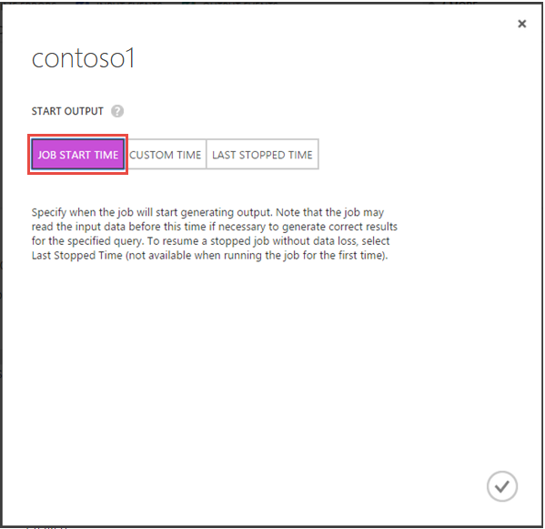

<properties
    pageTitle="如何在流分析中启动流式处理作业 | Azure"
    description="如何在 Azure 流分析中运行流式处理作业 | 学习路径段。"
    keywords="流式处理作业"
    documentationcenter=""
    services="stream-analytics"
    author="jeffstokes72"
    manager="jhubbard"
    editor="cgronlun" />
<tags
    ms.assetid="9d46950f-2b69-49ce-a567-df558c5dd820"
    ms.service="stream-analytics"
    ms.devlang="na"
    ms.topic="article"
    ms.tgt_pltfrm="na"
    ms.workload="data-services"
    ms.date="03/28/2017"
    wacn.date="05/15/2017"
    ms.author="jeffstok"
    ms.translationtype="Human Translation"
    ms.sourcegitcommit="457fc748a9a2d66d7a2906b988e127b09ee11e18"
    ms.openlocfilehash="07dcad0b0a6da0529642bb258192c0a9deef02a7"
    ms.contentlocale="zh-cn"
    ms.lasthandoff="05/05/2017" />

# 如何在 Azure 流分析中运行流式处理作业
当作业的输入、查询和输出均已指定时，你可以启动流分析作业。

若要启动你的作业：

1. 在 Azure 经典管理门户的作业仪表板中，单击页面底部的“启动”  。

      

    在 Azure 门户中，单击作业页顶部的“启动”  。

      
2. 指定一个“开始输出”值，确定此作业何时开始生成输出。 之前尚未启动作业的默认设置为“作业开始时间”，表示作业将立即开始处理数据。 也可以指定一个过去（用于使用历史数据）或将来（延迟处理直到将来某个时间）的“自定义”时间。 当作业以前已启动和停止时，可以使用“上次停止时间”选项，从上次输出时间恢复作业并避免数据丢失。  

      

      

3. 确认你的选择。 作业状态将更改为“正在启动”，然后在作业已启动后很快转变为“正在运行”。 可以在“通知中心”中监视“启动”操作的进度：

      

      

## 获取帮助
如需进一步的帮助，请尝试我们的 [Azure 流分析论坛](https://social.msdn.microsoft.com/Forums/zh-cn/home?forum=AzureStreamAnalytics)

## 后续步骤

* [Azure 流分析简介](/documentation/articles/stream-analytics-introduction/)
* [Azure 流分析入门](/documentation/articles/stream-analytics-get-started/)
* [缩放 Azure 流分析作业](/documentation/articles/stream-analytics-scale-jobs/)
* [Azure 流分析查询语言参考](https://msdn.microsoft.com/zh-cn/library/azure/dn834998.aspx)
* [Azure 流分析管理 REST API 参考](https://msdn.microsoft.com/zh-cn/library/azure/dn835031.aspx)

<!--Update_Description:update meta properties;wording update-->