<properties
    pageTitle="使用用于 Visual Studio 的 Azure 流分析工具 | Azure"
    description="用于 Visual Studio 的 Azure 流分析工具入门教程"
    keywords="visual studio"
    documentationcenter=""
    services="stream-analytics"
    author="jeffstokes72"
    manager="jhubbard"
    editor="cgronlun" />
<tags
    ms.assetid="a473ea0a-3eaa-4e5b-aaa1-fec7e9069f20"
    ms.service="stream-analytics"
    ms.devlang="na"
    ms.topic="article"
    ms.tgt_pltfrm="na"
    ms.workload="data-services"
    ms.date="03/28/2017"
    wacn.date="05/15/2017"
    ms.author="sujie"
    ms.translationtype="Human Translation"
    ms.sourcegitcommit="457fc748a9a2d66d7a2906b988e127b09ee11e18"
    ms.openlocfilehash="acb0e5f991c353f81cc4d687f2a4dca3bebba629"
    ms.contentlocale="zh-cn"
    ms.lasthandoff="05/05/2017" />

# 使用用于 Visual Studio 的 Azure 流分析工具
用于 Visual Studio 的 Azure 流分析工具现已推出正式版。 这些工具为流分析用户带来了更丰富的体验，可让他们进行故障排除以及编写复杂的查询，甚至可以在本地编写查询。 此外，还可让用户将流分析作业导出到 Visual Studio 项目中。

## 介绍
本教程介绍如何使用用于 Visual Studio 的 Azure 流分析工具来创建、编写、本地测试、管理和调试 Azure 流分析作业。 

完成本教程之后，你将能够：

* 熟悉用于 Visual Studio 的 Azure 流分析工具。
* 配置和部署流分析作业。
* 使用本地示例数据在本地测试作业。
* 使用监视功能排查问题。
* 将现有作业导出到项目。

## 先决条件
若要完成本教程，需要满足以下先决条件：

* 完成[使用流分析构建 IoT 解决方案教程](/documentation/articles/stream-analytics-build-an-iot-solution-using-stream-analytics/)中**创建流分析作业**前面的步骤。 
* Visual Studio 2015、Visual Studio 2013 Update 4 或 Visual Studio 2012。 支持 Enterprise (Ultimate/Premium)、Professional、Community 版本；不支持 Express 版本。 目前不支持 Visual Studio 2017。 
* 用于 .NET 的 Microsoft Azure SDK 2.7.1 或更高版本。  可以使用 [Web 平台安装程序](http://www.microsoft.com/web/downloads/platform.aspx)安装它。
* 安装 [用于 Visual Studio 的 Azure 流分析工具](http://aka.ms/asatoolsvs)。

## 创建流分析项目
在 Visual Studio 中，单击“文件”菜单并选择“新建项目”。 从左侧的模板列表中选择“流分析”，然后单击“Azure 流分析应用程序”。
像创建其他项目时一样，在底部输入“项目名称”、“位置”和“解决方案名称”。

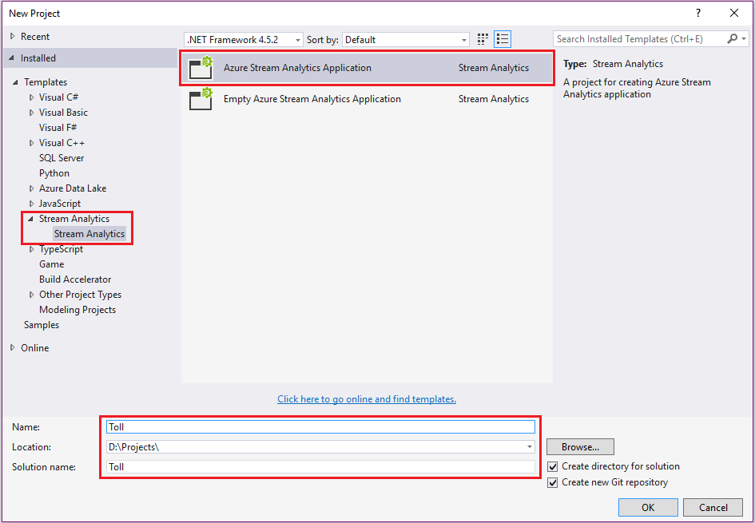

在“解决方案资源管理器”中可以看到生成了一个 **Toll** 项目。

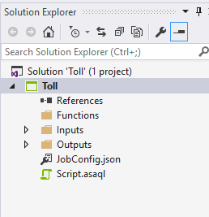

## 选择正确的订阅
1. 在 Visual Studio 中，通过“视图”菜单打开“服务器资源管理器”。
2. 使用 Azure 帐户登录。 

## 定义输入源
1. 在“解决方案资源管理器”中展开“输入”节点，将 **Input.json** 重命名为 **EntryStream.json**。 双击“EntryStream.json”。
2. “输入别名”现在应为 **EntryStream**。 请注意，输入别名是要在查询脚本中使用的别名。 
3. “源类型”为“数据流”。
4. 源是**事件中心**。
5. “服务总线命名空间”应是下拉列表中的 **tollData** 命名空间。
6. 事件中心名称应设置为 **entry**。
7. 事件中心策略名称为 **RootManageSharedAccessKey**（默认值）。
8. 选择“JSON”作为“事件序列化格式”，选择“UTF8”作为“编码”。

    设置看起来类似于：

    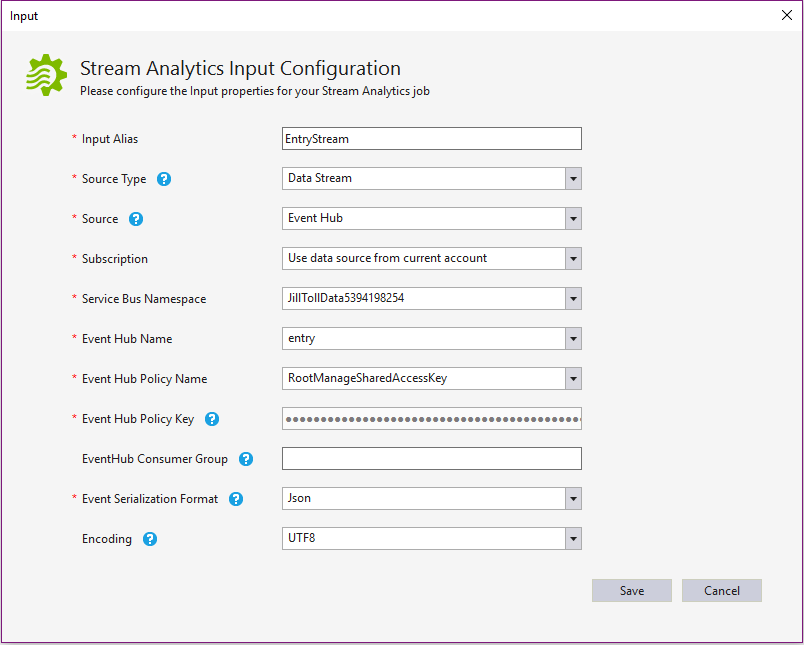

9. 单击页面底部的“保存”，完成向导操作。 现在，可以添加另一个输入源来创建出口流。 右键单击输入节点，然后单击“新建项”。

    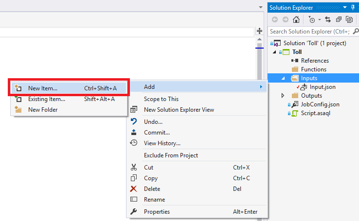

10. 在弹出的窗口中选择“Azure 流分析输入”，将“名称”更改为 **ExitStream.json**。 单击 **“添加”**。

    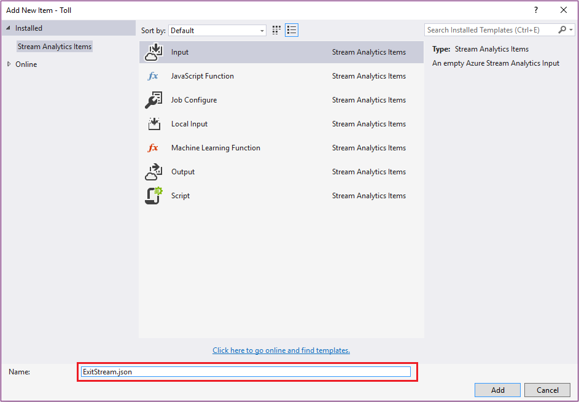

11. 在项目中双击“ExitStream.json”，然后遵循配置入口流时使用的相同步骤填写信息。 请确保按以下屏幕截图所示输入“事件中心名称”的值。

    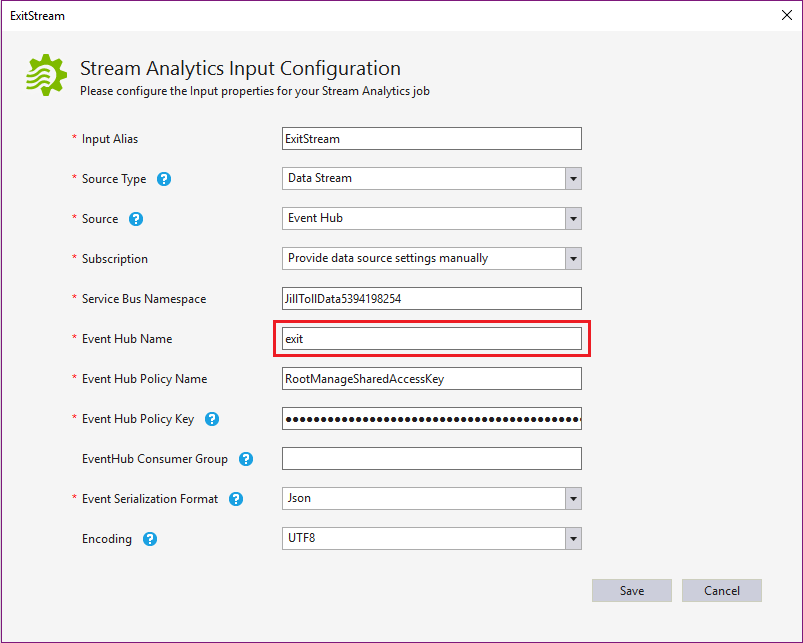

    现已定义两个输入流。

    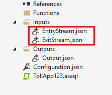

    接下来，为包含车辆登记数据的 blob 文件添加引用数据输入。

12. 在项目中右键单击“输入”节点，然后遵循配置流输入时使用的相同过程，但这次要选择“引用数据”而不是“数据流”，并且“输入别名”是 **Registration**。

    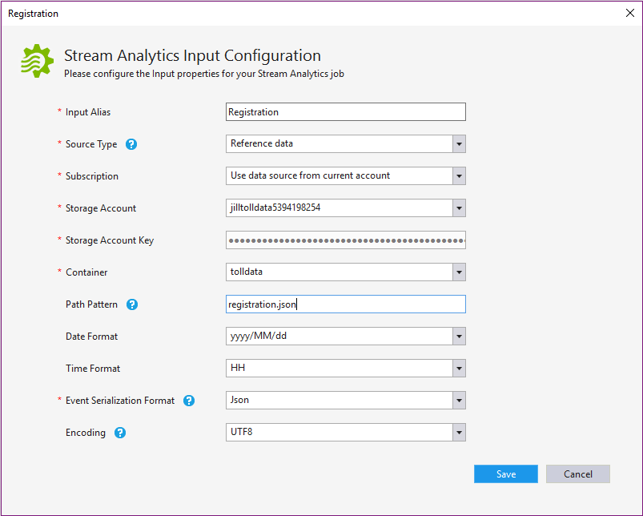

13. 选择包含 **tolldata** 的存储帐户。 容器名称应为 **tolldata**，**路径模式**应为 **registration.json**。 此文件名区分大小写，并且应该全为小写。
14. 单击“保存”完成向导操作。

现在，已定义所有输入。

## 定义输出
1. 在“解决方案资源管理器”中展开“输入”节点，然后双击“Output.json”。
2. 将“输出别名”设置为 **output**，然后将“接收器”设置为“SQL 数据库”。
3. 输入数据库名称：**TollDataDB**。
4. 在“用户名”字段中输入“tolladmin”、在“密码”字段中输入“123toll!” ，并在“表”字段中输入“TollDataRefJoin”。
5. 单击“保存” 。

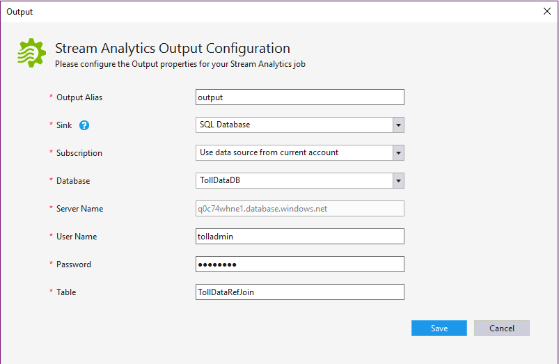

## Azure 流分析查询
本教程尝试回答几个与通行费数据相关的业务问题，并构造可在 Azure 流分析中使用的流分析查询来提供相关的答案。
在开始创建第一个流分析作业之前，让我们先了解一个简单的方案和查询语法。

### Azure 流分析查询语言简介
假设需要统计进入某个收费亭的车辆数目。 这是连续的事件流，因此必须定义“时段”。 让我们将问题修改为“每 3 分钟有多少辆车进入收费亭？”。 这通常称为轮转计数。

让我们看看能回答此问题的 Azure 流分析查询：

    SELECT TollId, System.Timestamp AS WindowEnd, COUNT(*) AS Count 
    FROM EntryStream TIMESTAMP BY EntryTime 
    GROUP BY TUMBLINGWINDOW(minute, 3), TollId 

如你所见，Azure 流分析会使用类似 SQL 的查询语言，并添加几个扩展来指定与时间相关的查询方面。

有关详细信息，请参阅 MSDN 中的[时间管理](https://msdn.microsoft.com/zh-cn/library/azure/mt582045.aspx)和查询中所用的[窗口化](https://msdn.microsoft.com/zh-cn/library/azure/dn835019.aspx)构造。

既然已经编写了第一个 Azure 流分析查询，现在就可以使用位于 TollApp 文件夹中以下路径的示例数据文件来测试该查询：

<seg>
  **..\TollApp\TollApp\Data**</seg>

此文件夹包含以下文件：

• Entry.json 
• Exit.json 
• Registration.json

## 问题：进入收费亭的汽车数目
在项目中，双击“Script.asaql”在编辑器中打开该脚本，然后将上一部分中的脚本粘贴到编辑器中。查询编辑器支持 Intellisense、语法颜色设置和错误标记。

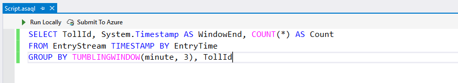  

### 在本地测试 Azure 流分析查询

1. 首先可以编译查询，查看是否存在任何语法错误。[TBD]
2. 若要针对示例数据验证此查询，可以使用本地示例数据：右键单击输入并从上下文菜单中选择“添加本地输入”。

    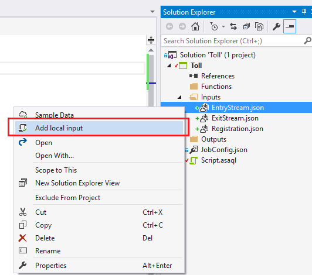

    在弹出窗口中，从本地路径选择示例数据。 单击“保存” 。

    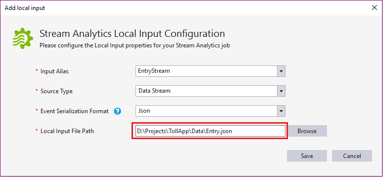

    名为 **local_EntryStream.json** 的文件将自动添加到输入文件夹。

    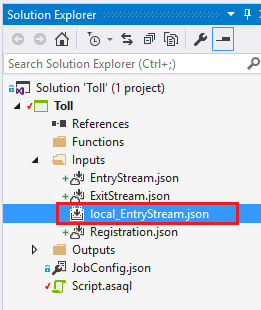

3. 在查询编辑器中单击“本地运行”， 或者按 F5。

    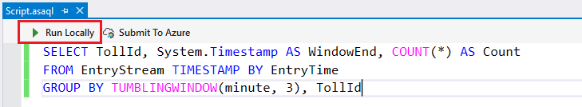

    可在控制台输出中找到输出路径，按任意键可打开结果文件夹。

    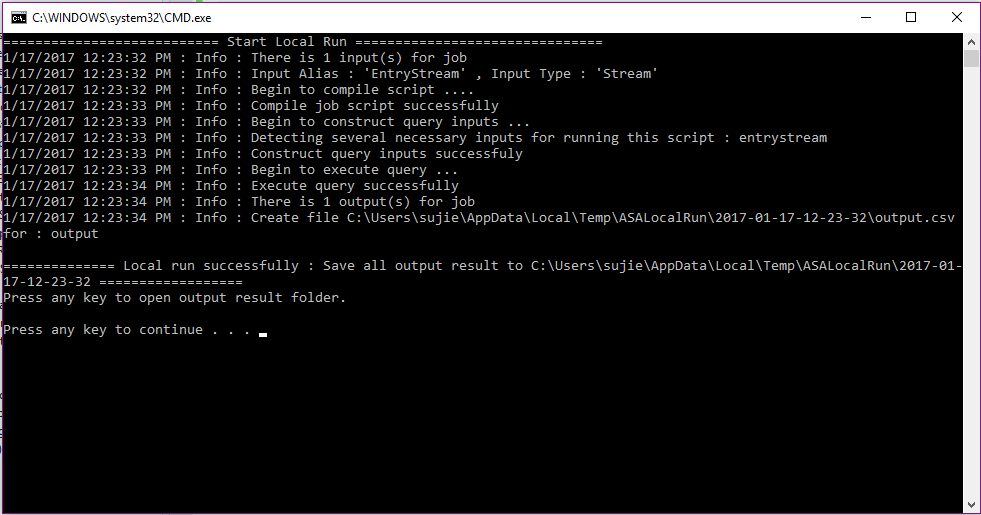

4. 检查本地文件夹中的结果。

    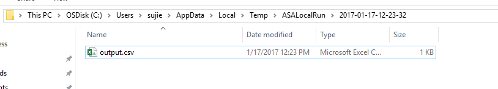

### 示例输入
还可以将输入源中的输入数据采样到本地文件。 右键单击输入配置文件并选择“数据采样”。 

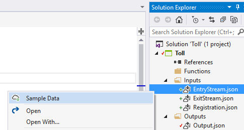

请注意，目前只能采样事件中心或 IoT 中心的数据。 其他输入源不受支持。  在弹出的对话框窗口中，填写用于保存样本数据的本地路径。 单击“采样”。

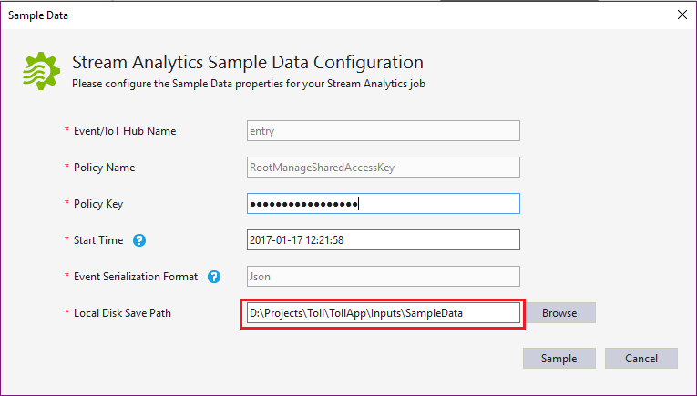

可在“输出”窗口中查看进度。 

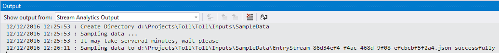

### 将 Azure 流分析查询提交到 Azure
在“查询编辑器”中，单击“在脚本编辑器中提交到 Azure”。

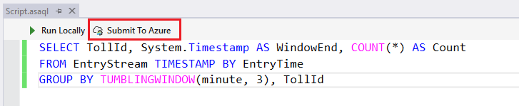

选择“创建新的 Azure 流分析作业”。 按如下所示输入“作业名称”。 选择正确的订阅。 单击“提交”。

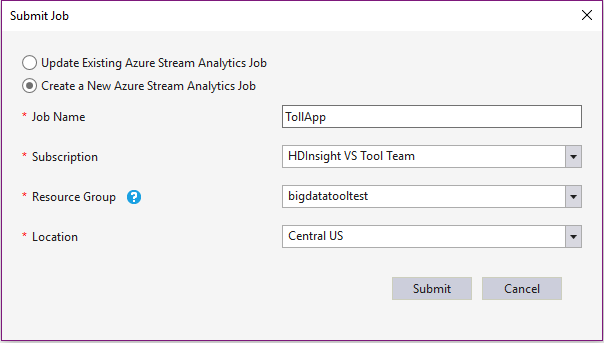

### 启动作业
现已创建作业，作业视图已自动打开。 单击 **绿色** 按钮启动作业。

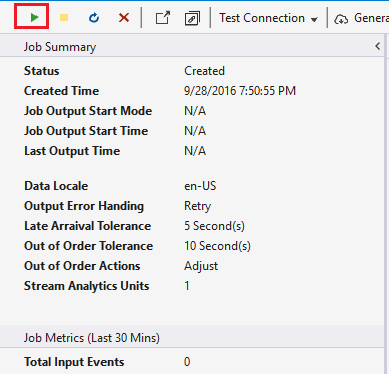

选择默认设置，然后单击“启动”。

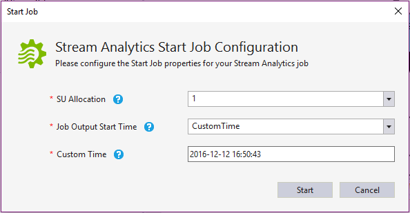

可以看到，作业状态已更改为“正在运行”，并出现了输入/输出事件。

## 在 Visual Studio 中检查结果
1. 打开 Visual Studio 服务器资源管理器，然后右键单击“TollDataRefJoin”  表。
2. 单击“显示表数据”  ，查看作业的输出。

    

### 查看作业指标
可在“作业指标”中找到一些基本的作业统计信息。 

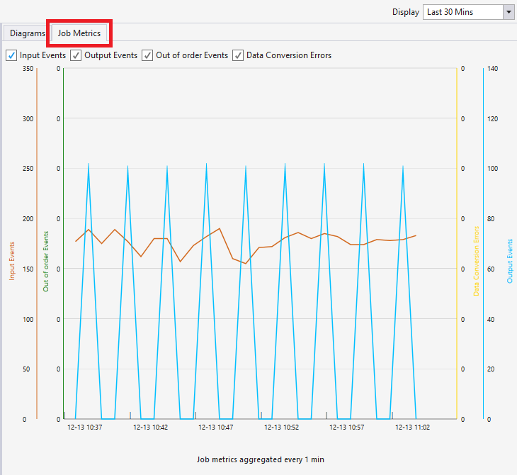

## 在服务器资源管理器中列出作业
在“服务器资源管理器”中单击“流分析作业”，然后单击“刷新”。 “流分析作业”下面应会出现你的作业。

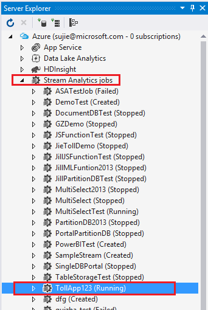

## 打开作业视图
展开作业节点，然后双击“作业视图”节点打开作业视图。

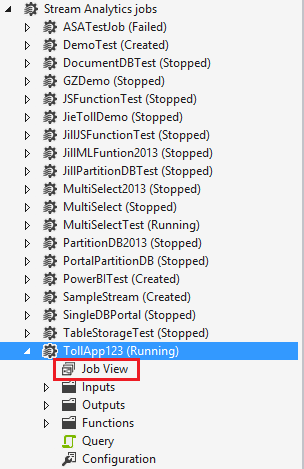

## 将现有作业导出到项目
可使用两种方法将现有作业导出到项目。
1. 在“服务器资源管理器”中的“流分析作业”节点下面右键单击作业节点。 在上下文菜单中单击“导出到新的流分析项目”。

    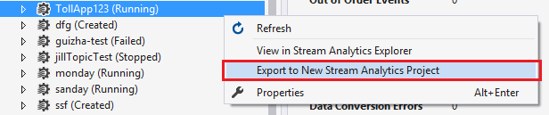

    “解决方案资源管理器”中会显示生成的项目。

    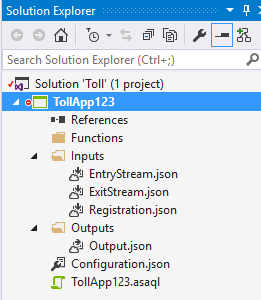

2. 在作业视图中，单击“生成项目”。

    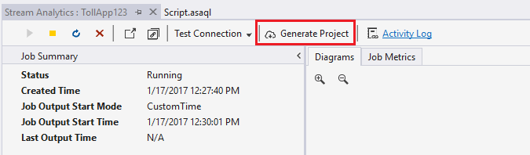

## 已知问题和限制

1. 如果查询包含地理空间函数，本地测试将无法运行。 
2. 不支持在编辑器中添加或更改 JavaScript UDF。
3. 本地测试不支持以 JSON 格式保存输出。
4. 不支持 Power BI 输出和 ADLS 输出。

## 后续步骤
* [Azure 流分析简介](/documentation/articles/stream-analytics-introduction/)
* [Azure 流分析入门](/documentation/articles/stream-analytics-get-started/)
* [缩放 Azure 流分析作业](/documentation/articles/stream-analytics-scale-jobs/)
* [Azure 流分析查询语言参考](https://msdn.microsoft.com/zh-cn/library/azure/dn834998.aspx)
* [Azure 流分析管理 REST API 参考](https://msdn.microsoft.com/zh-cn/library/azure/dn835031.aspx)

<!--Update_Description:Update meta properties;wording update;update reference link-->