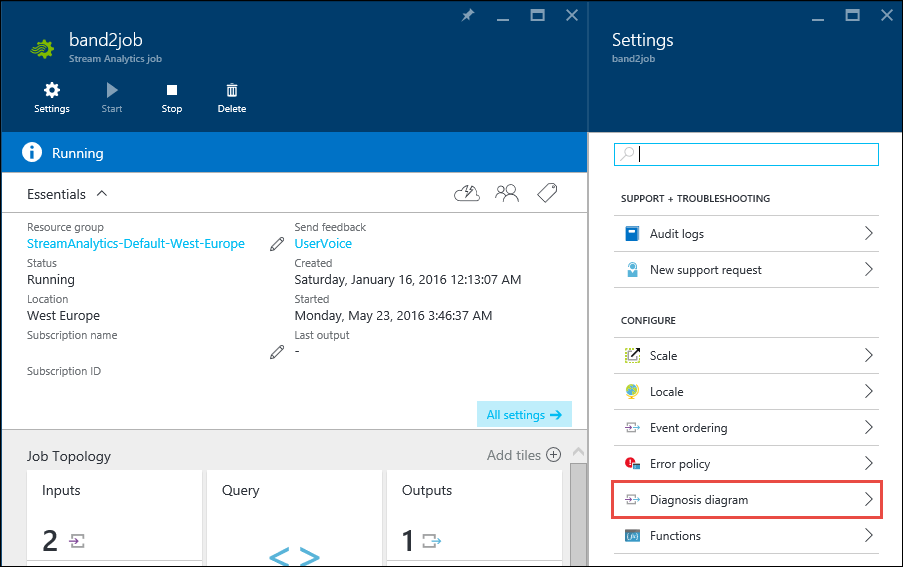
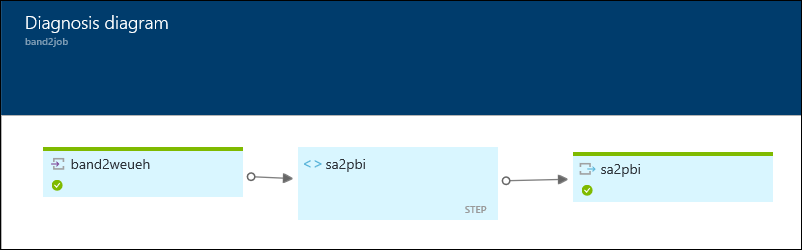
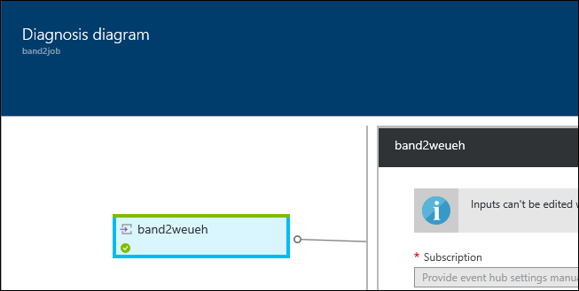

<properties
    pageTitle="流分析作业的可视化和故障排除 | Azure"
    description="了解如何使用诊断关系图功能对自助服务的流分析作业管道的故障排除进行可视化。"
    keywords=""
    documentationcenter=""
    services="stream-analytics"
    author="jeffstokes72"
    manager="jhubbard"
    editor="cgronlun" />
<tags
    ms.assetid="d87841cd-c59f-4a46-b46e-8b904fdc12e9"
    ms.service="stream-analytics"
    ms.devlang="na"
    ms.topic="article"
    ms.tgt_pltfrm="na"
    ms.workload="data-services"
    ms.date="03/28/2017"
    wacn.date="05/15/2017"
    ms.author="jeffstok"
    ms.translationtype="Human Translation"
    ms.sourcegitcommit="457fc748a9a2d66d7a2906b988e127b09ee11e18"
    ms.openlocfilehash="c149722faab8ad645c662737c547f82f7519162e"
    ms.contentlocale="zh-cn"
    ms.lasthandoff="05/05/2017" />

# 流分析作业的可视化和故障排除
与其他基于云的技术一样，在流分析中，故障排除有时需要深入了解作业没有生成预期的输出（或者是该问题的任何输出）的原因。 考虑到这一点，流分析提供了可视化流作业的功能。 该功能作为建模工具使用起来也很方便，并且对需要其工作文档的人员来说具有附带好处。

在可视化面板中显示输入和要执行的查询，然后是所有配置的输出。 连接或配置问题变得更加明显，对配置的可视化表示形式也很有用。

## 使用诊断关系图工具
若要访问此可视化工具，只需单击流分析作业的“设置”边栏选项卡中的“诊断关系图”按钮。

每个输入和输出都进行了颜色编码以表示组件的当前状态，如下所示。

当用户想要查看中间查询步骤，以了解作业内的数据流模式时，该可视化工具提供了将查询细分为其组件步骤的视图和流序列。 单击每个查询步骤将在查询编辑窗格中显示相应的部分，如图所示。 

## 后续步骤
* [Azure 流分析简介](/documentation/articles/stream-analytics-introduction/)
* [Azure 流分析入门](/documentation/articles/stream-analytics-get-started/)
* [缩放 Azure 流分析作业](/documentation/articles/stream-analytics-scale-jobs/)
* [Azure 流分析查询语言参考](https://msdn.microsoft.com/zh-cn/library/azure/dn834998.aspx)
* [Azure 流分析管理 REST API 参考](https://msdn.microsoft.com/zh-cn/library/azure/dn835031.aspx)

<!--Update_Description:update meta properties;wording update;update reference link-->