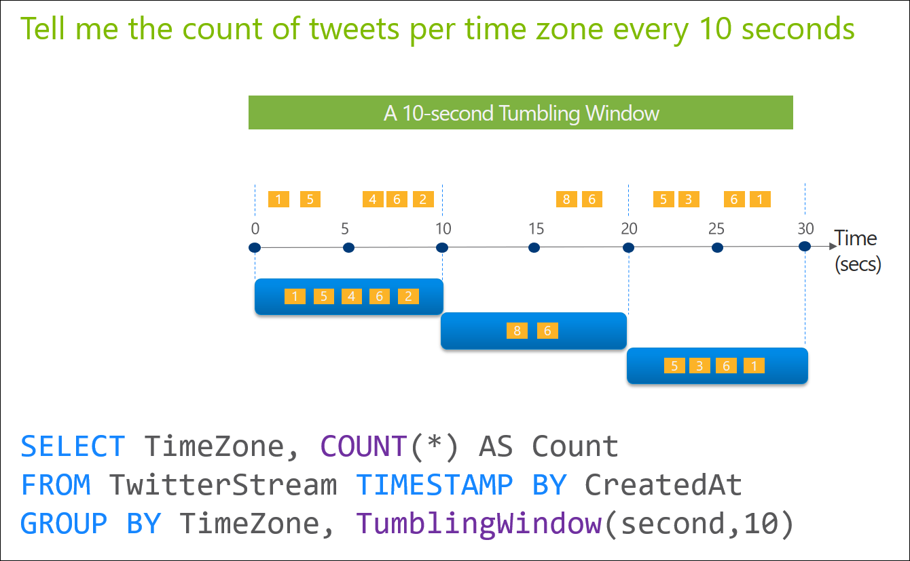
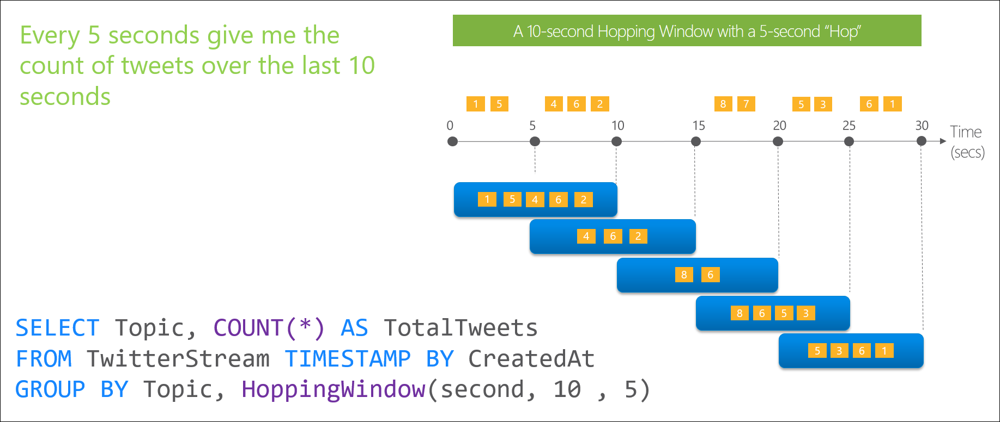

<properties
	pageTitle="流分析开窗函数简介 | Azure"
	description="了解流分析中的三个开窗函数（翻转、跳跃、滑动）。"
	keywords="翻转窗口, 滑动窗口, 跳跃窗口"
	documentationCenter=""
	services="stream-analytics"
	authors="jeffstokes72"
	manager="jhubbard"
	editor="cgronlun"
/>  

<tags
	ms.service="stream-analytics"
	ms.devlang="na"
	ms.topic="article"
	ms.tgt_pltfrm="na"
	ms.workload="data-services"
	ms.date="09/26/2016"
	wacn.date="11/14/2016"
	ms.author="jeffstok"
/>  

# 流分析开窗函数简介

在许多实时流方案中，只需要对临时窗口中包含的数据执行操作。开窗函数的本机支持是 Azure 流分析的重要功能，可对编写复杂流处理作业的开发人员工作效率造成重大影响。流分析可让开发人员使用[**翻转**](https://msdn.microsoft.com/zh-cn/library/dn835055.aspx)、[**跳跃**](https://msdn.microsoft.com/zh-cn/library/dn835041.aspx)和[**滑动**](https://msdn.microsoft.com/zh-cn/library/dn835051.aspx)窗口对流数据执行临时操作。值得注意的是，所有[开窗](https://msdn.microsoft.com/zh-cn/library/dn835019.aspx)操作都在窗口**结束**时输出结果。窗口的输出是基于所用聚合函数的单个事件。该事件包含窗口的结束时间戳，所有开窗函数都以固定的长度定义。最后，请务必注意，所有开窗函数只能在 [**GROUP BY**](https://msdn.microsoft.com/zh-cn/library/dn835023.aspx) 子句中使用。

## 翻转窗口

翻转开窗函数用于将数据流划分成不同的时间段并对其执行某个函数，如以下示例所示。翻转窗口的主要差异在于它们会重复，不重叠，并且一个事件不能属于多个翻转窗口。

## 跳跃窗口

跳跃开窗函数在一段固定的时间内向前跳跃。人们往往将此类窗口视为可以重叠的翻转窗口，因此一个事件可以属于多个跳跃窗口结果集。若要使跳跃窗口与翻转窗口相同，只需将跃点大小指定为与窗口大小相同。

  

## 滑动窗口

不同于翻转或跳跃窗口，滑动开窗函数**只**在事件发生时生成输出。每个窗口至少有一个事件，并且窗口持续根据 € (epsilon) 向前移动。与跳跃窗口一样，事件可以属于多个滑动窗口。

## 获取开窗函数的帮助

如需进一步的帮助，请尝试我们的 [Azure 流分析论坛](https://social.msdn.microsoft.com/Forums/en-US/home?forum=AzureStreamAnalytics)

## 后续步骤

- [Azure 流分析简介](/documentation/articles/stream-analytics-introduction/)
- [Azure 流分析入门](/documentation/articles/stream-analytics-get-started/)
- [缩放 Azure 流分析作业](/documentation/articles/stream-analytics-scale-jobs/)
- [Azure 流分析查询语言参考](https://msdn.microsoft.com/zh-cn/library/azure/dn834998.aspx)
- [Azure 流分析管理 REST API 参考](https://msdn.microsoft.com/zh-cn/library/azure/dn835031.aspx)

<!---HONumber=Mooncake_1107_2016-->