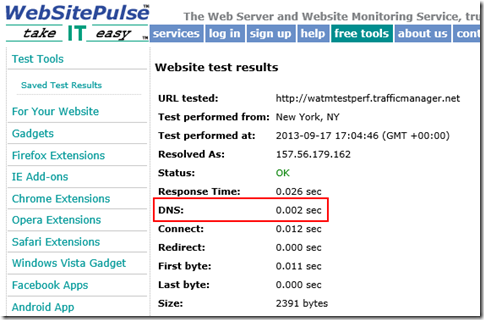

<properties
    pageTitle="Azure 流量管理器性能注意事项 | Azure"
    description="了解流量管理器的性能以及如何测试使用流量管理器时的网站性能"
    services="traffic-manager"
    documentationCenter=""
    authors="sdwheeler"
    manager="carmonm"
    editor=""
/>  

<tags
    ms.service="traffic-manager"
    ms.devlang="na"
    ms.topic="article"
    ms.tgt_pltfrm="na"
    ms.workload="infrastructure-services"
    ms.date="10/11/2016"
    wacn.date=""
    ms.author="sewhee"
/>  

# 流量管理器的性能注意事项

本页介绍使用流量管理器的性能注意事项。假设出现了下面这种情景：

你在中国北部和东亚区域分别创建了网站的实例。其中一个实例未通过流量管理器探测的运行状况检查。应用程序流量定向到正常的区域。这种故障转移是意料之中的，但由于流量现在要传送到远方区域，这种延迟会给性能造成问题。

## 流量管理器的工作方式

流量管理器对网站产生的唯一性能影响是初始 DNS 查找。针对流量管理器配置文件名称发出的 DNS 请求由托管 trafficmanager.cn 区域的 Microsoft DNS 根服务器处理。流量管理器根据流量管理器策略和探测结果填充并定期更新 Microsoft DNS 根服务器。因此，即使在初始 DNS 查找期间，也不会将 DNS 查询发送到流量管理器。

流量管理器由多个组件构成：DNS 名称服务器、API 服务、存储层和终结点监视服务。如果流量管理器服务组件发生故障，与流量管理器配置文件关联的 DNS 名称不会受到影响。Microsoft DNS 服务器中的记录将保留不变。但是，终结点监视和 DNS 更新不会发生。因此，当主站点关闭时，流量管理器无法将 DNS 更新为指向故障转移站点。

DNS 名称解析速度将会加快，结果将被缓存。初始 DNS 查找速度取决于客户端用于名称解析的 DNS 服务器。通常，客户端可在大约 50 毫秒内完成一个 DNS 查找。查找结果按照 DNS 生存时间 (TTL) 的持续时间缓存。流量管理器的默认 TTL 为 300 秒。

流量不会通过流量管理器。完成 DNS 查找后，客户端便获得了网站实例的 IP 地址。客户端直接连接到该地址，而不通过流量管理器。选择的流量管理器策略对 DNS 性能没有影响。但是，“性能”路由方法可能会对应用程序体验产生负面影响。例如，如果策略将来自北美的流量重定向到亚洲托管的实例，与这些会话之间的网络延迟可能会造成性能问题。

## 测量流量管理器性能

可以使用多个网站了解流量管理器配置文件的性能和行为。其中的许多站点可以免费使用，但可能附带限制。某些站点以收费形式提供增强型监视和报告。

这些站点上的工具可以测量 DNS 延迟，显示全球各地客户端位置的已解析 IP 地址。其中的大多数工具不会缓存 DNS 结果。因此，每次运行测试时，这些工具将显示完整的 DNS 查找。从自己的客户端测试时，只能在 TTL 持续期间内体验完整的 DNS 查找性能一次。

## 用于测量 DNS 性能的工具示例

- [SolveDNS](http://www.solvedns.com/dns-comparison/)

    SolveDNS 提供许多性能工具。DNS Comparison 工具可以显示解析 DNS 名称花费的时间，以及该时间与使用其他 DNS 服务提供程序时花费的时间的对比。

- [WebSitePulse](http://www.websitepulse.com/help/tools.php)

    其中最简单的工具就是 WebSitePulse。输入 URL 即可查看 DNS 解析时间、第一个字节、最后一个字节和其他性能统计信息。可以从三个不同的测试位置中选择。在此示例中可以看到，第一次执行显示 DNS 查找花费了 0.204 秒。

      

    由于结果会缓存，针对同一个流量管理器终结点执行第二次测试时，DNS 查找仅花费了 0.002 秒。

      

- [CA App Synthetic Monitor](https://asm.ca.com/en/checkit.php)

    前称 Watchmouse Check Website Tool，此站点可以同时从多个地理区域显示 DNS 解析时间。输入 URL 即可查看 DNS 解析时间、连接时间以及各个地理位置的连接速度。使用此测试可以查看针对全球不同位置返回了哪些托管服务。

      

- [Pingdom](http://tools.pingdom.com/)

    此工具提供网页上每个元素的性能统计信息。“Page Analysis”（页面分析）选项卡显示 DNS 查找花费的时间百分比。

- [What's My DNS?](http://www.whatsmydns.net/)

    此站点从 20 个不同的位置执行 DNS 查找，并在地图上显示结果。

- [Dig Web Interface](http://www.digwebinterface.com)

    此站点显示更详细的 DNS 信息，包括 CNAME 和 A 记录。请确保在选项下选中“着色输出”和“统计信息”，并在 Nameservers 下选中“全部”。

## 后续步骤

[关于流量管理器流量路由方法](/documentation/articles/traffic-manager-routing-methods/)

[测试流量管理器设置](/documentation/articles/traffic-manager-testing-settings/)

[流量管理器上的操作（REST API 参考）](https://msdn.microsoft.com/zh-cn/library/hh758255.aspx)

[Azure 流量管理器 Cmdlet](https://msdn.microsoft.com/zh-cn/library/dn690250.aspx)

<!---HONumber=Mooncake_1031_2016-->