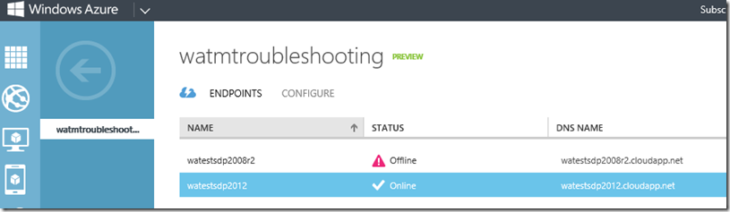

<properties
    pageTitle="Azure 流量管理器上的降级状态故障排除"
    description="如何在流量管理器显示为降级状态时对流量管理器配置文件进行故障排除。"
    services="traffic-manager"
    documentationCenter=""
    authors="sdwheeler"
    manager="carmonm"
    editor=""
/>  

<tags
    ms.service="traffic-manager"
    ms.devlang="na"
    ms.topic="article"
    ms.tgt_pltfrm="na"
    ms.workload="infrastructure-services"
    ms.date="10/11/2016"
    wacn.date="01/09/2017"
    ms.author="sewhee"
/>  

# Azure 流量管理器上的降级状态故障排除

本文介绍如何对显示降级状态的 Azure 流量管理器配置文件进行故障排除。在此方案中，假设已配置了一个指向某些 chinacloudapp.cn 托管服务的流量管理器配置文件。检查流量管理器的运行状况时，你看到“状态”显示为“已降级”。

  

转到该配置文件的“终结点”选项卡后，看到一个或多个终结点处于“脱机”状态：

  

## 了解流量管理器探测

- 仅当探测从探测路径收到 HTTP 200 响应时，流量管理器才将终结点视为“联机”。其他任何非 200 响应都被视为失败。
- 即使重定向 URL 返回 200，30x 重定向也会失败。
- 对于 HTTPS 探测器，证书错误将被忽略。
- 只要返回 200，就无需在意探测器路径的实际内容。常用的技巧是探测某些静态内容的 URL，例如“/favicon.ico”。即使应用程序处于正常状态，ASP 页等动态内容也不一定会返回 200。
- 最佳实践是将探测路径设置为提供足够逻辑来确定站点是启动还是关闭的值。在上述示例中，如果将路径设置为“/favicon.ico”，则只会测试 w3wp.exe 是否有响应。这种探测可能不会指示 Web 应用程序是否正常。更好的做法是将路径设置为类似于“/Probe.aspx”的值，通过某个逻辑来确定站点的运行状况。例如，可以使用性能计数器来查看 CPU 利用率，或者测量失败请求的数目。或者，可以尝试访问数据库资源或会话状态，确保 Web 应用程序正常工作。
- 如果配置文件中的所有终结点都已降级，流量管理器会将所有终结点视为处于正常状态，并将流量路由到所有终结点。此行为可确保探测机制中的问题不会导致服务完全中断。

## 故障排除

若要排查探测失败，需要使用一个工具显示探测 URL 中返回的 HTTP 状态代码。有许多工具可以显示原始 HTTP 响应。

* [Fiddler](http://www.telerik.com/fiddler)
* [curl](https://curl.haxx.se/)
* [wget](http://gnuwin32.sourceforge.net/packages/wget.htm)

也可以在 Internet Explorer 中使用“F12 调试工具”的“网络”标签页查看 HTTP 响应。

在本示例中，我们想要查看探测 URL 返回的响应：http://watestsdp2008r2.chinacloudapp.cn:80/Probe。以下 PowerShell 示例演示了该问题。

    Invoke-WebRequest 'http://watestsdp2008r2.chinacloudapp.cn/Probe' -MaximumRedirection 0 -ErrorAction SilentlyContinue | Select-Object StatusCode,StatusDescription

示例输出：

    StatusCode StatusDescription
    ---------- -----------------
            301 Moved Permanently

请注意我们收到了重定向响应。如前所述，任何非 200 状态代码都被视为失败。流量管理器将终结点状态更改为“脱机”。若要解决该问题，请检查网站配置，确保可以从探测路径返回正确的状态代码。将流量管理器探测重新配置为指向返回 200 的路径。

如果探测使用 HTTPS 协议，可能需要禁用证书检查，避免测试期间出现 SSL/TLS 错误。以下 PowerShell 语句禁用当前 PowerShell 会话的证书验证：

    add-type @"
    using System.Net;
    using System.Security.Cryptography.X509Certificates;
    public class TrustAllCertsPolicy : ICertificatePolicy {
        public bool CheckValidationResult(
        ServicePoint srvPoint, X509Certificate certificate,
        WebRequest request, int certificateProblem) {
        return true;
        }
    }
    "@
    [System.Net.ServicePointManager]::CertificatePolicy = New-Object TrustAllCertsPolicy

## 后续步骤

[关于流量管理器流量路由方法](/documentation/articles/traffic-manager-routing-methods/)

[什么是流量管理器](/documentation/articles/traffic-manager-overview/)

[云服务](/documentation/services/cloud-services/)

[Azure Web 应用](/documentation/services/app-service/web/)

[流量管理器上的操作（REST API 参考）](https://msdn.microsoft.com/zh-cn/library/hh758255.aspx)

[Azure 流量管理器 Cmdlet][1]

[1]: https://msdn.microsoft.com/zh-cn/library/mt125941(v=azure.200).aspx

<!---HONumber=Mooncake_Quality_Review_0104_2017-->