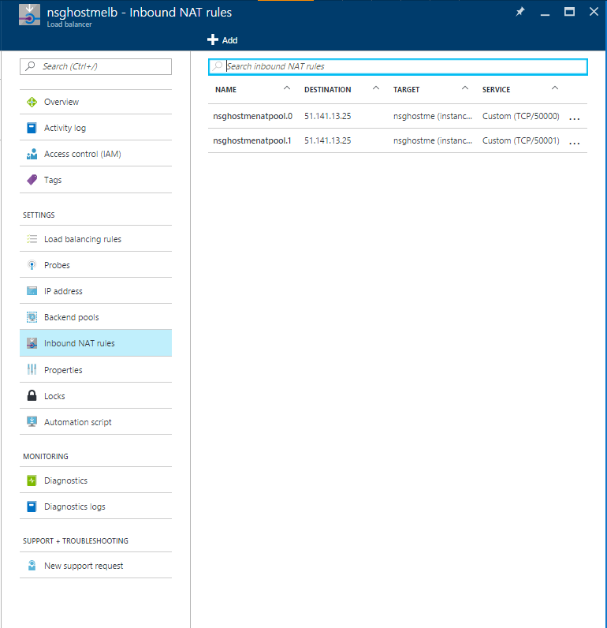

<properties
    pageTitle="使用 Azure 门户预览创建虚拟机规模集 | Azure"
    description="使用 Azure 门户预览部署规模集。"
    keywords="虚拟机规模集"
    services="virtual-machine-scale-sets"
    documentationcenter=""
    author="gatneil"
    manager="madhana"
    editor="tysonn"
    tags="azure-resource-manager"
    translationtype="Human Translation" />
<tags
    ms.assetid="9c1583f0-bcc7-4b51-9d64-84da76de1fda"
    ms.service="virtual-machine-scale-sets"
    ms.workload="infrastructure-services"
    ms.tgt_pltfrm="vm"
    ms.devlang="na"
    ms.topic="article"
    ms.date="09/15/2016"
    wacn.date="04/17/2017"
    ms.author="negat"
    ms.custom="H1Hack27Feb2017"
    ms.sourcegitcommit="e0e6e13098e42358a7eaf3a810930af750e724dd"
    ms.openlocfilehash="7cc2df26ff33d62b43a1f7eb73bbca93078655f4"
    ms.lasthandoff="04/06/2017" />

# 如何使用 Azure 门户预览创建虚拟机规模集
本教程介绍如何使用 Azure 门户预览在数分钟内轻松创建虚拟机规模集。 如果没有 Azure 订阅，可在开始前创建一个[试用帐户](/pricing/1rmb-trial/)。

## 从应用商店中选择 VM 映像
在门户中，可以使用 CentOS、CoreOS、Debian、Open Suse、Red Hat Enterprise Linux、SUSE Linux Enterprise Server、Ubuntu Server 或 Windows Server 映像轻松部署规模集。

首先，在 Web 浏览器中导航到 [Azure 门户预览](https://portal.azure.cn) 。 单击 `New`，搜索 `scale set`，然后选择 `Virtual machine scale set` 条目：

## 创建规模集
现在可使用默认设置并快速创建规模集。

* 在 `Basics` 边栏选项卡上，输入规模集的名称。 此名称将成为规模集前端负载均衡器的 FQDN 的基础，因此请确保在整个 Azure 中，此名称是唯一的。
* 选择所需的 OS 类型，输入所需的用户名，然后选择希望使用的身份验证类型。 如果选择使用密码，密码的长度必须至少为 12 个字符，并且必须符合以下四个复杂性要求中的其中三个：1 个小写字符、1 个大写字符、1 个数字和 1 个特殊字符。 了解有关[用户名和密码要求](/documentation/articles/virtual-machines-windows-faq/#what-are-the-username-requirements-when-creating-a-vm)的详细信息。 如果选择 `SSH public key`，请确保仅在公钥中粘贴，而不是在私钥中：

* 输入所需的资源组名称和位置，然后单击 `OK` 。
* 在 `Virtual machine scale set service settings` 边栏选项卡上：输入所需的域名标签（规模集前端负载均衡器的 FQDN 的基础）。 在整个 Azure 中，此标签必须是唯一的。
* 选择所需的操作系统磁盘映像、实例计数和计算机大小。

* 当验证完成时，在 `Summary` 边栏选项卡上，单击 `OK` 开始规模集部署。

## 连接到规模集中的 VM
如果选择将规模集限制在单个放置组，则使用 NAT 规则部署规模集，这些规则已配置为允许轻松连接到规模集（如果未配置，若要连接到规模集中的虚拟机，则可能需要在与规模集相同的虚拟网络中创建 jumpbox）。 若要查看它们，请导航到规模集的负载均衡器的 `Inbound NAT Rules` 选项卡：

可以使用这些 NAT 规则连接到规模集中的每个 VM。 例如，对于 Windows 规模集，如果传入端口 50000 使用的是 NAT 规则，则可以通过 `<load-balancer-ip-address>:50000`上的 RDP 连接到该计算机。 对于 Linux 规模集，则使用命令 `ssh -p 50000 <username>@<load-balancer-ip-address>`进行连接。

## 后续步骤
有关如何从 CLI 部署规模集的文档，请参阅[本文档](/documentation/articles/virtual-machine-scale-sets-create/)。

有关如何从 PowerShell 部署规模集的文档，请参阅[本文档](/documentation/articles/virtual-machine-scale-sets-create/)。

有关如何从 Visual Studio 部署规模集的文档，请参阅[本文档](/documentation/articles/virtual-machine-scale-sets-vs-create/)。

有关常规文档，请参阅[规模集的文档概述页](/documentation/articles/virtual-machine-scale-sets-overview/)。

有关一般信息，请参阅[规模集的主要登陆页](/home/features/virtual-machine-scale-sets/)。
<!--Update_Description: wording update-->