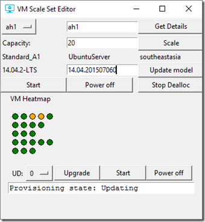

<properties
	pageTitle="在虚拟机规模集上部署应用 | Azure"
	description="在虚拟机规模集上部署应用"
	services="virtual-machine-scale-sets"
	documentationCenter=""
	authors="gbowerman"
	manager="timlt"
	editor=""
	tags="azure-resource-manager"/>  

<tags
	ms.service="virtual-machine-scale-sets"
	ms.workload="na"
	ms.tgt_pltfrm="na"
	ms.devlang="na"
	ms.topic="article"
	ms.date="09/13/2016"
	wacn.date="10/31/2016"
	ms.author="guybo"/>  

# 升级虚拟机规模集

本文介绍了如何在不停机的情况下为 Azure 虚拟机规模集推出 OS 更新。在此上下文中，OS 更新涉及到更改 OS 的版本或 SKU，或者更改自定义映像的 URI。在不停机的情况下更新意味着一次只更新一台或一个组中的虚拟机（如一次更新一个容错域），而不是一次更新所有虚拟机。这样做能使没有进行升级的虚拟机继续运行。

为了避免混淆，我们来区分一下可能要执行的 OS 更新的三种类型：

- 更改平台映像的版本或 SKU。例如，将 Ubuntu 14.04.2-LTS 版本从 14.04.201506100 更改为 14.04.201507060，或者将 Ubuntu 15.10/最新 SKU 更改为 16.04.0-LTS/最新。本文中介绍了此方案。

- 更改指向生成的自定义映像的新版本的 URI（“属性”>“virtualMachineProfile”>“storageProfile”>“osDisk”>“映像”>“URI”）。本文中介绍了此方案。

- 从虚拟机内部修补 OS（这样的示例包括安装安全修补程序以及运行 Windows 更新）。尽管此方案是受支持的，但在本文中不予讨论。

前两个选项是本文中所讨论的受支持的要求。若要执行第三个选项，需要创建新的规模集。

此处不讨论部署为 [Azure Service Fabric](/home/features/service-fabric/) 的一部分的虚拟机规模集。

更改平台映像的 OS 版本/SKU 或自定义映像的 URI 的基本顺序，如下所示：

1. 获取虚拟机规模集模型。

2. 更改模型中的版本、SKU 或 URI 值。

3. 更新模型。

4. 对规模集中的虚拟机执行 *manualUpgrade* 调用。只有将规模集中的 *upgradePolicy* 设置为“手动”时，此步骤才适用。如果设置为“自动”，所有的虚拟机则会同时升级，从而导致停机。

在记住了这些背景信息后，来看一下如何通过使用 REST API 在 PowerShell 中更新规模集的版本。尽管这些示例涵盖了关于平台映像的示例，但是本文提供了足量的信息使用户能够适应此过程以自定义映像。

## PowerShell ##

此示例会将 Windows 虚拟机规模集更新到新版本 4.0.20160229。更新模型后，它将一次更新一个虚拟机实例。

	$rgname = "myrg"
	$vmssname = "myvmss"
	$newversion = "4.0.20160229"
	$instanceid = "1"

	# get the VMSS model
	$vmss = Get-AzureRmVmss -ResourceGroupName $rgname -VMScaleSetName $vmssname

	# set the new version in the model data
	$vmss.virtualMachineProfile.storageProfile.imageReference.version = $newversion

	# update the virtual machine scale set model
	Update-AzureRmVmss -ResourceGroupName $rgname -Name $vmssname -VirtualMachineScaleSet $vmss

	# now start updating instances
	Update-AzureRmVmssInstance -ResourceGroupName $rgname -VMScaleSetName $vmssname -InstanceId $instanceId

如果要更新自定义映像的 URI，而不是更改平台映像版本，请将“设置新版本”一行替换为以下内容：

	# set the new version in the model data
	$vmss.virtualMachineProfile.storageProfile.osDisk.image.uri= $newURI

## REST API

这里有一些使用 Azure REST API 推出 OS 版本更新的 Python 示例。两种都使用了 Azure REST API 包装函数的轻型 [azurerm](https://pypi.python.org/pypi/azurerm) 库，可先对规模集模型执行 GET，然后使用更新的模型执行 PUT。它们也会查看虚拟机实例视图来根据更新域识别虚拟机。

### Vmssupgrade

 [Vmssupgrade](https://github.com/gbowerman/vmsstools) 是用于为正在运行的虚拟机规模集推出 OS 升级的 Python 脚本，一次一个更新域。

  

使用此脚本，可选择要更新的具体虚拟机或者指定更新域。它支持更改平台映像版本或更改自定义映像的 URI。

### Vmsseditor

[Vmsseditor](https://github.com/gbowerman/vmssdashboard) 是一个适用于虚拟机规模集的通用编辑器，用于显示状态为 heatmap 的虚拟机规模集，其中一行表示一个更新域。除此之外，还可以使用新版本、SKU 或自定义映像 URI 来更新规模集的模型，然后选择要升级的容错域。执行此操作时，该更新域中的所有虚拟机都将升级到新模型。或者，可以根据所选的批大小执行滚动升级。

以下屏幕截图显示了 Ubuntu 14.04-2LTS 版本 14.04.201507060 的规模集的模型。自此屏幕截图截取之后，又为此工具添加了更多的选项。

  

单击“升级”和“获取详细信息”之后，UD 0 中的虚拟机将开始进行更新。

  

<!---HONumber=Mooncake_1024_2016-->