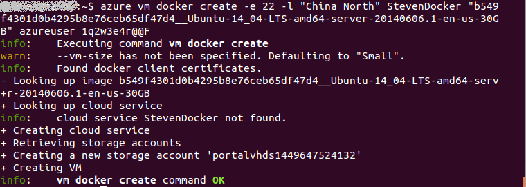

<properties title="How to use the Docker VM Extension from Azure Cross-Platform Interface (xplat-cli)" pageTitle="使用适用于 Azure 上的 Linux 的 Docker VM 扩展" description="介绍 Docker 以及 Azure 虚拟机扩展，并说明如何在 Azure 上，使用 azure-cli 命令界面通过命令行以编程方式创建用作 Docker 主机的虚拟机。" metaKeywords="linux, virtual machines, vm, azure, docker, linux containers,  lxc, virtualization" services="virtual-machines" solutions="dev-test" documentationCenter="virtual-machines" authors="rasquill" videoId="" scriptId="" manager="timlt" />
<tags
	ms.service="virtual-machines"
	ms.date="05/22/2015"
	wacn.date="08/29/2015"/>

# 从 Azure 命令行界面 (Azure CLI) 使用 Docker VM 扩展

本主题说明如何通过 Azure CLI 中的服务管理 (asm) 模式，在任何平台上创建包含 Docker VM 扩展的 VM。[Docker](https://www.docker.com/) 是最常用的虚拟化技术之一，它使用 [Linux 容器](http://zh.wikipedia.org/wiki/LXC)而不是虚拟机作为在共享资源上隔离数据和执行计算的方法。可以在 [Azure Linux 代理](/documentation/articles/virtual-machines-linux-agent-user-guide)中使用 Docker VM 扩展，以创建可在 Azure 上为应用程序托管任意数量的容器的 Docker VM。若要查看容器及其优点的综合讨论，请参阅 [Docker 高级白板](http://channel9.msdn.com/Blogs/Regular-IT-Guy/Docker-High-Level-Whiteboard)。

+ [如何对 Azure 使用 Docker VM 扩展]
+ [适用于 Linux 和 Windows 的虚拟机扩展] 
+ [Azure 的容器和容器管理资源]
+ [后续步骤]


## <a id='How to use the Docker VM Extension with Azure'>如何对 Azure 使用 Docker VM 扩展</a>
若要对 Azure 使用 Docker VM，你必须安装 0.8.6 版本以上的 [Azure 命令行界面 ](https://github.com/Azure/azure-sdk-tools-xplat)(Azure CLI) （截至本文编写时的最新版本为 0.8.10）。可以在 Mac、Linux 和 Windows 上安装 Azure CLI。


在 Azure 上使用 Docker 的整个过程相当简单：

+ 在要从中控制 Azure 的计算机上安装 Azure CLI 及其依赖项（在 Windows 上，这是作为虚拟机运行的 Linux 分发版）
+ 使用 Azure CLI Docker 命令在 Azure 中创建 VM Docker 主机
+ 使用本地 Docker 命令在 Azure 中的 Docker VM 内管理 Docker 容器。


### 安装 Azure 命令行界面 (Azure CLI)

若要安装和配置 Azure CLI，请参阅[如何安装 Azure 命令行界面](/documentation/articles/xplat-cli-install)。若要确认安装，请在命令提示符下键入 `azure`，片刻之后，你就会看到 Azure CLI ASCII 图文，其中列出了可用的基本命令。如果安装正常，你应该可以键入 `azure help vm`，并看到列出的其中一个命令是“docker”。

> [AZURE.NOTE]Docker 提供适用于 Windows 的安装程序 [Boot2Docker](https://docs.docker.com/installation/windows/)，你也可以使用该安装程序自动创建可以配合用作 docker 主机的 Azure VM 使用的 docker 客户端。

### 将 Azure CLI 连接到你的 Azure 帐户
在使用 Azure CLI 之前，必须将 Azure 帐户凭据与平台上的 Azure CLI 相关联。[如何连接到 Azure 订阅](/documentation/articles/xplat-cli-connect)部分说明了如何下载和导入 **.publishsettings** 文件，或者将 Azure CLI 与组织 ID 相关联。

> [AZURE.NOTE]由于使用一个或其他多个身份验证方法的行为有一些差异，因此请务必阅读上述文档，以了解不同的功能。

### 安装 Docker 并对 Azure 使用 Docker VM 扩展
遵循 [Docker 安装说明](https://docs.docker.com/installation/#installation)在计算机本地安装 Docker。

若要将 Docker 与 Azure 虚拟机配合使用，VM 使用的 Linux 映像上必须已安装 [Azure Linux VM 代理](/documentation/articles/virtual-machines-linux-agent-user-guide)。目前，只有两种类型的映像提供此代理：

+ Azure 映像库中的 Ubuntu 映像，或 

+ 使用已安装并配置的 Azure Linux VM 代理创建的自定义 Linux 映像。有关如何使用 Azure VM 代理构建自定义 Linux VM 的详细信息，请参阅 [Azure Linux VM 代理](/documentation/articles/virtual-machines-linux-agent-user-guide)。

### 使用 Azure 映像库

从 Bash 或终端会话键入以下 Azure CLI 命令找到 VM 映像库中要使用的最新 Ubuntu 映像

`azure vm image list | grep Ubuntu-14_04`

选择其中一个映像名称（例如 `b39f27a8b8c64d52b05eac6a62ebad85__Ubuntu-14_04-LTS-amd64-server-20140724-en-us-30GB`），然后使用以下命令创建使用该映像的新 VM。

```
azure vm docker create -e 22 -l "West US" <vm-cloudservice name> "b39f27a8b8c64d52b05eac6a62ebad85__Ubuntu-14_04-LTS-amd64-server-20140724-en-us-30GB" <username> <password>
``` 

其中：

+ *&lt;vm-cloudservice name&gt;* 是将成为 Azure 中 Docker 容器主计算机的 VM 名称。

+  *&lt;username&gt;* 是 VM 默认 root 用户的用户名

+ *&lt;password&gt;* 是 *username* 帐户的密码，需符合 Azure 的复杂性标准
 
> [AZURE.NOTE]目前，密码必须至少有 8 个字符，包含一个小写字母和一个大写字母、一个数字以及下列特殊字符之一：`!@#$%^&+=`。不，上一个句子末尾的句号并不是特殊字符。

如果命令成功，根据使用的确切参数和选项，你应会可以看到如下所示的内容：



> [AZURE.NOTE]创建虚拟机可能需要几分钟的时间，但当其设置完成后，Docker 守护程序（Docker 服务）便会启动，你可以连接到 Docker 容器主机。

若要测试你在 Azure 中创建的 Docker VM，请键入

`docker --tls -H tcp://<vm-name-you-used>.chinacloudapp.cn:2376 info`

其中，*<vm-name-you-used>* 是你在 `azure vm docker create` 调用中使用的虚拟机名称。你应会看到如下所示的内容，这表示 Docker 主机 VM 已在 Azure 中启动和运行，并且正等待你的命令。


### Docker 主机 VM 身份验证
除了创建 Docker VM 以外，`azure vm docker create` 命令还会自动创建所需的证书，使 Docker 客户端计算机能够使用 HTTPS 连接到 Azure 容器主机；这些证书将适当地存储在客户端和主计算机上。在后续运行时，现有证书将被重复使用并与新主机共享。

默认情况下，证书放置在 `~/.docker` 中，而 Docker 将配置为在端口 **2376** 上运行。如果你要使用不同的端口或目录，则可以使用下列其中一个 `azure vm docker create` 命令行选项将 Docker 容器主机 VM 配置为使用不同端口或不同证书来连接客户端：

```
-dp, --docker-port [port]              Port to use for docker [2376]
-dc, --docker-cert-dir [dir]           Directory containing docker certs [.docker/]
```

主机上的 Docker 守护程序配置为使用由 `azure vm docker create` 命令生成的证书侦听和验证指定端口上的客户端连接。客户端计算机必须使用这些证书来获取对 Docker 主机的访问权限。

> [AZURE.NOTE]不使用这些证书运行的联网主机很容易受到任何可连接到该计算机的用户的攻击。在修改默认配置之前，请确保了解这样做会对计算机和应用程序造成的风险。


## 后续步骤

现在，你可以转到 [Docker 用户指南]并开始使用你的 Docker VM。若要在新门户中创建启用 Docker 的 VM，请参阅[如何在门户中使用 Docker VM 扩展]。

<!--Anchors-->
[Subheading 1]: #subheading-1
[Subheading 2]: #subheading-2
[Subheading 3]: #subheading-3
[后续步骤]: #next-steps

[如何对 Azure 使用 Docker VM 扩展]: #How-to-use-the-Docker-VM-Extension-with-Azure
[适用于 Linux 和 Windows 的虚拟机扩展]: #Virtual-Machine-Extensions-For-Linux-and-Windows
[Azure 的容器和容器管理资源]: #Container-and-Container-Management-Resources-for-Azure

<!--Image references-->
[5]: ./media/markdown-template-for-new-articles/octocats.png
[6]: ./media/markdown-template-for-new-articles/pretty49.png
[7]: ./media/markdown-template-for-new-articles/channel-9.png


<!--Link references-->
[Link 1 to another azure.microsoft.com documentation topic]: /zh-cn/documentation/articles/virtual-machines-windows-tutorial/
[Link 2 to another azure.microsoft.com documentation topic]: /zh-cn/documentation/articles/web-sites-custom-domain-name/
[Link 3 to another azure.microsoft.com documentation topic]: /zh-cn/documentation/articles/storage-whatis-account/
[如何在门户中使用 Docker VM 扩展]: /zh-cn/documentation/articles/virtual-machines-docker-with-portal/

[Docker 用户指南]: https://docs.docker.com/userguide/

<!---HONumber=67-->