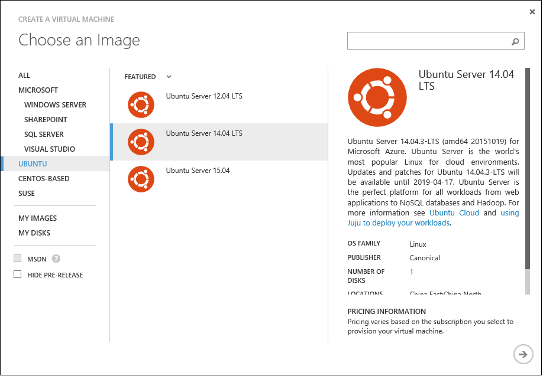
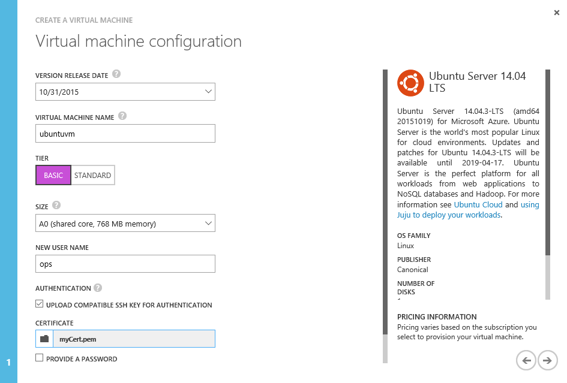
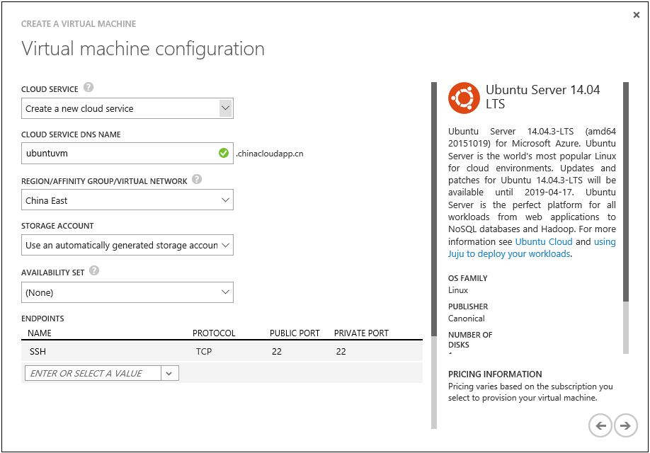
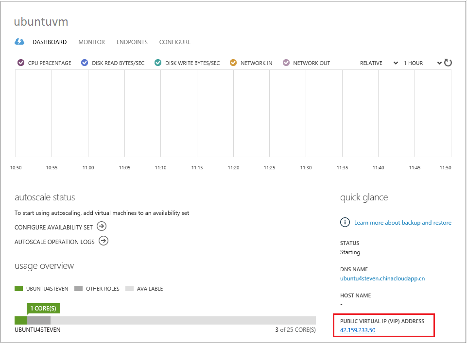

<properties
	pageTitle="在 Azure 管理门户中创建运行 Linux 的 Azure 虚拟机 | Azure"
	description="在 Azure 管理门户中使用 Azure 资源组创建运行 Linux 的 Azure 虚拟机 (VM)。"
	services="virtual-machines"
	documentationCenter=""
	authors="squillace"
	manager="timlt"
	editor="tysonn"
	tags="azure-resource-manager"/>

<tags
	ms.service="virtual-machines"
	ms.date="10/21/2015"
	wacn.date=""/>

# 使用 Azure 管理门户创建运行 Linux 的虚拟机

> [AZURE.SELECTOR]
- [门户 - Windows](/documentation/articles/virtual-machines-windows-tutorial-classic-portal)
- [PowerShell](/documentation/articles/virtual-machines-ps-create-preconfigure-windows-vms)
- [门户 - Linux](/documentation/articles/virtual-machines-linux-tutorial-portal-rm)
- [CLI](/documentation/articles/virtual-machines-linux-tutorial)

 

[AZURE.INCLUDE [了解部署模型](../includes/learn-about-deployment-models-classic-include.md)]

创建运行 Linux 的 Azure 虚拟机 (VM) 是一项很简单的操作。本教程演示如何使用 Azure 管理门户快速创建一个虚拟机，并使用 `.pem` 证书文件来保护与 VM 的 **SSH** 连接。你也可以[将自己的映像作为模板](/documentation/articles/virtual-machines-linux-create-upload-vhd)来创建 Linux VM。

[AZURE.INCLUDE [free-trial-note](../includes/free-trial-note.md)]

## 选择映像

1. 登录到 [Azure 管理门户](https://manage.windowsazure.cn)。

2. 在门户的底部，单击“新建”>“计算”>“虚拟机”>“从库中”。在映像列表中选择“Ubuntu Server 14.04 LTS”。

	

## 创建虚拟机

选择映像后，可以对大多数配置使用 Azure 的默认设置并快速创建 VM。

1. 在“虚拟机配置”上，输入要为 VM 起的**名称**和证书文件（在此例中为 `.pem` 文件）。有关详细信息，请参阅[如何在 Azure 中将 SSH 与 Linux 和 Mac 配合使用](/documentation/articles/virtual-machines-linux-use-ssh-key)。

	

	> [AZURE.NOTE] 如果不想使用公钥和私钥交换来保护 **ssh** 会话的安全，你还可以在此处选择用户名/密码身份验证并输入该信息。

2. 选择定价**层**，并使用“大小”下拉菜单选择所需的相应 VM 大小。每种大小都指定了计算核心的数量、内存以及其他功能，比如对高级存储的支持，这将对价格产生影响。根据所选的映像，Azure 将自动推荐特定的大小。

	>[AZURE.NOTE] 高级存储可用于 DS 系列虚拟机，该虚拟机尚不可在门户中配置。但是，你可以使用 Azure PowerShell 创建 DS 系列虚拟机。高级存储是数据密集型工作负荷（如数据库）的最佳存储选项。有关详细信息，请参阅[高级存储：适用于 Azure 虚拟机工作负荷的高性能存储](/documentation/articles/storage-premium-storage-preview-portal)。

3. 单击“下一步”按钮以查看新 VM 的存储和网络设置。对于第一个 VM，一般可以接受默认设置。

	

6. 单击“下一步”按钮，然后选择是否安装 VM 代理。请注意，**配置扩展**尚不可用于 Linux。

8. 单击“完成”按钮以创建虚拟机。创建虚拟机后，你将能够从虚拟机列表中看到它。

## 使用 **ssh** 连接到你的 Azure Linux VM

现在可以使用 **ssh** 以标准方式连接到 Ubuntu VM。可以从虚拟机列表中选择你的虚拟机并单击“仪表板”。你可以在该处找到**公共虚拟 IP (VIP) 地址**。

现在一切准备就绪，你可以使用 **ssh** 连接到你的 Azure VM 了。

	ssh ops@23.96.106.1 -p 22
	The authenticity of host '23.96.106.1 (23.96.106.1)' can't be established.
	ECDSA key fingerprint is bc:ee:50:2b:ca:67:b0:1a:24:2f:8a:cb:42:00:42:55.
	Are you sure you want to continue connecting (yes/no)? yes
	Warning: Permanently added '23.96.106.1' (ECDSA) to the list of known hosts.
	Welcome to Ubuntu 14.04.2 LTS (GNU/Linux 3.16.0-43-generic x86_64)

	 * Documentation:  https://help.ubuntu.com/

	  System information as of Mon Jul 13 21:36:28 UTC 2015

	  System load: 0.31              Memory usage: 5%   Processes:       208
	  Usage of /:  42.1% of 1.94GB   Swap usage:   0%   Users logged in: 0

	  Graph this data and manage this system at:
	    https://landscape.canonical.com/

	  Get cloud support with Ubuntu Advantage Cloud Guest:
	    http://www.ubuntu.com/business/services/cloud

	0 packages can be updated.
	0 updates are security updates.

	The programs included with the Ubuntu system are free software;
	the exact distribution terms for each program are described in the
	individual files in /usr/share/doc/*/copyright.

	Ubuntu comes with ABSOLUTELY NO WARRANTY, to the extent permitted by
	applicable law.

	ops@ubuntuvm:~$

## 后续步骤

若要了解有关 Azure 上的 Linux 的详细信息，请参阅：

- [Azure 上的 Linux 和开源计算](/documentation/articles/virtual-machines-linux-opensource)

- [如何使用针对 Mac 和 Linux 的 Azure 命令行工具](/documentation/articles/virtual-machines-command-line-tools)

- [使用适用于 Linux 的 Azure CustomScript 扩展部署 LAMP 应用程序](/documentation/articles/virtual-machines-linux-script-lamp)

- [Azure 上用于 Linux 的 Docker 虚拟机扩展](/documentation/articles/virtual-machines-docker-vm-extension)

<!---HONumber=Mooncake_0321_2016-->