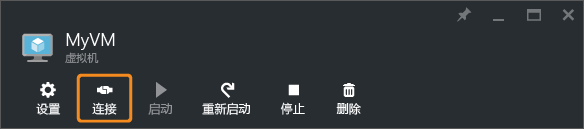

<!-- Ibiza portal: tested -->

<properties
	pageTitle="连接到 Windows Server VM | Azure"
	description="了解如何使用 Azure 门户预览和 Resource Manager 部署模型连接并登录到 Windows VM。"
	services="virtual-machines-windows"
	documentationCenter=""
	authors="cynthn"
	manager="timlt"
	editor="tysonn"
	tags="azure-resource-manager"/>

<tags
	ms.service="virtual-machines-windows"
	ms.date="05/05/2016"
	wacn.date="07/11/2016"/>

# 如何连接并登录到运行 Windows 的 Azure 虚拟机 

你将在 Azure 门户预览中使用“连接”按钮来启动远程桌面 (RDP) 会话。首先连接到虚拟机，然后登录。

## 连接到虚拟机

1. 如果你尚未登录 [Azure 门户预览](https://portal.azure.cn/)，请先登录。

2.	在“中心”菜单中，单击“虚拟机”。

3.	从列表中选择虚拟机。

4. 在虚拟机边栏选项卡上，单击“连接”。

	
	
 > [AZURE.TIP] 如果门户中的“连接”按钮灰显，并且你未通过 [Express Route](/documentation/articles/expressroute-introduction/) 或[站点到站点 VPN](/documentation/articles/vpn-gateway-howto-site-to-site-resource-manager-portal/) 连接连接到 Azure，则必须先为 VM 创建并分配一个公共 IP 地址才能使用 RDP。你可以深入了解 [Azure 中的公共 IP 地址](/documentation/articles/virtual-network-ip-addresses-overview-arm/)。

## 登录到虚拟机

[AZURE.INCLUDE [virtual-machines-log-on-win-server](../includes/virtual-machines-log-on-win-server.md)]

## 后续步骤

如果在尝试连接时遇到故障，请参阅[对基于 Windows 的 Azure 虚拟机的远程桌面连接进行故障排除](/documentation/articles/virtual-machines-windows-troubleshoot-rdp-connection/)。此文将指导你完成诊断和解决常见问题。

<!---HONumber=Mooncake_0704_2016-->