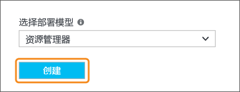
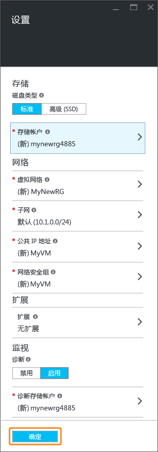
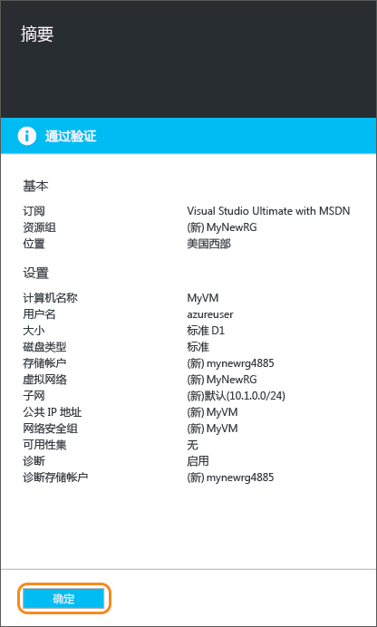
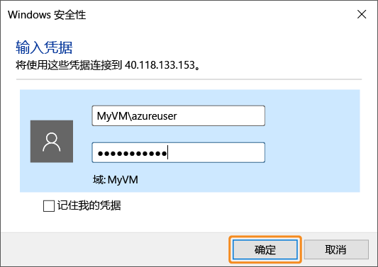
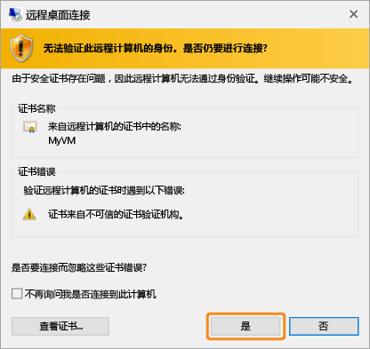
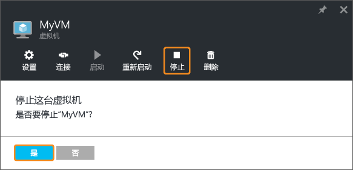

<!-- Ibiza portal: tested -->

<properties
	pageTitle="创建第一个 Windows VM | Azure"
	description="了解如何使用 Azure 门户预览创建第一个 Windows 虚拟机。"
	keywords="Windows 虚拟机,创建虚拟机,虚拟计算机,设置虚拟机"
	services="virtual-machines-windows"
	documentationCenter=""
	authors="cynthn"
	manager="timlt"
	editor=""
	tags="azure-resource-manager"/>
<tags 
	ms.service="virtual-machines-windows"
	ms.date="05/05/2016"
	wacn.date="06/20/2016"/>

# 在 Azure 门户预览中创建第一个 Windows 虚拟机

本教程说明如何在片刻之间轻松地在 Azure 门户预览中创建 Windows VM。

如果没有 Azure 订阅，只需要花费几分钟就能创建一个[试用帐户](/pricing/1rmb-trial/)。

下面是本教程的[视频演练](https://channel9.msdn.com/Blogs/Azure-Documentation-Shorts/Create-A-Virtual-Machine-Running-Windows-In-The-Azure-Preview-Portal)。

## 从应用商店中选择 VM 映像

我们将使用 Windows Server 2012 R2 Datacenter 映像作为示例，但这只是 Azure 提供的众多映像的其中一个。

1. 登录到 [Azure 门户预览](https://portal.azure.cn)。

2. 在“中心”菜单上，单击“新建”>“虚拟机”>“Windows Server 2012 R2 Datacenter”。

	

3. 在“Windows Server 2012 R2 Datacenter”页上，确保在“选择部署模型”下选择“资源管理器”。单击“创建”。

	

## 创建 Windows 虚拟机

选择映像后，可以对大多数配置使用 Azure 的默认设置并快速创建虚拟机。

1. 在“基本信息”边栏选项卡上，输入虚拟机的**名称**。名称必须为 1-15 个字符，不能包含特殊字符。

2. 输入用于在 VM 上创建本地帐户的**用户名**和强**密码**。该本地帐户用于登录和管理 VM。

	密码的长度必须至少为 12 到 123 个字符，并且必须至少包含 1 个小写字符、1 个大写字符、1 个数字和 1 个特殊字符。

3. 选择现有的[资源组](/documentation/articles/resource-group-overview/#resource-groups)，或键入新资源组的名称。键入 Azure 数据中心的**位置**，例如**中国北部**。

4. 完成后，单击“确定”转到下一部分。

	

	
5. 选择 VM [大小](/documentation/articles/virtual-machines-windows-sizes/)，然后单击“选择”以继续。

	

6. 在“设置”边栏选项卡上，可以更改存储和网络选项。对于第一个虚拟机，一般可以接受默认设置。如果选择了支持它的虚拟机大小，则可以通过选择“磁盘类型”下的“高级(SSD)”来试用高级存储。完成更改后，单击“确定”。

	

7. 单击“摘要”以查看你的选择。完成后，单击“确定”。

	

8. 当 Azure 创建虚拟机时，你可以在中心菜单中的“虚拟机”下跟踪进度。

## 连接到虚拟机并登录

1.	在“中心”菜单中，单击“虚拟机”。

2.	从列表中选择虚拟机。

3. 在虚拟机边栏选项卡上，单击“连接”。随后将创建并下载远程桌面协议文件（.rdp 文件），该文件类似于用于连接计算机的快捷方式。你可以将此文件保存到桌面以便于访问。**打开**此文件以连接到 VM。

	

4. 你将收到 .rdp 来自未知发布者的警告。这是一般警报。在“远程桌面”窗口中，单击“连接”以继续。

	

5. 在“Windows 安全性”窗口中，键入创建 VM 时创建的本地帐户的用户名和密码。以 *vmname*&#92;*username* 的形式输入用户名，然后单击“确定”。

	
 	
6.	你将收到警告，指出无法验证证书。这是一般警报。单击“是”以验证虚拟机的 ID 并完成登录。

	

如果你在尝试连接时遇到故障，请参阅[解决远程桌面连接到基于 Windows 的 Azure 虚拟机的问题](/documentation/articles/virtual-machines-windows-troubleshoot-rdp-connection/)。

您现在可以像使用任何其他服务器一样使用该虚拟机。

## 停止 VM

如果你并未真正在使用 VM，最好将它停止，以免产生费用。只需单击“停止”按钮，然后单击“是”。

	
准备好再次使用 VM 时，只需单击“启动”按钮即可将它重新启动。

## 后续步骤

* 你还可以体验[将数据磁盘附加到](/documentation/articles/virtual-machines-windows-attach-disk-portal/)虚拟机。数据磁盘可为虚拟机提供更多存储空间。

* 你也可以[使用 Powershell 创建 Windows VM](/documentation/articles/virtual-machines-windows-ps-create/) 或[使用 Azure CLI 创建 Linux 虚拟机](/documentation/articles/virtual-machines-linux-quick-create-cli/)。

<!---HONumber=Mooncake_0613_2016-->