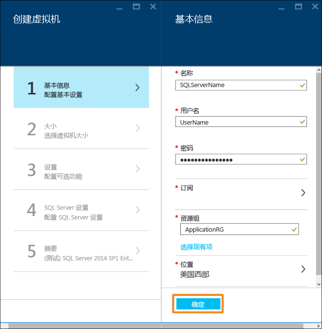

<!-- ARM -->

<properties
	pageTitle="预配 SQL Server 虚拟机 | Azure"
	description="使用门户在 Azure 中创建并连接到 SQL Server 虚拟机。本教程使用 Resource Manager 模式。"
	services="virtual-machines-windows"
	documentationCenter="na"
	authors="rothja"
	editor=""
	manager="jhubbard"
	tags="azure-resource-manager" />
<tags
	ms.service="virtual-machines-windows"
	ms.date="05/16/2016"
	wacn.date="06/27/2016"/>

# 在 Azure 门户中预配 SQL Server 虚拟机

> [AZURE.SELECTOR]
- [门户](/documentation/articles/virtual-machines-windows-portal-sql-server-provision)
- [PowerShell](/documentation/articles/virtual-machines-windows-ps-sql-create)

本端到端教程说明如何使用 Azure 门户来预配运行 SQL Server 的虚拟机。

> [AZURE.NOTE] Azure 具有用于创建和处理资源的两个不同的部署模型：[资源管理器和经典](/documentation/articles/resource-manager-deployment-model)。本文介绍如何使用 Resource Manager 部署模型。Microsoft 建议对大多数新的部署使用该模型，而不是经典部署模型。

Azure 虚拟机 (VM) 库包括几种内含 Microsoft SQL Server 的映像。只需单击几下鼠标，就可从库中选择一个 SQL VM 映像，并将其预配到你的 Azure 环境中。

在本教程中，您将：

- [从库中选择 SQL VM 映像](#select-a-sql-vm-image-from-the-gallery)
- [配置和创建 VM](#configure-the-vm)
- [使用远程桌面打开 VM](#open-the-vm-with-remote-desktop)
- [远程连接到 SQL Server](#connect-to-sql-server-remotely)

## 从库中选择 SQL VM 映像

1. 使用你的帐户登录到 [Azure 门户](https://portal.azure.cn)。

	>[AZURE.NOTE] 如果你没有 Azure 帐户，请访问 [Azure 试用](/pricing/1rmb-trial/)。

1. 在 Azure 门户中，单击“新建”。门户中会打开“新建”边栏选项卡。SQL Server VM 资源位于应用商店的“虚拟机”组中。

1. 在“新建”边栏选项卡中，单击“虚拟机”。
1. 若要查看所有可用的映像，请单击“虚拟机”边栏选项卡中的“查看全部”。

	

1. 在“数据库服务器”下单击“SQL Server”即可查看可供 SQL Server 使用的所有模板。你可能需要向下滚动才能找到“数据库服务器”。

	

1. 	每个模板均可标识 SQL Server 版本和操作系统。从列表中选择以下映像之一，以便显示包含其详细信息的边栏选项卡。
1.	详细信息边栏选项卡对此虚拟机映像进行了说明，并允许你选择部署模型。在“选择部署模型”下面，确认已选择“Resource Manager”，然后单击“创建”。

	

## 配置 VM
在 Azure 门户中有五个用于配置 SQL Server 虚拟机的边栏选项卡。

| 步骤 | 说明 |
|---------------------|-------------------------------|
| **基础知识** | [配置基本设置](#1-configure-basic-settings) |
| **大小** | [选择虚拟机大小](#2-choose-virtual-machine-size) |
| **设置** | [配置可选功能](#3-configure-optional-features) |
| **SQL Server 设置** | [配置 SQL Server 设置](#4-configure-sql-server-settings) |
| **摘要** | [查看摘要](#5-review-the-summary) |

## 1\.配置基本设置
在“基本信息”边栏选项卡中提供以下信息：

* 输入唯一的虚拟机**名称**。
* 指定计算机本地管理员帐户的**用户名**。此帐户还将是 SQL Server sysadmin 固定服务器角色的成员。
* 提供一个强**密码**。
* 如果你有多个订阅，请确保该订阅是要构建的 VM 的正确订阅。
* 在“资源组”框中，键入新资源组的名称。此外，若要使用现有的资源组，请单击“选择现有项”。资源组是 Azure（虚拟机、存储帐户、虚拟网络等）中相关资源的集合。
	
	>[AZURE.NOTE] 如果你只是测试或了解 Azure 中的 SQL Server 部署，使用新的资源组很有帮助。完成测试后，可以删除整个资源组。这会删除与该资源组关联的所有资源，包括 SQL VM。有关资源组的详细信息，请参阅 [Azure Resource Manager Overview（Azure Resource Manager 概述）](/documentation/articles/resource-group-overview)。

* 选择此部署的**位置**。
* 单击“确定”保存设置。

	

## 2\.选择虚拟机大小
执行“大小”设置步骤时，请在“选择大小”边栏选项卡中选择虚拟机大小。边栏选项卡最初会显示建议的计算机大小。大小取决于所选模板。系统还会估算每月运行 VM 的费用。

对于生产工作负荷，建议选择可支持[高级存储](/documentation/articles/storage-premium-storage)的虚拟机大小。如果你不需要该级别的性能，请使用“全部查看”按钮来查看所有计算机大小选项。例如，可以将较小的计算机大小用于开发或测试环境。

>[AZURE.NOTE] 有关虚拟机大小的详细信息，请参阅 [Sizes for virtual machines（虚拟机大小）](/documentation/articles/virtual-machines-windows-sizes)。有关 SQL Server VM 大小的考虑事项，请参阅 [Performance best practices for SQL Server in Azure Virtual Machines（SQL Server 在 Azure 虚拟机中的性能最佳实践）](/documentation/articles/virtual-machines-windows-sql-performance)。

选择计算机大小，然后单击“选择”。

## 3\.配置可选功能
在“设置”边栏选项卡中，为虚拟机配置 Azure 存储空间、网络和监视。

- 在“存储”下面，为“磁盘类型”指定“标准”或“高级(SSD)”。对于生产型工作负荷，建议使用高级存储。

>[AZURE.NOTE] 如果对不支持高级存储的计算机大小选择“高级(SSD)”，计算机大小会自动调整为支持高级存储的大小。

- 在“存储帐户”下，你可以接受自动设置的存储帐户名称，或者可以单击“存储帐户”以选择现有的帐户和配置存储帐户类型。默认情况下，Azure 将创建具有本地冗余存储空间的新存储帐户。有关存储选项的详细信息，请参阅 [Azure Storage replication（Azure 存储空间复制）](/documentation/articles/storage-redundancy)。

- 在“网络”下，你可以接受自动为功能填充的值，也可以单击每项功能，然后配置“虚拟网络”、“子网”、“公共 IP 地址”和“网络安全组”。对于本教程，请保留默认值。

- 默认情况下，Azure 会对为 VM 指定的同一个存储帐户启用“监视”功能。你可以在此处更改这些设置。

- 在“可用性集”下指定可用性集。在本教程中，可以选择“无”。如果你计划设置 SQL AlwaysOn 可用性组，可以对可用性进行配置，避免重新创建虚拟机。有关详细信息，请参阅[管理虚拟机的可用性](/documentation/articles/virtual-machines-windows-manage-availability)。

配置完这些设置后，请单击“确定”。

## 4\.配置 SQL Server 设置
在“SQL Server 设置”边栏选项卡上，配置 SQL Server 的特定设置和优化。可以为 SQL Server 配置的设置包括以下各项。

| 设置 |
|---------------------|
| [连接](#connectivity) |
| [身份验证](#authentication) |
| [存储配置](#storage-configuration) |
| [自动修补](#automated-patching) |
| [自动备份](#automated-backup) |
| [Azure 密钥保管库集成](#azure-key-vault-integration) |

### 连接
在“SQL 连接”下，指定要对此 VM 上的 SQL Server 实例进行的访问类型。对于本教程，请选择“公共(Internet)”以允许从 Internet 上的计算机或服务连接到 SQL Server。选择此选项以后，Azure 会自动将防火墙和网络安全组配置为允许在端口 1433 上通信。

若要通过 Internet 连接到 SQL Server，还必须启用下一部分中所述的“SQL Server 身份验证”。

>[AZURE.NOTE] 如果客户端通过特定的端口连接到 SQL Server，你可以限制与该源端口建立连接。为此，可以在创建 VM 后编辑网络安全组。有关详细信息，请参阅 [What is a Network Security Group (NSG)?（什么是网络安全组 (NSG)？）](/documentation/articles/virtual-networks-nsg)

如果你不希望启用通过 Internet 连接到数据库引擎这一功能，可选择以下选项之一：

- **本地(仅限 VM 内部)**：仅允许从 VM 内部连接到 SQL Server。
- **专用(虚拟网络内部)**：允许从同一虚拟网络中的虚拟机或服务连接到 SQL Server。

一般情况下，选择方案允许的最严格连接可提高安全性。但是，通过网络安全组规则和 SQL/Windows 身份验证的所有选项都是安全的。

**端口**：默认为 1433。你可以指定其他端口号。
有关详细信息，请参阅 [Connect to a SQL Server Virtual Machine (Resource Manager) | Azure（连接到 SQL Server 虚拟机 (Resource Manager) | Azure）](virtual-machines-windows-sql-connect.md)。

### 身份验证
如果你需要 SQL Server 身份验证，请在“SQL 身份验证”下单击“启用”。

>[AZURE.NOTE] 如果你计划通过 Internet 来访问 SQL Server（即“公共”连接选项），则必须在此处启用 SQL 身份验证。对 SQL Server 进行公共访问需要使用 SQL 身份验证。

如果启用 SQL Server 身份验证，请指定“登录名”和“密码”。此用户名将会是 SQL Server 身份验证登录名以及 sysadmin 固定服务器角色的成员。请参阅 [Choose an Authentication Mode（选择身份验证模式）](http://msdn.microsoft.com/zh-cn/library/ms144284.aspx)了解有关身份验证模式的详细信息。

如果未启用 SQL Server 身份验证，可以在 VM 上使用本地管理员帐户连接到 SQL Server 实例。

### 存储配置
单击“存储配置”以便指定存储要求。

>[AZURE.NOTE] 如果选择了标准存储，则此选项不可用。自动存储优化只适用于高级存储。

你可以将要求指定为每秒输入/输出操作数 (IOPs)、吞吐量（MB/秒）以及总存储大小。可使用可调缩放性对这些项进行配置。门户将根据这些要求自动计算磁盘数。

默认情况下，Azure 会对存储进行优化，以满足 5000 IOPs、200 MB 吞吐量和 1 TB 存储空间这样的要求。可根据工作负荷更改存储的这些设置。在“存储优化目标”下，选择以下某个选项

- **常规**：默认设置，支持大多数工作负荷。
- **事务处理**：针对传统数据库 OLTP 工作负荷优化存储。
- **数据仓库**：针对分析和报告工作负荷优化存储。

>[AZURE.NOTE] 滑块上的上限根据所选虚拟机大小的不同而异。

### 自动修补
**自动修补**：默认处于启用状态。Azure 可以通过自动修补来自动修补 SQL Server 和操作系统。指定进行维护的具体日期（星期几）、时间和时长。Azure 会在维护时段进行修补。维护时段计划使用 VM 的时间区域设置。如果你不希望 Azure 自动修补 SQL Server 和操作系统，请单击“禁用”。

有关详细信息，请参阅 [Automated Patching for SQL Server in Azure Virtual Machines（Azure 虚拟机中 SQL Server 的自动修补）](/documentation/articles/virtual-machines-windows-classic-sql-automated-patching)。

### 自动备份
在“自动备份”下启用针对所有数据库的自动数据库备份。默认情况下，自动备份处于禁用状态。

启用 SQL 自动备份以后，即可进行以下配置：

- 备份保留期（以天为单位）
- 用于备份的存储帐户
- 备份的加密选项。

若要加密备份，请单击“启用”。然后指定**密码**。Azure 创建一个证书来加密备份，并使用指定的密码来保护该证书。

 有关详细信息，请参阅[针对 Azure 虚拟机中 SQL Server 的自动备份](/documentation/articles/virtual-machines-windows-classic-sql-automated-backup)。

### Azure 密钥保管库集成
若要将安全密码存储在 Azure 中进行加密，请先单击“Azure 密钥保管库集成”，然后单击“启用”。

下表列出了配置 Azure 密钥保管库集成所需的参数。

|参数|说明|示例|
|----------|----------|-------|
|**密钥保管库 URL** |密钥保管库的位置。|https://contosokeyvault.vault.chinacloudapi.cn/ |
|**主体名称** |Azure Active Directory 服务主体名称。该名称也称为客户端 ID。 |fde2b411-33d5-4e11-af04eb07b669ccf2|
| **主体密码**|Azure Active Directory 服务主体密码。该密码也称为客户端密码。 | 9VTJSQwzlFepD8XODnzy8n2V01Jd8dAjwm/azF1XDKM=|
|**凭据名称**|**凭据名称**：AKV 集成在 SQL Server 内创建一个凭据，使 VM 具有对密钥保管库的访问权限。为此凭据选择一个名称。| mycred1|

有关详细信息，请参阅 [Configure Azure Key Vault Integration for SQL Server on Azure VMs（为 Azure VM 上的 SQL Server 配置 Azure 密钥保管库集成）](/documentation/articles/virtual-machines-windows-classic-ps-sql-keyvault)。

配置完 SQL Server 设置后，单击“确定”。

## 5\.查看摘要
在“摘要”边栏选项卡上查看摘要，然后单击“确定”以创建为此 VM 指定的 SQL Server、资源组和资源。

你可以从 Azure 门户监视部署情况。屏幕顶部的“通知”按钮显示部署的基本状态。

>[AZURE.NOTE] 为了让你了解部署时间，我已使用默认设置将一个 SQL VM 部署到中国东部区域。此项部署总共花费了 26 分钟才完成。但是根据你所在的区域和选择的设置，你花费的部署时间会更长或更短。

## 使用远程桌面打开 VM

使用以下步骤通过远程桌面连接到虚拟机：

1. 构建 Azure VM 后，该 VM 的图标将显示在 Azure 仪表板上。也可以通过浏览现有虚拟机找到该 VM。单击新的 SQL 虚拟机以查看其详细信息。
1. 在“虚拟机”边栏选项卡的顶部，单击“连接”。
1. 浏览器将为 VM 下载 .rdp 文件。打开该 .rdp 文件。
1. “远程桌面连接”会警告你无法识别此远程连接的发布者。单击“连接”以继续。
1. 在**“Windows 安全性”**对话框中，单击**“使用另一帐户”**。
1. 对于“用户名”，请键入 **<用户名>**，其中，<user name> 是你在配置 VM 时指定的用户名。请注意，必须添加最前面的反斜杠。
1. 键入前面为此 VM 配置的**密码**，然后单击“确定”进行连接。
1. 如果另一个“远程桌面连接”对话框询问是否要连接，请单击“是”。

连接到 SQL Server 虚拟机以后，即可启动 SQL Server Management Studio 并使用本地管理员凭据通过 Windows 身份验证进行连接。如果已启用 SQL Server 身份验证，也可以使用在预配期间配置的 SQL 登录名和密码来配合 SQL 身份验证进行连接。

通过访问计算机，可以根据要求直接更改计算机和 SQL Server 设置。例如，可以配置防火墙设置或更改 SQL Server 配置设置。

## 远程连接到 SQL Server

在本教程中，我们选择了虚拟机的“公共”访问权限和“SQL Server 身份验证”。这些设置将虚拟机自动配置为允许任何客户端通过 Internet 来与 SQL Server 建立连接（假设这些客户端可提供正确的 SQL 登录名）。

>[AZURE.NOTE] 如果你没有在预配过程中选择“公共”，则需执行其他步骤才能通过 Internet 访问 SQL Server 实例。有关详细信息，请参阅 [Connect to a SQL Server Virtual Machine（连接到 SQL Server 虚拟机）](/documentation/articles/virtual-machines-windows-sql-connect)。

以下部分说明了如何通过 Internet 从不同的计算机连接到 VM 上的 SQL Server 实例。

> [AZURE.INCLUDE [连接到 VM Resource Manager 中的 SQL Server](../includes/virtual-machines-sql-server-connection-steps-resource-manager.md)]

## 后续步骤
有关在 Azure 中使用 SQL Server 的其他信息，请参阅 [SQL Server on Azure Virtual Machines（Azure 虚拟机上的 SQL Server）](/documentation/articles/virtual-machines-windows-sql-server-iaas-overview)和 [Frequently Asked Questions（常见问题）](/documentation/articles/virtual-machines-windows-sql-server-iaas-faq)。

有关 Azure 虚拟机上的 SQL Server 视频概述，请观看 [Azure VM is the best platform for SQL Server 2016（Azure VM 是 SQL Server 2016 的最佳平台）](https://channel9.msdn.com/Events/DataDriven/SQLServer2016/Azure-VM-is-the-best-platform-for-SQL-Server-2016)。

<!---HONumber=Mooncake_0620_2016-->