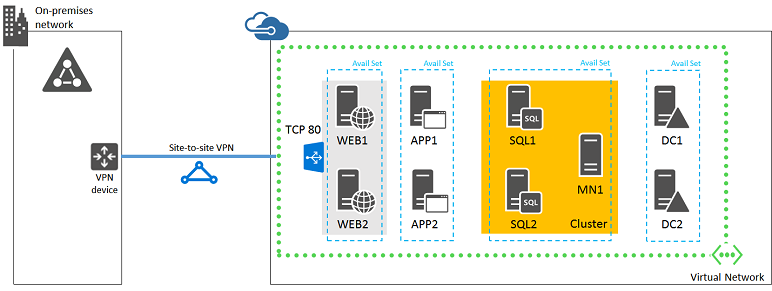

<properties
	pageTitle="Azure 基础结构服务工作负荷：Intranet SharePoint 场"
	description="了解 Azure 中部署的 Intranet SharePoint 场的价值、如何设置开发/测试环境，以及如何部署高可用性生产配置。"
	services="virtual-machines"
	documentationCenter=""
	authors="JoeDavies-MSFT"
	manager="timlt"
	editor=""
	tags="azure-service-management"/>

<tags
	ms.service="virtual-machines"
	ms.date="08/11/2015"
	wacn.date="09/18/2015"/>

# Azure 基础结构服务工作负荷：Intranet SharePoint 场

在 Microsoft Azure 中设置你的第一个或下一个 SharePoint 场，并利用配置的简便性和相关功能快速扩展场以包括关键功能的新增能力或优化。许多 SharePoint 场从标准的高度可用的三层配置扩展为可能具有十几个或更多服务器的场，该场针对性能或单独的角色进行了优化，如分布式缓存或搜索。

借助 Azure 基础结构服务的虚拟机和虚拟网络功能，你可以快速部署并运行以透明方式连接到你的本地网络的 SharePoint 场。例如，可以设置以下网络。

由于 Azure 虚拟网络是你的本地网络的扩展（其中所有正确的命名和通信路由已到位），因此你的用户可以就将像它位于本地数据中心内一样以相同的方式访问它。

此配置允许你通过添加新 Azure 虚拟机轻松地扩展 SharePoint 场，其中硬件和维护的持续成本将低于在数据中心中运行等效的场。

在 Azure 基础结构服务中托管 Intranet SharePoint 场是业务线应用程序的一个示例。有关概述，请参阅[业务线应用程序体系结构蓝图](http://msdn.microsoft.com/dn630664)。

下一步是设置 Azure 中托管的开发/测试 Intranet SharePoint 场。

## 创建 Azure 中托管的开发/测试 Intranet SharePoint 场

为 Azure 中托管的 SharePoint 场创建开发/测试环境有两个选择：

- 仅限云的虚拟网络
- 跨界虚拟网络

你可以创建 [Azure 试用订阅](/pricing/1rmb-trial/)。

### 仅限云的虚拟网络

仅限云的虚拟网络未连接到本地网络。如果你只想快速创建基本或高可用性 SharePoint 场，请参阅 [SharePoint Server 场](/documentation/articles/virtual-machines-sharepoint-farm-azure-preview)。以下示例显示了基本 SharePoint 场配置。

 
### 跨界虚拟网络

跨界虚拟网络通过站点到站点 VPN 或 ExpressRoute 连接与本地网络连接。如果你想要创建开发/测试环境，以模拟通过 VPN 连接访问 SharePoint Server 并执行远程管理的最终配置和试验，请参阅[在混合云中设置 SharePoint Intranet 场用于测试](/documentation/articles/virtual-networks-setup-sharepoint-hybrid-cloud-testing)。

 
下一步是在 Azure 中创建高可用性 Intranet SharePoint 场。

## 部署 Azure 中托管的 Intranet SharePoint 场

以下示例显示了正常运行的高可用性 Intranet SharePoint 场的基线代表配置。

这包括：

- 在 Web 层、应用程序层和数据库层具有两个服务器的 Intranet SharePoint 场。
- 在群集中包含两个 SQL Server 和一个多数节点计算机的 SQL Server AlwaysOn 可用性组配置。
- 具有两个副本域控制器的虚拟网络中的 Azure Active Directory。

<!--
	To see this configuration as an infographic, see [SharePoint with SQL Server AlwaysOn](http://azure.microsoft.com/zh-cn/documentation/infographics/sharepoint-sqlserver-alwayson/).
-->

### 材料清单

此基线配置需要以下一组 Azure 服务和组件：

- 九个虚拟机。
- 四个用于域控制器和 SQL Server 的额外数据磁盘。
- 三个云服务。
- 四个可用性集。
- 一个跨界虚拟网络。
- 一个存储帐户。
- 一个 Azure 订阅。

### 部署阶段

若要部署此配置，请使用以下过程：

- 阶段 1：配置 Azure。

	使用 Azure 门户和 Azure PowerShell 创建存储帐户、云服务和跨界虚拟网络。有关详细的配置步骤，请参阅[阶段 1](/documentation/articles/virtual-machines-workload-intranet-sharepoint-phase1)。

- 阶段 2：配置域控制器。

	为虚拟网络配置两个 Azure Active Directory 副本域控制器和 DNS 设置。有关详细的配置步骤，请参阅[阶段 2](/documentation/articles/virtual-machines-workload-intranet-sharepoint-phase2)。

- 阶段 3：配置 SQL Server 基础结构。

	准备要用于 SharePoint 的 SQL Server 虚拟机并创建 SQL Server 群集。有关详细的配置步骤，请参阅[阶段 3](/documentation/articles/virtual-machines-workload-intranet-sharepoint-phase3)。

- 阶段 4：配置 SharePoint Server。

	为新的 SharePoint 场配置四个 SharePoint 虚拟机。有关详细的配置，请参阅[阶段 4](/documentation/articles/virtual-machines-workload-intranet-sharepoint-phase4)。

- 阶段 5：创建 AlwaysOn 可用性组。

	准备 SharePoint 数据库，创建 AlwaysOn 可用性组，然后将 SharePoint 数据库添加到该组中。有关详细的配置步骤，请参阅[阶段 5](/documentation/articles/virtual-machines-workload-intranet-sharepoint-phase5)。

配置后，你可以按照[适用于 SharePoint 2013 的 Microsoft Azure 体系结构](http://technet.microsoft.com/zh-cn/library/dn635309.aspx)中的指南扩展此 SharePoint 场。

## 其他资源

<!--[-->在 Azure 中通过 SQL Server AlwaysOn 可用性组部署 SharePoint<!--](/documentation/articles/virtual-machines-workload-deploy-spsqlao-overview)-->

[在混合云中设置 SharePoint Intranet 场用于测试](/documentation/articles/virtual-networks-setup-sharepoint-hybrid-cloud-testing)

[适用于 SharePoint 2013 的 Windows Azure 体系结构](https://technet.microsoft.com/zh-cn/library/dn635309.aspx)

[具有 SQL Server AlwaysOn 的 SharePoint 信息图](http://go.microsoft.com/fwlink/?LinkId=394788)

[Azure 基础结构服务中托管的 SharePoint 场](/documentation/articles/virtual-machines-sharepoint-infrastructure-services)

[Azure 基础结构服务实施准则](/documentation/articles/virtual-machines-infrastructure-services-implementation-guidelines)

[Azure 基础结构服务工作负荷：高可用性业务线应用程序](/documentation/articles/virtual-machines-workload-high-availability-LOB-application)

<!---HONumber=70-->