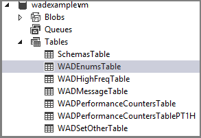

<properties
    pageTitle="如何在虚拟机中使用 Azure 诊断 | Azure"
    description="使用 Azure 诊断从 Azure 虚拟机收集数据，以用于调试、性能度量、监视和流量分析等目的。"
    services="virtual-machines"
    documentationcenter=".net"
    author="davidmu1"
    manager=""
    editor="" />
<tags
    ms.assetid="dfaabc7a-23e7-4af0-8369-f504d2915b3d"
    ms.service="virtual-machines"
    ms.workload="na"
    ms.tgt_pltfrm="na"
    ms.devlang="dotnet"
    ms.topic="article"
    ms.date="02/16/2016"
    wacn.date="05/15/2017"
    ms.author="davidmu"
    ms.translationtype="Human Translation"
    ms.sourcegitcommit="457fc748a9a2d66d7a2906b988e127b09ee11e18"
    ms.openlocfilehash="d1fd11f824eab4b94f3403d53c00b5f8b2ccda8f"
    ms.contentlocale="zh-cn"
    ms.lasthandoff="05/05/2017" />

# 在 Azure 虚拟机中启用诊断

## 如何在虚拟机中启用诊断
本演练介绍如何从开发计算机将 Diagnostics 远程安装到 Azure 虚拟机。 你还将了解如何实施在该 Azure 虚拟机上运行的应用程序，并使用 .NET [EventSource Class][EventSource Class] 发出遥测数据。 Azure Diagnostics 用于收集遥测数据，并将其存储在一个 Azure 存储帐户中。

### 先决条件
本演练假定你具有 Azure 订阅，并将 Visual Studio 2013 与 Azure SDK 结合使用。 如果没有 Azure 订阅，可以注册[试用版][Trial]。 请确保[安装并配置 Azure PowerShell 0.8.7 版或更高版本][Install and configure Azure PowerShell version 0.8.7 or later]。

[AZURE.INCLUDE [azure-sdk-developer-differences](../../includes/azure-visual-studio-login-guide.md)]

### 步骤 1：创建虚拟机
1. 在开发计算机上启动 Visual Studio 2013。
2. 在 Visual Studio 服务器资源管理器中，展开“Azure”，右键单击“虚拟机”然后选择“创建虚拟机”。
3. 在“选择订阅”对话框中选择 Azure 订阅，然后单击“下一步”。
4. 在“选择虚拟机映像”对话框中选择“Windows Server 2012 R2 Datacenter 2014 年 11 月版”，然后单击“下一步”。
5. 在“虚拟机基本设置”中，将虚拟机名称设置为“wadexample”。 设置管理员用户名和密码，然后单击“下一步”。
6. 在“云服务设置”对话框中，创建名为“wadexampleVM”的新云服务。 创建一个名为“wadexample”的新存储帐户，然后单击“下一步”。
7. 单击“创建” 。

### 步骤 2：创建应用程序
1. 在开发计算机上启动 Visual Studio 2013。
2. 创建面向 .NET Framework 4.5 的新 Visual C# 控制台应用程序。 将该项目命名为“WadExampleVM”。
   
3. 将 Program.cs 的内容替换为以下代码。 类 **SampleEventSourceWriter** 实现四个日志记录方法：**SendEnums**、**MessageMethod**、**SetOther** 和 **HighFreq**。 WriteEvent 方法的第一个参数定义相关事件的 ID。 Run 方法实现一个无限循环，该循环每隔 10 秒调用 **SampleEventSourceWriter** 类中实现的每个日志记录方法。

         using System;
         using System.Diagnostics;
         using System.Diagnostics.Tracing;
         using System.Threading;

         namespace WadExampleVM
         {
           sealed class SampleEventSourceWriter : EventSource {
             public static SampleEventSourceWriter Log = new SampleEventSourceWriter();
             public void SendEnums(MyColor color, MyFlags flags) { if (IsEnabled())  WriteEvent(1, (int)color, (int)flags); } // Cast enums to int for efficient logging.
             public void MessageMethod(string Message) { if (IsEnabled())  WriteEvent(2, Message); }
             public void SetOther(bool flag, int myInt) { if (IsEnabled())  WriteEvent(3, flag, myInt); }
             public void HighFreq(int value) { if (IsEnabled()) WriteEvent(4, value); }
           }

           enum MyColor {
             Red,
             Blue,
             Green
           }

           [Flags]
           enum MyFlags {
             Flag1 = 1,
             Flag2 = 2,
             Flag3 = 4
           }

           class Program
           {
             static void Main(string[] args) {
             Trace.TraceInformation("My application entry point called");

             int value = 0;

             while (true) {
                 Thread.Sleep(10000);
                 Trace.TraceInformation("Working");

                 // Emit several events every time we go through the loop
                 for (int i = 0; i < 6; i++) {
                     SampleEventSourceWriter.Log.SendEnums(MyColor.Blue, MyFlags.Flag2 | MyFlags.Flag3);
                 }

                 for (int i = 0; i < 3; i++) {
                     SampleEventSourceWriter.Log.MessageMethod("This is a message.");
                     SampleEventSourceWriter.Log.SetOther(true, 123456789);
                 }

                 if (value == int.MaxValue) value = 0;
                 SampleEventSourceWriter.Log.HighFreq(value++);
             }

            }
          }
         }

4. 保存该文件，然后从“生成”菜单中选择“生成解决方案”以生成代码。

### 步骤 3：部署应用程序
1. 在“解决方案资源管理器”中右键单击“WadExampleVM”项目，然后选择“在文件资源管理器中打开文件夹”。
2. 导航到 *bin/Debug* 文件夹，并复制所有文件 (WadExampleVM.*)
3. 在“服务器资源管理器”中，右键单击虚拟机并选择“使用远程桌面连接”。
4. 连接到 VM 后，创建名为 WadExampleVM 的文件夹，并将应用程序文件粘贴到该文件夹中。
5. 启动应用程序 WadExampleVM.exe。 你应会看到一个空白控制台窗口。

### 步骤 4：创建 Diagnostics 配置并安装扩展
1. 通过执行以下 PowerShell 命令，将公共配置文件架构定义下载到开发计算机：

        (Get-AzureServiceAvailableExtension -ExtensionName 'PaaSDiagnostics' -ProviderNamespace 'Microsoft.Azure.Diagnostics').PublicConfigurationSchema | Out-File -Encoding utf8 -FilePath 'WadConfig.xsd'
2. 在 Visual Studio 中打开一个新的 XML 文件：可以在已打开的项目中，或者在未打开项目的 Visual Studio 实例中执行此操作。 在 Visual Studio 中，选择“添加” -> “新建项...” -> “Visual C# 项” -> “数据” -> “XML 文件”。 将该文件命名为“WadExample.xml”
3. 将 WadConfig.xsd 与配置文件相关联。 确保 WadExample.xml 编辑器窗口是活动的窗口。 按 **F4** 打开“属性”窗口。 在“属性”窗口中单击“架构”属性。 在“架构”属性中 单击“...”。 在“架构”属性中单击“...”  。 单击“确定” 。
4. 将 WadExample.xml 配置文件的内容替换为以下 XML 并保存该文件。 此配置文件定义两个要收集的性能计数器：一个对应于 CPU 使用率，另一个对应于内存使用率。 配置将定义对应于 SampleEventSourceWriter 类中方法的四个事件。

            <?xml version="1.0" encoding="utf-8"?>
            <PublicConfig xmlns="http://schemas.microsoft.com/ServiceHosting/2010/10/DiagnosticsConfiguration">
                  <WadCfg>
                    <DiagnosticMonitorConfiguration overallQuotaInMB="25000">
                      <PerformanceCounters scheduledTransferPeriod="PT1M">
                        <PerformanceCounterConfiguration counterSpecifier="\Processor(_Total)\% Processor Time" sampleRate="PT1M" unit="percent" />
                        <PerformanceCounterConfiguration counterSpecifier="\Memory\Committed Bytes" sampleRate="PT1M" unit="bytes"/>
                          </PerformanceCounters>
                          <EtwProviders>
                            <EtwEventSourceProviderConfiguration provider="SampleEventSourceWriter" scheduledTransferPeriod="PT5M">
                                  <Event id="1" eventDestination="EnumsTable"/>
                                  <Event id="2" eventDestination="MessageTable"/>
                                  <Event id="3" eventDestination="SetOtherTable"/>
                                  <Event id="4" eventDestination="HighFreqTable"/>
                                  <DefaultEvents eventDestination="DefaultTable" />
                            </EtwEventSourceProviderConfiguration>
                          </EtwProviders>
                    </DiagnosticMonitorConfiguration>
                  </WadCfg>
            </PublicConfig>

### 步骤 5：将 Diagnostics 远程安装到 Azure 虚拟机上
用于在 VM 上管理 Diagnostics 的 PowerShell cmdlet 为：Set-AzureVMDiagnosticsExtension、Get-AzureVMDiagnosticsExtension 和 Remove-AzureVMDiagnosticsExtension。

1. 在开发人员计算机上，打开 Microsoft Azure PowerShell。
2. 执行脚本以在 VM 上远程安装 Diagnostics（将 *StorageAccountKey* 替换为 wadexamplevm 存储帐户的存储帐户密钥）：

        $storage_name = "wadexamplevm"
        $key = "<StorageAccountKey>"
        $config_path="c:\users\<user>\documents\visual studio 2013\Projects\WadExampleVM\WadExampleVM\WadExample.xml"
        $service_name="wadexamplevm"
        $vm_name="WadExample"
        $storageContext = New-AzureStorageContext -StorageAccountName $storage_name -StorageAccountKey $key
        $VM1 = Get-AzureVM -ServiceName $service_name -Name $vm_name
        $VM2 = Set-AzureVMDiagnosticsExtension -DiagnosticsConfigurationPath $config_path -Version "1.*" -VM $VM1 -StorageContext $storageContext
        $VM3 = Update-AzureVM -ServiceName $service_name -Name $vm_name -VM $VM2.VM

### 步骤 6：查看遥测数据
在 Visual Studio 的“服务器资源管理器”中，导航到 wadexample 存储帐户。 在 VM 大约运行 5 分钟后，你应该会看到表 **WADEnumsTable**、**WADHighFreqTable**、**WADMessageTable**、**WADPerformanceCountersTable** 和 **WADSetOtherTable**。 双击其中一个表即可查看已收集的遥测数据。

## 配置文件架构
诊断配置文件定义启动诊断代理时用于初始化诊断配置设置的值。 有关有效值和示例，请参阅[最新架构参考](https://msdn.microsoft.com/zh-cn/library/azure/mt634524.aspx)。

[EventSource Class]: http://msdn.microsoft.com/zh-cn/library/system.diagnostics.tracing.eventsource(v=vs.110).aspx

[Debugging an Azure Application]: http://msdn.microsoft.com/zh-cn/library/azure/ee405479.aspx   
[Collect Logging Data by Using Azure Diagnostics]: http://msdn.microsoft.com/zh-cn/library/azure/gg433048.aspx
[Trial]: /pricing/1rmb-trial/
[Install and configure Azure PowerShell version 0.8.7 or later]: /documentation/articles/powershell-install-configure/