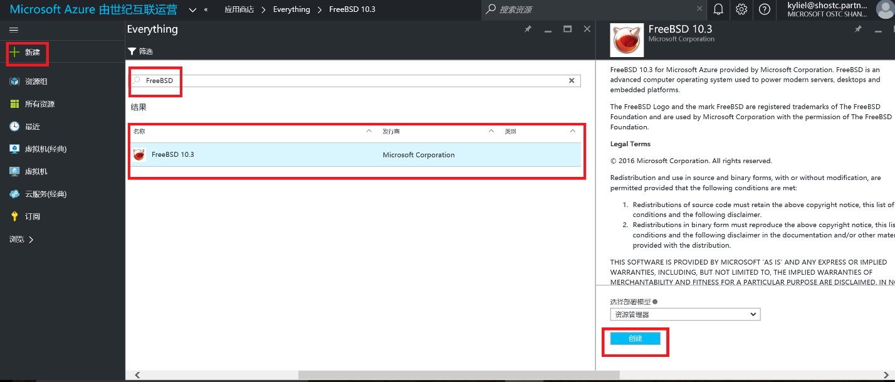

<properties
	pageTitle="Azure 上的 FreeBSD 简介 | Azure"
	description="学习在 Azure 使用 FreeBSD 虚拟机"
	services="virtual-machines-linux"
	documentationCenter=""
	authors="KylieLiang"
	manager="timlt"
	editor=""
	tags="azure-service-management"/>

<tags
	ms.service="virtual-machines-linux"
	ms.date="08/27/2016"
	wacn.date="09/12/2016"/>

# Azure 上的 FreeBSD 简介

本主题提供了在 Azure 中运行 FreeBSD 虚拟机的概述。

## 概述

FreeBSD 是一个卓越的操作系统，可用于服务器，桌面和嵌入式平台。由微软发布的 FreeBSD 10.3 镜像现已落地于由世纪互联运营的 Azure。该镜像基于 FreeBSD 社区发布的 10.3 版本并安装了 Azure 虚拟机代理 [2.1.4](https://github.com/Azure/WALinuxAgent/releases/tag/v2.1.4) 版本。[Azure 虚拟机代理](/documentation/articles/virtual-machines-linux-agent-user-guide/)管理虚拟机与 Azure 结构控制器的交互，比如在第一次使用的时候对虚拟机进行配置（用户账户名字，密码，主机名等）以及调用选择的虚拟机扩展。关于后续 FreeBSD 版本的支持，微软的策略是紧跟 FreeBSD 版本发布的节奏，下一个新的版本将是 [FreeBSD 11](https://www.freebsd.org/releases/11.0R/schedule.html)。

## 创建一个 FreeBSD 虚拟机

在 [Azure 门户预览](https://portal.azure.cn/)上选择由微软发布的 FreeBSD 10.3 虚拟机镜像并创建一个 FreeBSD 虚拟机是很简单的，如下图所示。

## FreeBSD 虚拟机扩展

以下是 FreeBSD 虚拟机所支持的扩展列表：

* [VMAccess](https://github.com/Azure/azure-linux-extensions/tree/master/VMAccess)

	VMAccess 扩展具有以下功能，具体配置可参考“[如何使用 VMAccess 扩展](/documentation/articles/virtual-machines-linux-classic-reset-access/)”。

	*	重置原有 sudo 用户的密码
	*	创建一个新的 sudo 用户，包括相应的密码
	*	设置 SSH 密钥 
	*	在配置虚拟机的时候重置 SSH 密钥
	*	打开 SSH 端口 (22) 并在 reset_ssh 被配置成真的时候重置 sshd_config
	*	删除用户
	*	检查所添加磁盘的一致性
	*	修复添加的磁盘

* [CustomScript](https://github.com/Azure/azure-linux-extensions/tree/master/CustomScript)

	CustomScript 扩展具有以下功能:

	*	如有提供定制化脚本，从 Azure 存储或公共存储（比如 Github）下载脚本
	*	调用入口脚本
	*	支持内嵌的命令
	*	支持以 Linux 系统下任何脚本语言（Python、Linux Shell 脚本语言等）编写的脚本
	*	删除 Shell 和 Python 脚本中的B OM
	*	保护敏感数据

## 身份验证：用户名、密码和 SSH 密钥

在使用 Azure 经典管理门户创建 FreeBSD虚拟机时，系统会要求您提供用户名、密码或 SSH 公钥。在 Azure 上部署 FreeBSD 虚拟机时，用户名的选择受到以下限制：不允许使用虚拟机中已经存在的系统帐户 (UID <100) 的名称，例如，“root”。当前Azure只支持RSA SSH 密钥，也就是说您的SSH密钥需要以 "---- BEGIN SSH2 PUBLIC KEY ----" 开头并以 "---- END SSH2 PUBLIC KEY ----" 结尾。

## 使用 sudo 获取超级用户特权

在 Azure 上部署虚拟机实例的过程中指定的用户帐户是特权帐户。发布的 FreeBSD 镜像已经安装了 sudo 的安装包。在使用此用户帐户登录后，您将能够使用命令语法以 root 身份运行命令。

	# sudo <COMMAND>

您也可以选择使用 sudo -s 来获取 root的特权。

## 下一步

*	登录 [Azure 经典管理门户](https://manage.windowsazure.cn/)创建 一个 FreeBSD 虚拟机吧！
*	如您想带自定义的 FreeBSD 上 Azure，参考“[创建 FreeBSD VHD 并将其上载到 Azure](/documentation/articles/virtual-machines-linux-classic-freebsd-create-upload-vhd)”。

