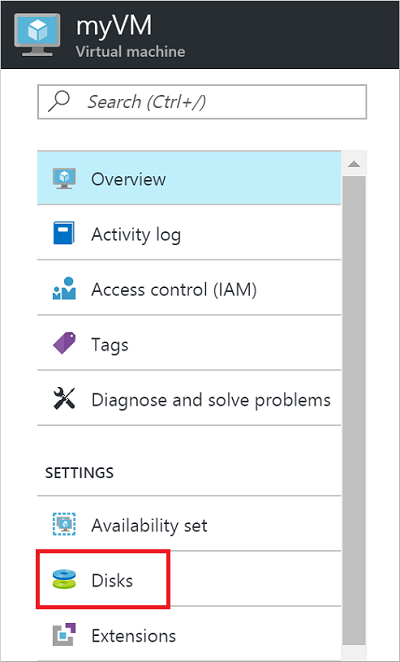
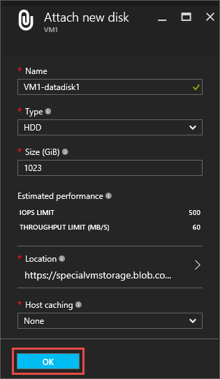
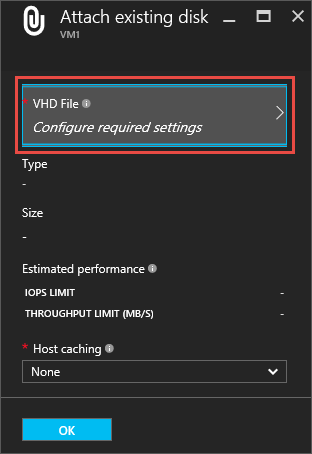
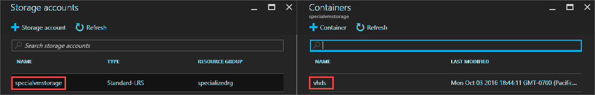

<properties
    pageTitle="将数据磁盘附加到 Linux VM | Azure"
    description="如何使用 Resource Manager 部署模型在 Azure 门户预览中将新数据磁盘或现有数据磁盘附加到 Linux VM。"
    services="virtual-machines-linux"
    documentationcenter=""
    author="cynthn"
    manager="timlt"
    editor=""
    tags="azure-resource-manager"
    translationtype="Human Translation" />
<tags
    ms.assetid="5e1c6212-976c-4962-a297-177942f90907"
    ms.service="virtual-machines-linux"
    ms.workload="infrastructure-services"
    ms.tgt_pltfrm="vm-linux"
    ms.devlang="na"
    ms.topic="article"
    ms.date="03/07/2017"
    wacn.date="04/24/2017"
    ms.author="cynthn"
    ms.sourcegitcommit="a114d832e9c5320e9a109c9020fcaa2f2fdd43a9"
    ms.openlocfilehash="194a9513fce8b042811d16dfb7373ac6a5b3d248"
    ms.lasthandoff="04/14/2017" />

# 如何在 Azure 门户预览中将数据磁盘附加到 Linux VM
本文介绍如何通过 Azure 门户预览将新磁盘和现有磁盘附加到 Linux 虚拟机。 还可以[在 Azure 门户预览中将数据磁盘附加到 Windows VM](/documentation/articles/virtual-machines-windows-attach-disk-portal/)。

将磁盘附加到 VM 前，请查看以下提示：

* 虚拟机的大小决定了可以附加多少个磁盘。 有关详细信息，请参阅[虚拟机大小](/documentation/articles/virtual-machines-linux-sizes/)。
* 若要使用高级存储，需要一个 DS 系列或 FS 系列虚拟机。 可以将高级磁盘和标准磁盘用于这些虚拟机。 高级存储只在某些区域可用。 有关详细信息，请参阅[高级存储：适用于 Azure 虚拟机工作负荷的高性能存储](/documentation/articles/storage-premium-storage/)。
* 附加到虚拟机的磁盘实际上是存储在 Azure 中的 .vhd 文件。 有关详细信息，请参阅[关于虚拟机的磁盘和 VHD](/documentation/articles/storage-about-disks-and-vhds-linux/)。

## 查找虚拟机
1. 登录 [Azure 门户预览](https://portal.azure.cn/)。
2. 在“中心”菜单中，单击“虚拟机” 。
3. 从列表中选择虚拟机。
4. 在“虚拟机”边栏选项卡的“概要”中，单击“磁盘”。

    

##  附加新磁盘

1. 在“磁盘”边栏选项卡上，单击“+ 添加数据磁盘”。
2. 检查默认设置，根据需要更新，然后单击“确定”。

    
3. 在 Azure 创建磁盘并将磁盘附加到虚拟机之后，新磁盘将出现在“数据磁盘”下的虚拟机磁盘设置中。

## 附加现有磁盘
1. 在“磁盘”边栏选项卡上，单击“+ 添加数据磁盘”。
2. 在“附加现有磁盘”下，单击“VHD 文件”。

    
3. 在“存储帐户” 下，选择帐户和容纳 .vhd 文件的容器。

    
4. 选择 .vhd 文件
5. 在“附加现有磁盘”下，刚才选择的文件将出现在“VHD 文件”中。 单击 **“确定”**。
6. 在 Azure 将磁盘附加到虚拟机之后，磁盘将出现在“数据磁盘”下的虚拟机磁盘设置中。

## 后续步骤
添加磁盘后，需要准备它以供使用。 有关详细信息，请参阅[如何：在 Linux 中初始化新的数据磁盘](/documentation/articles/virtual-machines-linux-classic-attach-disk/#initialize-a-new-data-disk-in-linux)。
<!--Update_Description: wording update-->