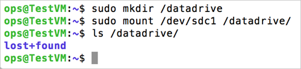

<properties
    pageTitle="将磁盘附加到 Linux VM | Azure"
    description="了解如何使用经典部署模型将数据磁盘附加到 Linux VM 并将其初始化，以便它可供使用"
    services="virtual-machines-linux"
    documentationcenter=""
    author="iainfoulds"
    manager="timlt"
    editor="tysonn"
    tags="azure-service-management" />  

<tags
    ms.assetid="4901384d-2a6f-4f46-bba0-337a348b7f87"
    ms.service="virtual-machines-linux"
    ms.workload="infrastructure-services"
    ms.tgt_pltfrm="vm-linux"
    ms.devlang="na"
    ms.topic="article"
    ms.date="11/14/2016"
    wacn.date="12/20/2016"
    ms.author="iainfou" />

# 如何将数据磁盘附加到 Linux 虚拟机
[AZURE.INCLUDE [了解部署模型](../../includes/learn-about-deployment-models-classic-include.md)]

请参阅如何[使用 Resource Manager 部署模型附加数据磁盘](/documentation/articles/virtual-machines-linux-add-disk/)。

可以将空磁盘和包含数据的磁盘附加到 Azure VM。这两种类型的磁盘是驻留在 Azure 存储帐户中的 .vhd 文件。与将任何磁盘添加到 Linux 计算机一样，附加磁盘之后需要将它初始化和格式化才可供使用。本文将详细说明如何附加空磁盘和附加包含数据的磁盘到 VM，以及初始化和格式化新磁盘的方法。

> [AZURE.NOTE]
最佳做法是使用一个或多个不同的磁盘来存储虚拟机的数据。在创建 Azure 虚拟机时，该虚拟机有一个操作系统磁盘和一个临时磁盘。**不要使用临时磁盘来存储持久性数据。** 顾名思义，它仅提供临时存储。它不提供冗余或备份，因为它不驻留在 Azure 存储中。临时磁盘通常由 Azure Linux 代理管理并且自动装载到 **/mnt/resource**（或 Ubuntu 映像上的 **/mnt**）。另一方面，数据磁盘可以由 Linux 内核命名为 `/dev/sdc` 这样的形式，而用户则需对该资源进行分区、格式化和安装。有关详细信息，请参阅 [Azure Linux 代理用户指南][Agent]。
> 
> 

[AZURE.INCLUDE [howto-attach-disk-windows-linux](../../includes/howto-attach-disk-linux.md)]

##  在 Linux 中初始化新的数据磁盘
1. 通过 SSH 连接到 VM。有关详细信息，请参阅[如何登录到运行 Linux 的虚拟机][Logon]。
2. 接下来，需要查找可供数据磁盘初始化的设备标识符。可通过两种方式实现此操作：
   
    a) 日志中 SCSI 设备的 Grep，例如，在以下命令中：

        sudo grep SCSI /var/log/messages

    如果是最近的 Ubuntu 分发，则可能需要使用 `sudo grep SCSI /var/log/syslog`，因为默认情况下可能已禁止登录到 `/var/log/messages`。
   
    可以在所示消息中找到最后添加的数据磁盘的标识符。
   
    
   
    或
   
    b) 使用 `lsscsi` 命令找出设备 ID。可以通过 `yum install lsscsi`（在基于 Red Hat 的分发上）或 `apt-get install lsscsi`（在基于 Debian 的分发上）安装 `lsscsi`。可以通过磁盘的 *lun*（即 **逻辑单元号**）找到所需磁盘。例如，所附加磁盘的 *lun* 可以轻松地通过 `azure vm disk list <virtual-machine>` 来查看，如下所示：

        azure vm disk list myVM

    输出与下面类似：

        info:    Executing command vm disk list
        + Fetching disk images
        + Getting virtual machines
        + Getting VM disks
        data:    Lun  Size(GB)  Blob-Name                         OS
        data:    ---  --------  --------------------------------  -----
        data:         30        myVM-2645b8030676c8f8.vhd  Linux
        data:    0    100       myVM-76f7ee1ef0f6dddc.vhd
        info:    vm disk list command OK

    将此数据与同一示例性虚拟机的 `lsscsi` 的输出进行比较：

        [1:0:0:0]    cd/dvd  Msft     Virtual CD/ROM   1.0   /dev/sr0
        [2:0:0:0]    disk    Msft     Virtual Disk     1.0   /dev/sda
        [3:0:1:0]    disk    Msft     Virtual Disk     1.0   /dev/sdb
        [5:0:0:0]    disk    Msft     Virtual Disk     1.0   /dev/sdc

    每一行的元组中的最后一个数字就是 *lun*。有关详细信息，请参阅 `man lsscsi`。
3. 在提示符下，键入以下命令以创建设备：

        sudo fdisk /dev/sdc

4. 出现提示时，请键入 **n** 创建分区。

      

5. 出现提示时，键入 **p** 以将分区设置为主分区。键入“1”将其设置为第一分区，然后键入 Enter 以接受柱面的默认值。在某些系统上，它可以显示第一个和最后一个扇区（而不是柱面）的默认值。可以选择接受这些默认值。

    

6. 键入“p”以查看有关分区磁盘的详细信息。

    

7. 键入“w”以写入磁盘的设置。

    

8. 现在，可以在新分区上创建文件系统。在设备 ID 后面追加磁盘分区号（在以下示例中为 `/dev/sdc1`）。以下示例在 /dev/sdc1 上创建 ext4 磁盘分区：

        sudo mkfs -t ext4 /dev/sdc1

      

   
   > [AZURE.NOTE]
   对于 ext4 文件系统，SuSE Linux Enterprise 11 系统仅支持只读访问。对于这些系统，建议将新文件系统格式化为 ext3 而非 ext4。

9. 创建一个目录来装载新的文件系统，如下所示：

        sudo mkdir /datadrive

10. 最后可以装载驱动器，如下所示：

        sudo mount /dev/sdc1 /datadrive

    数据磁盘现在可以作为 **/datadrive** 使用。
   
    

11. 将新驱动器添加到 /etc/fstab：
   
    若要确保在重新引导后自动重新装载驱动器，必须将其添加到 /etc/fstab 文件。此外，强烈建议在 /etc/fstab 中使用 UUID（全局唯一标识符）来引用驱动器而不是只使用设备名称（即 /dev/sdc1）。如果 OS 在启动过程中检测到磁盘错误，使用 UUID 可以避免将错误的磁盘装载到给定位置，然后为剩余的数据磁盘分配这些设备 ID。若要查找新驱动器的 UUID，可以使用 **blkid** 实用程序：

        sudo -i blkid

    输出内容类似于下面的示例：

        /dev/sda1: UUID="11111111-1b1b-1c1c-1d1d-1e1e1e1e1e1e" TYPE="ext4"
        /dev/sdb1: UUID="22222222-2b2b-2c2c-2d2d-2e2e2e2e2e2e" TYPE="ext4"
        /dev/sdc1: UUID="33333333-3b3b-3c3c-3d3d-3e3e3e3e3e3e" TYPE="ext4"

    > [AZURE.NOTE]
    错误地编辑 **/etc/fstab** 文件可能会导致系统无法引导。如果没有把握，请参考分发的文档来获取有关如何正确编辑该文件的信息。另外，建议在编辑之前创建 /etc/fstab 文件的备份。

    接下来，请在文本编辑器中打开 **/etc/fstab** 文件：

        sudo vi /etc/fstab

    在此示例中，将使用在之前的步骤中创建的新 **/dev/sdc1** 设备的 UUID 值并使用装载点 **/datadrive**。将以下行添加到 **/etc/fstab** 文件的末尾：

        UUID=33333333-3b3b-3c3c-3d3d-3e3e3e3e3e3e   /datadrive   ext4   defaults,nofail   1   2

    另外，在基于 SuSE Linux 的系统上，你可能需要使用稍微不同的格式：

        /dev/disk/by-uuid/33333333-3b3b-3c3c-3d3d-3e3e3e3e3e3e   /datadrive   ext3   defaults,nofail   1   2

    > [AZURE.NOTE]
    即使文件系统已损坏或磁盘在引导时不存在，`nofail` 选项也能确保 VM 启动。如果不使用此选项，可能会遇到 [Cannot SSH to Linux VM due to FSTAB errors](https://blogs.msdn.microsoft.com/linuxonazure/2016/07/21/cannot-ssh-to-linux-vm-after-adding-data-disk-to-etcfstab-and-rebooting/)（由于 FSTAB 错误而无法通过 SSH 连接到 Linux VM）中所述的行为。

    现在，可以通过卸载并重新装载文件系统（即使用在之前的步骤中创建的示例装载点 `/datadrive`）来测试文件系统是否已正确装载：

        sudo umount /datadrive
        sudo mount /datadrive

    如果 `mount` 命令产生错误，请检查 /etc/fstab 文件的语法是否正确。如果还创建了其他数据驱动器或分区，同样也需要分别将其输入到 /etc/fstab 中。

    需要使用以下命令将驱动器设为可写：

        sudo chmod go+w /datadrive

    > [AZURE.NOTE]
    之后，在不编辑 fstab 的情况下删除数据磁盘可能会导致 VM 无法引导。如果这是一种常见情况，则请注意，大多数分发都提供了 `nofail` 和/或 `nobootwait` fstab 选项，这些选项使系统在磁盘无法装载的情况下也能引导。有关这些参数的详细信息，请查阅分发文档。

### Azure 中对 Linux 的 TRIM/UNMAP 支持
某些 Linux 内核支持 TRIM/UNMAP 操作以放弃磁盘上未使用的块。这些操作主要适用于标准存储，以通知 Azure 已删除的页不再有效可以丢弃。如果创建了较大的文件，然后将其删除，则放弃页可以节省成本。

在 Linux VM 中有两种方法可以启用 TRIM 支持。与往常一样，有关建议的方法，请参阅分发：

* 在 `/etc/fstab` 中使用 `discard` 装载选项，例如：

        UUID=33333333-3b3b-3c3c-3d3d-3e3e3e3e3e3e   /datadrive   ext4   defaults,discard   1   2

* 此处，还可以从命令行手动运行 `fstrim` 命令，或将其添加到 crontab 以定期运行：
  
    **Ubuntu**

        sudo apt-get install util-linux
        sudo fstrim /datadrive

    **RHEL/CentOS**

        sudo yum install util-linux
        sudo fstrim /datadrive

## 故障排除
[AZURE.INCLUDE [virtual-machines-linux-lunzero](../../includes/virtual-machines-linux-lunzero.md)]

## 后续步骤
可以阅读下列文章，进一步了解如何使用 Linux VM：

* [如何登录到运行 Linux 的虚拟机][Logon]
* [如何从 Linux 虚拟机分离磁盘](/documentation/articles/virtual-machines-linux-classic-detach-disk/)
* [将 Azuer CLI 与经典部署模型搭配使用](/documentation/articles/virtual-machines-command-line-tools/)

<!--Link references-->
[Agent]: /documentation/articles/virtual-machines-linux-agent-user-guide/
[Logon]: /documentation/articles/virtual-machines-linux-mac-create-ssh-keys/

<!---HONumber=Mooncake_1212_2016-->