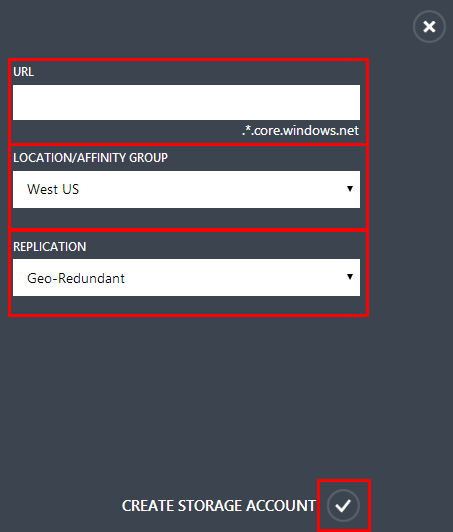
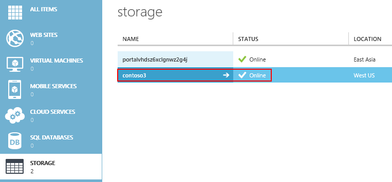
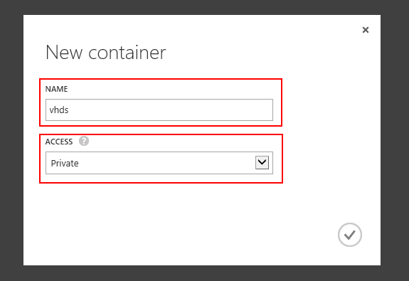
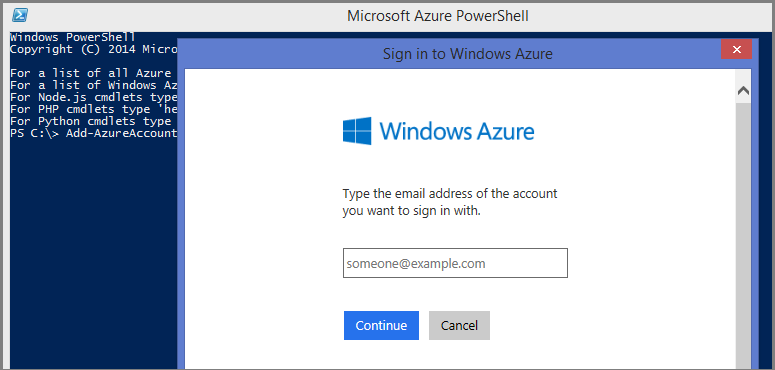
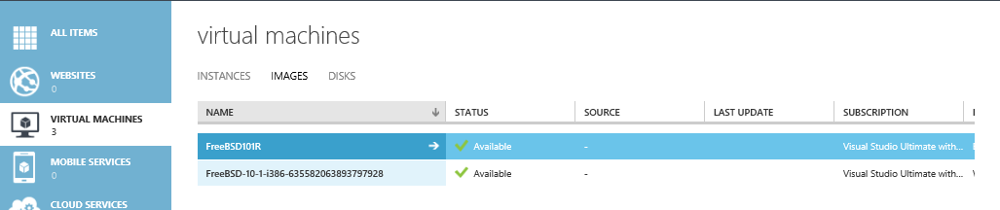

<properties
   pageTitle="创建和上载 FreeBSD VM 映像 | Azure"
   description="了解如何创建和上载包含 FreeBSD 操作系统的虚拟硬盘 (VHD) 以创建 Azure 虚拟机。"
   services="virtual-machines-linux"
   documentationCenter=""
   authors="KylieLiang"
   manager="timlt"
   editor=""
   tags="azure-service-management"/>

<tags
   ms.service="virtual-machines-linux"
   ms.devlang="na"
   ms.topic="article"
   ms.tgt_pltfrm="vm-linux"
   ms.workload="infrastructure-services"
   ms.date="08/29/2016"
   wacn.date="01/05/2017"
   ms.author="kyliel"/>

# 创建 FreeBSD VHD 并将其上载到 Azure

本文说明如何创建和上载包含 FreeBSD 操作系统的虚拟硬盘 (VHD)。将其上载后，可以使用它作为你自己的映像在 Azure 中创建虚拟机 (VM)。

[AZURE.INCLUDE [了解部署模型](../../includes/learn-about-deployment-models-classic-include.md)]

想查看更多关于使用资源管理器模型上传 VHD，请点击[这里](/documentation/articles/virtual-machines-linux-upload-vhd/)。

## 先决条件
本文假定你拥有以下项目：

- **Azure 订阅** - 如果你没有帐户，只需花费几分钟就能创建一个帐户。请参阅[创建试用帐户](/pricing/1rmb-trial/)。

- **Azure PowerShell 工具** - 必须安装 Azure PowerShell 模块并将其配置为使用你的 Azure 订阅。若要下载该模块，请参阅 [Azure 下载](/downloads/)。可在此处获取介绍如何安装和配置该模块的教程。使用 [Azure 下载](/downloads/) cmdlet 上载 VHD。

- **安装在 .vhd 文件中的 FreeBSD 操作系统** - 必须将受支持的 FreeBSD 操作系统安装到虚拟硬盘。可使用多个工具创建 .vhd 文件。例如，可使用虚拟化解决方案（如 Hyper-V）创建 .vhd 文件并安装操作系统。有关如何安装和使用 Hyper-V 的说明，请参阅[安装 Hyper-V 和创建虚拟机](http://technet.microsoft.com/zh-cn/library/hh846766.aspx)。

> [AZURE.NOTE] Azure 不支持更新的 VHDX 格式。可使用 Hyper-V 管理器或 [convert-vhd](https://technet.microsoft.com/zh-cn/library/hh848454.aspx) cmdlet 将磁盘转换为 VHD 格式。此外，MSDN 上还有[有关如何将 FreeBSD 与 Hyper-V 配合使用的教程](http://blogs.msdn.com/b/kylie/archive/2014/12/25/running-freebsd-on-hyper-v.aspx)。

此任务包括以下五个步骤。

## 步骤 1：准备要上载的映像

在安装了 FreeBSD 操作系统的虚拟机中，完成以下过程：

1. 启用 DHCP。

		# echo 'ifconfig_hn0="SYNCDHCP"' >> /etc/rc.conf
		# service netif restart

2. 启用 SSH。

    从光盘安装后，将默认启用 SSH。如果由于某种原因未启用它，或者如果直接使用 FreeBSD VHD，请键入以下命令：

		# echo 'sshd_enable="YES"' >> /etc/rc.conf
		# ssh-keygen -t dsa -f /etc/ssh/ssh_host_dsa_key
		# ssh-keygen -t rsa -f /etc/ssh/ssh_host_rsa_key
		# service sshd restart

3. 设置串行控制台。

		# echo 'console="comconsole vidconsole"' >> /boot/loader.conf
		# echo 'comconsole_speed="115200"' >> /boot/loader.conf

4. 安装 sudo。

    在 Azure 中禁用根帐户。这意味着你需要通过无特权用户利用 sudo 使用提升的权限运行命令。

		# pkg install sudo

5. Azure 代理的先决条件。

		# pkg install python27  
		# pkg install Py27-setuptools27   
		# ln -s /usr/local/bin/python2.7 /usr/bin/python   
		# pkg install git

6. 安装 Azure 代理。

    可以始终在 [github](https://github.com/Azure/WALinuxAgent/releases) 上找到 Azure 代理的最新版本。2.0.10 + 版正式支持 FreeBSD 10 和 10.1，2.1.4 版正式支持 FreeBSD 10.2 和更高版本。

		# git clone https://github.com/Azure/WALinuxAgent.git  
		# cd WALinuxAgent  
		# git tag  
		…
		WALinuxAgent-2.0.16
		…
		v2.1.4
		v2.1.4.rc0
		v2.1.4.rc1

    对于 2.0，让我们使用 2.0.16 作为示例：

		# git checkout WALinuxAgent-2.0.16
		# python setup.py install  
		# ln -sf /usr/local/sbin/waagent /usr/sbin/waagent  

    对于 2.1，让我们使用 2.1.4 作为示例：

		# git checkout v2.1.4
		# python setup.py install  
		# ln -sf /usr/local/sbin/waagent /usr/sbin/waagent  
		# ln -sf /usr/local/sbin/waagent2.0 /usr/sbin/waagent2.0

    >[AZURE.IMPORTANT] 安装 Azure 代理之后，验证它是否正在运行是一个好主意：

		# waagent -version
		WALinuxAgent-2.1.4 running on freebsd 10.3
		Python: 2.7.11
		# service -e | grep waagent
		/etc/rc.d/waagent
		# cat /var/log/waagent.log

7. 取消预配系统。

    取消预配系统以清除系统并使其适用于重新预配。以下命令还会删除上次预配的用户帐户和关联数据：

		# echo "y" |  /usr/local/sbin/waagent -deprovision+user  
		# echo  'waagent_enable="YES"' >> /etc/rc.conf

    现在，你可以关闭你的 VM 了。

## 步骤 2：在 Azure 中创建存储帐户 ##

你需要在 Azure 中具有存储帐户才能上载 .vhd 文件，以便可以使用它创建虚拟机。可使用 Azure 经典管理门户创建存储帐户。

1. 登录到 [Azure 经典管理门户](https://manage.windowsazure.cn)。

2. 在命令栏上，选择“新建”。

3. 依次选择“数据服务”>“存储”>“快速创建”。

	

4. 如下所示填写字段：

	- 在 **URL** 字段中，键入要在存储帐户 URL 中使用的子域名称。该条目可能包含 3 到 24 个数字和小写字母。此名称将成为用于对订阅的 Azure Blob 存储、Azure 队列存储或 Azure 表存储资源进行寻址的 URL 中的主机名。

	- 在“位置/地缘组”下拉菜单中，选择存储帐户的**位置或地缘组**。地缘组让你能够将你的云服务和存储放在同一数据中心。

	- 在“复制”字段中，决定是否要对存储帐户使用**异地冗余**复制。默认情况下启用地域复制。此选项会将你的数据免费复制到辅助位置，以便在主位置发生严重故障时将你的存储故障转移到该位置。将自动分配辅助位置，并且无法对其进行更改。如果你因法律要求或组织策略需要更好地控制基于云的存储的位置，可以关闭地域复制。但是，请注意，如果稍后你打开地域复制，则将现有数据复制到辅助位置时将向你收取一次性数据传输费用。不具有地域复制的存储服务将以优惠价提供。有关管理存储帐户的异地复制的更多详细信息，请参阅：[创建、管理或删除存储帐户](/documentation/articles/storage-create-storage-account/)。

	

5. 选择“创建存储帐户”。该帐户现在会出现在“存储”下。

	

6. 接下来，为上载的 .vhd 文件创建容器。选择存储帐户名称，然后选择“容器”。

	

7. 选择“创建容器”。

	

8. 在“名称”字段中，键入容器的名称。然后，在“访问”下拉列表菜单中，选择所需的访问策略类型。

	

    > [AZURE.NOTE] 默认情况下，该容器是专用容器，只能由帐户所有者访问。若要允许对容器中的 Blob 进行公共读取访问，但不允许对容器属性和元数据进行公共读取访问，请使用“公共 Blob”选项。若要允许对容器和 Blob 进行完全公共读取访问，请使用“公共容器”选项。

## 步骤 3：准备连接到 Azure

你首先需要在计算机和 Azure 订阅之间建立一个安全连接，然后才能上载 .vhd 文件。你可以使用 Azure Active Directory (Azure AD) 方法或证书方法来执行此操作。

### 使用 Azure AD 方法上载 .vhd 文件

1. 打开 Azure PowerShell 控制台。

2. 输入以下命令：
	`Add-AzureAccount -Environment AzureChinaCloud`

	此命令将打开一个登录窗口，你可以在其中使用工作或学校帐户登录。

	

3. Azure 将对凭据信息进行身份验证和保存。然后它将关闭该窗口。

### 使用证书方法上载 .vhd 文件

1. 打开 Azure PowerShell 控制台。

2. 键入：
	`Get-AzurePublishSettingsFile -Environment AzureChinaCloud`。

3. 此时将打开一个浏览器窗口，并提示你下载 .publishsettings 文件。该文件包含 Azure 订阅的信息和证书。

	

3. 保存 .publishsettings 文件。

4. 键入：
	`Import-AzurePublishSettingsFile -Environment AzureChinaCloud <PathToFile>`，其中 `<PathToFile>` 是 .publishsettings 文件的完整路径。

   有关详细信息，请参阅 [Azure cmdlet 入门](http://msdn.microsoft.com/zh-cn/library/azure/jj554332.aspx)。

   有关安装和配置 PowerShell 的详细信息，请参阅[如何安装和配置 Azure PowerShell](https://docs.microsoft.com/powershell/azureps-cmdlets-docs)。

## 步骤 4：上载 .vhd 文件

在上载 .vhd 文件时，你可以将该文件放置在 Blob 存储中的任何位置。以下是上载该文件时将使用的一些术语：
-  **BlobStorageURL** 是你在步骤 2 中创建的存储帐户的 URL。
-  **YourImagesFolder** 是你在 Blob 存储中要用来存储映像的容器。
- **VHDName** 是显示在 Azure 经典管理门户中用于标识虚拟硬盘的标签。
- **PathToVHDFile** 是 .vhd 文件的完整路径和名称。

从你在上一步中使用的 Azure PowerShell 窗口中，键入：

		Add-AzureVhd -Destination "<BlobStorageURL>/<YourImagesFolder>/<VHDName>.vhd" -LocalFilePath <PathToVHDFile>

## 步骤 5：使用上载的 .vhd 文件创建 VM
上载 .vhd 文件后，你可以将其作为映像添加到与订阅关联的自定义映像列表，并使用此自定义映像创建虚拟机。

1. 从你在上一步中使用的 Azure PowerShell 窗口中，键入：

		Add-AzureVMImage -ImageName <Your Image's Name> -MediaLocation <location of the VHD> -OS <Type of the OS on the VHD>

    > [AZURE.NOTE]使用 Linux 作为 OS 类型。当前的 Azure PowerShell 版本只接受“Linux”或“Windows”作为参数。

2. 完成前面的步骤后，当你在 Azure 经典管理门户上选择“映像”选项卡时，将列出新映像。

    

3. 从库中创建虚拟机。此新映像现在将显示在“我的映像”下。
4. 选择此新映像。接下来，按照提示完成设置主机名、密码、SSH 密钥等操作。

	

4. 完成预配后，你将看到你的 FreeBSD VM 在 Azure 中运行。

	

<!---HONumber=Mooncake_0808_2016-->