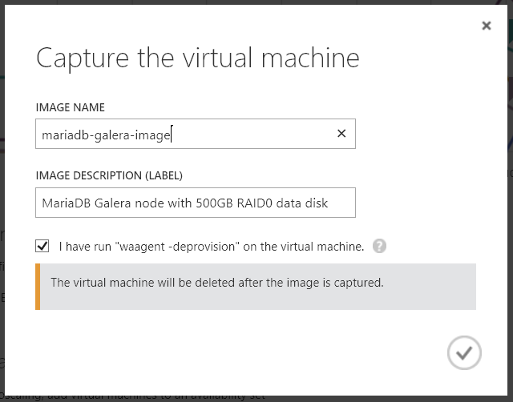
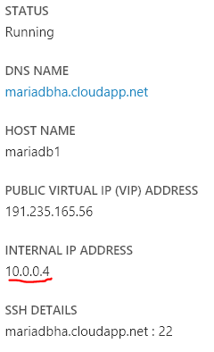
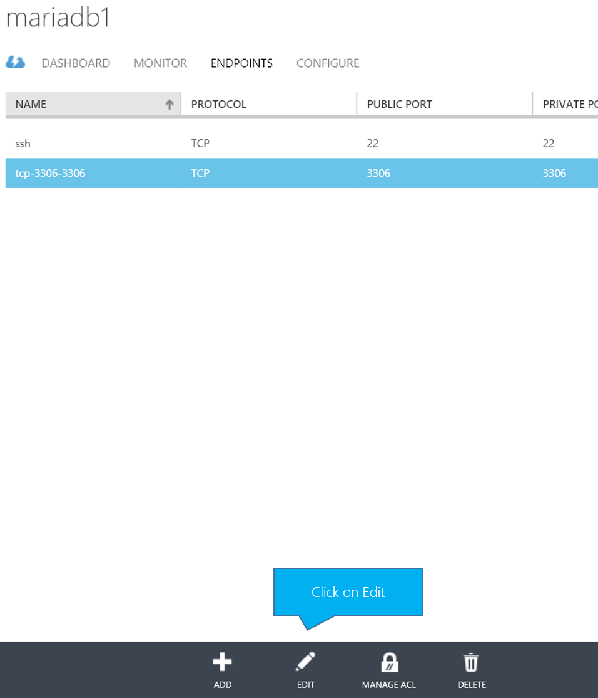
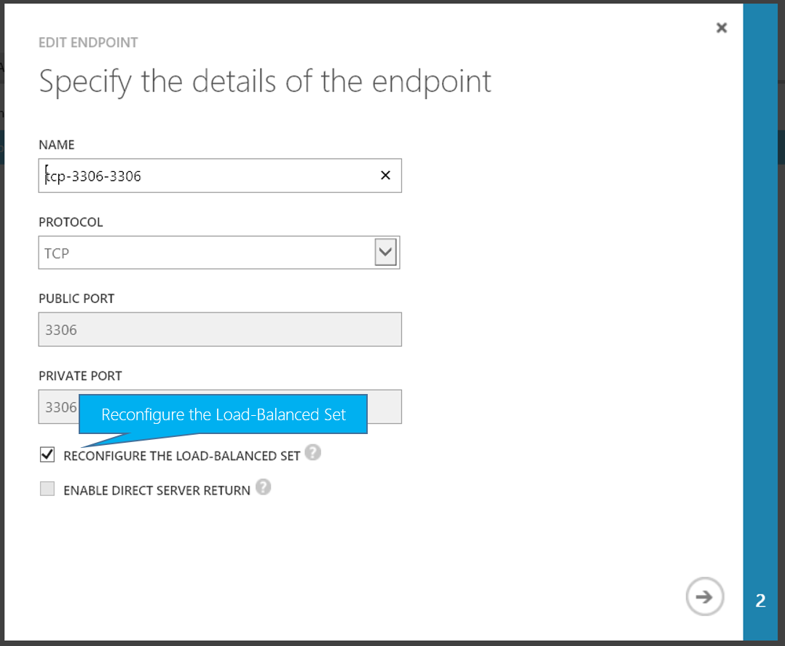

<properties
    pageTitle="在 Azure 上运行 MariaDB (MySQL) 群集 | Azure"
    description="在 Azure 虚拟机上创建 MariaDB + Galera MySQL 群集"
    services="virtual-machines-linux"
    documentationcenter=""
    author="sabbour"
    manager="timlt"
    editor=""
    tags="azure-service-management" />
<tags
    ms.assetid="d0d21937-7aac-4222-8255-2fdc4f2ea65b"
    ms.service="virtual-machines-linux"
    ms.devlang="multiple"
    ms.topic="article"
    ms.tgt_pltfrm="vm-linux"
    ms.workload="infrastructure-services"
    ms.date="04/15/2015"
    wacn.date="03/28/2017"
    ms.author="asabbour" />  

# MariaDB \(MySQL\) 群集：Azure 教程
> [AZURE.IMPORTANT]
Azure 有两种用于创建和处理资源的不同部署模型：[Azure Resource Manager 部署模型](/documentation/articles/resource-manager-deployment-model/)和经典部署模型。本文介绍经典部署模型。Azure 建议大多数新部署使用 Azure Resource Manager 模型。

本文介绍如何创建 [MariaDB](https://mariadb.org/en/about/) 的多主机 [Galera](http://galeracluster.com/products/) 群集（MySQL 的嵌入式替代版本，稳健、可缩放且可靠），适用于 Azure 虚拟机中的高可用性环境。

## 体系结构概述
本文介绍如何完成以下步骤：

- 创建一个三节点群集。
- 将数据磁盘与 OS 磁盘隔离开来。
- 在 RAID-0/条带化设置下创建数据磁盘，以提高 IOPS。
- 使用 Azure 负载均衡器均衡三个节点的负载。
- 为了最大程度地减少重复工作，可创建一个包含 MariaDB + Galera 的 VM 映像，并将其用于创建其他群集 VM。

  

> [AZURE.NOTE]
本主题使用 [Azure CLI](/documentation/articles/xplat-cli-install/) 工具，请确保按照说明进行下载并连接到你的 Azure 订阅。如需 Azure CLI 中可用命令的参考，可查看 [Azure CLI 命令参考](/documentation/articles/virtual-machines-command-line-tools/)。另外还需[创建用于身份验证的 SSH 密钥]，并记下 .pem 文件的位置。
>
>

## 创建模板
### 基础结构
1. 创建地缘组，将资源保存在一起。

        azure account affinity-group create mariadbcluster --location "China North" --label "MariaDB Cluster"
2. 创建虚拟网络。

        azure network vnet create --address-space 10.0.0.0 --cidr 8 --subnet-name mariadb --subnet-start-ip 10.0.0.0 --subnet-cidr 24 --affinity-group mariadbcluster mariadbvnet
3. 创建存储帐户，托管所有磁盘。不得将超过 40 个常用磁盘放置在同一存储帐户上，以免达到存储帐户的 20,000 IOPS 上限。在本例中，你将远低于该上限，所以为了简单起见，可以将所有磁盘存储在同一帐户上。

        azure storage account create mariadbstorage --label mariadbstorage --affinity-group mariadbcluster
4. 查找 CentOS 7 虚拟机映像的名称。

        azure vm image list | findstr CentOS
    输出类似于 `f1179221e23b4dbb89e39d70e5bc9e72__OpenLogic-CentOS-70-20160329`。

    在以下步骤中使用该名称。
5. 创建 VM 模板，将 /path/to/key.pem 替换为生成的 .pem SSH 密钥的存储路径。

        azure vm create --virtual-network-name mariadbvnet --subnet-names mariadb --blob-url "http://mariadbstorage.blob.core.chinacloudapi.cn/vhds/mariadbhatemplate-os.vhd"  --vm-size Medium --ssh 22 --ssh-cert "/path/to/key.pem" --no-ssh-password mariadbtemplate f1179221e23b4dbb89e39d70e5bc9e72__OpenLogic-CentOS-70-20160329 azureuser
6. 将 4 个 500 GB 的数据磁盘附加到 VM，以便在 RAID 配置中使用。

        FOR /L %d IN (1,1,4) DO azure vm disk attach-new mariadbhatemplate 512 http://mariadbstorage.blob.core.chinacloudapi.cn/vhds/mariadbhatemplate-data-%d.vhd
7. 使用 SSH 登录到在 mariadbhatemplate.chinacloudapp.cn:22 创建的模板 VM，并使用私钥进行连接。

### 软件
1. 获取根。

        sudo su

2. 安装 RAID 支持：

    a.安装 mdadm。

              yum install mdadm

    b.创建具有 EXT4 文件系统的 RAID0/条带化配置。

              mdadm --create --verbose /dev/md0 --level=stripe --raid-devices=4 /dev/sdc /dev/sdd /dev/sde /dev/sdf
              mdadm --detail --scan >> /etc/mdadm.conf
              mkfs -t ext4 /dev/md0
    c.创建装入点目录。

              mkdir /mnt/data
    d.检索新创建的 RAID 设备的 UUID。

              blkid | grep /dev/md0
    e.编辑 /etc/fstab。

              vi /etc/fstab
    f.添加设备，以便在重新启动时自动装载，并将 UUID 替换为从之前的 **blkid** 命令中获取的值。

              UUID=<UUID FROM PREVIOUS>   /mnt/data ext4   defaults,noatime   1 2
    g.装载新分区。

              mount /mnt/data

3. 安装 MariaDB。

    a.创建 MariaDB.repo 文件。

                vi /etc/yum.repos.d/MariaDB.repo

    b.使用以下内容填充 repo 文件：

              [mariadb]
              name = MariaDB
              baseurl = http://yum.mariadb.org/10.0/centos7-amd64
              gpgkey=https://yum.mariadb.org/RPM-GPG-KEY-MariaDB
              gpgcheck=1
    c.为了避免冲突，请删除现有后缀和 mariadb-libs。

          yum remove postfix mariadb-libs-*
    d.安装包含 Galera 的 MariaDB。

          yum install MariaDB-Galera-server MariaDB-client galera

4. 将 MySQL 数据目录移动到 RAID 块设备。

    a.将当前 MySQL 目录复制到新位置，然后删除旧目录。

          cp -avr /var/lib/mysql /mnt/data  
          rm -rf /var/lib/mysql
    b.相应地设置新目录的权限。

           chown -R mysql:mysql /mnt/data && chmod -R 755 /mnt/data/

    c.创建一个符号链接，将旧目录指向 RAID 分区中的新位置。

           ln -s /mnt/data/mysql /var/lib/mysql

5. [SELinux 干扰群集操作](http://galeracluster.com/documentation-webpages/configuration.html#selinux)，所以在当前会话中有必要将其禁用。编辑 `/etc/selinux/config`，禁止其随后重新启动。

        setenforce 0

    然后编辑 `/etc/selinux/config` 以设置 `SELINUX=permissive`
6. 验证 MySQL 是否运行。

    a.启动 MySQL。

           service mysql start
    b.保护 MySQL 安装、设置根密码、删除匿名用户以禁用远程根登录，以及删除测试数据库。

           mysql_secure_installation
    c.在数据库上创建一个用户，以便在群集操作中使用，也可以选择在应用程序中使用。

           mysql -u root -p
           GRANT ALL PRIVILEGES ON *.* TO 'cluster'@'%' IDENTIFIED BY 'p@ssw0rd' WITH GRANT OPTION; FLUSH PRIVILEGES;
           exit

    d.停止 MySQL。

            service mysql stop
7. 创建配置占位符。

    a.编辑 MySQL 配置，以便为群集设置创建一个占位符。现在不要替换 **`<Variables>`** 或取消注释。通过此模板创建 VM 后，才需执行该操作。

           vi /etc/my.cnf.d/server.cnf
    b.编辑 **[galera]** 部分，将其清空。

    c.编辑 **\[mariadb\]** 部分。

           wsrep_provider=/usr/lib64/galera/libgalera_smm.so
           binlog_format=ROW
           wsrep_sst_method=rsync
           bind-address=0.0.0.0 # When set to 0.0.0.0, the server listens to remote connections
           default_storage_engine=InnoDB
           innodb_autoinc_lock_mode=2

           wsrep_sst_auth=cluster:p@ssw0rd # CHANGE: Username and password you created for the SST cluster MySQL user
           #wsrep_cluster_name='mariadbcluster' # CHANGE: Uncomment and set your desired cluster name
           #wsrep_cluster_address="gcomm://mariadb1,mariadb2,mariadb3" # CHANGE: Uncomment and Add all your servers
           #wsrep_node_address='<ServerIP>' # CHANGE: Uncomment and set IP address of this server
           #wsrep_node_name='<NodeName>' # CHANGE: Uncomment and set the node name of this server
8. 在 CentOS 7 上使用 FirewallD 打开防火墙上的所需端口。

    * MySQL：`firewall-cmd --zone=public --add-port=3306/tcp --permanent`
    * GALERA：`firewall-cmd --zone=public --add-port=4567/tcp --permanent`
    * GALERA IST：`firewall-cmd --zone=public --add-port=4568/tcp --permanent`
    * RSYNC：`firewall-cmd --zone=public --add-port=4444/tcp --permanent`
    * 重新加载防火墙：`firewall-cmd --reload`

9. 优化系统性能。有关详细信息，请参阅[性能调优策略](/documentation/articles/virtual-machines-linux-classic-optimize-mysql/)。

    a.再次编辑 MySQL 配置文件。

           vi /etc/my.cnf.d/server.cnf
    b.编辑 **\[mariadb\]** 部分，追加以下内容：

    > [AZURE.NOTE]
    建议将 innodb\_buffer\_pool\_size 设置为 VM 的 70% 内存。在此示例中，已针对 RAM 为 3.5 GB 的中型 Azure VM 将其设置为 2.45 GB。
    >
    >

           innodb_buffer_pool_size = 2508M # The buffer pool contains buffered data and the index. This is usually set to 70 percent of physical memory.
           innodb_log_file_size = 512M #  Redo logs ensure that write operations are fast, reliable, and recoverable after a crash
           max_connections = 5000 # A larger value will give the server more time to recycle idled connections
           innodb_file_per_table = 1 # Speed up the table space transmission and optimize the debris management performance
           innodb_log_buffer_size = 128M # The log buffer allows transactions to run without having to flush the log to disk before the transactions commit
           innodb_flush_log_at_trx_commit = 2 # The setting of 2 enables the most data integrity and is suitable for Master in MySQL cluster
           query_cache_size = 0
10. 停止 MySQL 并禁止 MySQL 服务在启动时运行，以免在添加节点时导致群集混乱，然后取消预配计算机。

        service mysql stop
        chkconfig mysql off
        waagent -deprovision
11. 通过门户捕获 VM。（目前，[Azure CLI 工具中的问题 1268](https://github.com/Azure/azure-xplat-cli/issues/1268) 描述的事实是，Azure CLI 工具所捕获的映像并没有捕获所附加的数据磁盘。）

    a.通过门户关闭计算机。

    b.单击“捕获”，将映像名称指定为“mariadb-galera-image”。提供说明，并选中“我已运行 waagent”。
      
        

## 创建群集
使用创建的模板创建 3 个 VM，然后配置并启动群集。

1. 从所创建的 mariadb-galera-image 映像创建第一个 CentOS 7 VM，提供以下信息：

 - 虚拟网络名称：mariadbvnet
 - 子网：mariadb
 - 虚拟机大小：中等
 - 云服务名称：mariadbha（或者可以通过 mariadbha.chinacloudapp.cn 访问的任何名称）
 - 虚拟机名称：mariadb1
 - 用户名：azureuser
 - SSH 访问权限：启用
 - 传递 SSH 证书 .pem 文件，将 /path/to/key.pem 替换为生成的 .pem SSH 密钥的存储路径。

    > [AZURE.NOTE]
    为清楚起见，以下命令拆开显示在多行内，但每个都应作为一整行进行输入。
    >
    >
        azure vm create
        --virtual-network-name mariadbvnet
        --subnet-names mariadb
        --availability-set clusteravset
        --vm-size Medium
        --ssh-cert "/path/to/key.pem"
        --no-ssh-password
        --ssh 22
        --vm-name mariadb1
        mariadbha mariadb-galera-image azureuser
2. 再创建两个虚拟机，将其连接到 mariadbha 云服务。更改 VM 名称，并将 SSH 端口更改为不与同一云服务中的其他 VM 冲突的唯一端口。

        azure vm create
        --virtual-network-name mariadbvnet
        --subnet-names mariadb
        --availability-set clusteravset
        --vm-size Medium
        --ssh-cert "/path/to/key.pem"
        --no-ssh-password
        --ssh 23
        --vm-name mariadb2
        --connect mariadbha mariadb-galera-image azureuser
    对于 MariaDB3：

        azure vm create
        --virtual-network-name mariadbvnet
        --subnet-names mariadb
        --availability-set clusteravset
        --vm-size Medium
        --ssh-cert "/path/to/key.pem"
        --no-ssh-password
        --ssh 24
        --vm-name mariadb3
        --connect mariadbha mariadb-galera-image azureuser
3. 需要获取三个 VM 各自的内部 IP 地址，才能执行下一步：

      

4. 使用 SSH 登录到三个 VM，编辑每个 VM 上的配置文件。

        sudo vi /etc/my.cnf.d/server.cnf

    取消 **`wsrep_cluster_name`** 和 **`wsrep_cluster_address`** 的注释，方法是删除所在行开头的 **\#**。此外，将 **`wsrep_node_address`** 中的 **`<ServerIP>`** 和 **`wsrep_node_name`** 中的 **`<NodeName>`** 分别替换为 VM 的 IP 地址和名称，然后同样取消这些行的注释。
5. 启动 MariaDB1 上的群集，并允许其在启动时运行。

        sudo service mysql bootstrap
        chkconfig mysql on
6. 在 MariaDB2 和 MariaDB3 上启动 MySQL，并允许其在启动时运行。

        sudo service mysql start
        chkconfig mysql on

## 对群集进行负载均衡
在创建群集 VM 时，已将其添加到了名为 clusteravset 的可用性集中，确保其放置在不同的容错和更新域上，且 Azure 不会同时在所有虚拟机上执行维护。此配置符合该 Azure 服务级别协议 \(SLA\) 将支持的要求。

现在，使用 Azure 负载均衡器均衡三个节点之间的请求。

通过 Azure CLI 在计算机上运行以下命令。

命令参数结构是：`azure vm endpoint create-multiple <MachineName> <PublicPort>:<VMPort>:<Protocol>:<EnableDirectServerReturn>:<Load Balanced Set Name>:<ProbeProtocol>:<ProbePort>`

    azure vm endpoint create-multiple mariadb1 3306:3306:tcp:false:MySQL:tcp:3306
    azure vm endpoint create-multiple mariadb2 3306:3306:tcp:false:MySQL:tcp:3306
    azure vm endpoint create-multiple mariadb3 3306:3306:tcp:false:MySQL:tcp:3306

CLI 将负载均衡器探测时间间隔设置为 15 秒，这可能有点太长。不管什么 VM，均可在门户的“终结点”下对其进行更改。

  

选择“重新配置负载均衡集”。

  

将“探测时间间隔”更改为 5 秒，并保存所做的更改。

  

## 验证群集
繁琐的工作已经完成。现在应该可以在 `mariadbha.chinacloudapp.cn:3306` 访问群集，这将触发负载均衡器并在三个 VM 之间顺利、高效地路由请求。

使用偏好的 MySQL 客户端进行连接，或从其中一个 VM 进行连接，验证此群集是否正常运行。

     mysql -u cluster -h mariadbha.chinacloudapp.cn -p

然后，创建数据库并在其中填充一些数据。

    CREATE DATABASE TestDB;
    USE TestDB;
    CREATE TABLE TestTable (id INT NOT NULL AUTO_INCREMENT PRIMARY KEY, value VARCHAR(255));
    INSERT INTO TestTable (value)  VALUES ('Value1');
    INSERT INTO TestTable (value)  VALUES ('Value2');
    SELECT * FROM TestTable;

所创建的数据库将返回下表：

    +----+--------+
    | id | value  |
    +----+--------+
    |  1 | Value1 |
    |  4 | Value2 |
    +----+--------+
    2 rows in set (0.00 sec)

<!--Every topic should have next steps and links to the next logical set of content to keep the customer engaged-->

## 后续步骤
在本文中，你在运行 CentOS 7 的 Azure 虚拟机上创建了三节点型 MariaDB + Galera 高可用性群集。VM 通过 Azure 负载均衡器实现负载均衡。

你可能希望了解[在 Linux 上对 MySQL 进行集群的其他方式](/documentation/articles/virtual-machines-linux-classic-mysql-cluster/)并探究如何[优化和测试 Azure Linux VM 上的 MySQL 性能](/documentation/articles/virtual-machines-linux-classic-optimize-mysql/)。

<!--Anchors-->

[Architecture overview]: #architecture-overview
[Creating the template]: #creating-the-template
[Creating the cluster]: #creating-the-cluster
[Load balancing the cluster]: #load-balancing-the-cluster
[Validating the cluster]: #validating-the-cluster
[Next steps]: #next-steps

<!--Image references-->

<!--Link references-->

[Galera]: http://galeracluster.com/products/
[MariaDBs]: https://mariadb.org/en/about/
[创建用于身份验证的 SSH 密钥]: http://www.jeff.wilcox.name/2013/06/secure-linux-vms-with-ssh-certificates/
[issue #1268 in the Azure CLI]: https://github.com/Azure/azure-xplat-cli/issues/1268

<!---HONumber=Mooncake_0213_2017-->
<!--Update_Description: wording update-->