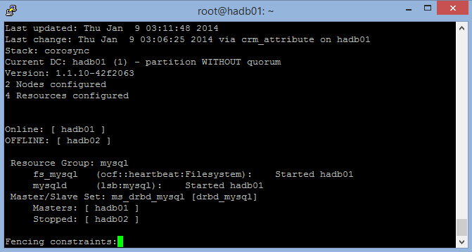

<properties
    pageTitle="使用负载均衡集组建 MySQL 的群集 | Azure"
    description="在 Azure 上设置使用经典部署模型创建的负载均衡且高度可用的 Linux MySQL 群集"
    services="virtual-machines-linux"
    documentationcenter=""
    author="bureado"
    manager="timlt"
    editor=""
    tags="azure-service-management" />
<tags
    ms.assetid="6c413a16-e9b5-4ffe-a8a3-ae67046bbdf3"
    ms.service="virtual-machines-linux"
    ms.workload="infrastructure-services"
    ms.tgt_pltfrm="vm-linux"
    ms.devlang="na"
    ms.topic="article"
    ms.date="04/14/2015"
    wacn.date="02/20/2017"
    ms.author="jparrel" />  

# 使用负载均衡的集来群集化 Linux 上的 MySQL
> [AZURE.IMPORTANT]
Azure 提供两个不同的部署模型用于创建和处理资源：[Azure Resource Manager](/documentation/articles/resource-manager-deployment-model/) 模型和经典模型。本文介绍使用经典部署模型的情况。Azure 建议大多数新部署使用 Resource Manager 模型。如果需要部署 MySQL 群集，可以使用 [Resource Manager 模板](https://github.com/Azure/azure-quickstart-templates/tree/master/mysql-replication/)。

本文探讨并演示在 Azure 上部署基于 Linux 的高度可用服务时可用的不同方法，并在 MySQL Server 高可用性方面提供入门性的探讨。演示此方法的视频可在[第 9 频道](http://channel9.msdn.com/Blogs/Open/Load-balancing-highly-available-Linux-services-on-Windows-Azure-OpenLDAP-and-MySQL)上找到。

我们将基于 DRBD、Corosync 和 Pacemaker 概述无共享双节点单主机 MySQL 高可用性解决方案。一次只有一个节点运行 MySQL。读取和写入 DRBD 资源也限制为一次只有一个节点。

无需使用类似 LVS 的 VIP 解决方案，因为我们将使用 Azure 中的负载均衡集来同时提供轮循功能和 VIP 的终结点检测、删除和正常恢复功能。VIP 是在首次创建云服务时由 Microsoft Azure 分配的全局可路由 IPv4 地址。

MySQL 的其他可能体系结构包括 NBD 群集、Percona 和 Galera 以及多个中间件解决方案，其中至少有一个以 VM Depot 中的 VM 的形式提供。只要这些解决方案可以复制到单播、多播或广播上，并且不要依赖于共享存储或多个网络接口，这些方案就应该很容易在 Azure 上部署。

这些群集体系结构可以类似方式扩展到其他产品（如 PostgreSQL 和 OpenLDAP）。例如，此无共享的负载均衡过程已成功在多主机 OpenLDAP 上测试，并可以在我们的第 9 频道博客上观看。

## 准备工作
需具备以下资源和能力：

  - 准备一个 Azure 帐户和有效的订阅，能够至少创建两个 VM（本示例使用了 XS）
  - 一个网络和一个子网
  - 一个地缘组
  - 一个可用性集
  - 能够在云服务所在的同一区域中创建 VHD，并将这些 VHD 附加到 Linux VM

### 已测试的环境
* Ubuntu 13.10
    * DRBD
    * MySQL Server
    * Corosync 和 Pacemaker

### 地缘组
创建解决方案的地缘组：登录到 Azure 经典管理门户，选择“设置”，然后创建地缘组。稍后创建的已分配资源将分配给此地缘组。

### 网络
将创建新网络，并在该网络内部创建子网。本示例使用只包含一个 /24 子网的 10.10.10.0/24 网络。

### 虚拟机
第一个 Ubuntu 13.10 VM 是使用 Endorsed Ubuntu 库映像创建的，其名为 `hadb01`。在此过程中，将创建名为 hadb 的新云服务。这样命名是为了说明在添加更多资源时，该服务具有共享的负载均衡性质。`hadb01` 的创建是直截了当的，可以使用门户完成。系统会自动创建 SSH 的终结点，并选择新网络。现在，可为 VM 创建可用性集。

创建第一个 VM 后（从技术上讲，创建云服务时），请继续创建第二个 VM `hadb02`。对于第二个 VM，请通过门户使用库中的 Ubuntu 13.10 VM，但要使用现有的云服务 `hadb.chinacloudapp.cn`，而不是新建一个。系统会自动选择网络和可用性集。也将创建 SSH 终结点。

创建两个 VM 后，请记下 `hadb01` 的 SSH 端口 \(TCP 22\) 和 `hadb02`（由 Azure 自动分配）。

### 附加存储
将新磁盘附加到两个 VM，并在附加过程中创建 5-GB 磁盘。这些磁盘托管在 VHD 容器中，用作主要操作系统磁盘。创建并附加磁盘后，无需重启 Linux，因为内核将会发现新设备。此设备通常为 `/dev/sdc`。检查 `dmesg` 的输出。

在每个 VM 上，使用 `cfdisk` 创建分区（主 Linux 分区），并写入新的分区表。不要在此分区中创建文件系统。

## 设置群集
在两个 Ubuntu VM 上，使用 APT 安装 Corosync、Pacemaker 和 DRBD。为此，请结合 `apt-get` 运行以下代码：

    sudo apt-get install corosync pacemaker drbd8-utils.

暂时不要安装 MySQL。Debian 和 Ubuntu 安装脚本将在 `/var/lib/mysql` 上初始化 MySQL 数据目录，但由于该目录将由 DRBD 文件系统取代，因此稍后需要安装 MySQL。

使用 `/sbin/ifconfig` 验证两个 VM 是否使用 10.10.10.0/24 子网中的地址，并且它们是否可以按名称彼此 ping 通。还可以使用 `ssh-keygen` 和 `ssh-copy-id` 确保这两个 VM 可以通过 SSH 通信而无需密码。

### 设置 DRBD
创建一个 DRBD 资源，该资源使用基础 `/dev/sdc1` 分区生成能够使用 ext3 格式化并在主节点和辅助节点中使用的 `/dev/drbd1` 资源。

1. 打开 `/etc/drbd.d/r0.res`，复制两个 VM 上的以下资源定义：

        resource r0 {
          on `hadb01` {
            device  /dev/drbd1;
            disk   /dev/sdc1;
            address  10.10.10.4:7789;
            meta-disk internal;
          }
          on `hadb02` {
            device  /dev/drbd1;
            disk   /dev/sdc1;
            address  10.10.10.5:7789;
            meta-disk internal;
          }
        }

2. 在两个 VM 上使用 `drbdadm` 初始化资源：

        sudo drbdadm -c /etc/drbd.conf role r0
        sudo drbdadm up r0

3. 在主 VM \(`hadb01`\) 上强制指定 DRBD 资源的所有权 \(primary\)：

        sudo drbdadm primary --force r0

如果你在这两个 VM 中检查 /proc/drbd \(`sudo cat /proc/drbd`\) 的内容，你应在 `hadb01` 上看到 `Primary/Secondary`，在 `hadb02` 上看到 `Secondary/Primary`，与此时的解决方案保持一致。5-GB 磁盘通过 10.10.10.0/24 网络进行同步，不会向客户收费。

同步磁盘后，可在 `hadb01` 上创建文件系统。出于测试目的，我们使用了 ext2，但以下代码将创建 ext3 文件系统：

    mkfs.ext3 /dev/drbd1

### 装载 DRBD 资源
现已准备好在 `hadb01` 上装载 DRBD 资源。Debian 和派生物使用 `/var/lib/mysql` 作为 MySQL 的数据目录。由于尚未安装 MySQL，因此需要创建该目录并装载 DRBD 资源。若要执行此选项，请在 `hadb01` 上运行以下代码：

    sudo mkdir /var/lib/mysql
    sudo mount /dev/drbd1 /var/lib/mysql

## 设置 MySQL
现在你已准备好在 `hadb01` 上安装 MySQL：

    sudo apt-get install mysql-server

对于 `hadb02`，可以使用两个选项。可以安装 mysql-server，这会创建 /var/lib/mysql 并在其中填入一个新的数据目录，然后删除内容。若要执行此选项，请在 `hadb02` 上运行以下代码：

    sudo apt-get install mysql-server
    sudo service mysql stop
    sudo rm -rf /var/lib/mysql/*

第二个选项用于故障转移到 `hadb02`，然后在该位置安装 mysql-server。安装脚本会检测到现有安装，并且不会对它进行修改。

在 `hadb01` 上运行以下代码：

    sudo drbdadm secondary -force r0

在 `hadb02` 上运行以下代码：

    sudo drbdadm primary -force r0
    sudo apt-get install mysql-server

如果你现在不打算故障转移 DRBD，则第一个选项虽说算不上极好但更容易。设置此项后，但可以开始处理 MySQL 数据库了。在 `hadb02` 上（或根据 DRBD 处于活动状态的任何服务器上）运行以下代码：

    mysql -u root -p
    CREATE DATABASE azureha;
    CREATE TABLE things ( id SERIAL, name VARCHAR(255) );
    INSERT INTO things VALUES (1, "Yet another entity");
    GRANT ALL ON things.\* TO root;

> [AZURE.WARNING]
此最后一条语句有效地对该表中的根用户禁用身份验证。这应替换为生产级别 GRANT 语句，并且仅为说明目的才包括在内。

如果要从 VM 外部进行查询，则还需要为 MySQL 启用网络（这是本指南的目的）。在两个 VM 上打开 `/etc/mysql/my.cnf` 并转到 `bind-address`。将地址从 127.0.0.1 更改为 0.0.0.0。保存该文件之后，在当前主节点上发出 `sudo service mysql restart`。

### 创建 MySQL 负载均衡集
返回门户，转到 `hadb01`，然后选择“终结点”。若要创建终结点，请从下拉列表中选择“MySQL \(TCP 3306\)”，然后选择“新建负载均衡集”。将负载均衡的终结点命名为 `lb-mysql`。将“时间”设置为最小 5 秒。

创建终结点后，转到 `hadb02`，选择“终结点”，然后创建一个终结点。选择 `lb-mysql`，然后从下拉列表中选择“MySQL”。还可以将 Azure CLI 用于此步骤。

现已做好手动操作群集所需的一切准备。

### 测试负载均衡集
可以从外部计算机使用任何 MySQL 客户端，或者使用特定的应用程序（例如，作为 Azure 网站运行的 phpMyAdmin）执行测试。在本例中，我们在另一台 Linux 计算机上使用了 MySQL 的命令行工具：

    mysql azureha -u root -h hadb.chinacloudapp.cn -e "select * from things;"

### 手动故障转移
可以通过关闭 MySQL、切换 DRBD 的主节点并再次启动 MySQL 来模拟故障转移。

若要执行此任务，请在 hadb01 上运行以下代码：

    service mysql stop && umount /var/lib/mysql ; drbdadm secondary r0

然后，在 hadb02 上：

    drbdadm primary r0 ; mount /dev/drbd1 /var/lib/mysql && service mysql start

手动故障转移后，可以重复执行远程查询，它应该能够完美运行。

## 设置 Corosync
Corosync 是使 Pacemaker 工作所需的基础群集基础结构。对于检测信号（以及 Ultramonkey 等其他方法），Corosync 是 CRM 功能的拆分，而 Pacemaker 将保持更类似于功能中的检测信号。

Azure 上 Corosync 的主要约束是 Corosync 首选多播，其次广播，再其次单播通信，但 Azure 网络仅支持单播。

幸运的是，Corosync 提供一种可行的单播模式。唯一的真正约束是，由于并非所有节点之间都可互相通信，因此需要在配置文件中定义节点，包括其 IP 地址。我们可以对单播使用 Corosync 示例文件，更改绑定地址、节点列表和日志记录目录（Ubuntu 使用 `/var/log/corosync`，而示例文件使用 `/var/log/cluster`），并启用仲裁工具。

> [AZURE.NOTE]
使用以下 `transport: udpu` 指令以及为两个节点手动定义的 IP 地址。

在 `/etc/corosync/corosync.conf` 上针对两个节点运行以下代码：

    totem {
      version: 2
      crypto_cipher: none
      crypto_hash: none
      interface {
        ringnumber: 0
        bindnetaddr: 10.10.10.0
        mcastport: 5405
        ttl: 1
      }
      transport: udpu
    }

    logging {
      fileline: off
      to_logfile: yes
      to_syslog: yes
      logfile: /var/log/corosync/corosync.log
      debug: off
      timestamp: on
      logger_subsys {
        subsys: QUORUM
        debug: off
        }
      }

    nodelist {
      node {
        ring0_addr: 10.10.10.4
        nodeid: 1
      }

      node {
        ring0_addr: 10.10.10.5
        nodeid: 2
      }
    }

    quorum {
      provider: corosync_votequorum
    }

将此配置文件复制到两个 VM，然后在这两个节点上启动 Corosync：

    sudo service start corosync

启动该服务后不久，群集应在当前环中建立，并应构成仲裁。可以通过查看日志或运行以下代码来检查此功能：

    sudo corosync-quorumtool -l

将看到如下图所示的输出：

  

## 设置 Pacemaker
Pacemaker 使用群集监视资源、定义主节点何时停机，并将这些资源切换到辅助节点。可以通过一组可用脚本或 LSB（类似 init）脚本以及其他选项定义资源。

我们希望 Pacemaker“拥有”DRBD 资源、装入点和 MySQL 服务。如果在主节点出现问题时 Pacemaker 可以启用和关闭 DRBD，请按正确的顺序装载和卸载它，然后启动并停止 MySQL，这样就完成了设置。

首次安装 Pacemaker 时，你的配置应足够简单，如下所示：

    node $id="1" hadb01
      attributes standby="off"
    node $id="2" hadb02
      attributes standby="off"

1. 运行 `sudo crm configure show` 检查配置。
2. 然后，使用以下资源创建一个文件（例如 `/tmp/cluster.conf`）：

        primitive drbd_mysql ocf:linbit:drbd \
              params drbd_resource="r0" \
              op monitor interval="29s" role="Master" \
              op monitor interval="31s" role="Slave"

        ms ms_drbd_mysql drbd_mysql \
              meta master-max="1" master-node-max="1" \
                clone-max="2" clone-node-max="1" \
                notify="true"

        primitive fs_mysql ocf:heartbeat:Filesystem \
              params device="/dev/drbd/by-res/r0" \
              directory="/var/lib/mysql" fstype="ext3"

        primitive mysqld lsb:mysql

        group mysql fs_mysql mysqld

        colocation mysql_on_drbd \
               inf: mysql ms_drbd_mysql:Master

        order mysql_after_drbd \
               inf: ms_drbd_mysql:promote mysql:start

        property stonith-enabled=false

        property no-quorum-policy=ignore

3. 将文件加载到配置中。只需在一个节点中执行此操作。

        sudo crm configure
          load update /tmp/cluster.conf
          commit
          exit

4. 确保 Pacemaker 在这两个节点中引导时启动：

        sudo update-rc.d pacemaker defaults

5. 使用 `sudo crm_mon -L` 验证某个节点是否已成为群集的主机并且正在运行所有资源。可以使用 mount 和 PS 来检查资源是否正在运行。

以下屏幕截图显示一个节点已停止的 `crm_mon`（使用 Ctrl+C 退出）：

  

此屏幕截图显示了两个节点，一个是主节点，一个是从节点：

  

## 测试
现已准备好自动故障转移模拟。可通过两种方式执行此操作：软方式和硬方式。

软方式使用群集的关闭功能：``crm_standby -U `uname -n` -v on``。在主节点上使用此功能时，从节点将会接管。请记得将此功能重新设为 off。否则，crm\_mon 会显示一个节点处于待机。

硬方式是通过门户关闭主 VM \(hadb01\) 或更改 VM 上的运行级别（即，停止、关闭）。这可以通过指示主节点即将关闭来帮助 Corosync 和 Pacemaker。可以对此进行测试（适用于维护窗口），但也可以通过只冻结 VM 来强制实施该方案。

## STONITH
它应该能够通过 Azure CLI 代替用于控制物理设备的 STONITH 脚本向 VM 发出关闭命令。可以使用 `/usr/lib/stonith/plugins/external/ssh` 作为基础并在群集的配置中启用 STONITH。应全局安装 Azure CLI 并应为群集的用户加载发布设置和配置文件。

[GitHub](https://github.com/bureado/aztonith) 上提供了资源的示例代码。可通过将以下代码添加到 `sudo crm configure` 来更改群集的配置：

    primitive st-azure stonith:external/azure \
      params hostlist="hadb01 hadb02" \
      clone fencing st-azure \
      property stonith-enabled=true \
      commit

> [AZURE.NOTE]
该脚本不执行向上/向下检查。原始 SSH 资源使用 15 次 ping 检查，但 Azure VM 的恢复时间可能更多变。

## 限制
以下限制适用：

* 管理 DRBD 的 linbit DRBD 资源脚本作为 Pacemaker 中的资源在关闭节点时使用 `drbdadm down`，即使该节点只是转为待机状态也是如此。这并不理想，因为当主节点获得写入时，从节点将不会同步 DRBD 资源。如果主节点未按正常方式失败，则从节点可以接受较旧的文件系统状态。可通过两种可能方式来解决此问题：
    * 在所有群集节点上通过本地（非群集化）监视程序强制执行 `drbdadm up r0`
    * 编辑 linbit DRBD 脚本以确保未在 `/usr/lib/ocf/resource.d/linbit/drbd` 中调用 `down`。
* 负载均衡器至少需要 5 秒钟才能做出响应，因此应用程序应是群集感知的并更容忍超时。其他体系结构（如应用中队列和查询中间件）也会有帮助。
* 有必要进行 MySQL 优化，确保以受控的速度完成写入，并且尽可能频繁地将缓存刷新到磁盘。
* 写入性能依赖于虚拟交换机中的 VM 互连，因为这是 DRBD 用于复制设备的机制。

<!---HONumber=Mooncake_0213_2017-->