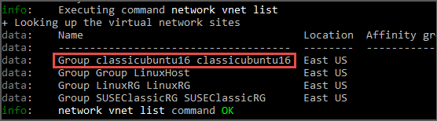

<!-- not suitable for Mooncake -->

<properties
	pageTitle="使用 Azure CLI 将 IaaS 资源从经典部署模型迁移到 Azure Resource Manager 部署模型 | Azure"
	description="本文逐步讲解如何使用 Azure CLI 对资源进行平台支持的从经典部署模型到 Azure Resource Manager 部署模型的迁移"
	services="virtual-machines-linux"
	documentationCenter=""
	authors="cynthn"
	manager="timlt"
	editor=""
	tags="azure-resource-manager"/>

<tags
	ms.service="virtual-machines-linux"
	ms.workload="infrastructure-services"
	ms.tgt_pltfrm="vm-linux"
	ms.devlang="na"
	ms.topic="article"
	ms.date="07/19/2016"
	wacn.date="12/27/2016"
	ms.author="cynthn"/>

# 使用 Azure CLI 将 IaaS 资源从经典部署模型迁移到 Azure Resource Manager 部署模型

以下步骤演示如何使用 Azure 命令行接口 (CLI) 命令将基础结构即服务 (IaaS) 资源从经典部署模型迁移到 Azure Resource Manager 部署模型。本文中的操作需要 [Azure CLI](/documentation/articles/xplat-cli-install/)。

>[AZURE.NOTE] 此处描述的所有操作都是幂等的。如果你遇到功能不受支持或配置错误以外的问题，建议你重试准备、中止或提交操作。然后平台将重试操作。

## 步骤 1：准备迁移

下面是建议你在将 IaaS 资源从经典部署模型迁移到 Resource Manager 部署模型时遵循的一些最佳实践：

- 请参阅[不受支持的配置或功能的列表](/documentation/articles/virtual-machines-windows-migration-classic-resource-manager/)。如果虚拟机使用不受支持的配置或功能，建议你等到我们宣布支持该功能/配置时再进行迁移。或者，可以删除该功能或移出该配置，以利迁移进行（如果这样做符合要求）。
-	如果你通过自动化脚本来部署目前的基础结构和应用程序，则可尝试使用这些脚本进行迁移，以便创建类似的测试性设置。也可以使用 Azure 门户设置示例环境。

## 步骤 2：设置订阅并注册提供程序

对于迁移方案，需要针对经典部署模型和 Resource Manager 部署模型设置环境。[安装 Azure CLI](/documentation/articles/xplat-cli-install/) 并[选择订阅](/documentation/articles/xplat-cli-connect/)。

登录到帐户。
	
	azure login -e AzureChinaCloud

使用以下命令选择 Azure 订阅。

	azure account set "<azure-subscription-name>"

>[AZURE.NOTE] 注册是一次性步骤，但必须在尝试迁移之前完成。如果不注册，你会看到以下错误消息

>	*BadRequest : Subscription is not registered for migration.* 

使用以下命令向迁移资源提供程序注册。请注意，在某些情况下，此命令会超时。但是，注册会成功。

	azure provider register Microsoft.ClassicInfrastructureMigrate

请等五分钟让注册完成。可以使用以下命令来检查审批状态。请确保在继续操作之前，RegistrationState 为 `Registered`。

	azure provider show Microsoft.ClassicInfrastructureMigrate

现在请将 CLI 切换到 `asm` 模式。

	azure config mode asm

## 步骤 3：请确保在当前部署或 VNET 的 Azure 区域中有足够的 Azure Resource Manager 虚拟机核心

要执行此步骤，需要切换到 `arm` 模式。使用以下命令执行此操作。

	azure config mode arm

可以使用以下 CLI 命令检查当前 Azure Resource Manager 中已有的核心数量。若要了解有关核心配额的详细信息，请参阅[限制和 Azure Resource Manager](/documentation/articles/azure-subscription-service-limits/#limits-and-the-azure-resource-manager)

	azure vm list-usage -l "<Your VNET or Deployment's Azure region"

验证完此步骤后，可以切换回 `asm` 模式。

	azure config mode asm

## 步骤 4：选项 1 - 迁移云服务中的虚拟机 

使用以下命令获取云服务列表，然后选取要迁移的云服务。请注意，如果云服务中的 VM 在虚拟网络中或者具有 Web/辅助角色，你将收到错误消息。

	azure service list

运行以下命令，从详细输出中获取云服务的部署名称。在大多数情况下，部署名称与云服务名称相同。

	azure service show <serviceName> -vv

准备迁移云服务中的虚拟机。可以从两个选项中进行选择。

如果你想要将 VM 迁移到平台所创建的虚拟网络上，请使用以下命令。

	azure service deployment prepare-migration <serviceName> <deploymentName> new "" "" ""

如果你想要迁移到 Resource Manager 部署模型中的现有虚拟网络，请使用以下命令。

	azure service deployment prepare-migration <serviceName> <deploymentName> existing <destinationVNETResourceGroupName> subnetName <vnetName>

准备操作成功后，可以查看详细输出，以获取 VM 的迁移状态，并确保其处于 `Prepared` 状态。

	azure vm show <vmName> -vv

使用 CLI 或 Azure 门户查看准备好的资源的配置。如果你尚未做好迁移准备，因此想要回到旧的状态，请使用以下命令。

	azure service deployment abort-migration <serviceName> <deploymentName>

如果准备好的配置看起来没问题，则可继续进行，使用以下命令提交资源。

	azure service deployment commit-migration <serviceName> <deploymentName>

	
## 步骤 4：选项 2 - 迁移虚拟网络中的虚拟机

选取要迁移的虚拟网络。请注意，如果虚拟网络包含的 Web/辅助角色或 VM 的配置不受支持，你将收到验证错误消息。

使用以下命令获取订阅中的所有虚拟网络。

	azure network vnet list
	
输出将如下所示：

在上面的示例中，**virtualNetworkName** 是完整名称 **"Group classicubuntu16 classicubuntu16"**。

使用以下命令来准备要迁移的所选虚拟网络。

	azure network vnet prepare-migration <virtualNetworkName>

使用 CLI 或 Azure 门户查看准备好的虚拟机的配置。如果你尚未做好迁移准备，因此想要回到旧的状态，请使用以下命令。

	azure network vnet abort-migration <virtualNetworkName>

如果准备好的配置看起来没问题，则可继续进行，使用以下命令提交资源。

	azure network vnet commit-migration <virtualNetworkName>

## 步骤 5：迁移存储帐户

完成虚拟机迁移之后，建议你迁移存储帐户。

使用以下命令来准备要迁移的存储帐户

	azure storage account prepare-migration <storageAccountName>

使用 CLI 或 Azure 门户查看准备就绪的存储帐户的配置。如果你尚未做好迁移准备，因此想要回到旧的状态，请使用以下命令。

	azure storage account abort-migration <storageAccountName>

如果准备好的配置看起来没问题，则可继续进行，使用以下命令提交资源。

	azure storage account commit-migration <storageAccountName>

## 后续步骤

- [平台支持的从经典部署模型到 Resource Manager 部署模型的 IaaS 资源迁移](/documentation/articles/virtual-machines-windows-migration-classic-resource-manager/)
- [技术探讨：平台支持的从经典部署模型到 Resource Manager 部署模型的迁移](/documentation/articles/virtual-machines-windows-migration-classic-resource-manager-deep-dive/)

<!---HONumber=Mooncake_1017_2016-->