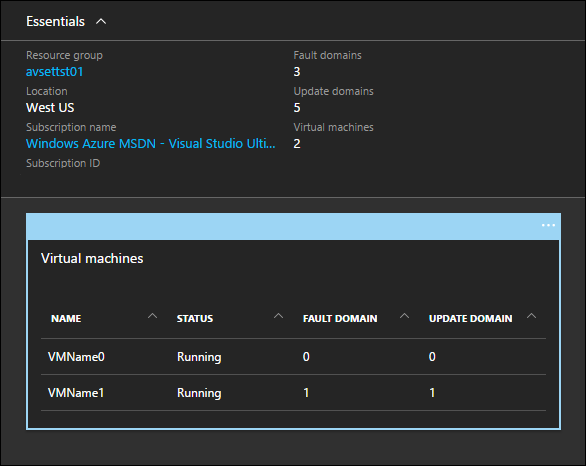
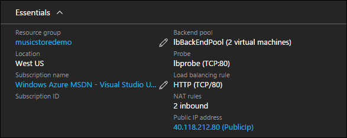
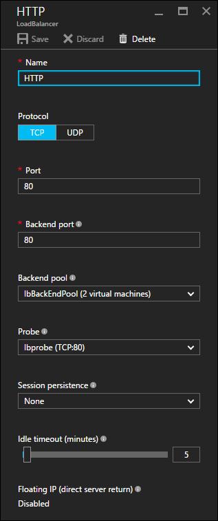
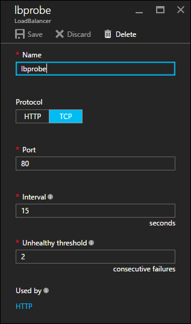
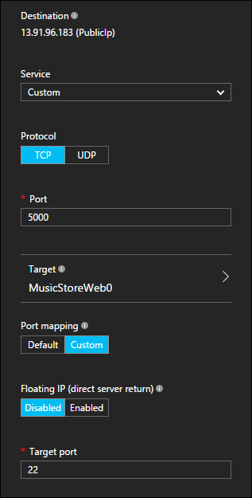

<properties
    pageTitle="Azure Resource Manager 模板的可用性和缩放 | Azure"
    description="Azure 虚拟机 DotNet Core 教程"
    services="virtual-machines-linux"
    documentationcenter="virtual-machines"
    author="neilpeterson"
    manager="timlt"
    editor="tysonn"
    tags="azure-service-management" />  

<tags
    ms.assetid="8fcfea79-f017-4658-8c51-74242fcfb7f6"
    ms.service="virtual-machines-linux"
    ms.devlang="na"
    ms.topic="article"
    ms.tgt_pltfrm="vm-linux"
    ms.workload="infrastructure"
    ms.date="11/21/2016"
    wacn.date=""
    ms.author="nepeters" />  

# Azure Resource Manager 模板的可用性和缩放
可用性和缩放是指满足特定需求而要达到的运行时间与能力。如果应用程序必须在 99.9% 的时间保持运行状态，则就需要一个允许多个并发计算资源的体系结构。例如，具有较高程度可用性的配置不会使用单个网站，而是使用同一站点的多个实例，这些实例采用均衡技术。在此配置中，可以关闭一个应用程序实例进行维护，剩余的实例继续正常运行。另一方面，缩放是指应用程序为需求提供服务的能力。使用负载均衡的应用程序时，在池中添加或删除实例，即可让应用程序根据需求缩放。

本文档详细说明如何针对可用性和缩放配置音乐应用商店示例部署。所有依赖项和独特配置都已突出显示。为了获得最佳体验，请将一个解决方案实例预先部署到 Azure 订阅，然后将它与 Azure Resource Manager 模板配合运行。可通过以下链接找到完整模板 – [Ubuntu 上的音乐应用商店部署](https://github.com/Microsoft/dotnet-core-sample-templates/tree/master/dotnet-core-music-linux)。

## 可用性集
可用性集以逻辑方式将 Azure 虚拟机分散在不同的物理主机与其他基础结构组件（例如电源和物理网络硬件）上。可用性集确保在维护期间，设备故障或其他停机事件不会影响到所有虚拟机。可通过使用 Visual Studio 中的“添加新资源向导”或者在模板中插入有效 JSON，将可用性集添加到 Azure Resource Manager 模板中。

单击以下链接可查看 Resource Manager 模板中的 JSON 示例 – [可用性集](https://github.com/Microsoft/dotnet-core-sample-templates/blob/master/dotnet-core-music-linux/azuredeploy.json#L387)。

    {
      "apiVersion": "2015-06-15",
      "type": "Microsoft.Compute/availabilitySets",
      "name": "[variables('availabilitySetName')]",
      "location": "[resourceGroup().location]",
      "dependsOn": [],
      "tags": {
        "displayName": "avalibility-set"
      },
      "properties": {
        "platformUpdateDomainCount": 5,
        "platformFaultDomainCount": 3
      }
    }

可用性集声明为虚拟机资源的属性。

单击以下链接可查看 Resource Manager 模板中的 JSON 示例 – [可用性集与虚拟机的关联](https://github.com/Microsoft/dotnet-core-sample-templates/blob/master/dotnet-core-music-linux/azuredeploy.json#L313)。

    "properties": {
      "availabilitySet": {
        "id": "[resourceId('Microsoft.Compute/availabilitySets', variables('availabilitySetName'))]"
      }

Azure 门户预览中显示的可用性集。下面说明了每个虚拟机及其配置的详细信息。

  

有关可用性集的深入信息，请参阅 [Manage availability of virtual machines](/documentation/articles/virtual-machines-linux-manage-availability/)（管理虚拟机的可用性）。

## 网络负载均衡器
可用性集提供应用程序容错能力，而负载均衡器可让单个网络地址上有多个应用程序实例可供使用。多个应用程序实例可以托管在多个虚拟机上，每个虚拟机都连接到负载均衡器。访问应用程序时，负载均衡器将传入请求路由到每个附加的成员。可以通过使用 Visual Studio 中的“添加新资源向导”或者在 Azure Resource Manager 模板中插入格式正确的 JSON 资源，来添加负载均衡器。

单击以下链接可查看 Resource Manager 模板中的 JSON 示例 – [网络负载均衡器](https://github.com/Microsoft/dotnet-core-sample-templates/blob/master/dotnet-core-music-linux/azuredeploy.json#L208)。

    {
      "apiVersion": "2015-06-15",
      "type": "Microsoft.Network/loadBalancers",
      "name": "[variables('loadBalancerName')]",
      "location": "[resourceGroup().location]",
      "tags": {
        "displayName": "load-balancer-front"
      },
      ........<truncated>
    }

由于示例应用程序通过公共 IP 地址向 Internet 公开，因此，此地址与负载均衡器关联。

单击以下链接可查看 Resource Manager 模板中的 JSON 示例 – [网络负载均衡器与公共 IP 地址的关联](https://github.com/Microsoft/dotnet-core-sample-templates/blob/master/dotnet-core-music-linux/azuredeploy.json#L221)。

    "frontendIPConfigurations": [
      {
        "properties": {
          "publicIPAddress": {
            "id": "[resourceId('Microsoft.Network/publicIPAddresses', variables('publicipaddressName'))]"
          }
        },
        "name": "LoadBalancerFrontend"
      }
    ]

在 Azure 门户预览中，网络负载均衡器概述显示了与公共 IP 地址的关联。

  

## 负载均衡器规则
使用负载均衡器时，可配置规则来控制如何在各个目标资源之间均衡流量。在示例音乐应用商店应用程序中，流量将进入公共 IP 地址的端口 80，然后分发到所有虚拟机的端口 80。

单击以下链接可查看 Resource Manager 模板中的 JSON 示例 – [负载均衡器规则](https://github.com/Microsoft/dotnet-core-sample-templates/blob/master/dotnet-core-music-linux/azuredeploy.json#L270)。

    "loadBalancingRules": [
      {
        "name": "[variables('loadBalencerRule')]",
        "properties": {
          "frontendIPConfiguration": {
            "id": "[concat(resourceId('Microsoft.Network/loadBalancers', variables('loadBalancerName')), '/frontendIPConfigurations/LoadBalancerFrontend')]"
          },
          "backendAddressPool": {
            "id": "[variables('lbPoolID')]"
          },
          "protocol": "Tcp",
          "frontendPort": 80,
          "backendPort": 80,
          "enableFloatingIP": false,
          "idleTimeoutInMinutes": 5,
          "probe": {
            "id": "[variables('lbProbeID')]"
          }
        }
      }
    ]

门户中显示的网络负载均衡器规则。

  

## 负载均衡器探测
负载均衡器还需要监视每个虚拟机，以便只将请求提供给正在运行的系统。这种监视通过不断探测预定义的端口来进行。音乐应用商店部署配置为探测所有包含的虚拟机上的端口 80。

单击以下链接可查看 Resource Manager 模板中的 JSON 示例 – [负载均衡器探测](https://github.com/Microsoft/dotnet-core-sample-templates/blob/master/dotnet-core-music-linux/azuredeploy.json#L257)。

    "probes": [
      {
        "properties": {
          "protocol": "Tcp",
          "port": 80,
          "intervalInSeconds": 15,
          "numberOfProbes": 2
        },
        "name": "lbprobe"
      }
    ]

Azure 门户预览中显示的负载均衡器探测。

  

## 入站 NAT 规则
使用负载均衡器时，需要部署规则来提供对每个虚拟机的非负载均衡访问。例如，与每个虚拟机创建 SSH 连接时，不应该对此流量进行负载均衡，而应配置一个预先确定的路径。预先确定的路径是使用入站 NAT 规则资源配置的。使用此资源可将入站通信映射到各个虚拟机。

在音乐应用商店应用程序中，从 5000 开始的端口映射到每个虚拟机上的端口 22，实现 SSH 访问。使用 `copyindex()` 函数可以递增传入端口，使第二个虚拟机接收传入端口 5001，第三个虚拟机接收 5002，依此类推。

单击以下链接可查看 Resource Manager 模板中的 JSON 示例 – [入站 NAT 规则](https://github.com/Microsoft/dotnet-core-sample-templates/blob/master/dotnet-core-music-linux/azuredeploy.json#L270)。

    {
      "apiVersion": "2015-06-15",
      "type": "Microsoft.Network/loadBalancers/inboundNatRules",
      "name": "[concat(variables('loadBalancerName'), '/', 'SSH-VM', copyIndex())]",
      "tags": {
        "displayName": "load-balancer-nat-rule"
      },
      "location": "[resourceGroup().location]",
      "copy": {
        "name": "lbNatLoop",
        "count": "[parameters('numberOfInstances')]"
      },
      "dependsOn": [
        "[concat('Microsoft.Network/loadBalancers/', variables('loadBalancerName'))]"
      ],
      "properties": {
        "frontendIPConfiguration": {
          "id": "[variables('ipConfigID')]"
        },
        "protocol": "tcp",
        "frontendPort": "[copyIndex(5000)]",
        "backendPort": 22,
        "enableFloatingIP": false
      }
    }

Azure 门户预览中显示的一个示例入站 NAT 规则。在部署中为每个虚拟机创建一个 SSH NAT 规则。

  

有关 Azure 网络负载均衡器的深入信息，请参阅 [Azure 基础结构服务的负载均衡](/documentation/articles/virtual-machines-linux-load-balance/)。

## 部署多个 VM
最后，为使可用性集或负载均衡器有效运行，需要部署多个虚拟机。可以使用 Azure Resource Manager 模板复制函数来部署多个 VM。使用复制函数时，不需要定义有限数量的虚拟机，而可以在部署时动态提供此值。复制函数使用要创建的实例数目，可以部署适当数目的虚拟机和关联的资源。

音乐应用商店示例模板中已定义一个提取实例计数的参数。创建虚拟机和相关资源时，将在整个模板中使用此数字。

    "numberOfInstances": {
      "type": "int",
      "minValue": 1,
      "defaultValue": 1,
      "metadata": {
        "description": "Number of VM instances to be created behind load balancer."
      }
    }

在虚拟机资源中，复制循环已命名，实例参数数目用于控制生成的副本数目。

单击以下链接可查看 Resource Manager 模板中的 JSON 示例 – [虚拟机复制函数](https://github.com/Microsoft/dotnet-core-sample-templates/blob/master/dotnet-core-music-linux/azuredeploy.json#L300)。

    "apiVersion": "2015-06-15",
    "type": "Microsoft.Compute/virtualMachines",
    "name": "[concat(variables('vmName'),copyindex())]",
    "location": "[resourceGroup().location]",
    "copy": {
      "name": "virtualMachineLoop",
      "count": "[parameters('numberOfInstances')]"
    }

可以使用 `copyIndex()` 函数访问复制函数的当前迭代。复制索引函数的值可用于命名虚拟机和其他资源。例如，如果部署了两个虚拟机实例，它们需要不同的名称。可将 `copyIndex()` 函数用作虚拟机名称的一部分来创建唯一名称。在虚拟机资源中可以看到一个用于命名目的的 `copyindex()` 函数示例。此处的计算机名称由 `vmName` 参数和 `copyIndex()` 函数串连而成。

单击以下链接可查看 Resource Manager 模板中的 JSON 示例 – [复制索引函数](https://github.com/Microsoft/dotnet-core-sample-templates/blob/master/dotnet-core-music-linux/azuredeploy.json#L319)。

    "osProfile": {
      "computerName": "[concat(parameters('vmName'),copyindex())]",
      "adminUsername": "[parameters('adminUsername')]",
      "linuxConfiguration": {
        "disablePasswordAuthentication": "true",
        "ssh": {
          "publicKeys": [
            {
              "path": "[variables('sshKeyPath')]",
              "keyData": "[parameters('sshKeyData')]"
            }
          ]
        }
      }
    }

`copyIndex` 函数在音乐应用商店示例模板中多次使用。利用 `copyIndex` 的资源和函数包括特定于单个虚拟机实例的任何对象，例如网络接口、负载均衡器规则以及依赖于函数的任何对象。

有关复制函数的详细信息，请参阅[在 Azure Resource Manager 中创建多个资源实例](/documentation/articles/resource-group-create-multiple/)。

## 后续步骤

[步骤 4 - 使用 Azure Resource Manager 模板部署应用程序](/documentation/articles/virtual-machines-linux-dotnet-core-5-app-deployment/)

<!---HONumber=Mooncake_1212_2016-->