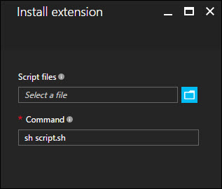

<properties
    pageTitle="适用于 Linux 的虚拟机扩展和功能 | Azure"
    description="了解可为 Azure 虚拟机提供的扩展，这些虚拟机扩展按它们提供或改进的功能进行分组。"
    services="virtual-machines-linux"
    documentationcenter=""
    author="neilpeterson"
    manager="timlt"
    editor=""
    tags="azure-service-management,azure-resource-manager" />
<tags 
    ms.assetid="52f5d0ec-8f75-49e7-9e15-88d46b420e63"
    ms.service="virtual-machines-linux"
    ms.devlang="na"
    ms.topic="article"
    ms.tgt_pltfrm="vm-linux"
    ms.workload="infrastructure-services"
    ms.date="11/17/2016"
    wacn.date="01/20/2017"
    ms.author="nepeters" />

# 适用于 Linux 的虚拟机扩展和功能

Azure 虚拟机扩展是小型应用程序，可在Azure 虚拟机上提供部署后配置和自动化任务。例如，如果虚拟机需要安装软件或进行防病毒保护，可以使用 VM 扩展来完成这些任务。可以使用 Azure CLI、PowerShell、Azure Resource Manager 模板和 Azure 门户预览运行 Azure VM 扩展。扩展可与新虚拟机部署捆绑在一起，或者针对任何现有系统运行。

本文档提供 VM 扩展的概述、使用 Azure VM 扩展的先决条件，以及有关如何检测、管理和删除 VM 扩展的指南。由于有许多 VM 扩展可用，每个扩展可能具有唯一的配置，因此本文档提供通用信息。扩展特定的详细信息可在每个特定于单个扩展的文档中找到。

## 用例和示例

有许多不同的 Azure VM 扩展可用，每个都有特定用例。下面是一些示例：

- 使用适用于 Linux 的 DSC 扩展将 PowerShell 所需状态配置应用于虚拟机。有关详细信息，请参阅 [Azure Desired State configuration extension](https://github.com/Azure/azure-linux-extensions/tree/master/DSC)（Azure Desired State Configuration 扩展）。
- 使用 Microsoft 监视代理 VM 扩展配置虚拟机监视功能。有关详细信息，请参阅 [Enable or disable VM monitoring](/documentation/articles/virtual-machines-linux-vm-monitoring/)（启用或禁用 VM 监视）。
- 使用 Datadog 扩展配置 Azure 基础结构监视功能。有关详细信息，请参阅 [Datadog 博客](https://www.datadoghq.com/blog/introducing-azure-monitoring-with-one-click-datadog-deployment/)。

除了进程特定的扩展外，自定义脚本扩展也可用于 Windows 和 Linux 虚拟机。适用于 Linux 的自定义脚本扩展允许在虚拟机上运行任何 Bash 脚本。在设计需要本机 Azure 工具无法提供的配置的 Azure 部署时，这很有用。有关详细信息，请参阅 [Linux VM Custom Script extension](/documentation/articles/virtual-machines-linux-extensions-customscript/)（Linux VM 自定义脚本扩展）。

若要浏览在端到端应用程序部署中使用 VM 扩展的示例，请参阅[将应用程序自动部署到 Azure 虚拟机](/documentation/articles/virtual-machines-linux-dotnet-core-1-landing/)。

## 先决条件

每个虚拟机扩展可能都有其自己的一组先决条件。特定于扩展的文档中详细介绍了单个扩展的要求。

### Azure VM 代理

Azure VM 代理可管理 Azure 虚拟机与 Azure 结构控制器之间的交互。VM 代理负责部署和管理 Azure 虚拟机的许多功能层面，包括运行 VM 扩展。Azure VM 代理预先安装在 Azure 应用商店映像上，并可手动安装在支持的操作系统上。

有关支持的操作系统和安装说明的信息，请参阅 [Azure 虚拟机代理](/documentation/articles/virtual-machines-linux-classic-agents-and-extensions/)。

## 发现 VM 扩展

有许多不同的 VM 扩展可与 Azure 虚拟机配合使用。若要查看完整列表，请使用 Azure CLI 运行以下命令，并将示例位置替换为所选位置。

    azure vm extension-image list chinanorth

## 运行 VM 扩展

Azure 虚拟机扩展可以在现有虚拟机上运行，当需要在已部署的 VM 上进行配置更改或恢复连接时，这很有用。VM 扩展还可以与 Azure Resource Manager 模板部署捆绑。将扩展与 Resource Manager 模板配合使用，可以部署和配置 Azure 虚拟机，而无需部署后干预。

可使用以下方法针对现有虚拟机运行扩展。

### Azure CLI

可以使用 `azure vm extension set` 命令针对现有虚拟机运行 Azure 虚拟机扩展。此示例针对虚拟机运行自定义脚本扩展。

    azure vm extension set myResourceGroup myVM CustomScript Microsoft.Azure.Extensions 2.0 \
      --auto-upgrade-minor-version \
      --public-config '{"fileUris": ["https://gist.github.com/ahmetalpbalkan/b5d4a856fe15464015ae87d5587a4439/raw/466f5c30507c990a4d5a2f5c79f901fa89a80841/hello.sh"],"commandToExecute": "./hello.sh"}'

这提供类似以下文本的输出：

    info:    Executing command vm extension set
    + Looking up the VM "myVM"
    + Installing extension "CustomScript", VM: "mvVM"
    info:    vm extension set command OK

### Azure 门户预览

可通过 Azure 门户预览将 VM 扩展应用到现有虚拟机。为此，请选择虚拟机，选择“扩展”，然后单击“添加”。这将提供可用扩展的列表。选择所需的扩展，并按照向导中的说明进行操作。

下图演示了如何从 Azure 门户预览安装 Linux 自定义脚本扩展。

  

### Azure Resource Manager 模板

VM 扩展可添加到 Azure Resource Manager 模板，并在部署模板的过程中执行。使用模板部署扩展时，可以创建完全配置的 Azure 部署。例如，以下 JSON 取自一个 Resource Manager 模板，该模板将在每个 VM 上部署一组负载均衡虚拟机和一个 Azure SQL 数据库，然后安装一个 .NET Core 应用程序。VM 扩展负责安装软件。

有关详细信息，请参阅完整的 [Resource Manager 模板](https://github.com/Microsoft/dotnet-core-sample-templates/tree/master/dotnet-core-music-linux)。

    {
        "apiVersion": "2015-06-15",
        "type": "extensions",
        "name": "config-app",
        "location": "[resourceGroup().location]",
        "dependsOn": [
        "[concat('Microsoft.Compute/virtualMachines/', concat(variables('vmName'),copyindex()))]"
        ],
        "tags": {
        "displayName": "config-app"
        },
        "properties": {
        "publisher": "Microsoft.Azure.Extensions",
        "type": "CustomScript",
        "typeHandlerVersion": "2.0",
        "autoUpgradeMinorVersion": true,
        "settings": {
            "fileUris": [
            "https://raw.githubusercontent.com/Microsoft/dotnet-core-sample-templates/master/dotnet-core-music-linux/scripts/config-music.sh"
            ]
        },
        "protectedSettings": {
            "commandToExecute": "[concat('sudo sh config-music.sh ',variables('musicStoreSqlName'), ' ', parameters('adminUsername'), ' ', parameters('sqlAdminPassword'))]"
        }
        }
    }

有关详细信息，请参阅 [Authoring Azure Resource Manager templates with Linux VM extensions](/documentation/articles/virtual-machines-linux-extensions-authoring-templates/)（使用 Linux VM 扩展创作 Azure Resource Manager 模板）。

## 保护 VM 扩展数据

运行 VM 扩展时，可能需要提供敏感信息，例如凭据、存储帐户名称和存储帐户访问密钥。许多 VM 扩展包括用于对数据进行加密，并且仅在目标虚拟机内对数据进行解密的受保护配置。每个扩展都有特定的受保护配置架构，将在特定于扩展的文档中详细介绍每个配置架构。

以下示例演示了适用于 Linux 的自定义脚本扩展的实例。请注意，要执行的命令包含一组凭据。在此示例中，不会加密要执行的命令。

    {
      "apiVersion": "2015-06-15",
      "type": "extensions",
      "name": "config-app",
      "location": "[resourceGroup().location]",
      "dependsOn": [
        "[concat('Microsoft.Compute/virtualMachines/', concat(variables('vmName'),copyindex()))]"
      ],
      "tags": {
        "displayName": "config-app"
      },
      "properties": {
        "publisher": "Microsoft.Azure.Extensions",
        "type": "CustomScript",
        "typeHandlerVersion": "2.0",
        "autoUpgradeMinorVersion": true,
        "settings": {
          "fileUris": [
            "https://raw.githubusercontent.com/Microsoft/dotnet-core-sample-templates/master/dotnet-core-music-linux/scripts/config-music.sh"
          ],
          "commandToExecute": "[concat('sudo sh config-music.sh ',variables('musicStoreSqlName'), ' ', parameters('adminUsername'), ' ', parameters('sqlAdminPassword'))]"
        }
      }
    }

将“要执行的命令”属性移到**受保护**配置可保护执行字符串。

    {
      "apiVersion": "2015-06-15",
      "type": "extensions",
      "name": "config-app",
      "location": "[resourceGroup().location]",
      "dependsOn": [
        "[concat('Microsoft.Compute/virtualMachines/', concat(variables('vmName'),copyindex()))]"
      ],
      "tags": {
        "displayName": "config-app"
      },
      "properties": {
        "publisher": "Microsoft.Azure.Extensions",
        "type": "CustomScript",
        "typeHandlerVersion": "2.0",
        "autoUpgradeMinorVersion": true,
        "settings": {
          "fileUris": [
            "https://raw.githubusercontent.com/Microsoft/dotnet-core-sample-templates/master/dotnet-core-music-linux/scripts/config-music.sh"
          ]
        },
        "protectedSettings": {
          "commandToExecute": "[concat('sudo sh config-music.sh ',variables('musicStoreSqlName'), ' ', parameters('adminUsername'), ' ', parameters('sqlAdminPassword'))]"
        }
      }
    }

## 排查 VM 扩展的问题

每个 VM 扩展都有特定于扩展的故障排除步骤。例如，使用自定义脚本扩展时，可在运行该扩展的本地虚拟机上找到脚本执行详细信息。任何特定于扩展的故障排除步骤均在特定于扩展的文档中详细说明。

以下故障排除步骤适用于所有虚拟机扩展。

### 查看扩展状态

针对虚拟机运行虚拟机扩展后，使用以下 Azure CLI 命令返回扩展状态。请将示例参数名称替换为你自己的值。

    azure vm extension get myResourceGroup myVM

输出类似于以下文本：

    info:    Executing command vm extension get
    + Looking up the VM "myVM"
    data:    Publisher                   Name             Version  State
    data:    --------------------------  ---------------  -------  ---------
    data:    Microsoft.Azure.Extensions  XXXExtension  1.0      Succeeded
    info:    vm extension get command OK         :

此外，还可以在 Azure 门户预览中找到扩展执行状态。若要查看扩展的状态，请选择虚拟机，选择“扩展”，然后选择所需的扩展。

### 重新运行 VM 扩展

在某些情况下，可能需要重新运行虚拟机扩展。可以通过删除扩展，然后使用所选执行方法重新运行扩展来执行此操作。若要删除扩展，请使用 Azure CLI 模块运行以下命令。请将示例参数名称替换为你自己的值。

    azure vm extension set myResourceGroup myVM --uninstall CustomScript Microsoft.Azure.Extensions 2.0

可以在 Azure 门户预览中执行以下步骤来删除扩展：

1. 选择虚拟机。
2. 选择“扩展”。
3. 选择所需的扩展。
4. 选择“卸载”。

## 常见 VM 扩展参考
| 扩展名称 | 说明 | 详细信息 |
| --- | --- | --- |
| 适用于 Linux 的自定义脚本扩展 |针对 Azure 虚拟机运行脚本 |[适用于 Linux 的自定义脚本扩展](/documentation/articles/virtual-machines-linux-extensions-customscript/) |
| VM 访问扩展 |重新获取对 Azure 虚拟机的访问权限 |[VM 访问扩展](https://github.com/Azure/azure-linux-extensions/tree/master/VMAccess) |
| Azure 诊断扩展 |管理 Azure 诊断 |[Azure 诊断扩展](https://azure.microsoft.com/blog/windows-azure-virtual-machine-monitoring-with-wad-extension/) |
| Azure VM 访问扩展 |管理用户和凭据 |[适用于 Linux 的 VM 访问扩展](https://azure.microsoft.com/blog/using-vmaccess-extension-to-reset-login-credentials-for-linux-vm/) |

<!---HONumber=Mooncake_0116_2017-->
<!--Update_Description: add VM Extensions Data Protection-->