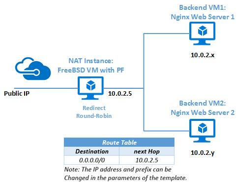

<properties
    pageTitle="使用 FreeBSD 的数据包筛选器在 Azure 中创建防火墙 | Azure"
    description="了解如何在 Azure 中使用 FreeBSD 的 PF 部署 NAT 防火墙。"
    services="virtual-machines-linux"
    documentationcenter=""
    author="KylieLiang"
    manager="timlt"
    editor=""
    tags="azure-resource-manager"
    translationtype="Human Translation" />
<tags
    ms.assetid=""
    ms.service="virtual-machines-linux"
    ms.devlang="na"
    ms.topic="article"
    ms.tgt_pltfrm="vm-linux"
    ms.workload="infrastructure-services"
    ms.date="02/20/2017"
    wacn.date="04/17/2017"
    ms.author="kyliel"
    ms.sourcegitcommit="e0e6e13098e42358a7eaf3a810930af750e724dd"
    ms.openlocfilehash="242a3bac471395ed31bf9bd85d4a2d65d6de4e5f"
    ms.lasthandoff="04/06/2017" />

# 如何使用 FreeBSD 的数据包筛选器在 Azure 中创建安全防火墙
本文介绍如何通过 Azure Resource Manager 模板使用 FreeBSD 的数据包筛选器为通用 Web 服务器方案部署 NAT 防火墙。

## 什么是 PF？
PF（数据包筛选器，也写为 pf）是 BSD 许可的有状态数据包筛选器，是用于创建防火墙的软件的中心部分。 由于 PF 的快速发展，现在相比其他可用的防火墙具有一些优势。 从一开始 PF 就包括网络地址转换 (NAT) 功能，随后通过集成 ALTQ 并可使用 PF 的配置对其进行配置，将数据包计划程序和活动队列管理功能集成到 PF。 PF 具有一些扩展功能，例如用于故障转移和冗余的 pfsync 和 CARP、用于会话身份验证的 authpf，以及用于简化使用复杂的 FTP 协议创建防火墙的 ftp-proxy 等。 简而言之，PF 是一个功能强大且丰富的防火墙。 

## 入门
如果你有兴趣在云中为你的 Web 服务器设置安全防火墙，那么让我们开始吧。 你还可以将此 Azure Resource Manager 模板中使用的脚本应用于网络拓扑的设置。
Azure Resource Manager 模板设置一个使用 PF 执行 NAT/重定向的 FreeBSD 虚拟机和两个安装并配置了 Nginx Web 服务器的 FreeBSD 虚拟机。 除了为两个 Web 服务器出口流量执行 NAT，NAT/重定向虚拟机还在轮询机制下截获 HTTP 请求并将其重定向到这两个 Web 服务器。 VNet 使用专用的不可路由 IP 地址空间 10.0.0.2/24，你可以修改模板的参数。 Azure Resource Manager 模板还为整个 VNet 定义路由表，该路由表是用于替代基于目标 IP 地址的 Azure 默认路由的各个路由的集合。 

### 通过 Azure CLI 进行部署
需要安装最新的 [Azure CLI 2.0](https://docs.microsoft.com/zh-cn/cli/azure/install-az-cli2) 并已使用 [az login](https://docs.microsoft.com/zh-cn/cli/azure/#login) 登录到 Azure 帐户。 使用 [az group create](https://docs.microsoft.com/zh-cn/cli/azure/group#create) 创建资源组。 以下示例在 `China North` 位置创建名为 `myResourceGroup` 的资源组。

[AZURE.INCLUDE [azure-cli-2-azurechinacloud-environment-parameter](../../includes/azure-cli-2-azurechinacloud-environment-parameter.md)]

    az group create --name myResourceGroup --location chinanorth

接下来，使用 [az group deployment create](https://docs.microsoft.com/zh-cn/cli/azure/group/deployment#create) 部署模板 [pf-freebsd-setup](https://github.com/Azure/azure-quickstart-templates/tree/master/pf-freebsd-setup)。 在相同路径下下载 [azuredeploy.parameters.json](https://github.com/Azure/azure-quickstart-templates/blob/master/pf-freebsd-setup/azuredeploy.parameters.json)，并定义自己的资源值，如 `adminPassword`、`networkPrefix` 和 `domainNamePrefix`。 

    az group deployment create --resource-group myResourceGroup --name myDeploymentName \
        --template-uri https://raw.githubusercontent.com/Azure/azure-quickstart-templates/master/pf-freebsd-setup/azuredeploy.json \
        --parameters '@azuredeploy.parameters.json' --verbose

大约五分钟后，你将获得 `"provisioningState": "Succeeded"` 的信息。 然后你可以使用 ssh 访问前端 VM (NAT) 或使用前端 VM (NAT) 的公共 IP 地址或 FQDN 在浏览器中访问 Nginx Web 服务器。 以下示例列出了分配给 `myResourceGroup` 资源组中前端 VM (NAT) 的 FQDN 和公共 IP 地址。 

    az network public-ip list --resource-group myResourceGroup

## 后续步骤
是否要在 Azure 中设置自己的 NAT？ 是否开源、免费，但功能强大？ 那么 PF 是一个不错的选择。 通过使用模板 [pf-freebsd-setup](https://github.com/Azure/azure-quickstart-templates/tree/master/pf-freebsd-setup)，只需要五分钟即可在 Azure 中使用 FreeBSD 的 PF 为通用 Web 服务器方案设置具有轮循机制负载均衡的 NAT 防火墙。 

如果想要了解 Azure 中的 FreeBSD 产品，请参阅 [Azure FreeBSD 简介](/documentation/articles/virtual-machines-freebsd-intro-on-azure/)。

如果想要了解有关 PF 的详细信息，请参阅 [FreeBSD 手册](https://www.freebsd.org/doc/handbook/firewalls-pf.html)或 [PF - 用户指南](https://www.freebsd.org/doc/handbook/firewalls-pf.html)。