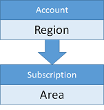
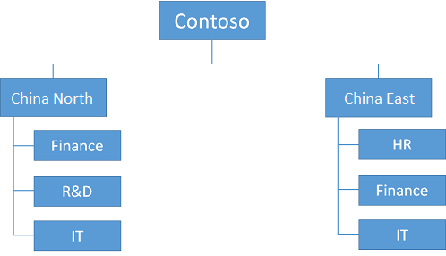

<properties
	pageTitle="订阅和帐户准则 | Azure"
	description="了解 Azure 中订阅和帐户的关键设计和实施准则。"
	documentationCenter=""
	services="virtual-machines-linux"
	authors="iainfoulds"
	manager="timlt"
	editor=""
	tags="azure-resource-manager"/>  

<tags
	ms.service="virtual-machines-linux"
	ms.workload="infrastructure-services"
	ms.tgt_pltfrm="vm-linux"
	ms.devlang="na"
	ms.topic="article"
	ms.date="09/08/2016"
	wacn.date="10/24/2016"
	ms.author="iainfou"/>  

# 订阅和帐户准则

[AZURE.INCLUDE [virtual-machines-linux-infrastructure-guidelines-intro](../../includes/virtual-machines-linux-infrastructure-guidelines-intro.md)]

本文重点了解如何随环境和用户群的增长实行订阅和帐户管理。

## 订阅和帐户的实施准则

决策：

- 需要使用哪一组订阅和帐户来托管 IT 工作负荷或基础结构？
- 如何细分层次结构以适应组织？

任务：

- 按照将从订阅级别进行管理来定义逻辑组织层次结构。
- 若要匹配此逻辑层次结构，请定义所需帐户和每个帐户下的订阅。
- 使用命名约定创建订阅和帐户集。

## 订阅和帐户

若要使用 Azure，需要一个或多个 Azure 订阅。虚拟机 (VM) 或虚拟网络等资源存在于这些订阅中。

- 企业客户通常具有企业许可登记表，该表是层次结构中的最顶层资源并与一个或多个帐户相关联。
- 对于没有企业许可登记表的使用者和客户，最顶层资源是帐户。
- 订阅关联到帐户，并且每个帐户可以有一个或多个订阅。订阅级别的 Azure 记录计费信息。

由于两个层次结构级别在帐户/订阅关系上的限制，根据计费要求调整帐户和订阅的命名约定至关重要。例如，如果一家国营公司使用 Azure，他们可以选择每个区域建立一个帐户，并在区域级别管理订阅：

  

例如，可能会使用以下结构：

  

如果某一区域决定将多个订阅关联到一个特定组，则命名约定应引入相应方法来对帐户或订阅名称的额外数据进行编码。此组织允许窜改计费数据以在计费报告期间生成新的层次结构级别：

  

该组织可以如下所示：

  

我们通过可下载的文件为企业协议中的单个帐户或所有帐户提供详细的计费信息。

## 后续步骤

[AZURE.INCLUDE [virtual-machines-linux-infrastructure-guidelines-next-steps](../../includes/virtual-machines-linux-infrastructure-guidelines-next-steps.md)]

<!---HONumber=Mooncake_1017_2016-->