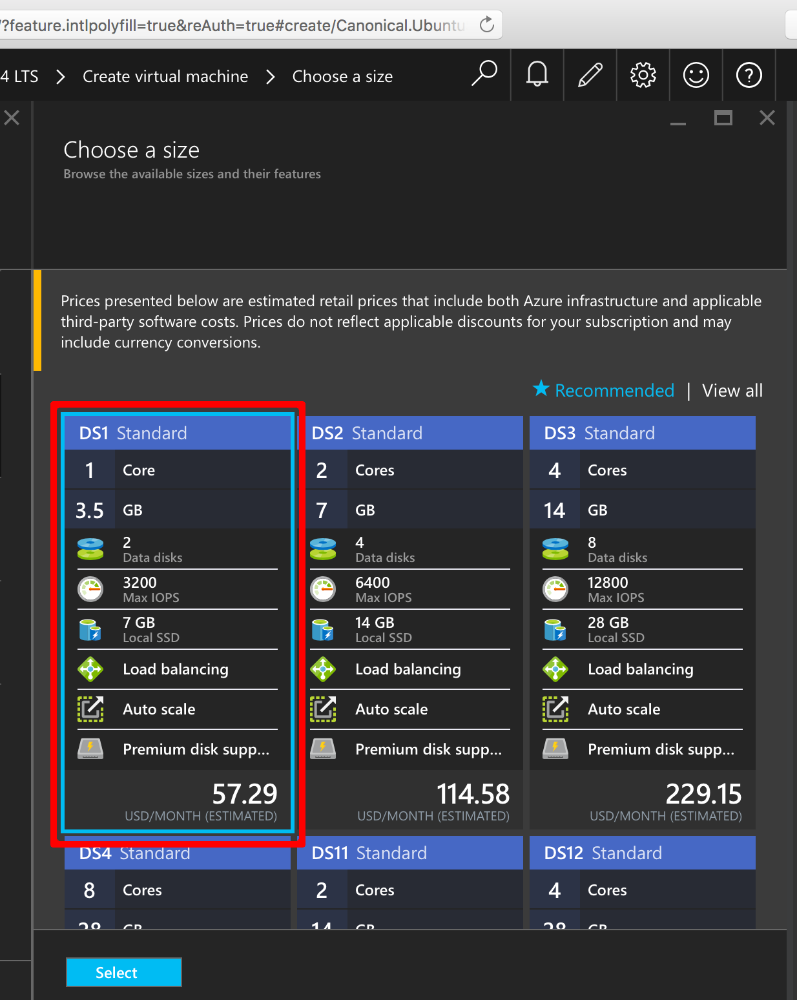
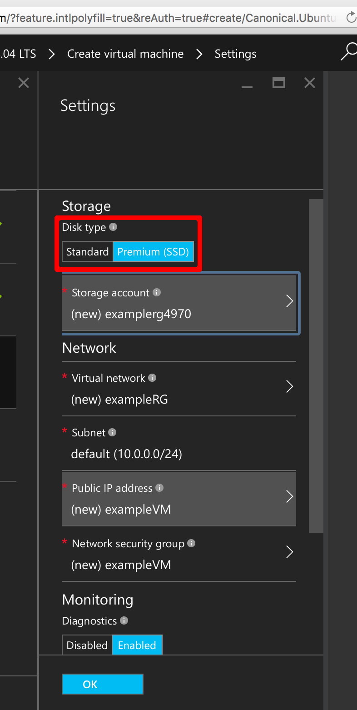
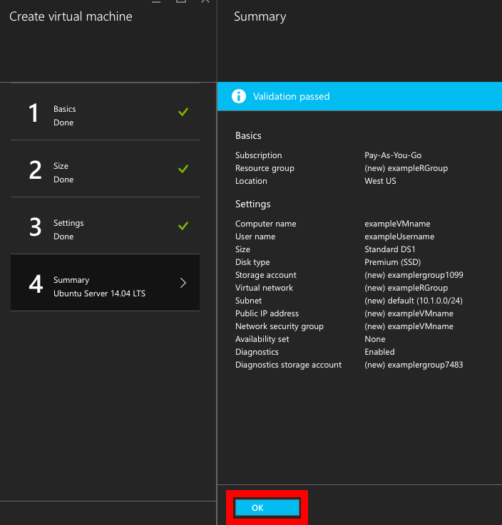
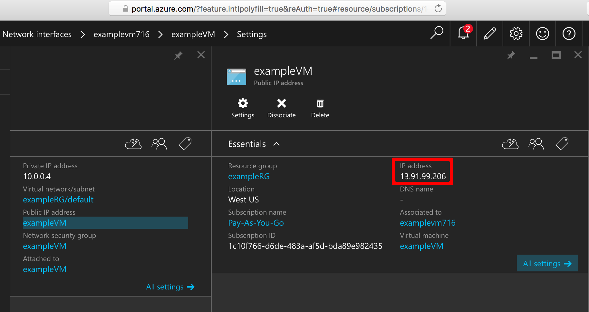

<!-- customized -->

<properties
    pageTitle="使用 Azure 门户预览创建 Linux VM | Azure"
    description="使用 Azure 门户预览创建 Linux VM。"
    services="virtual-machines-linux"
    documentationCenter=""
    authors="vlivech"
    manager="timlt"
    editor=""
    tags="azure-resource-manager"
/>

<tags
	ms.service="virtual-machines-linux"
	ms.date="04/29/2016"
	wacn.date="06/29/2016"/>

# 使用门户预览在 Azure 上创建 Linux VM

本文说明如何使用 [Azure 门户预览](https://portal.azure.cn/)快速创建 Linux 虚拟机。唯一的要求是 [Azure 帐户](/pricing/1rmb-trial/)和 [SSH 公钥与私钥文件](/documentation/articles/virtual-machines-linux-mac-create-ssh-keys/)。


1. 使用你的 Azure 帐户标识登录到 Azure 门户预览，然后单击左上角的“+ 新建”：

    

2. 在“应用商店”中单击“虚拟机”，单击“查看全部”，然后从列表中选择“CentOS-based 7.2 - OpenLogic”。确认底部显示的部署模型是 `资源管理器`，然后单击“创建”。

3. 在“基本信息”页上输入：
    - VM 的名称
    - 管理员用户的用户名
    - 设置为“SSH 公钥”的身份验证类型
    - 字符串形式的 SSH 公钥（默认情况下位于 `~/.ssh/` 目录中）
    - 资源组名称（用于创建新的部署组），或选择现有的组

    单击“确定”继续操作，然后选择 VM 大小，如下所示：

    

4. 选择“DS1”大小（将在高级 SSD 上安装 CentOS），然后单击“选择”以配置设置。

    

5. 在“设置”中，保留“存储”和“网络”的默认值，然后单击“确定”查看摘要。请注意，磁盘类型已通过选择 DS1（**S** 表示 SSD）设置为高级 SSD。

    

6. 确认新 CentOS VM 的设置，然后单击“确定”。

    

7. 打开门户预览仪表板并在“网络接口”中选择 NIC

    

8. 打开 NIC 设置下面的公共 IP 地址菜单

    

9. 使用 SSH 公钥通过 SSH 连接到公共 IP

```
ssh -i ~/.ssh/azure_id_rsa centos@13.91.99.206
```

## 后续步骤

现在，你已快速创建了一个用于测试或演示的 Linux VM。若要创建针对基础结构自定义的 Linux VM，可以遵循下列任一文章操作。

- [Create a Linux VM on Azure using Templates（使用模板在 Azure 上创建 Linux VM）](/documentation/articles/virtual-machines-linux-cli-deploy-templates/)
- [Create a SSH Secured Linux VM on Azure using Templates（使用模板在 Azure 上创建受 SSH 保护的 Linux VM）](/documentation/articles/virtual-machines-linux-create-ssh-secured-vm-from-template/)
- [Create a Linux VM using the Azure CLI（使用 Azure CLI 创建 Linux VM）](/documentation/articles/virtual-machines-linux-create-cli-complete/)

这些文章可帮助你开始构建 Azure 基础结构，并介绍多种专属和开源基础结构部署、配置与协调工具。

<!----HONumber=Mooncake_0425_2016-->