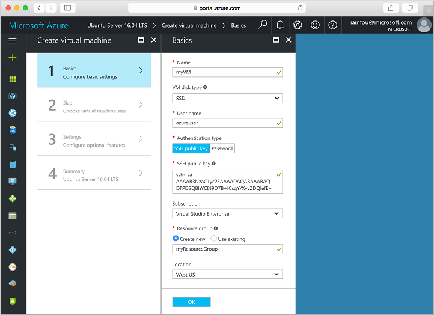
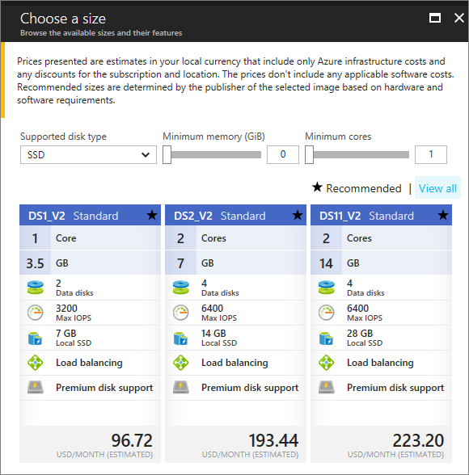

<properties
    pageTitle="Azure 快速入门 - 创建 VM 门户 | Azure"
    description="Azure 快速入门 - 创建 VM 门户"
    services="virtual-machines-linux"
    documentationcenter="virtual-machines"
    author="neilpeterson"
    manager="timlt"
    editor="tysonn"
    tags="azure-resource-manager" />
<tags
    ms.assetid=""
    ms.service="virtual-machines-linux"
    ms.devlang="na"
    ms.topic="hero-article"
    ms.tgt_pltfrm="vm-linux"
    ms.workload="infrastructure"
    ms.date="04/13/2017"
    wacn.date="05/15/2017"
    ms.author="nepeters"
    ms.translationtype="Human Translation"
    ms.sourcegitcommit="457fc748a9a2d66d7a2906b988e127b09ee11e18"
    ms.openlocfilehash="b0163dafbe864f16abde07f3a7e261151349d2db"
    ms.contentlocale="zh-cn"
    ms.lasthandoff="05/05/2017" />

# 使用 Azure 门户预览创建 Linux 虚拟机

可以通过 Azure 门户预览创建 Azure 虚拟机。 此方法提供一个基于浏览器的用户界面，用于创建和配置虚拟机和所有相关的资源。 此快速入门介绍了如何使用 Azure 门户预览创建虚拟机。

如果没有 Azure 订阅，可在开始前创建一个[试用帐户](/pricing/1rmb-trial/)。

## 创建 SSH 密钥对

需要一个 SSH 密钥对才能完成此快速入门。 如果有现成的 SSH 密钥对，则可跳过此步骤。 如果使用的是 Windows 计算机，请遵循[此处](/documentation/articles/virtual-machines-linux-ssh-from-windows/)提供的说明。 

在 Bash 外壳程序中，运行以下命令并按屏幕说明操作。 命令输出包括公钥文件的文件名。 创建虚拟机时，需要此文件的内容。

    ssh-keygen -t rsa -b 2048

## 登录到 Azure 

通过 http://portal.azure.cn 登录到 Azure 门户预览。

## 创建虚拟机

1. 单击 Azure 门户预览左上角的“新建”按钮。

2. 从“新建”边栏选项卡中选择“计算”，从“计算”边栏选项卡中选择“Ubuntu Server 16.04 LTS”，然后单击“创建”按钮。

3. 填写虚拟机“基本信息”表单。 对于“身份验证类型”，请选择“SSH”。 粘贴“SSH 公钥”时，请务必删除所有前导或尾随空格。 对于“资源组”，请创建一个新的资源组。 资源组是在其中创建并集中管理 Azure 资源的逻辑容器。 完成后，单击“确定”。

      

4. 为 VM 选择大小。 若要查看更多的大小，请选择“全部查看”或更改“支持的磁盘类型”筛选器。 

      

5. 在“设置”边栏选项卡中，为其余设置保留默认值，然后单击“确定”。

6. 在摘要页上，单击“确定”以开始虚拟机部署。

7. 若要监视部署状态，请单击虚拟机。 可以在 Azure 门户预览仪表板上或者通过从左侧菜单中选择“虚拟机”来找到该 VM。 创建 VM 后，状态将从“正在部署”更改为“正在运行”。

## 为 Web 流量打开端口 80 

默认情况下，仅允许通过 SSH 连接登录到 Azure 中部署的 Linux 虚拟机。 如果此 VM 将用作 Web 服务器，则需要为 Web 流量打开端口 80。 此步骤将介绍如何创建网络安全组 (NSG) 规则，以允许端口 80 上的入站连接。

1. 在虚拟机边栏选项卡的“基本信息”部分，单击**资源组**的名称。
2. 在资源组的边栏选项卡中，单击资源列表中的“网络安全组”。 NSG 名称应为 VM 名称后面追加“-nsg”。
3. 单击“入站安全规则”标题，打开入站规则列表。 此时列表中应会出现一条适用于 RDP 的规则。
4. 单击“+ 添加”，打开“添加入站安全规则”边栏选项卡。
5. 在“名称”中，键入 **nginx**。 请确保将“端口范围”设置为 80，将“操作”设置为“允许”。 单击 **“确定”**。

## 连接到虚拟机

完成部署后，请与虚拟机建立 SSH 连接。

1. 单击虚拟机边栏选项卡上的“连接”按钮。 单击“连接”按钮后，将显示可用于连接到虚拟机的 SSH 连接字符串。

     

2. 运行以下命令创建 SSH 会话。 将连接字符串替换为从 Azure 门户预览复制的值。

        ssh <replace with IP address>

## 安装 NGINX

使用以下 bash 脚本更新包源并安装最新的 NGINX 包。 

    #!/bin/bash

    # update package source
    apt-get -y update

    # install NGINX
    apt-get -y install nginx

## 查看 NGIX 欢迎页

NGINX 已安装，并且现在已从 Internet 打开 VM 上的端口 80 - 可以使用所选的 Web 浏览器查看默认的 NGINX 欢迎页。 请务必使用所记录的 `publicIpAddress` 访问默认页面。 

 
## 删除虚拟机

不再需要资源组、虚拟机和所有相关的资源时，可将其删除。 为此，请从虚拟机边栏选项卡中选择该资源组，然后单击“删除”。

## 后续步骤

[创建高可用性虚拟机教程](/documentation/articles/virtual-machines-linux-create-cli-complete/)

[浏览 VM 部署 CLI 示例](/documentation/articles/virtual-machines-windows-cli-samples/)