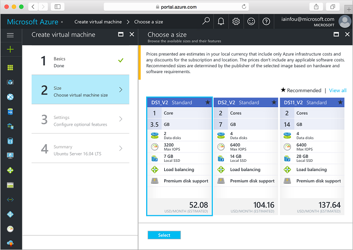

<properties
    pageTitle="Azure 快速入门 - 创建 VM 门户 | Azure"
    description="Azure 快速入门 - 创建 VM 门户"
    services="virtual-machines-linux"
    documentationcenter="virtual-machines"
    author="neilpeterson"
    manager="timlt"
    editor="tysonn"
    tags="azure-resource-manager"
    translationtype="Human Translation" />
<tags
    ms.assetid=""
    ms.service="virtual-machines-linux"
    ms.devlang="na"
    ms.topic="article"
    ms.tgt_pltfrm="vm-linux"
    ms.workload="infrastructure"
    ms.date="03/15/2017"
    wacn.date="04/24/2017"
    ms.author="nepeters"
    ms.sourcegitcommit="a114d832e9c5320e9a109c9020fcaa2f2fdd43a9"
    ms.openlocfilehash="2cf2143ffb808a6bad41886e17573b3259415e79"
    ms.lasthandoff="04/14/2017" />

# 使用 Azure 门户预览创建 Linux 虚拟机

可以通过 Azure 门户预览创建 Azure 虚拟机。 此方法提供一个基于浏览器的用户界面，用于创建和配置 VM 和所有相关的 Azure 资源。

## 创建 SSH 密钥对

需要一个 SSH 密钥对才能完成此快速入门。 如果有现成的 SSH 密钥对，则可跳过此步骤。 如果使用的是 Windows 计算机，请遵循[此处](/documentation/articles/virtual-machines-linux-ssh-from-windows/)提供的说明。 

在 Bash 外壳程序中，运行以下命令并按屏幕说明操作。 命令输出包括公钥文件的文件名。 创建虚拟机时，需要此文件的内容。

    ssh-keygen -t rsa -b 2048

## 登录到 Azure 

通过 http://portal.azure.cn 登录到 Azure 门户预览。

## 创建虚拟机

1. 单击 Azure 门户预览左上角的“新建”按钮。

2. 从“新建”边栏选项卡中选择“计算”，从“计算”边栏选项卡中选择“Ubuntu Server 16.04 LTS”，然后单击“创建”按钮。

3. 填写虚拟机“基本信息”表单。 对于“身份验证类型”，请选择“SSH”。 粘贴“SSH 公钥”时，请务必删除所有前导或尾随空格。 对于“资源组”，请创建一个新的资源组。 资源组是在其中创建并集中管理 Azure 资源的逻辑容器。 完成后，单击“确定”。

      

4. 选择 VM 的大小，然后单击“选择”。 

    

5. 在“设置”边栏选项卡中，为其余设置保留默认值，然后单击“确定”。

6. 在摘要页上，单击“确定”以开始虚拟机部署。

7. 若要监视部署状态，请单击虚拟机。 可以在 Azure 门户预览仪表板上或者通过从左侧菜单中选择“虚拟机”来找到该 VM。 创建 VM 后，状态将从“正在部署”更改为“正在运行”。

## 连接到虚拟机

完成部署后，请与虚拟机建立 SSH 连接。

1. 单击该虚拟机。 可以在 Azure 门户预览的主屏幕上或者通过从左侧菜单中选择“虚拟机”来找到该 VM。

2. 单击“连接”按钮。 单击“连接”按钮后，将显示可用于连接到虚拟机的 SSH 连接字符串。

     

3. 运行以下命令创建 SSH 会话。 将连接字符串替换为从 Azure 门户预览复制的值。

        ssh <replace with IP address>

## 删除虚拟机

不再需要资源组、虚拟机和所有相关的资源时，可将其删除。 为此，请从虚拟机边栏选项卡中选择该资源组，然后单击“删除”。

## 后续步骤

[创建高可用性虚拟机教程](/documentation/articles/virtual-machines-linux-create-cli-complete/)

[浏览 VM 部署 CLI 示例](/documentation/articles/virtual-machines-linux-cli-samples/)
<!--Update_Description: wording update-->