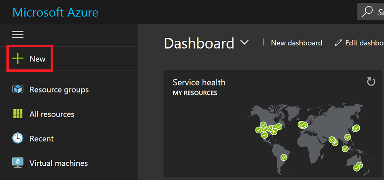
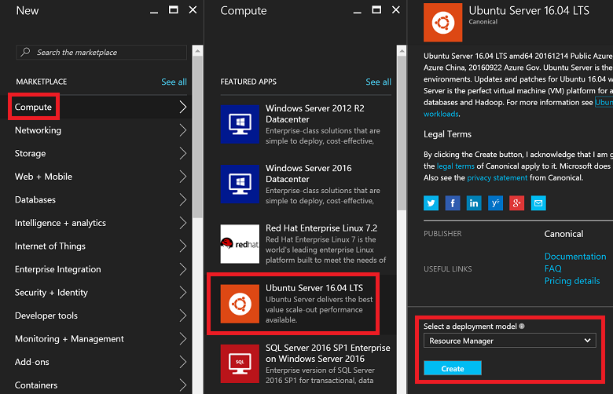
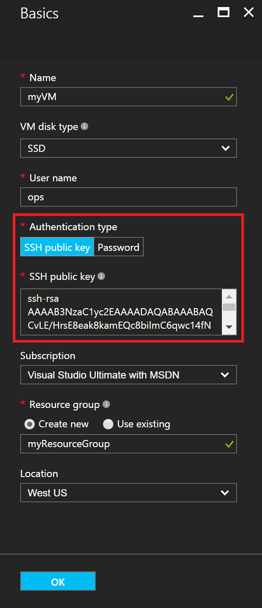
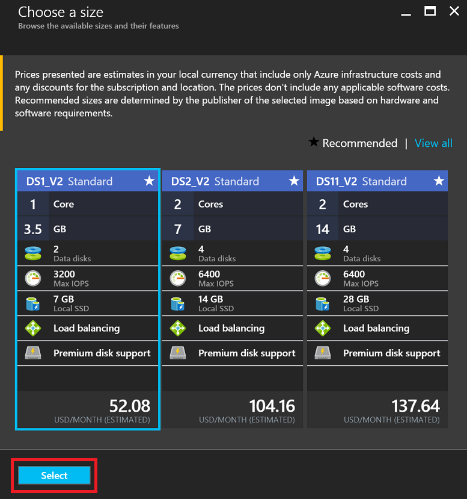
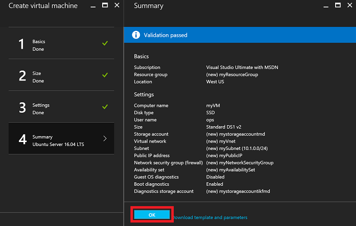
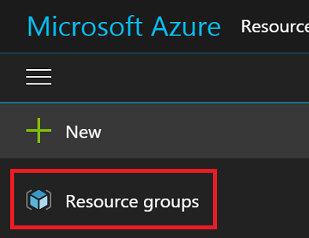
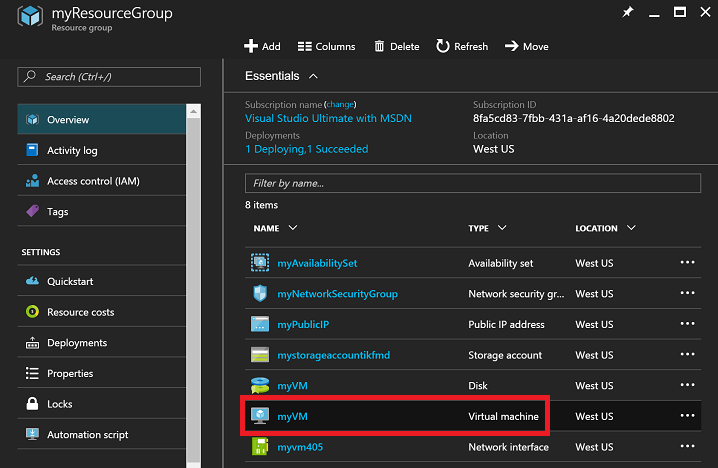
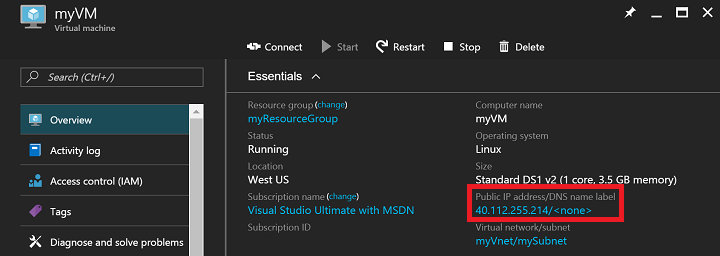

<properties
    pageTitle="使用 Azure 门户预览创建 Linux VM | Azure"
    description="使用 Azure 门户预览创建 Linux VM。"
    services="virtual-machines-linux"
    documentationcenter=""
    author="iainfoulds"
    manager="timlt"
    editor=""
    tags="azure-resource-manager" />
<tags
    ms.assetid="cc5dc395-dc54-4402-8804-2bb15aba8ea2"
    ms.service="virtual-machines-linux"
    ms.workload="infrastructure-services"
    ms.tgt_pltfrm="vm-linux"
    ms.devlang="na"
    ms.topic="hero-article"
    ms.date="1/17/2016"
    wacn.date="03/20/2017"
    ms.author="iainfou" />  

# 使用门户在 Azure 上创建 Linux VM
本文介绍如何使用 [Azure 门户预览](https://portal.azure.cn/)创建 Linux 虚拟机。

要求包括：

* [一个 Azure 帐户](/pricing/1rmb-trial/)
* [SSH 公钥和私钥文件](/documentation/articles/virtual-machines-linux-mac-create-ssh-keys/)

## 登录
使用 Azure 帐户标识登录到 Azure 门户预览。单击左上角的“+ 新建”：

  

## 选择 VM
在“应用商店”中单击“计算机”，然后从“特别推荐的应用”映像列表中选择“Ubuntu Server 16.04 LTS”。确认底部显示的部署模型是 `Resource Manager`，然后单击“创建”。

  

## 输入 VM 选项
在“基本信息”页上输入：

* VM 的名称
* VM 磁盘类型（SSD（默认）或 HDD）
* 管理员用户的用户名
* 将“身份验证类型”设置为“SSH 公钥”的
* 字符串形式的 SSH 公钥（位于 `~/.ssh/` 目录中）
* 指定一个资源组名称，或选择现有的资源组，

然后单击“确定”继续。边栏选项卡应如以下屏幕截图所示：

  

## 选择 VM 大小
选择 VM 大小。以下示例选择 **DS1\_V2 Standard**，在高级 SSD 上安装 Ubuntu。VM 大小中的 **S** 表示 SSD 支持。单击“选择”对设置进行配置。

  

## 存储和网络
在“设置”中，保留“存储和网络”值的默认设置，然后单击“确定”查看摘要。请注意，已通过选择 DS1（**S** 表示 SSD）将磁盘类型设置为高级 SSD。

  

## 确认 VM 设置并启动
确认新 Ubuntu VM 的设置，然后单击“确定”。

  

## 选择 VM 资源
打开门户主页，从左上角的菜单中选择“资源组”。根据需要单击菜单顶部的三个条，将列表展开如下：

  

选择资源组，然后单击新 VM：

  

## 查找公共 IP
查看分配给 VM 的**公共 IP 地址**：

  

## 通过 SSH 连接到 VM
使用 SSH 公钥通过 SSH 连接到公共 IP。在 Mac 或 Linux 工作站上，可以直接从终端进行 SSH 连接。如果在 Windows 工作站上操作，需要使用 PuTTY、MobaXTerm 或 Cygwin 通过 SSH 连接到 Linux。如果尚未在 Windows 工作站上准备好这些工具，请参阅以下文档通过 SSH 连接到 Linux。

[如何在 Azure 上的 Windows 中使用 SSH 密钥](/documentation/articles/virtual-machines-linux-ssh-from-windows/)

    ssh -i ~/.ssh/azure_id_rsa ops@40.112.255.214

## 后续步骤
现在，已快速创建了用于测试或演示的 Linux VM。若要根据基础结构创建自定义的 Linux VM，可根据下列任一文章所述执行操作。

* [Create a Linux VM on Azure using Templates（使用模板在 Azure 上创建 Linux VM）](/documentation/articles/virtual-machines-linux-cli-deploy-templates/)
* [使用模板在 Azure 上创建受 SSH 保护的 Linux VM](/documentation/articles/virtual-machines-linux-create-ssh-secured-vm-from-template/)
* [Create a Linux VM using the Azure CLI（使用 Azure CLI 创建 Linux VM）](/documentation/articles/virtual-machines-linux-create-cli-complete/)

<!---HONumber=Mooncake_0313_2017-->
<!--Update_Description: wording update-->