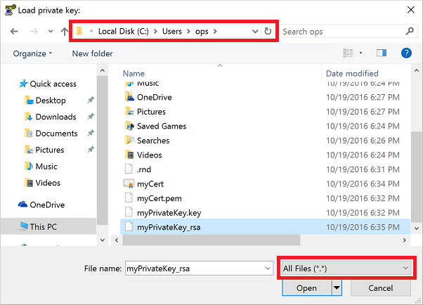
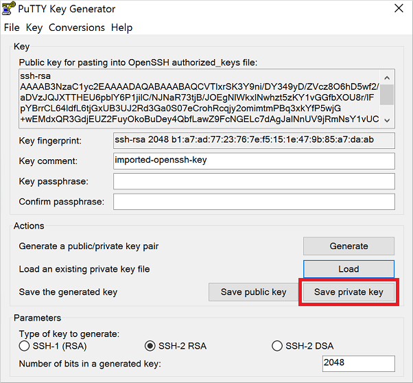

<!-- need to be verified -->

<properties
    pageTitle="在 Windows 中对 Linux VM 使用 SSH 密钥 | Azure"
    description="了解如何在 Windows 计算机上生成和使用 SSH 密钥连接到 Azure 上的 Linux 虚拟机。"
    services="virtual-machines-linux"
    documentationcenter=""
    author="squillace"
    manager="timlt"
    editor=""
    tags="azure-service-management,azure-resource-manager" />
<tags 
    ms.assetid="2cacda3b-7949-4036-bd5d-837e8b09a9c8"
    ms.service="virtual-machines-linux"
    ms.workload="infrastructure-services"
    ms.tgt_pltfrm="vm-linux"
    ms.devlang="na"
    ms.topic="article"
    ms.date="10/18/2016"
    wacn.date=""
    ms.author="rasquill" />

# 如何在 Azure 上的 Windows 中使用 SSH 密钥
> [AZURE.SELECTOR]
- [Windows](/documentation/articles/virtual-machines-linux-ssh-from-windows/)
- [Linux/Mac](/documentation/articles/virtual-machines-linux-mac-create-ssh-keys/)

连接到 Azure 中的 Linux 虚拟机 (VM) 时，应该使用[公钥加密](https://wikipedia.org/wiki/Public-key_cryptography)以更安全的方式登录到 Linux VM。此过程涉及到通过使用安全外壳 (SSH) 命令（而不是用户名和密码）进行公钥和私钥交换来验证自己的身份。密码容易受到暴力破解攻击，尤其是在面向 Internet 的 VM 上（如 Web 服务器）。本文提供 SSH 密钥的概述，以及如何在 Windows 计算机上生成适当的密钥。

## SSH 和密钥的概述
可以使用公钥和私钥安全登录到 Linux VM：

* **公钥**放置在 Linux VM中，或者要对其使用公钥加密的其他任何服务中。
* 登录时，需要向 Linux VM 提供**私钥**来验证自己的身份。请保护好私钥，不要透露给其他人。

可以在多个 VM 和服务中使用这些公钥与私钥。不需要针对想要访问的每个 VM 或服务提供一对密钥。有关更详细的概述，请参阅[公钥加密](https://wikipedia.org/wiki/Public-key_cryptography)。

SSH 是一种加密的连接协议，可用于通过不安全的连接进行安全登录。它是适用于 Azure 中托管的 Linux VM 的默认连接协议。尽管 SSH 本身提供加密的连接，但如果结合使用密码和 SSH 连接，VM 仍然容易受到暴力破解攻击，或者密码被猜出。使用 SSH 连接到 VM 时，更安全、更合理的方法是使用这些公钥和私钥，也称为 SSH 密钥。

如果不想要使用 SSH 密钥，仍可使用密码登录到 Linux VM。如果 VM 未向 Internet 公开，使用密码可能已足够。但是，仍然需要管理每个 Linux VM 的密码，维护并定期更新健全的密码策略和实践（例如最小密码长度）。使用 SSH 密钥可以简化多个 VM 中的凭据的管理。

## Windows 包和 SSH 客户端
可以使用 **ssh** 客户端连接和管理 Azure 中的 Linux VM。Windows 计算机上通常未安装 **ssh** 客户端。以下包中包含了可安装的常用 Windows SSH 客户端：

* [Git For Windows](https://git-for-windows.github.io/)
* [puTTY](http://www.chiark.greenend.org.uk/~sgtatham/putty/)
* [MobaXterm](http://mobaxterm.mobatek.net/)
* [Cygwin](https://cygwin.com/)

> [AZURE.NOTE]
最新的 Windows 10 Anniversary Update 包含 Bash for Windows。使用此功能可以运行适用于 Linux 的 Windows 子系统，以及访问 SSH 客户端等实用程序。Bash for Windows 仍在开发中，目前被视为一个 beta 版本。有关 Bash for Windows 的详细信息，请参阅 [Bash on Ubuntu on Windows](https://msdn.microsoft.com/commandline/wsl/about)（Windows 上的 Ubuntu Bash）。
> 
> 

## 你需要创建哪些密钥文件？
Azure 需要至少 2048 位采用 **ssh-rsa** 格式的公钥和私钥。如果使用经典部署模型管理 Azure 资源，则还需要生成一个 PEM（`.pem` 文件）。

以下是部署方案，以及你在每个方案中使用的文件类型：

1. 使用 [Azure 门户预览](https://portal.azure.cn)的所有部署以及使用 [Azure CLI](/documentation/articles/xplat-cli-install/) 的 Resource Manager 部署都需要 **ssh-rsa** 密钥。
   * 几乎所有部署人员都需要这些密钥。
2. 使用[经典管理门户](https://manage.windowsazure.cn)创建 VM 时，需要用到 `.pem` 文件。使用 [Azure CLI](/documentation/articles/xplat-cli-install/) 的经典部署也支持这些密钥。
   * 仅当你要管理使用经典部署模型创建的资源时，才需要创建这些附加密钥和证书。

## 安装 Git For Windows
上一部分列出了包含适用于 Windows 的 `openssl` 工具的多个包。需要使用此工具来创建公钥和私钥。以下示例详细说明了如何安装和使用 **Git for Windows**，不过，你可以选择自己偏好的任何包。借助 **Git for Windows**，可以访问使用 Linux VM 时可能会带来帮助的其他一些开源软件 ([OSS](https://en.wikipedia.org/wiki/Open-source_software)) 工具和实用程序。

1. 从以下位置下载并安装 **Git for Windows**：[https://git-for-windows.github.io/](https://git-for-windows.github.io/)。
2. 在安装过程中请接受默认选项，除非确实需要更改这些选项。
3. 通过“开始”菜单 >“Git”>“Git Bash”运行 **Git Bash**。控制台类似于以下示例：
   
      

## 创建私钥
1. 在“Git Bash”窗口中，使用 `openssl.exe` 创建私钥。以下示例创建名为 `myPrivateKey` 的密钥，以及名为 `myCert.pem` 的证书：

        openssl.exe req -x509 -nodes -days 365 -newkey rsa:2048 \
            -keyout myPrivateKey.key -out myCert.pem

    输出内容类似于下面的示例：

        Generating a 2048 bit RSA private key
        .......................................+++
        .......................+++
        writing new private key to 'myPrivateKey.key'
        -----
        You are about to be asked to enter information that will be incorporated
        into your certificate request.
        What you are about to enter is what is called a Distinguished Name or a DN.
        There are quite a few fields but you can leave some blank
        For some fields there will be a default value,
        If you enter '.', the field will be left blank.
        -----
        Country Name (2 letter code) [AU]:

2. 回答有关国家/地区名称、位置、组织名称等的提示问题。
3. 新私钥和证书将在当前工作目录中创建。为了遵循安全最佳实践，应该对私钥设置权限，以便只有你才能访问它：

        chmod 0600 myPrivateKey.key

4. [下一部分](#create-a-private-key-for-putty)详细说明了如何通过 PuTTYgen 来查看和使用公钥，以及专门创建一个私钥用于在 PuTTY 中通过 SSH 连接到 Linux VM。以下命令生成名为 `myPublicKey.key` 的、可立即使用的公钥文件：

        openssl.exe rsa -pubout -in myPrivateKey.key -out myPublicKey.key

5. 如果还需要管理经典资源，请将 `myCert.pem` 转换为 `myCert.cer`（DER 编码的 X509 证书）。仅当需要专门管理旧的经典资源时，才执行这个可选步骤。
   
    使用以下命令转换证书：

        openssl.exe  x509 -outform der -in myCert.pem -out myCert.cer

##  为 PuTTY 创建私钥
PuTTY 是适用于 Windows 的常用 SSH 客户端。不过，你可以根据需要使用任意 SSH 客户端。若要使用 PuTTY，需要创建一种附加密钥类型 - PuTTY 私钥 (PPK)。如果不想要使用 PuTTY，请跳过本部分。

以下示例将创建这个附加私钥，专门供 PuTTY 使用：

1. 使用 **Git Bash** 将私钥转换为 PuTTYgen 可以识别的 RSA 私钥。以下示例基于名为 `myPrivateKey` 的现有密钥创建名为 `myPrivateKey_rsa` 的密钥：

        openssl rsa -in ./myPrivateKey.key -out myPrivateKey_rsa

    为了遵循安全最佳实践，应该对私钥设置权限，以便只有你才能访问它：

        chmod 0600 myPrivateKey_rsa

2. 从以下位置下载并运行 PuTTYgen：[http://www.chiark.greenend.org.uk/~sgtatham/putty/download.html](http://www.chiark.greenend.org.uk/~sgtatham/putty/download.html)
3. 单击菜单：“文件”>“加载私钥”
4. 找到你的私钥（在前面的示例中为 `myPrivateKey_rsa`）。启动 **Git Bash** 时的默认目录为 `C:\Users\%username%`。更改文件筛选器以显示“所有文件 (*.*)”：
   
      

5. 单击“打开”。此时将显示一条提示，指出已成功导入密钥：
   
      

6. 单击“确定”关闭提示。
7. 公钥将显示在“PuTTYgen”窗口的顶部。创建 Linux VM 时，请复制此公钥并将其粘贴到 Azure 门户或 Azure Resource Manager 模板中。也可以单击“保存公钥”将一个副本保存到计算机：
   
      

   
    以下示例演示在创建 Linux VM 时，如何复制此公钥并将其粘贴到 Azure 门户中。然后，公钥通常存储在新 VM 上的 `~/.ssh/authorized_keys` 中。
   
      

8. 返回到“PuTTYgen”，单击“保存私钥”：
   
      

   
   > [AZURE.WARNING]
   此时将显示一条提示，询问你是否想要继续，且不输入密钥的通行短语。通行短语类似于附加到私钥的密码。即使有人获取了你的私钥，但如果单纯使用该密钥，他们也无法进行身份验证，必须获得通行短语才行。如果有人获取了你的私钥但没有通行短语，他们可以登录到使用该密钥的任何 VM 或服务。我们建议创建一个通行短语。但是，如果你忘记了通行短语，将没有办法恢复它。
   > 
   > 
   
    如果要输入密码，请单击“否”，在主 PuTTYgen 窗口中输入密码，然后再次单击“保存私钥”。否则，请单击“是”继续而不提供可选密码。
9. 输入名称和位置，保存 PPK 文件。

## 使用 Putty 通过 SSH 连接到 Linux 计算机
如前所述，PuTTY 是适用于 Windows 的常用 SSH 客户端。不过，你可以根据需要使用任意 SSH 客户端。以下步骤详细说明如何使用私钥通过 SSH 在 Azure VM 上进行身份验证。这些步骤与在其他 SSH 密钥客户端中执行的步骤类似，都无需加载私钥来对 SSH 连接进行身份验证。

1. 从以下位置下载并运行 putty：[http://www.chiark.greenend.org.uk/~sgtatham/putty/download.html](http://www.chiark.greenend.org.uk/~sgtatham/putty/download.html)
2. 填写从 Azure 门户预览获取的 VM 主机名或 IP 地址：
   
      

3. 在选择“打开”之前，请单击“连接”>“SSH”>“身份验证”选项卡。浏览到你的私钥并将其选中：
   
      

4. 单击“打开”以连接到你的虚拟机

## 后续步骤
也可以[使用 OS X 和 Linux](/documentation/articles/virtual-machines-linux-mac-create-ssh-keys/) 生成公钥与私钥。

有关 Bash for Windows 的详细信息以及在 Windows 计算机上提前准备好 OSS 工具的好处，请参阅 [Bash on Ubuntu on Windows](https://msdn.microsoft.com/commandline/wsl/about)（Windows 上的 Ubuntu Bash）。

如果使用 SSH 连接到 Linux VM 时遇到问题，请参阅 [Troubleshoot SSH connections to an Azure Linux VM](/documentation/articles/virtual-machines-linux-troubleshoot-ssh-connection/)（排查 Azure Linux VM 的 SSH 连接问题）。

<!---HONumber=Mooncake_1212_2016-->