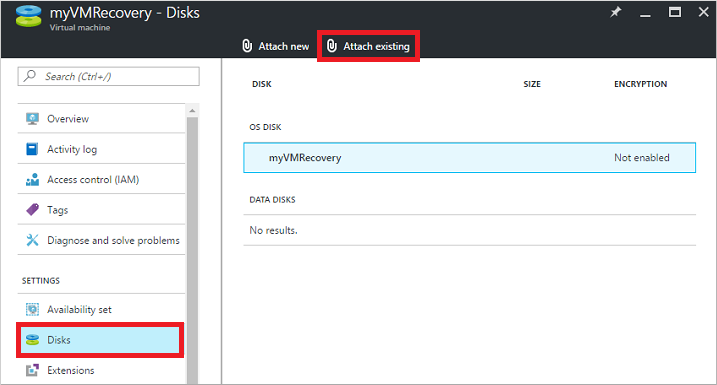
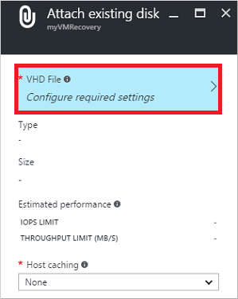

<!-- need to be verified -->

<properties
    pageTitle="在门户中使用 Linux 故障排除 VM | Azure"
    description="了解如何通过使用 Azure 门户预览将 OS 磁盘连接到恢复 VM 来排查 Linux 虚拟机问题"
    services="virtual-machines-linux"
    documentationCenter=""
    authors="iainfoulds"
    manager="timlt"
    editor="" />
<tags 
    ms.service="virtual-machines-linux"
    ms.devlang="na"
    ms.topic="article"
    ms.tgt_pltfrm="vm-linux"
    ms.workload="infrastructure"
    ms.date="11/14/2016"
    wacn.date="12/20/2016"
    ms.author="iainfou" />

# 通过使用 Azure 门户预览将 OS 磁盘附加到恢复 VM 来对 Linux VM 进行故障排除
如果 Linux 虚拟机 (VM) 遇到启动或磁盘错误，可能需要对虚拟硬盘本身执行故障排除步骤。一个常见示例是 `/etc/fstab` 中存在无效条目，使 VM 无法成功启动。本文详细介绍如何使用 Azure 门户预览将虚拟硬盘连接到另一个 Linux VM 来修复所有错误，然后重新创建原始 VM。

## 恢复过程概述
故障排除过程如下：

1. 删除遇到问题的 VM，保留虚拟硬盘。
2. 将虚拟硬盘附加并装入到另一个 Linux VM，以便进行故障排除。
3. 连接到故障排除 VM。编辑文件或运行任何工具以修复原始虚拟硬盘上的问题。
4. 从故障排除 VM 卸载并分离虚拟硬盘。
5. 使用原始虚拟硬盘创建 VM。

## 确定启动问题
检查启动诊断信息和 VM 屏幕截图，确定 VM 不能正常启动的原因。一个常见的例子是 `/etc/fstab` 中存在无效条目，或底层虚拟硬盘已删除或移动。

在门户中选择你的 VM，然后向下滚动到“支持 + 故障排除”部分。单击“启动诊断”，查看从 VM 流式传输的控制台消息。检查控制台日志，看看是否能够判断出 VM 遇到问题的原因。以下示例显示某个 VM 停滞在维护模式，需要人工干预：

  

也可以单击启动诊断日志顶部的“屏幕截图”，下载 VM 的屏幕截图。

## 查看现有虚拟硬盘的详细信息
在将虚拟硬盘附加到另一个 VM 之前，需要标识虚拟硬盘 (VHD) 的名称。

在门户中选择资源组，然后选择存储帐户。单击“Blob”，如以下示例中所示：

  

通常，虚拟硬盘存储在一个名为 **vhds** 的容器中。请选择该容器查看虚拟硬盘的列表。记下 VHD 的名称（前缀通常是你的 VM 的名称）：

  

从列表中选择现有的虚拟硬盘，并复制 URL 供后续步骤使用：

  

## 删除现有 VM
虚拟硬盘和 VM 在 Azure 中是两个不同的资源。虚拟硬盘是操作系统本身，存储应用程序和配置。VM 本身只是定义大小或位置的元数据，引用虚拟硬盘或虚拟网络接口卡 (NIC) 等资源。每个虚拟硬盘在附加到 VM 时分配有一个租约。尽管 VM 正在运行时也可以附加和分离数据磁盘，但是，若要分离 OS 磁盘，则必须删除 VM 资源。即使 VM 处于停止和解除分配状态，租约也继续将 OS 磁盘与 VM 相关联。

恢复 VM 的第一步是删除 VM 资源本身。删除 VM 时会将虚拟硬盘留在存储帐户中。删除 VM 后，可将虚拟硬盘附加到另一个 VM，以排查和解决这些错误。

在门户中选择你的 VM，然后单击“删除”：

  

等到 VM 完成删除，然后将虚拟硬盘附加到另一个 VM。虚拟硬盘上将其与 VM 关联的租约需要释放，然后才能将虚拟硬盘附加到另一个 VM。

## 将现有虚拟硬盘附加到另一个 VM
在后续几个步骤中，将使用另一个 VM 进行故障排除。将现有虚拟硬盘附加到此故障排除 VM，以便浏览和编辑磁盘的内容。例如，此过程允许用户更正任何配置错误或者查看其他应用程序或系统日志文件。选择或创建另一个 VM 用于故障排除。

1. 在门户中选择资源组，然后选择故障排除 VM。选择“磁盘”，然后单击“附加现有磁盘”：

      

2. 若要选择现有的虚拟硬盘，请单击“VHD 文件”：

      

3. 选择存储帐户和容器，然后单击现有的 VHD。单击“选择”按钮确认所做的选择：

      

4. 选择 VHD 后，请单击“确定”附加现有虚拟硬盘：

      

5. 几秒钟后，VM 的“磁盘”窗格将列出作为数据磁盘连接的现有虚拟硬盘：

      

## 装载附加的数据磁盘

1. 使用相应的凭据通过 SSH 连接到故障排除 VM。如果此磁盘是附加到故障排除 VM 的第一个数据磁盘，则它可能已连接到 `/dev/sdc`。使用 `dmseg` 列出附加的磁盘：

        dmesg | grep SCSI

    输出类似于以下示例：

        [    0.294784] SCSI subsystem initialized
        [    0.573458] Block layer SCSI generic (bsg) driver version 0.4 loaded (major 252)
        [    7.110271] sd 2:0:0:0: [sda] Attached SCSI disk
        [    8.079653] sd 3:0:1:0: [sdb] Attached SCSI disk
        [ 1828.162306] sd 5:0:0:0: [sdc] Attached SCSI disk

    在前面的示例中，OS 磁盘位于 `/dev/sda`，为每个 VM 提供的临时磁盘位于 `/dev/sdb`。如果有多个数据磁盘，它们应位于 `/dev/sdd`、`/dev/sde`，依次类推。

2. 创建一个目录来装载现有的虚拟硬盘。以下示例创建一个名为 `troubleshootingdisk` 的目录：

        sudo mkdir /mnt/troubleshootingdisk

3. 如果现有的虚拟硬盘上有多个分区，则装载所需的分区。以下示例在 `/dev/sdc1` 中装载第一个主分区：

        sudo mount /dev/sdc1 /mnt/troubleshootingdisk

    > [AZURE.NOTE]
    最佳做法是使用虚拟硬盘的全局唯一标识符 (UUID) 装载 Azure 中 VM 上的数据磁盘。对于此简短的故障排除方案，不必要使用 UUID 装载虚拟硬盘。但是，在正常使用时，编辑 `/etc/fstab` 以使用设备名称（而不是 UUID）装载虚拟硬盘可能会导致 VM 无法启动。

## 修复原始虚拟硬盘上的问题
装载现有虚拟硬盘后，可以根据需要执行任何维护和故障排除步骤。解决问题后，请继续执行以下步骤。

## 卸载并分离原始虚拟硬盘
解决错误后，可从故障排除 VM 中分离现有虚拟硬盘。在将虚拟硬盘附加到故障排除 VM 的租约释放前，不能将该虚拟硬盘用于任何其他 VM。

1. 通过 SSH 会话登录到故障排除 VM 中，卸载现有的虚拟硬盘。首先更改出装入点的父目录：

        cd /

    现在卸载现有的虚拟硬盘。以下示例卸载 `/dev/sdc1` 中的设备：

        sudo umount /dev/sdc1

2. 现在从 VM 中分离虚拟硬盘。在门户中选择你的 VM，然后单击“磁盘”。选择现有的虚拟硬盘，然后单击“分离”：

      

    等到 VM 成功分离数据磁盘，然后继续操作。

## 从原始硬盘创建 VM
若要从原始虚拟硬盘创建 VM，请使用[此 Azure Resource Manager 模板](https://github.com/Azure/azure-quickstart-templates/tree/master/201-vm-specialized-vhd-existing-vnet)。该模板使用前面命令中的 VHD URL 将 VM 部署到现有虚拟网络。单击“部署到 Azure”按钮，如下所示：

模板已载入 Azure 门户预览进行部署。请输入新 VM 和现有 Azure 资源的名称，然后粘贴现有虚拟硬盘的 URL。若要开始部署，请单击“购买”：

  

## 重新启用启动诊断
从现有虚拟硬盘创建 VM 时，启动诊断可能不会自动启用。若要检查启动诊断的状态并根据需要打开启动诊断，请在门户中选择你的 VM。在“监视”下面，单击“诊断设置”。确保状态为“打开”，并检查“启动诊断”旁边的复选标记是否为选中状态。如果做了任何更改，请单击“保存”：

  

## 后续步骤
如果在连接到 VM 时遇到问题，请参阅 [Troubleshoot SSH connections to an Azure VM](/documentation/articles/virtual-machines-linux-troubleshoot-ssh-connection/)（排查 Azure VM 的 SSH 连接问题）。如果在访问 VM 上运行的应用时遇到问题，请参阅 [Troubleshoot application connectivity issues on a Linux VM](/documentation/articles/virtual-machines-linux-troubleshoot-app-connection/)（排查 Linux VM 上的应用程序连接问题）。

有关资源组的详细信息，请参阅 [Azure Resource Manager 概述](/documentation/articles/resource-group-overview/)。

<!---HONumber=Mooncake_1212_2016-->