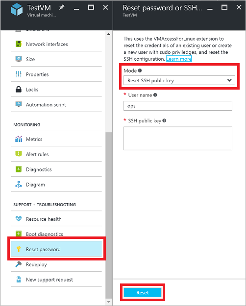
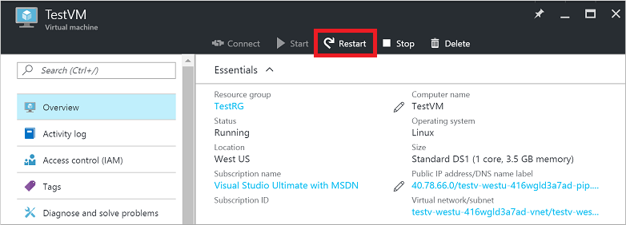

<properties
    pageTitle="排查到 Azure VM 的 SSH 连接问题 | Azure"
    description="如何排查运行 Linux 的 Azure VM 上发生的“SSH 连接失败”或“SSH 连接被拒绝”等问题。"
    keywords="ssh 连接被拒绝, ssh 错误, azure ssh, SSH 连接失败"
    services="virtual-machines-linux"
    documentationcenter=""
    author="iainfoulds"
    manager="timlt"
    editor=""
    tags="top-support-issue,azure-service-management,azure-resource-manager"
    translationtype="Human Translation" />
<tags
    ms.assetid="dcb82e19-29b2-47bb-99f2-900d4cfb5bbb"
    ms.service="virtual-machines-linux"
    ms.workload="infrastructure-services"
    ms.tgt_pltfrm="vm-linux"
    ms.devlang="na"
    ms.topic="article"
    ms.date="12/21/2016"
    wacn.date="04/24/2017"
    ms.author="iainfou"
    ms.sourcegitcommit="a114d832e9c5320e9a109c9020fcaa2f2fdd43a9"
    ms.openlocfilehash="f361a9fbccb5c425a0edd7effd420c7a80f292b0"
    ms.lasthandoff="04/14/2017" />

# 针对通过 SSH 连接到 Azure Linux VM 时发生的失败、错误或被拒绝问题进行故障排除
尝试连接到 Linux 虚拟机 (VM) 时，有多种原因可能会导致安全外壳 (SSH) 错误、SSH 连接失败或被拒绝。 本文将帮助用户找出原因并更正问题。 可以使用 Azure 门户预览、Azure CLI 或适用于 Linux 的 VM 访问扩展来排查和解决连接问题。

[AZURE.INCLUDE [learn-about-deployment-models](../../includes/learn-about-deployment-models-both-include.md)]

如果你对本文中的任何观点存在疑问，可以联系 [MSDN Azure 和 CSDN Azure](/support/forums/)上的 Azure 专家。 或者，也可以提交 Azure 支持事件。 请转到 [Azure 支持站点](/support/contact/)并选择“获取支持”。 有关使用 Azure 支持的信息，请阅读 [Azure 支持常见问题](/support/faq/)。

## 快速故障排除步骤
执行每个故障排除步骤后，请尝试重新连接到 VM。

1. 重置 SSH 配置。
2. 重置用户的凭据。
3. 确认[网络安全组](/documentation/articles/virtual-networks-nsg/)规则是否允许 SSH 流量。
    * 确保有一条网络安全组规则允许 SSH 流量（默认为 TCP 端口 22）。
    * 在不使用 Azure 负载均衡器的情况下无法使用端口重定向/映射。
5. 重启 VM。
6. 重新部署 VM。

继续阅读余下的内容，获取更详细的故障排除步骤和说明。

## 排查 SSH 连接问题的可用方法
可以使用以下方法之一重置凭据或 SSH 配置：

* [Azure 门户预览](#use-the-azure-portal) - 如果需要快速重置 SSH 配置或 SSH 密钥，并且没有安装 Azure 工具，则很适合使用此方法。
* [Azure CLI 2.0](#use-the-azure-cli-20) - 如果已打开命令行，则可以快速重置 SSH 配置或凭据。 还可以使用 [Azure CLI 1.0](#use-the-azure-cli-10)
* [Azure VMAccessForLinux 扩展](#use-the-vmaccess-extension) - 创建和重复使用 json 定义文件来重置 SSH 配置或用户凭据。

在执行每个故障排除步骤之后，请尝试再次连接到 VM。 如果仍然无法连接，请尝试下一步。

##  使用 Azure 门户预览
在 Azure 门户预览中，可以快速重置 SSH 配置或用户凭据，无需在本地计算机上安装任何工具。

请在 Azure 门户预览中选择你的 VM。 向下滚动到“支持 + 故障排除”部分并选择“重置密码”，如以下示例中所示：

### 重置 SSH 配置
第一步是从“模式”下拉菜单中选择“`Reset SSH configuration only`”（如上面的屏幕截图中所示），然后单击“重置”按钮。 完成此操作后，再次尝试访问你的 VM。

### 重置用户的 SSH 凭据
若要重置现有用户的凭据，请从“模式”下拉菜单中选择“`Reset SSH public key`”或“`Reset password`”，如上面的屏幕截图中所示。 指定用户名和 SSH 密钥或新密码，然后单击“重置”按钮。

还可以通过此菜单在 VM 上创建具有 sudo 权限的用户。 输入新用户名和关联的密码或 SSH 密钥，然后单击“重置”按钮。

##  使用 Azure CLI 2.0
安装最新的 [Azure CLI 2.0](https://docs.microsoft.com/zh-cn/cli/azure/install-az-cli2) 并使用 [az login](https://docs.microsoft.com/zh-cn/cli/azure/#login) 登录到 Azure 帐户（如果尚未这样做）。

[AZURE.INCLUDE [azure-cli-2-azurechinacloud-environment-parameter](../../includes/azure-cli-2-azurechinacloud-environment-parameter.md)]

如果创建并上载了自定义 Linux 磁盘映像，请确保已安装 [Azure Linux 代理](/documentation/articles/virtual-machines-linux-agent-user-guide/) 2.0.5 或更高版本。 在使用库映像创建的 VM 上，系统已自动安装并配置了此访问扩展。

### 重置用户的 SSH 凭据
以下示例在 `myResourceGroup` 中名为 `myVM` 的 VM 上，使用 [az vm access set-linux-user](https://docs.microsoft.com/zh-cn/cli/azure/vm/access#set-linux-user) 将 `myUsername` 的凭据重置为 `myPassword` 中指定的值。 请如下所示使用自己的值：

    az vm access set-linux-user --resource-group myResourceGroup --name myVM \
         --username myUsername --password myPassword

如果使用 SSH 密钥身份验证，可以重置给定用户的 SSH 密钥。 以下示例在 `myResourceGroup` 中名为 `myVM` 的 VM 上，使用 **az vm access set-linux-user** 更新存储在 `~/.ssh/id_rsa.pub` 中的用户名为 `myUsername` 的 SSH 密钥。 请如下所示使用自己的值：

    az vm access set-linux-user --resource-group myResourceGroup --name myVM \
        --username myUsername --ssh-key-value ~/.ssh/id_rsa.pub

##  使用 VMAccess 扩展
适用于 Linux 的 VM 访问扩展可以读入用于定义待执行操作的 json 文件。 这些操作包括重置 SSHD、重置 SSH 密钥或添加用户。 你仍要使用 Azure CLI 调用 VMAccess 扩展，但可以根据需要在多个 VM 上重复使用该 json 文件。 使用这种方法可以创建 json 文件存储库，然后，可以在给定的方案中调用这些文件。

### 重置 SSHD
创建包含以下内容的名为 `PrivateConf.json` 的文件：

    {  
        "reset_ssh":"True"
    }

使用 Azure CLI，然后调用 `VMAccessForLinux` 扩展并指定 json 文件来重置 SSHD 连接。 以下示例重置 `myResourceGroup` 中名为 `myVM` 的 VM 上的 SSHD。 请如下所示使用自己的值：

    azure vm extension set myResourceGroup myVM \
        VMAccessForLinux Microsoft.OSTCExtensions "1.2" \
        --private-config-path PrivateConf.json

### 重置用户的 SSH 凭据
如果 SSHD 看上去运行正常，可以重置给定用户的凭据。 若要重置用户的密码，请创建名为 `PrivateConf.json` 的文件。 以下示例将 `myUsername` 的凭据重置为 `myPassword` 中指定的值。 在 `PrivateConf.json` 文件中使用自己的值输入以下行：

    {
        "username":"myUsername", "password":"myPassword"
    }

若要重置用户的 SSH 密钥，请先创建名为 `PrivateConf.json` 的文件。 以下示例在 `myResourceGroup` 中名为 `myVM` 的 VM 上，将 `myUsername` 的凭据重置为 `myPassword` 中指定的值。 在 `PrivateConf.json` 文件中使用自己的值输入以下行：

    {
        "username":"myUsername", "ssh_key":"mySSHKey"
    }

创建 json 文件之后，使用 Azure CLI 调用 `VMAccessForLinux` 扩展并指定 json 文件来重置 SSH 用户凭据。 以下示例重置 `myResourceGroup` 中名为 `myVM` 的 VM 上的凭据。 请如下所示使用自己的值：

    azure vm extension set myResourceGroup myVM \
        VMAccessForLinux Microsoft.OSTCExtensions "1.2" \
        --private-config-path PrivateConf.json

##  使用 Azure CLI 1.0
[安装 Azure CLI 1.0 并连接到 Azure 订阅](/documentation/articles/cli-install-nodejs/)（如果尚未这样做）。 确保按如下所示使用 Resource Manager 模式：

    azure config mode arm

如果创建并上载了自定义 Linux 磁盘映像，请确保已安装 [Azure Linux 代理](/documentation/articles/virtual-machines-linux-agent-user-guide/) 2.0.5 或更高版本。 在使用库映像创建的 VM 上，系统已自动安装并配置了此访问扩展。

### 重置 SSH 配置
SSHD 配置本身可能有误或服务遇到错误。 你可以重置 SSHD 以确保 SSH 配置本身是有效的。 要执行的第一个故障排除步骤应该是重置 SSHD。

以下示例重置 `myResourceGroup` 资源组中名为 `myVM` 的 VM 上的 SSHD。 请使用自己的 VM 和资源组名称，如下所示：

    azure vm reset-access --resource-group myResourceGroup --name myVM \
        --reset-ssh

### 重置用户的 SSH 凭据
如果 SSHD 看上去运行正常，可以重置给定用户的密码。 以下示例在 `myResourceGroup` 中名为 `myVM` 的 VM 上，将 `myUsername` 的凭据重置为 `myPassword` 中指定的值。 请如下所示使用自己的值：

    azure vm reset-access --resource-group myResourceGroup --name myVM \
         --user-name myUsername --password myPassword

如果使用 SSH 密钥身份验证，可以重置给定用户的 SSH 密钥。 以下示例在 `myResourceGroup` 中名为 `myVM` 的 VM 上，更新 `~/.ssh/id_rsa.pub` 中为用户 `myUsername` 存储的 SSH 密钥。 请如下所示使用自己的值：

    azure vm reset-access --resource-group myResourceGroup --name myVM \
        --user-name myUsername --ssh-key-file ~/.ssh/id_rsa.pub

## 重新启动 VM
如果已重置 SSH 配置和用户凭据，或者在执行此操作期间遇到错误，可以尝试重新启动 VM 来解决基本的计算问题。

### Azure 门户预览
若要使用 Azure 门户预览重新启动 VM，请选择 VM，然后单击“重新启动”按钮，如以下示例所示： 

### Azure CLI 1.0
以下示例重新启动 `myResourceGroup` 资源组中名为 `myVM` 的 VM。 请如下所示使用自己的值：

    azure vm restart --resource-group myResourceGroup --name myVM

### Azure CLI 2.0
以下示例使用 [az vm restart](https://docs.microsoft.com/zh-cn/cli/azure/vm#restart) 重新启动名为 `myResourceGroup` 的资源组中名为 `myVM` 的 VM。 请如下所示使用自己的值：

    az vm restart --resource-group myResourceGroup --name myVM

## 重新部署 VM
你可以将 VM 重新部署到 Azure 中的另一个节点，这可能可以更正任何潜在的网络问题。 有关重新部署 VM 的信息，请参阅[将虚拟机重新部署到新的 Azure 节点](/documentation/articles/virtual-machines-windows-redeploy-to-new-node/)。

> [AZURE.NOTE]
> 完成此操作后，临时磁盘数据会丢失，并且系统会更新与虚拟机关联的动态 IP 地址。
> 
> 

### Azure 门户预览
若要使用 Azure 门户预览重新部署 VM，请选择 VM，然后向下滚动到“支持 + 故障排除”部分。 Click the **Redeploy** button as in the following example:

### Azure CLI 1.0
以下示例重新部署 `myResourceGroup` 资源组中名为 `myVM` 的 VM。 请如下所示使用自己的值：

    azure vm redeploy --resource-group myResourceGroup --name myVM

### Azure CLI 2.0
以下示例使用 [az vm redeploy](https://docs.microsoft.com/zh-cn/cli/azure/vm#redeploy) 重新部署名为 `myResourceGroup` 的资源组中名为 `myVM` 的 VM。 请如下所示使用自己的值：

    az vm redeploy --resource-group myResourceGroup --name myVM

## 使用经典部署模型创建的 VM
若要解决使用经典部署模型创建的 VM 中最常见的 SSH 连接失败问题，请尝试以下步骤。 执行每个步骤后，请尝试重新连接到 VM。

* 从 [Azure 门户预览](https://portal.azure.cn)重置远程访问。 在 Azure 门户预览中选择你的 VM，然后单击“重置远程...”按钮。
* 重启 VM。 在 [Azure 门户预览](https://portal.azure.cn)中选择 VM，然后单击“重新启动”按钮。

    - 或 -

    在 [Azure 经典管理门户](https://manage.windowsazure.cn)中，选择“虚拟机” > “实例” > “重新启动”。
* 将 VM 重新部署到新的 Azure 节点。 有关如何重新部署 VM 的信息，请参阅[将虚拟机重新部署到新的 Azure 节点](/documentation/articles/virtual-machines-windows-redeploy-to-new-node/)。

    完成此操作后，临时磁盘数据会丢失，并且系统会更新与虚拟机关联的动态 IP 地址。
* 按照[如何为基于 Linux 的虚拟机重置密码或 SSH](/documentation/articles/virtual-machines-linux-classic-reset-access/) 中的说明执行以下操作：

    * 重置密码或 SSH 密钥。
    * 创建 *sudo* 用户帐户。
    * 重置 SSH 配置。
* 检查 VM 的资源运行状况，了解是否存在任何平台问题。 
   选择 VM 并向下滚动到“设置” > “检查运行状况”********。

## 其他资源
* 如果在执行后续步骤之后仍然无法通过 SSH 连接到 VM，请参阅[更详细的故障排除步骤](/documentation/articles/virtual-machines-linux-detailed-troubleshoot-ssh-connection/)，查看其他可以解决问题的步骤。
* 有关对应用程序访问进行故障排除的详细信息，请参阅[对在 Azure 虚拟机上运行的应用程序的访问进行故障排除](/documentation/articles/virtual-machines-linux-troubleshoot-app-connection/)
* 有关对使用经典部署模型创建的虚拟机进行故障排除的详细信息，请参阅[如何为基于 Linux 的虚拟机重置密码或 SSH](/documentation/articles/virtual-machines-linux-classic-reset-access/)。
<!--Update_Description: wording update-->