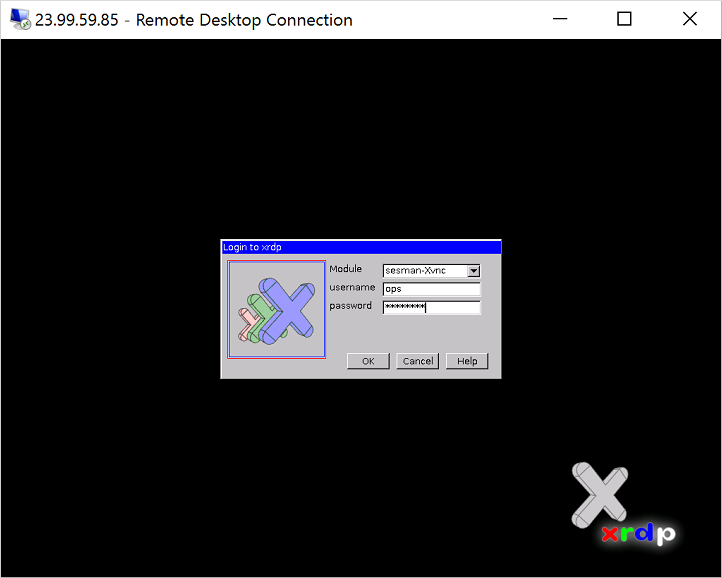
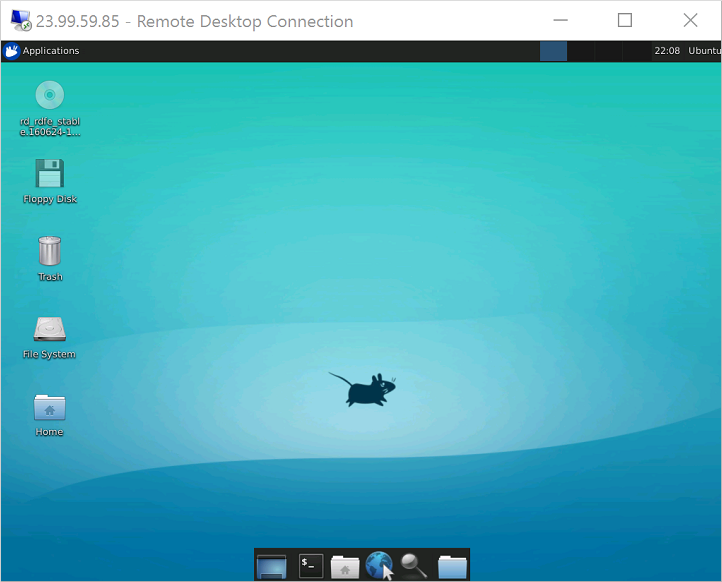

<properties
    pageTitle="使用远程桌面连接到 Azure 中的 Linux VM | Azure"
    description="了解如何使用图形工具安装和配置远程桌面 (xrdp) 以连接到 Azure 中的 Linux VM"
    services="virtual-machines-linux"
    documentationcenter=""
    author="iainfoulds"
    manager="timlt"
    editor="" />
<tags
    ms.assetid=""
    ms.service="virtual-machines-linux"
    ms.workload="infrastructure-services"
    ms.tgt_pltfrm="vm-linux"
    ms.devlang="na"
    ms.topic="article"
    ms.date="12/08/2016"
    wacn.date="01/13/2017"
    ms.author="iainfou" />  

# 安装和配置远程桌面以连接到 Azure 中的 Linux VM
通常使用安全外壳 (SSH) 连接从命令行管理 Azure 中的 Linux 虚拟机 (VM)。如果不熟悉 Linux，或者要快速进行故障排除，使用远程桌面可能会更方便。本文详细介绍如何使用 Resource Manager 部署模型为 Linux VM 安装和配置桌面环境 ([xfce](https://www.xfce.org)) 和远程桌面 ([xrdp](http://www.xrdp.org))。还可以[使用经典部署模型对 VM 执行这些步骤](/documentation/articles/virtual-machines-linux-classic-remote-desktop/)。

## 先决条件
本文需要 Azure 中的现有 Linux VM。如果需要创建 VM，请使用以下方法之一：

- [Azure CLI 1.0](/documentation/articles/virtual-machines-linux-quick-create-cli-nodejs/)
- [Azure 门户预览](/documentation/articles/virtual-machines-linux-quick-create-portal/)

[AZURE.INCLUDE [azure-cli-2-azurechinacloud-environment-parameter](../../includes/azure-cli-2-azurechinacloud-environment-parameter.md)]

还需要安装最新的 [Azure CLI 1.0](/documentation/articles/xplat-cli-install/) 并登录到[有效的 Azure 帐户](/pricing/1rmb-trial/)。

[AZURE.INCLUDE [azure-cli-2-azurechinacloud-environment-parameter](../../includes/azure-cli-2-azurechinacloud-environment-parameter.md)]

## 快速命令
如果需要快速完成任务，以下部分详细说明了在 VM 上安装和配置远程桌面所需的基本命令。本文档的余下部分（[从此处开始](#install-graphical-environment-on-linux-vm)）提供了每个步骤的更详细信息和应用背景。

以下示例在 Ubuntu VM 上安装轻型 [xfce4](https://www.xfce.org/) 桌面环境。其他分发版和桌面环境略有不同。例如，使用 **yum** 在 Red Hat Enterprise Linux 上安装并配置适当的 **selinux** 规则，或者使用 **zypper** 在 SUSE 上安装。

通过 SSH 连接到 VM。安装 xfce 桌面环境，如下所示：

    sudo apt-get update
    sudo apt-get install xfce4

安装 xrdp，如下所示：

    sudo apt-get install xrdp

配置 xrdp 以使用 xfce 作为桌面环境，如下所示：

    echo xfce4-session >~/.xsession

重新启动 xrdp 服务：

    sudo service xrdp restart

如果当前仅使用 SSH 密钥进行身份验证，请为用户帐户设置密码：

    sudo passwd ops

退出 Linux VM 的 SSH 会话。使用本地计算机上的 Azure CLI 创建网络安全组规则，以允许远程桌面流量。以下示例使用 Azure CLI 1.0 在 `myNetworkSecurityGroup` 内创建名为 `myNetworkSecurityGroupRule` 的规则，以允许 tcp 端口 3389 上的流量：

    azure network nsg rule create --resource-group myResourceGroup \
        --nsg-name myNetworkSecurityGroup --name myNetworkSecurityGroupRule \
        --protocol tcp --direction inbound --priority 1010 \
        --destination-port-range 3389 --access allow

  

##  在 Linux VM 上安装桌面环境
Azure 中的大多数 Linux VM 默认情况下未安装桌面环境。通常使用 SSH 连接（而不是桌面环境）来管理 Linux VM。Linux 中有各种可以选择的桌面环境。根据所选的桌面环境，可能会占用 1 到 2 GB 的磁盘空间，并需要 5 到 10 分钟来安装和配置所有所需的包。

以下示例在 Ubuntu VM 上安装轻型 [xfce4](https://www.xfce.org/) 桌面环境。其他分发的命令略有不同（例如，使用 **yum** 在 Red Hat Enterprise Linux 上安装并配置适当的 **selinux** 规则，或者使用 **zypper** 在 SUSE 上安装）。

首先，通过 SSH 连接到 VM。以下示例使用用户名 `ops` 连接到名为 `myvm.chinanorth.chinacloudapp.cn` 的 VM：

    ssh ops@myvm.chinanorth.chinacloudapp.cn ~/.ssh/id_rsa.pub

如果要使用 Windows 并且需要有关使用 SSH 的详细信息，请参阅[如何将 SSH 密钥用于 Windows](/documentation/articles/virtual-machines-linux-ssh-from-windows/)。

接下来，使用 `apt` 安装 xfce，如下所示：

    sudo apt-get update
    sudo apt-get install xfce4

## 安装和配置远程桌面服务器
现在，已安装桌面环境，可配置远程桌面服务以侦听传入连接。[xrdp](http://www.xrdp.org/) 是一个在大多数 Linux 发行版中提供的开放源代码远程桌面协议 (RDP) 服务器，非常适用于 xfce。在 Ubuntu VM 上安装 xrdp，如下所示：

    sudo apt-get install xrdp

告诉 xrdp 在启动会话时要使用的桌面环境。配置 xrdp 以使用 xfce 作为桌面环境，如下所示：

    echo xfce4-session >~/.xsession

重新启动 xrdp 服务使更改生效，如下所示：

    sudo service xrdp restart

## 设置本地用户帐户密码
如果在创建 VM 时已为用户帐户创建密码，请跳过此步骤。如果仅使用 SSH 密钥身份验证，并且未设置本地帐户密码，请在使用 xrdp 之前指定密码以登录到 VM。xrdp 无法接受使用 SSH 密钥进行身份验证。以下示例为用户帐户 `ops` 指定密码：

    sudo passwd ops

> [AZURE.NOTE]
指定密码不会将 sshd 配置更新为允许密码登录（如果当前不允许）。从安全角度看，你可能想要使用基于密钥的身份验证通过 SSH 隧道连接到 VM，然后连接到 xrdp。如果是这样，请跳过以下创建网络安全组规则的步骤，以允许远程桌面流量。

## 为远程桌面流量创建网络安全组规则
若要允许远程桌面流量到达 Linux VM，需要创建网络安全组规则以允许端口 3389 上的 TCP 访问 VM。有关网络安全组规则的详细信息，请参阅[什么是网络安全组？](/documentation/articles/virtual-networks-nsg/) 还可以[使用 Azure 门户预览创建网络安全组规则](/documentation/articles/virtual-machines-windows-nsg-quickstart-portal/)。

以下示例创建名为 `myNetworkSecurityGroupRule` 的网络安全组规则以 `allow` `tcp` 端口 `3389` 上的流量。

- 使用 Azure CLI 1.0：

        azure network nsg rule create --resource-group myResourceGroup \
            --nsg-name myNetworkSecurityGroup --name myNetworkSecurityGroupRule \
            --protocol tcp --direction inbound --priority 1010 \
            --destination-port-range 3389 --access allow

## 使用远程桌面客户端连接 Linux VM
打开本地的远程桌面客户端，并连接到 Linux VM 的 IP 地址或 DNS 名称。输入 VM 上的用户帐户的用户名和密码，如下所示：

  

进行身份验证后，将加载 xfce 桌面环境，其外观类似于以下示例：

  

## 故障排除
如果无法使用远程桌面客户端连接到 Linux VM，请在 Linux VM上使用 `netstat` 验证 VM 是否正在侦听 RDP 连接，如下所示：

    sudo netstat -plnt | grep rdp

以下示例显示正在按预期方式侦听 TCP 端口 3389 的 VM：

    tcp     0     0      127.0.0.1:3350     0.0.0.0:*     LISTEN     53192/xrdp-sesman
    tcp     0     0      0.0.0.0:3389       0.0.0.0:*     LISTEN     53188/xrdp

如果 xrdp 服务未在侦听，请在 Ubuntu VM 上重新启动该服务，如下所示：

    sudo service xrdp restart

请在 Ubuntu VM 上的 `/var/log` 中查看日志，以获得该服务可能未响应的原因的指示。也可以在远程桌面连接尝试期间监视 syslog 以查看任何错误：

    tail -f /var/log/syslog

其他 Linux 分发（例如，Red Hat Enterprise Linux 和 SUSE）重新启动服务的方式可能有所不同，并且可能需要更换要查看的日志文件位置。

如果用户在远程桌面客户端中未收到任何响应，并且在系统日志中看不到任何事件，则此行为指示远程桌面流量无法到达 VM。查看网络安全组规则，以确保有规则允许端口 3389 上的 TCP。有关详细信息，请参阅[排查应用程序连接问题](/documentation/articles/virtual-machines-linux-troubleshoot-app-connection/)。

## 后续步骤
有关为 Linux VM 创建 SSH 密钥和在 Linux VM 上使用 SSH 密钥的详细信息，请参阅[在 Azure 中为 Linux VM 创建 SSH 密钥](/documentation/articles/virtual-machines-linux-mac-create-ssh-keys/)。

有关从 Windows 使用 SSH 的信息，请参阅[如何在 Windows 中使用 SSH 密钥](/documentation/articles/virtual-machines-linux-ssh-from-windows/)。

<!---HONumber=Mooncake_0109_2017-->