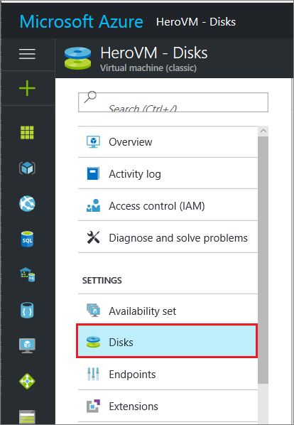
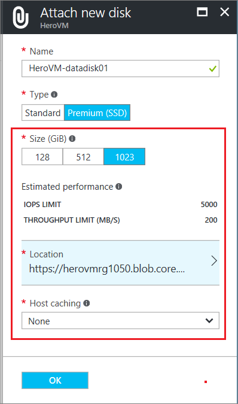
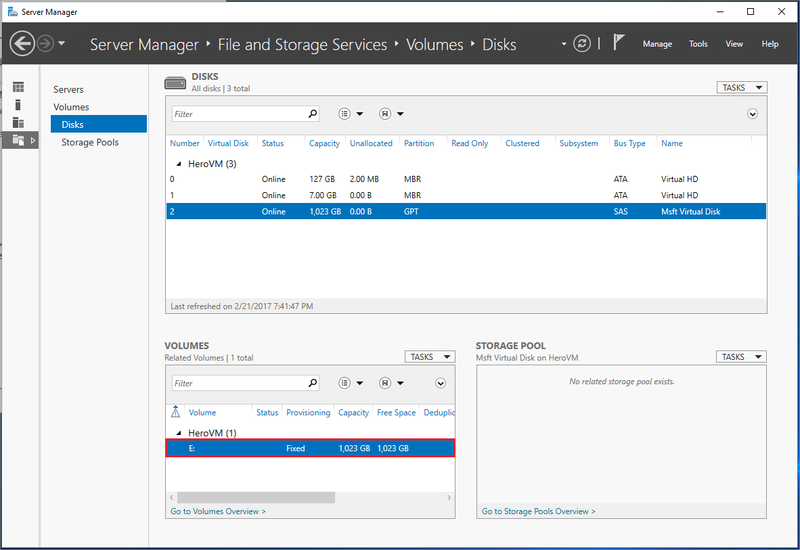
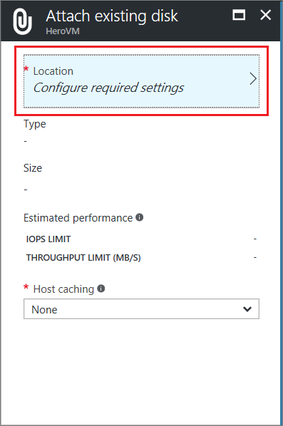
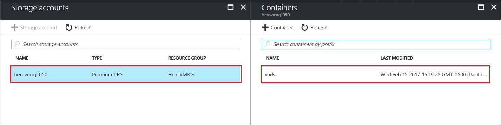

<properties
    pageTitle="将磁盘附加到经典 Azure VM | Azure"
    description="将数据磁盘附加到使用经典部署模型创建的 Windows 虚拟机并进行初始化。"
    services="virtual-machines-windows, storage"
    documentationcenter=""
    author="cynthn"
    manager="timlt"
    editor="tysonn"
    tags="azure-service-management"
    translationtype="Human Translation" />
<tags
    ms.assetid="be4e3e74-05bc-4527-969f-84f10a1d66a7"
    ms.service="virtual-machines-windows"
    ms.workload="infrastructure-services"
    ms.tgt_pltfrm="vm-windows"
    ms.devlang="na"
    ms.topic="article"
    ms.date="02/21/2017"
    wacn.date="04/24/2017"
    ms.author="cynthn"
    ms.sourcegitcommit="a114d832e9c5320e9a109c9020fcaa2f2fdd43a9"
    ms.openlocfilehash="2a4910e4a0e163ac3fdd98477a2b478dc8086825"
    ms.lasthandoff="04/14/2017" />

# 将数据磁盘附加到使用经典部署模型创建的 Windows 虚拟机
<!--
Refernce article:
    If you want to use the new portal, see [How to attach a data disk to a Windows VM in the Azure portal preview](/documentation/articles/virtual-machines-windows-attach-disk-portal/).
-->

本文介绍如何通过 Azure 门户将通过经典部署模型创建的新磁盘和现有磁盘附加到 Windows 虚拟机。

也可以[在 Azure 门户中将数据磁盘附加到 Linux VM](/documentation/articles/virtual-machines-linux-attach-disk-portal/)。

附加磁盘之前，请查看以下提示：

* 虚拟机的大小决定了可以附加多少个磁盘。 有关详细信息，请参阅[虚拟机大小](/documentation/articles/virtual-machines-windows-sizes/)。

* 若要使用高级存储，需要使用 DS 系列或 GS 序列虚拟机。 可以从高级存储帐户和标准存储帐户通过这些虚拟机使用磁盘。 高级存储只在某些区域可用。 有关详细信息，请参阅[高级存储：适用于 Azure 虚拟机工作负荷的高性能存储](/documentation/articles/storage-premium-storage/)。

* 对于新磁盘，你不必首先创建它，因为 Azure 将在附加磁盘时创建该磁盘。

还可以[使用 Powershell 附加数据磁盘](/documentation/articles/virtual-machines-windows-attach-disk-ps/)。

> [AZURE.IMPORTANT]
> Azure 提供两个不同的部署模型用于创建和处理资源：[Resource Manager 和经典模型](/documentation/articles/resource-manager-deployment-model/)。

## 查找虚拟机
1. 登录 [Azure 门户](https://portal.azure.cn/)。
2. 从仪表板上列出的资源中选择虚拟机。
3. 在“设置”下的左窗格中，单击“磁盘”。

    

按照附加[新磁盘](#option-1-attach-and-initialize-a-new-disk)或[现有磁盘](#option-2-attach-an-existing-disk)的说明继续操作。

## 选项 1：附加并初始化新的磁盘

1. 在“磁盘”边栏选项卡上，单击“附加新磁盘”。
2. 检查默认设置，根据需要更新，然后单击“确定”。

   

3. 在 Azure 创建磁盘并将磁盘附加到虚拟机之后，新磁盘将出现在“数据磁盘”下的虚拟机磁盘设置中。

### 初始化新的数据磁盘

1. 连接到虚拟机。 有关说明，请参阅[如何连接并登录到运行 Windows 的 Azure 虚拟机](/documentation/articles/virtual-machines-windows-connect-logon/)。
2. 在登录虚拟机后，打开“服务器管理器” 。 在左窗格中，选择“文件和存储服务” 。

    

3. 选择“磁盘”。
4. “磁盘”部分会列出磁盘。 大多数情况下，虚拟机包含磁盘 0、磁盘 1 和磁盘 2。 磁盘 0 是操作系统磁盘，磁盘 1 是临时磁盘，磁盘 2 是新附加到虚拟机的数据磁盘。 数据磁盘将分区列为“未知”。

 右键单击磁盘，然后选择“初始化”。

5. 在初始化磁盘时，系统会通知用户所有的数据将被擦除。 单击“是”以确认警告并初始化磁盘  。 完成后，即会将分区列为“GPT” 。 再次右键单击磁盘，然后选择“新建卷” 。

6. 使用默认值完成向导操作。 完成向导后，“卷”  部分将列出新卷。 现在，磁盘处于联机状态并已准备好存储数据。

    

## 选项 2：附加现有磁盘
1. 在“磁盘”边栏选项卡上，单击“附加现有磁盘”。
2. 在“附加现有磁盘”下，单击“位置”。

   
3. 在“存储帐户” 下，选择帐户和容纳 .vhd 文件的容器。

   

4. 选择 .vhd 文件
5. 在“附加现有磁盘”下，刚才选择的文件将出现在“VHD 文件”中。 单击 **“确定”**。
6. 在 Azure 将磁盘附加到虚拟机之后，磁盘将出现在“数据磁盘” 下的虚拟机磁盘设置中。

## 将 TRIM 与标准存储配合使用

如果使用标准存储 (HDD)，应启用 TRIM。 TRIM 会放弃磁盘上未使用的块，以便仅对实际使用的存储进行收费。 使用 TRIM 可以节省成本，涉及删除大型文件时生成的未使用块。

可以运行此命令来检查 TRIM 设置。 在 Windows VM 上打开命令提示符，然后键入：

    fsutil behavior query DisableDeleteNotify

如果该命令返回 0，则表示正确启用了 TRIM。 如果返回 1，请运行以下命令启用 TRIM：

    fsutil behavior set DisableDeleteNotify 0

## 后续步骤
如果应用程序需要使用 D: 盘存储数据，可以[更改 Windows 临时磁盘的驱动器号](/documentation/articles/virtual-machines-windows-classic-change-drive-letter/)。

## 其他资源
[关于虚拟机的磁盘和 VHD](/documentation/articles/storage-about-disks-and-vhds-linux/)
<!--Update_Description: change to the new portal-->