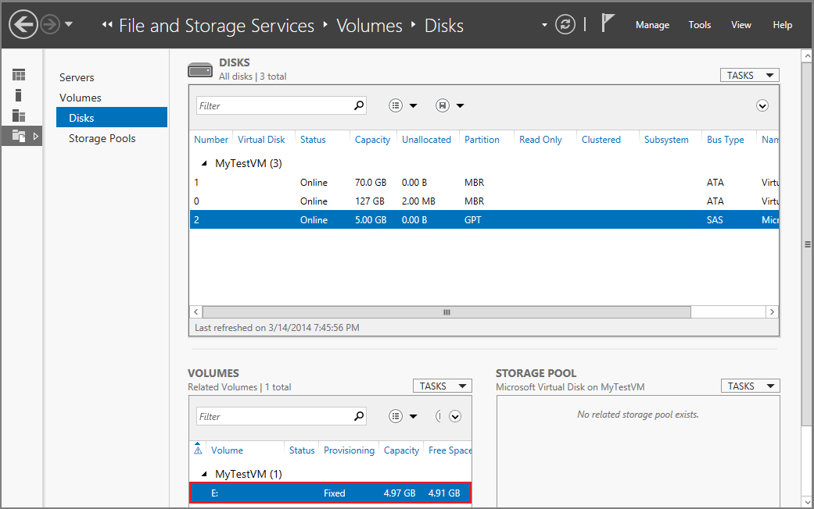

<properties
	pageTitle="将磁盘附加到 VM | Azure"
	description="将数据磁盘附加到使用经典部署模型创建的 Windows 虚拟机并进行初始化。"
	services="virtual-machines-windows, storage"
	documentationCenter=""
	authors="cynthn"
	manager="timlt"
	editor="tysonn"
	tags="azure-service-management"/>  

<tags
	ms.service="virtual-machines-windows"
	ms.workload="infrastructure-services"
	ms.tgt_pltfrm="vm-windows"
	ms.devlang="na"
	ms.topic="article"
	ms.date="01/23/2017"
	wacn.date="03/28/2017"
	ms.author="cynthn"/>

# 将数据磁盘附加到使用经典部署模型创建的 Windows 虚拟机

> [AZURE.IMPORTANT] Azure 具有用于创建和处理资源的两个不同的部署模型：[资源管理器和经典](/documentation/articles/resource-manager-deployment-model/)。本文介绍使用经典部署模型。Azure 建议大多数新部署使用资源管理器模型。如果想要使用新的门户，请参阅[如何在 Azure 门户预览中将数据磁盘附加到 Windows VM](/documentation/articles/virtual-machines-windows-attach-disk-portal/)。

如果需要其他数据磁盘，可将空磁盘或现有的数据磁盘附加到 VM。在这两种情况下，磁盘是驻留在 Azure 存储帐户中的 .vhd 文件。如果是新磁盘，在附加磁盘之后，你也需要将它初始化，使其可供 Windows VM 使用。

有关磁盘的更多详细信息，请参阅[关于虚拟机的磁盘和 VHD](/documentation/articles/storage-about-disks-and-vhds-windows/)。

[AZURE.INCLUDE [howto-attach-disk-windows-linux](../../includes/howto-attach-disk-windows-linux.md)]

##  初始化磁盘

1. 连接到虚拟机。有关说明，请参阅[如何登录到运行 Windows Server 的虚拟机][logon]。

2. 在登录虚拟机后，打开“服务器管理器”。在左窗格中，选择“文件和存储服务”。

	

3. 展开菜单并选择“磁盘”。

4. “磁盘”部分会列出磁盘。在大多数情况下，会有磁盘 0、磁盘 1 和磁盘 2。磁盘 0 是操作系统磁盘，磁盘 1 是临时磁盘，磁盘 2 是刚附加到 VM 的数据磁盘。新的数据磁盘会将分区列为“未知”。右键单击磁盘，然后选择“初始化”。

5.	在初始化磁盘时，系统会通知用户所有的数据将被擦除。单击“是”以确认警告并初始化磁盘。完成后，即会将分区列为“GPT”。再次右键单击磁盘，然后选择“新建卷”。

6.	使用默认值完成向导操作。完成向导后，“卷”部分将列出新卷。现在，磁盘处于联机状态并已准备好存储数据。

	

> [AZURE.NOTE] VM 的大小决定可以在其上附加的磁盘数量。有关详细信息，请参阅[虚拟机大小](/documentation/articles/virtual-machines-windows-sizes/)。

## 其他资源

[如何从 Windows 虚拟机分离磁盘](/documentation/articles/virtual-machines-windows-classic-detach-disk/)

[关于虚拟机的磁盘和 VHD](/documentation/articles/storage-about-disks-and-vhds-windows/)

[logon]: /documentation/articles/virtual-machines-windows-classic-connect-logon/

<!---HONumber=Mooncake_Quality_Review_1202_2016-->