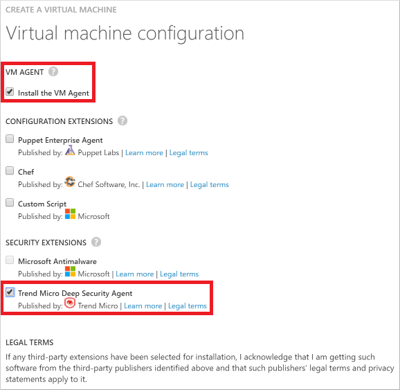

<properties
	pageTitle="在 VM 上安装 Trend Micro Deep Security | Azure"
	description="本文介绍如何在 Azure 中使用经典部署模型创建的 VM 上安装和配置 Trend Micro Deep Security。"
	services="virtual-machines-windows"
	documentationCenter=""
	authors="iainfoulds"
	manager="timlt"
	editor=""
	tags="azure-service-management"/>  

<tags
	ms.service="virtual-machines-windows"
	ms.workload="infrastructure-services"
	ms.tgt_pltfrm="vm-multiple"
	ms.devlang="na"
	ms.topic="article"
	ms.date="08/24/2016"
	wacn.date="10/24/2016"
	ms.author="iainfou"/>  

# 如何在 Windows VM 上安装和配置 Trend Micro Deep Security 即服务

[AZURE.INCLUDE [了解部署模型](../../includes/learn-about-deployment-models-classic-include.md)]

本文演示了如何在运行 Windows Server 的新的或现有虚拟机 (VM) 上安装和配置 Trend Micro Deep Security 即服务。Deep Security 即服务包括反恶意软件保护、防火墙、入侵防御系统和完整性监视。

该客户端通过 VM 代理作为安全扩展插件进行安装。在新虚拟机上，可随 Deep Security Agent 一起安装 VM 代理。在未安装 VM 代理的现有虚拟机上，需要先下载并安装 VM 代理。本文介绍这两种情况。

如果已经有针对本地解决方案的 Trend Micro 现有订阅，则可用它来帮助保护 Azure 虚拟机。如果还不是客户，则可注册试用订阅。有关此解决方案的详细信息，请参阅 Trend Micro 博客文章 [Azure VM Agent Extension For Deep Security](http://blog.trendmicro.com/microsoft-azure-vm-agent-extension-for-deep-security/)（用于 Deep Security 的 Azure VM 代理扩展）。

## 在新 VM 上安装 Deep Security Agent

使用“从库中”选项创建虚拟机时，[Azure 经典管理门户](http://manage.windowsazure.cn)允许安装 VM 代理和 Trend Micro 安全扩展插件。如果要创建的是单个虚拟机，则可通过此门户轻松地添加来自 Trend Micro 的保护。

此**“从库中”**选项会打开帮助你设置虚拟机的向导。该向导的最后一页用于安装 VM 代理和 Trend Micro 安全扩展插件。有关常规说明，请参阅 [Create a virtual machine running Windows in the Azure Classic Management Portal](/documentation/articles/virtual-machines-windows-classic-tutorial/)（在 Azure 经典管理门户中创建运行 Windows 的虚拟机）。进入向导的最后一页时，请执行以下操作：

1.	在“VM 代理”下，选中“安装 VM 代理”。

2.	在“安全扩展插件”下，选中“Trend Micro Deep Security Agent”。

	  

3.	单击复选标记可创建虚拟机。

## 在现有 VM 上安装 Deep Security Agent

若要在现有 VM 上安装代理，需满足以下先决条件：

- 在本地计算机上安装 Azure PowerShell 模块 0.8.2 版或更高版本。可以使用 **Get-Module azure | format-table version** 命令查看已安装的 Azure PowerShell 的版本。有关说明以及指向最新版本的链接，请参阅[如何安装和配置 Azure PowerShell](/documentation/articles/powershell-install-configure/)。使用 `Add-AzureAccount` 登录到 Azure 订阅。

- 在目标虚拟机上安装 VM 代理。

首先，请验证是否已安装 VM 代理。填写云服务名称和虚拟机名称，然后在管理员级别的 Azure PowerShell 命令提示符下运行以下命令。替换引号内的所有内容，包括 < and > 字符。

	$CSName = "<cloud service name>"
	$VMName = "<virtual machine name>"
	$vm = Get-AzureVM -ServiceName $CSName -Name $VMName
	write-host $vm.VM.ProvisionGuestAgent

如果不知道云服务名称和虚拟机名称，运行 **Get-AzureVM** 即可显示当前订阅中所有虚拟机的该信息。

如果 **write-host** 命令返回 **True**，则已安装 VM 代理。如果该命令返回 **False**，请参阅 Azure 博客文章 [VM 代理和扩展 - 第 2 部分](https://azure.microsoft.com/zh-cn/blog/vm-agent-and-extensions-part-2/)中的说明和下载链接。

如果已安装 VM 代理，请运行以下命令。

	$Agent = Get-AzureVMAvailableExtension TrendMicro.DeepSecurity -ExtensionName TrendMicroDSA

	Set-AzureVMExtension -Publisher TrendMicro.DeepSecurity -Version $Agent.Version -ExtensionName TrendMicroDSA -VM $vm | Update-AzureVM

## 后续步骤

安装后，代理需要几分钟时间才会开始运行。之后需在虚拟机上激活 Deep Security，然后才能通过 Deep Security Manager 进行管理。有关其他说明，请参阅以下内容：

- 有关此解决方案的 Trend 文章：[Instant-On Cloud Security for Azure](http://www.trendmicro.com/us/business/saas/deep-security-as-a-service/microsoft-azure-security/index.html?cm_mmc=VURL:www.trendmicro.com-_-VURL-_-%2Fazure%2Findex.html-_-1-1#how-it-works)（用于 Azure 的 Instant-On Cloud Security）
- 用于配置虚拟机的 [Windows PowerShell 脚本示例](https://dsahandler.blob.core.windows.net/dsaas/ds-config.ps1)
- 示例的[说明](https://dsahandler.blob.core.windows.net/dsaas/ds-config-README.txt)

## 其他资源

[如何登录到运行 Windows Server 的虚拟机]

[Azure VM 扩展和功能]

<!--Link references-->

[如何登录到运行 Windows Server 的虚拟机]: /documentation/articles/virtual-machines-windows-classic-connect-logon/
[Azure VM 扩展和功能]: /documentation/articles/virtual-machines-windows-extensions-features

<!---HONumber=Mooncake_1017_2016-->