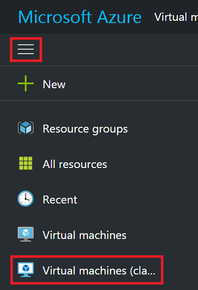
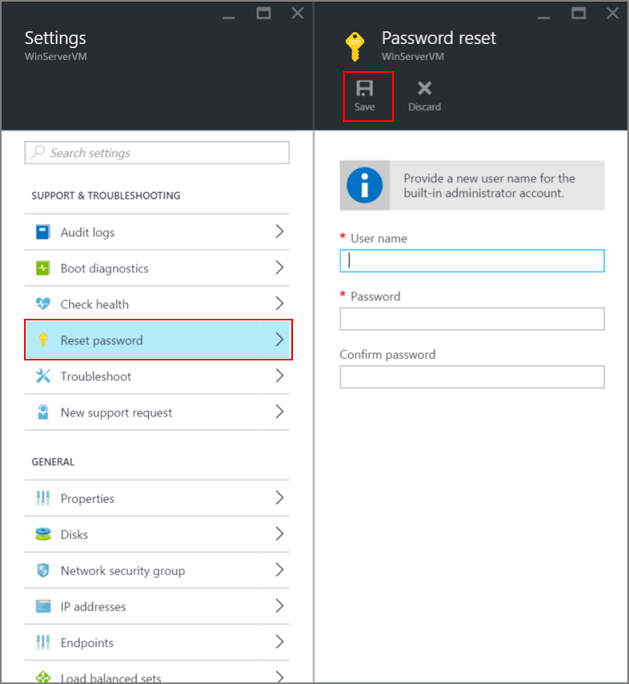

<properties
    pageTitle="在 Azure 的 Windows VM 上重置密码或远程桌面配置 | Azure"
    description="了解如何使用 Azure 门户或 Azure PowerShell 在通过经典部署模型创建的 Windows VM 上重置帐户密码或远程桌面服务。"
    services="virtual-machines-windows"
    documentationcenter=""
    author="iainfoulds"
    manager="timlt"
    editor=""
    tags="azure-service-management"
    translationtype="Human Translation" />
<tags
    ms.assetid=""
    ms.service="virtual-machines-windows"
    ms.workload="infrastructure-services"
    ms.tgt_pltfrm="vm-windows"
    ms.devlang="na"
    ms.topic="article"
    ms.date="03/14/2017"
    wacn.date="04/17/2017"
    ms.author="iainfou"
    ms.sourcegitcommit="e0e6e13098e42358a7eaf3a810930af750e724dd"
    ms.openlocfilehash="2741e9043ef7bb9fa62f5bb8c8ba4cc506a6f023"
    ms.lasthandoff="04/06/2017" />

# 如何在使用经典部署模型创建的 Windows VM 中重置远程桌面服务或其登录密码
> [AZURE.IMPORTANT]
> Azure 具有用于创建和处理资源的两个不同的部署模型： [资源管理器和经典](/documentation/articles/resource-manager-deployment-model/)。 本文介绍如何使用经典部署模型。 Azure 建议大多数新部署使用 Resource Manager 模型。 还可对[使用 Resource Manager 部署模型创建的 VM 执行这些步骤](/documentation/articles/virtual-machines-windows-reset-rdp/)。

如果无法连接到 Windows 虚拟机 (VM)，可以重置本地管理员密码或重置远程桌面服务配置。 可以使用 Azure 门户或 Azure PowerShell 中的 VM 访问扩展重置密码。

## 如何重置配置或凭据
可以根据需要，通过多种不同的方式重置远程桌面服务和凭据：

- [使用 Azure 门户重置](#azure-portal)
- [使用 Azure PowerShell 进行重置](#vmaccess-extension-and-powershell)

## Azure 门户
可使用 [Azure 门户](https://portal.azure.cn)重置远程桌面服务。 若要展开门户菜单，请单击左上角的三栏，然后单击“虚拟机(经典)”：

选择 Windows 虚拟机，然后单击“重置远程...” 。 此时将显示以下用于重置远程桌面配置的对话框：

还可以重置本地管理员帐户的用户名和密码。 从 VM 中单击“支持 + 故障排除” > “重置密码”。 此时会显示密码重置边栏选项卡：

输入新用户名和密码，然后单击“保存”。

## VMAccess 扩展和 PowerShell
确保在虚拟机上安装 VM 代理。 只要 VM 代理可用，就无需事先安装 VMAccess 扩展。 使用以下命令验证是否已在虚拟机上安装 VM 代理。 （分别将“myCloudService”和“myVM”替换为云服务和 VM 的名称。 若要了解这些名称，可运行不带任何参数的 `Get-AzureVM`。）

    $vm = Get-AzureVM -ServiceName "myCloudService" -Name "myVM"
    write-host $vm.VM.ProvisionGuestAgent

如果 **write-host** 命令显示 **True**，则已安装 VM 代理。 如果该命令显示 **False**，请参阅 Azure 博客文章 [VM 代理和扩展 - 第 2 部分](https://azure.microsoft.com/zh-cn/blog/vm-agent-and-extensions-part-2/)中的说明和下载链接。

如果使用门户创建虚拟机，检查 `$vm.GetInstance().ProvisionGuestAgent` 是否返回 **True**。 如果不是，使用以下命令进行设置：

    $vm.GetInstance().ProvisionGuestAgent = $true

此命令可防止在后续步骤中运行 **Set-AzureVMExtension** 命令时出现以下错误：“在设置 IaaS VM Access 扩展前，必须对 VM 对象启用预配来宾代理。”

### **重置本地管理员帐户密码**
使用当前的本地管理员帐户名和新密码创建登录凭据，然后运行 `Set-AzureVMAccessExtension` ，如下所示。

    $cred=Get-Credential
    Set-AzureVMAccessExtension -vm $vm -UserName $cred.GetNetworkCredential().Username `
        -Password $cred.GetNetworkCredential().Password  | Update-AzureVM

如果键入不同于当前帐户的名称，VMAccess 扩展将重命名本地管理员帐户，将密码分配到该帐户，并发出远程桌面注销命令。 如果禁用本地管理员帐户，则 VMAccess 扩展将启用它。

这些命令也可重置远程桌面服务配置。

### **重置远程桌面服务配置**
若要重置远程桌面服务配置，请运行以下命令：

    Set-AzureVMAccessExtension -vm $vm | Update-AzureVM

VMAccess 扩展在虚拟机上运行两个命令：

    netsh advfirewall firewall set rule group="Remote Desktop" new enable=Yes

此命令启用允许传入远程桌面流量（使用 TCP 端口 3389）的内置 Windows 防火墙组。

    Set-ItemProperty -Path 'HKLM:\System\CurrentControlSet\Control\Terminal Server' -name "fDenyTSConnections" -Value 0

此命令将 fDenyTSConnections 注册表值设置为 0，以启用远程桌面连接。

## 后续步骤
如果 Azure VM 访问扩展无响应，并且密码无法重置，可以[脱机重置本地 Windows 密码](/documentation/articles/virtual-machines-windows-reset-local-password-without-agent/)。 此方法是一个更高级的方案，需将问题 VM 的虚拟硬盘连接到另一个 VM。 请首先按照本文中所述的步骤操作，将脱机密码重置方法作为最后的选择。

[Azure VM 扩展和功能](/documentation/articles/virtual-machines-windows-extensions-features/)

[使用 RDP 或 SSH 连接到 Azure 虚拟机](/documentation/articles/virtual-machines-linux-azure-overview/)

[对与基于 Windows 的 Azure 虚拟机的远程桌面连接进行故障排除](/documentation/articles/virtual-machines-windows-troubleshoot-rdp-connection/)