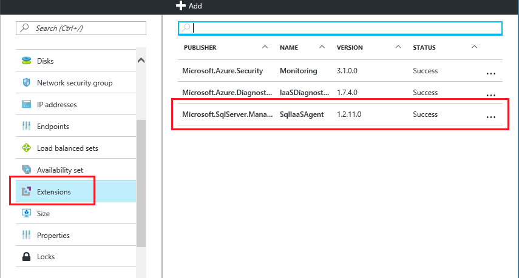

<properties
	pageTitle="适用于 SQL Server VM 的 SQL Server 代理扩展（经典）| Azure"
	description="本主题介绍如何管理可以自动执行特定 SQL Server 管理任务的 SQL Server 代理扩展。这些任务包括自动备份、自动修补和 Azure 密钥保管库集成。本主题使用经典部署模式。"
	services="virtual-machines-windows"
	documentationCenter=""
	authors="rothja"
	manager="jhubbard"
	editor=""
	tags="azure-service-management"/>  

<tags
	ms.service="virtual-machines-windows"
	ms.devlang="na"
	ms.topic="article"
	ms.tgt_pltfrm="vm-windows-sql-server"
	ms.workload="infrastructure-services"
	ms.date="10/27/2016"
	wacn.date="12/30/2016"
	ms.author="jroth"/>

# 适用于 SQL Server VM 的 SQL Server 代理扩展（经典）

> [AZURE.SELECTOR]
- [Resource Manager](/documentation/articles/virtual-machines-windows-sql-server-agent-extension/)
- [经典](/documentation/articles/virtual-machines-windows-classic-sql-server-agent-extension/)

SQL Server IaaS 代理扩展 (SQLIaaSAgent) 在 Azure 虚拟机上运行，可以自动执行管理任务。本主题概述了该扩展支持的服务以及有关安装、状态及删除的说明。

> [AZURE.IMPORTANT]Azure 具有用于创建和处理资源的两个不同的部署模型：[资源管理器和经典](/documentation/articles/resource-manager-deployment-model/)。本文介绍使用经典部署模型。Azure 建议大多数新部署使用资源管理器模型。若要查看本文的 Resource Manager 版本，请参阅[适用于 SQL Server VM 的 SQL Server 代理扩展 (Resource Manager)](/documentation/articles/virtual-machines-windows-sql-server-agent-extension/)。

## 支持的服务

SQL Server IaaS 代理扩展支持以下管理任务：

| 管理功能 | 说明 |
|---------------------|-------------------------------|
| **SQL 自动备份** | 对 VM 中的 SQL Server 默认实例自动执行所有数据库的备份计划。有关详细信息，请参阅 [Azure 虚拟机中 SQL Server 的自动备份（经典）](/documentation/articles/virtual-machines-windows-classic-sql-automated-backup/)。|
| **SQL 自动修补** | 配置维护时段，在此期间可能更新 VM，因此可以避免在工作负荷高峰时间进行更新。有关详细信息，请参阅 [Azure 虚拟机中 SQL Server 的自动修补（经典）](/documentation/articles/virtual-machines-windows-classic-sql-automated-patching/)。|
| **Azure 密钥保管库集成** | 可让你在 SQL Server VM 上自动安装和配置 Azure 密钥保管库。有关详细信息，请参阅[在 Azure VM 上配置 SQL Server 的 Azure 密钥保管库集成（经典）](/documentation/articles/virtual-machines-windows-classic-ps-sql-keyvault/)。|

## 先决条件

在 VM 上使用 SQL Server IaaS 代理扩展的要求：

### 操作系统：

- Windows Server 2012
- Windows Server 2012 R2

### SQL Server 版本：

- SQL Server 2012
- SQL Server 2014
- SQL Server 2016

### Azure PowerShell：

[下载并配置最新 Azure PowerShell 命令](/documentation/articles/powershell-install-configure/)。

启动 Windows PowerShell，并通过 **Add-AzureAccount** 命令将其连接到 Azure 订阅。

	Add-AzureAccount -Environment AzureChinaCloud

若有多个订阅，请使用 **Select-AzureSubscription** 选择含有目标经典 VM 的订阅。

	Select-AzureSubscription -SubscriptionName <subscriptionname>

此时，可以通过 **Get AzureVM** 命令获得一个列表，其中会列出经典虚拟机及其关联服务名称。

	Get-AzureVM

## 安装

对于经典 VM，必须使用 PowerShell 安装 SQL Server IaaS 代理扩展并配置关联服务。使用 **Set-AzureVMSqlServerExtension** PowerShell cmdlet 安装扩展。例如，以下命令将在 Windows Server VM（经典）上安装扩展并将其命名为“SQLIaaSExtension”。

	Get-AzureVM -ServiceName <vmservicename> -Name <vmname> | Set-AzureVMSqlServerExtension -ReferenceName "SQLIaasExtension" -Version "1.2" | Update-AzureVM

如果要更新到最新版本的 SQL IaaS 代理扩展，则必须在更新该扩展后重启虚拟机。

>[AZURE.NOTE] 经典虚拟机不能通过门户安装和配置 SQL IaaS 代理扩展。

## 状态

验证是否已安装扩展的方法之一是在 Azure 门户预览中查看代理状态。在虚拟机边栏选项卡中选择“所有设置”，然后单击“扩展”。随后应列出 **SQLIaaSAgent** 扩展。

还可使用 **Get-AzureVMSqlServerExtension** Azure Powershell cmdlet。

	Get-AzureVM -ServiceName "service" -Name "vmname" | Get-AzureVMSqlServerExtension

## 删除   

在 Azure 门户预览中，可以卸载扩展，方法是访问虚拟机属性的“扩展”边栏选项卡，单击其中的省略号，然后单击“删除”。

还可使用 **Remove-AzureVMSqlServerExtension** Powershell cmdlet。

	Get-AzureVM -ServiceName "service" -Name "vmname" | Remove-AzureVMSqlServerExtension | Update-AzureVM

## 后续步骤

开始使用扩展支持的服务之一。有关详细信息，请参阅本文的[支持的服务](#supported-services)部分中提到的主题。

有关在 Azure 虚拟机中运行 SQL Server 的详细信息，请参阅 [Azure 虚拟机中的 SQL Server 概述](/documentation/articles/virtual-machines-windows-sql-server-iaas-overview/)。

<!---HONumber=Mooncake_Quality_Review_1215_2016-->