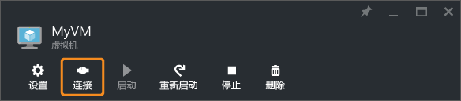

<properties
    pageTitle="连接到 Windows Server VM | Azure"
    description="了解如何使用 Azure 门户和 Resource Manager 部署模型连接并登录到 Windows VM。"
    services="virtual-machines-windows"
    documentationcenter=""
    author="cynthn"
    manager="timlt"
    editor="tysonn"
    tags="azure-resource-manager"
    translationtype="Human Translation" />
<tags
    ms.assetid="ef62b02e-bf35-468d-b4c3-71b63fe7f409"
    ms.service="virtual-machines-windows"
    ms.workload="infrastructure-services"
    ms.tgt_pltfrm="vm-windows"
    ms.devlang="na"
    ms.topic="get-started-article"
    ms.date="03/01/2017"
    wacn.date="04/24/2017"
    ms.author="cynthn"
    ms.sourcegitcommit="a114d832e9c5320e9a109c9020fcaa2f2fdd43a9"
    ms.openlocfilehash="f0d3082e68b6da6daa1a8a214f4f6742213779f1"
    ms.lasthandoff="04/14/2017" />

# 如何连接并登录到运行 Windows 的 Azure 虚拟机
可以从 Windows 桌面使用 Azure 门户中的“连接”按钮来启动远程桌面 (RDP) 会话。 首先连接到虚拟机，然后登录。

如果尝试从 Mac 连接到 Windows VM，则需为 Mac 安装 RDP 客户端，例如 [Microsoft 远程桌面](https://itunes.apple.com/app/microsoft-remote-desktop/id715768417)。

## 连接到虚拟机
1. 登录到 [Azure 门户](https://portal.azure.cn/)（如果未登录）。
2. 在“中心”菜单中，单击“虚拟机” 。
3. 从列表中选择虚拟机。
4. 在虚拟机边栏选项卡上，单击“连接”。

    

    > [AZURE.TIP]
    > 如果门户中的“连接”按钮灰显，并且你未通过 [Express Route](/documentation/articles/expressroute-introduction/) 或[站点到站点 VPN](/documentation/articles/vpn-gateway-howto-site-to-site-resource-manager-portal/) 连接连接到 Azure，则必须先为 VM 创建并分配一个公共 IP 地址才能使用 RDP。 详细了解 [Azure 中的公共 IP 地址](/documentation/articles/virtual-network-ip-addresses-overview-arm/)。
    > 
    > 

## 登录到虚拟机
[AZURE.INCLUDE [virtual-machines-log-on-win-server](../../includes/virtual-machines-log-on-win-server.md)]

## 后续步骤
如果在尝试连接时遇到故障，请参阅 [故障排除远程桌面连接](/documentation/articles/virtual-machines-windows-troubleshoot-rdp-connection/)。 此文将指导你完成诊断和解决常见问题。
<!--Update_Description: wording update-->