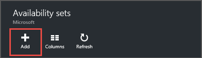
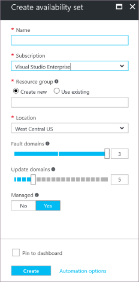

<properties
    pageTitle="在 Azure 中创建 VM 可用性集 | Azure"
    description="了解如何通过 Azure PowerShell 或门户，使用 Resource Manager 部署模型为虚拟机创建可用性集。"
    keywords="可用性集"
    services="virtual-machines-windows"
    documentationcenter=""
    author="cynthn"
    manager="timlt"
    editor=""
    tags="azure-resource-manager" />
<tags
    ms.assetid="a3db8659-ace8-4e78-8b8c-1e75c04c042c"
    ms.service="virtual-machines-windows"
    ms.workload="infrastructure-services"
    ms.tgt_pltfrm="vm-windows"
    ms.devlang="na"
    ms.topic="article"
    ms.date="02/06/2017"
    wacn.date="03/20/2017"
    ms.author="cynthn" />  

# 创建可用性集
可用性集可为应用程序提供冗余。我们建议你将两个或更多虚拟机组合到一个可用性集中。这种配置可以确保在发生计划内或计划外维护事件时，至少有一个虚拟机可用，并满足 99.95% 的 Azure SLA 要求。有关详细信息，请参阅[虚拟机的 SLA](/support/sla/virtual-machines/)。

> [AZURE.IMPORTANT]
必须在可用性集所在的资源组中创建 VM。
> 

如果你希望 VM 属于某个可用性集，则需要在创建可用性集中的第一个 VM 时先创建可用性集。

有关创建和使用可用性集的详细信息，请参阅[管理虚拟机的可用性](/documentation/articles/virtual-machines-windows-manage-availability/)。

## 在创建 VM 之前先使用门户创建可用性集
1. 在中心菜单中，单击“浏览”，然后选择“可用性集”。
2. 在“可用性集”边栏选项卡上，单击“添加”。
   
    
3. 在“创建可用性集”边栏选项卡上，填写可用性集的相关信息。
   
    
   
    * **名称** - 名称应为 1-80 个字符，由数字、字母、句点、下划线和短划线组成。第一个字符必须是字母或数字。最后一个字符必须是字母、数字或下划线。
    * **容错域** - 容错域可定义一组共用一个通用电源和网络交换机的虚拟机。默认情况下，VM 最多分组到三个容错域中，此值可以更改为 1 到 3 之间的值。
    * **更新域** - 默认分配五个更新域，此值可以设置为 1 到 20 之间的值。更新域表示虚拟机组以及可同时重新启动的基础物理硬件。例如，如果指定五个更新域，在单个可用性集中配置了五个以上的虚拟机时，第六个虚拟机将放置在第一个虚拟机所在的更新域中，第七个虚拟机将放置在第二个虚拟机所在的更新域中，依此类推。重启顺序可能不是连续的，但一次只能重启一个更新域。
    * **订阅** - 如果有多个订阅，请选择要使用的订阅。
    * **资源组** - 通过以下方法选择现有资源组：单击箭头，然后从下拉列表中选择资源组。也可以通过键入名称来创建新的资源组。名称可以包含以下任意字符：字母、数字、句点、短划线、下划线和左右括号。名称不能以句点结尾。可用性组中的所有 VM 需要与可用性集创建在同一资源组中。
    * **位置** - 从下拉列表中选择一个位置。
   
4. 完成信息输入后，单击“创建”。

## 使用门户同时创建虚拟机和可用性集
如果要使用门户创建新 VM，还可以在创建该集中的第一个 VM 的同时，为该 VM 创建新的可用性集。

  

## 在门户中将新 VM 添加到现有可用性集
对于所创建的应属于该集的每个其他 VM，请确保在同一个**资源组**中创建该 VM，然后在步骤 3 中选择现有可用性集。

## 使用 PowerShell 创建可用性集
此示例将在位于**中国北部**位置的 **myResourceGroup** 资源组中创建一个名为 **myAvailabilitySet** 的可用性集。此操作需在创建属于该集的第一个 VM 之前完成。

在开始之前，请确保你有最新版本的 AzureRM.Compute PowerShell 模块。运行以下命令来安装该模块。

    Install-Module AzureRM.Compute -RequiredVersion 2.6.0

有关详细信息，请参阅 [Azure PowerShell 版本控制](https://docs.microsoft.com/powershell/azureps-cmdlets-docs/#azure-powershell-versioning)。

        New-AzureRmAvailabilitySet -ResourceGroupName "myResourceGroup" '
        -Name "myAvailabilitySet" -Location "China North" 

有关详细信息，请参阅 [New-AzureRmAvailabilitySet](https://docs.microsoft.com/powershell/resourcemanager/azurerm.compute/v2.8.0/new-azurermavailabilityset)。

## 故障排除
* 创建 VM 时，如果所需的可用性集不在门户的下拉列表中，则表示可能已在不同的资源组中创建该可用性集。如果不知道可用性集所属的资源组，请转到中心菜单并单击“浏览”>“可用性集”，以查看可用性集及其所属资源组的列表。

## 后续步骤
通过添加更多[数据磁盘](/documentation/articles/virtual-machines-windows-attach-disk-portal/)，向 VM 添加更多存储。

<!---HONumber=Mooncake_0313_2017-->
<!--Update_Description: wording update-->