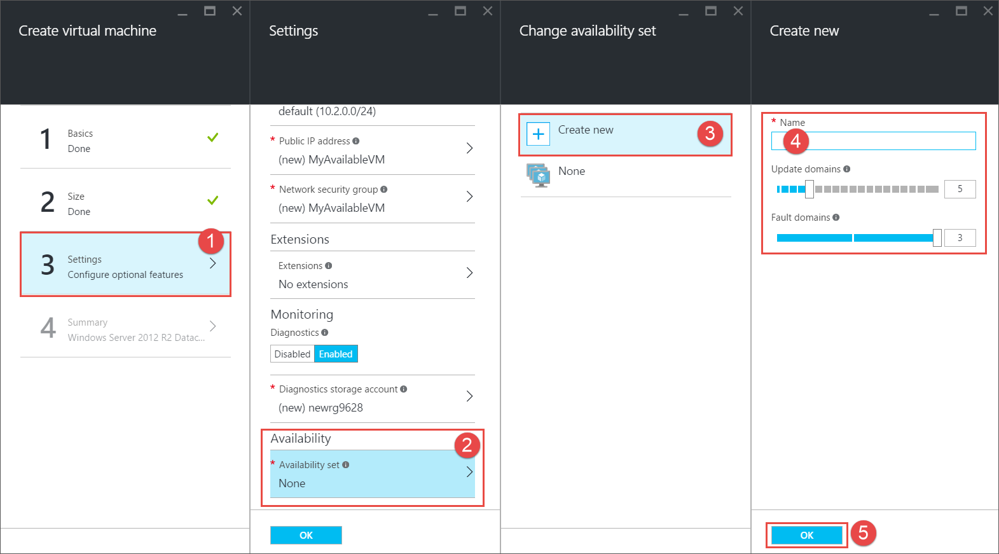

<!-- Ibiza portal: tested -->

<properties
	pageTitle="创建 VM 可用性集 | Azure"
	description="了解如何通过 Azure 门户预览或 PowerShell，使用 Resource Manager 部署模型为虚拟机创建可用性集。"
	keywords="可用性集"
	services="virtual-machines-windows"
	documentationCenter=""
	authors="cynthn"
	manager="timlt"
	editor=""
	tags="azure-resource-manager"/>
<tags 
	ms.service="virtual-machines-windows"
	ms.date="06/17/2016"
	wacn.date="07/11/2016"/>

# 创建可用性集 

使用门户时，如果希望 VM 属于某个可用性集，则需要先创建该可用性集。

有关创建和使用可用性集的详细信息，请参阅[管理虚拟机的可用性](/documentation/articles/virtual-machines-windows-manage-availability/)。

## 在创建 VM 之前使用门户创建可用性集

1. 在中心菜单中，单击“浏览”，然后选择“可用性集”。

2. 在“可用性集”边栏选项卡上，单击“添加”。

	

3. 在“创建可用性集”边栏选项卡上，填写可用性集的相关信息。

	

	- **名称** — 名称应为 1-80 个字符，由数字、字母、句点、下划线和短划线组成。第一个字符必须是字母或数字。最后一个字符必须是字母、数字或下划线。
	- **容错域** — 容错域定义一组共用一个通用电源和网络交换机的虚拟机。默认情况下，VM 最多分组到三个容错域中，此值可以更改为 1 到 3 之间的值。
	- **更新域** — 默认情况下分配五个更新域，此值可以设置为 1 到 20 之间的值。更新域表示虚拟机组以及可同时重新启动的基础物理硬件。例如，如果指定五个更新域，在单个可用性集中配置了五个以上的虚拟机时，第六个虚拟机将放置在第一个虚拟机所在的更新域中，第七个虚拟机将放置在第二个虚拟机所在的更新域中，依此类推。重启顺序可能不是连续的，但一次只能重启一个更新域。
	- **订阅** — 如果有多个订阅，请选择要使用的订阅。
	- **资源组** — 通过以下方法选择现有资源组：单击箭头，然后从下拉列表中选择资源组。也可以通过键入名称来创建新的资源组。名称可以包含以下任意字符：字母、数字、句点、短划线、下划线和左右括号。名称不能以句点结尾。需要在与可用性集相同的资源组中创建可用性组中的所有 VM。
	- **位置** — 从下拉列表中选择一个位置。

4. 完成信息输入后，单击“创建”。一旦创建了可用性组，就可以通过刷新门户在列表中看到它。

## 使用门户同时创建虚拟机和可用性集

如果要使用门户创建新 VM，还可以在为该 VM 创建新可用性集的同时，创建该集中的第一个 VM。

## 将新 VM 添加到现有可用性集

对于所创建的应属于该集的每个附加 VM，请确保在同一个**资源组**中创建该 VM，然后在步骤 3 中选择现有可用性集。

## 使用 PowerShell 创建可用性集

此示例将在位于**中国北部**的 **RMResGroup** 资源组中创建一个可用性集。此操作需在创建属于该集的第一个 VM 之前完成。

	New-AzureRmAvailabilitySet -ResourceGroupName "RMResGroup" -Name "AvailabilitySet03" -Location "China North"
	
有关详细信息，请参阅 [New-AzureRmAvailabilitySet](https://msdn.microsoft.com/zh-cn/library/mt619453.aspx)。

## 故障排除

- 创建 VM 时，如果所需的可用性集不在门户的下拉列表中，则表示可能已在不同的资源组中创建该可用性集。如果不知道可用性集所属的资源组，请转到中心菜单并单击“浏览”>“可用性集”，以查看可用性集及其所属资源组的列表。

## 后续步骤

通过添加附加[数据磁盘](/documentation/articles/virtual-machines-windows-attach-disk-portal/)，向 VM 添加附加存储。

<!---HONumber=Mooncake_0704_2016-->