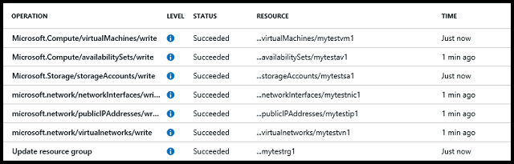

<properties
	pageTitle="使用 C# 和 Resource Manager 模板部署 VM | Azure"
	description="了解如何使用 C# 和 Resource Manager 模板部署 Azure VM。"
	services="virtual-machines-windows"
	documentationCenter=""
	authors="davidmu1"
	manager="timlt"
	editor="tysonn"
	tags="azure-resource-manager"/>  

<tags
	ms.service="virtual-machines-windows"
	ms.workload="na"
	ms.tgt_pltfrm="vm-windows"
	ms.devlang="na"
	ms.topic="article"
	ms.date="10/10/2016"
	wacn.date="12/16/2016"
	ms.author="davidmu"/>  

# 使用 C# 和 Resource Manager 模板部署 Azure 虚拟机

使用资源组和模板即可统一管理支持应用程序的所有资源。本文介绍了如何使用 Visual Studio 和 C# 来设置身份验证和创建模板，然后如何使用创建的模板部署 Azure 资源。

需要先确保已完成以下设置步骤：

- 安装 [Visual Studio](http://msdn.microsoft.com/zh-cn/library/dd831853.aspx)
- 验证是否安装了 [Windows Management Framework 3.0](http://www.microsoft.com/download/details.aspx?id=34595) 或 [Windows Management Framework 4.0](http://www.microsoft.com/download/details.aspx?id=40855)
- 获取[身份验证令牌](/documentation/articles/resource-group-authenticate-service-principal/)
- 使用 [Azure PowerShell](/documentation/articles/resource-group-template-deploy/)、[Azure CLI](/documentation/articles/resource-group-template-deploy-cli/) 或 [Azure 门户预览](/documentation/articles/resource-group-template-deploy-portal/)创建资源组。

完成这些步骤大约需要 30 分钟。
    
## 步骤 1：创建 Visual Studio 项目、模板文件和参数文件

### 创建模板文件

可使用 Azure Resource Manager 模板统一部署和管理 Azure 资源。该模板是资源及关联部署参数的 JSON 描述。

在 Visual Studio 中执行以下步骤：

1. 依次单击“文件”>“新建”>“项目”。

2. 在“模板”>“Visual C#”中，选择“控制台应用程序”，输入项目的名称和位置，然后单击“确定”。

3. 在解决方案资源管理器中，右键单击项目名称，然后单击“添加”>“新建项”。

4. 单击“Web”并选择“JSON 文件”，再输入 *VirtualMachineTemplate.json* 用作名称，然后单击“添加”。

5. 在 VirtualMachineTemplate.json 文件的左括号和右括号中，添加所需的架构元素和所需的 contentVersion 元素：

        {
          "$schema": "https://schema.management.azure.com/schemas/2015-01-01/deploymentTemplate.json",
          "contentVersion": "1.0.0.0",
        }

6. [参数](/documentation/articles/resource-group-authoring-templates/#parameters)并非总是必需，但它们在部署参数时提供了一种输入值的方式。在 ContentVersion 元素后面添加 parameters 元素及其子元素：

        {
          "$schema": "https://schema.management.azure.com/schemas/2015-01-01/deploymentTemplate.json",
          "contentVersion": "1.0.0.0",
          "parameters": {
            "adminUserName": { "type": "string" },
            "adminPassword": { "type": "securestring" }
          },
        }

7. 可以在模板中使用[变量](/documentation/articles/resource-group-authoring-templates/#variables)来指定可能经常发生变化的值，或者需要从参数值的组合创建的值。在 parameters 节的后面添加 variables 元素：

        {
          "$schema": "https://schema.management.azure.com/schemas/2015-01-01/deploymentTemplate.json",
          "contentVersion": "1.0.0.0",
          "parameters": {
            "adminUsername": { "type": "string" },
            "adminPassword": { "type": "securestring" }
          },
          "variables": {
            "vnetID":"[resourceId('Microsoft.Network/virtualNetworks','myvn1')]",
            "subnetRef": "[concat(variables('vnetID'),'/subnets/mysn1')]"  
          },
        }

8. 接下来将在模板中定义[资源](/documentation/articles/resource-group-authoring-templates/#resources)，例如虚拟机、虚拟网络和存储帐户。在 variables 节的后面添加 resources 节：

        {
          "$schema": "https://schema.management.azure.com/schemas/2015-01-01/deploymentTemplate.json",
          "contentVersion": "1.0.0.0",
          "parameters": {
            "adminUsername": { "type": "string" },
            "adminPassword": { "type": "securestring" }
          },
          "variables": {
            "vnetID":"[resourceId('Microsoft.Network/virtualNetworks','myvn1')]",
            "subnetRef": "[concat(variables('vnetID'),'/subnets/mysn1')]"
          },
          "resources": [
            {
              "type": "Microsoft.Storage/storageAccounts",
              "name": "mystorage1",
              "apiVersion": "2015-06-15",
              "location": "[resourceGroup().location]",
              "properties": { "accountType": "Standard_LRS" }
            },
            {
              "apiVersion": "2016-03-30",
              "type": "Microsoft.Network/publicIPAddresses",
              "name": "myip1",
              "location": "[resourceGroup().location]",
              "properties": {
                "publicIPAllocationMethod": "Dynamic",
                "dnsSettings": { "domainNameLabel": "mydns1" }
              }
            },
            {
              "apiVersion": "2016-03-30",
              "type": "Microsoft.Network/virtualNetworks",
              "name": "myvnet1",
              "location": "[resourceGroup().location]",
              "properties": {
                "addressSpace": { "addressPrefixes": [ "10.0.0.0/16" ] },
                "subnets": [ {
                  "name": "mysn1",
                  "properties": { "addressPrefix": "10.0.0.0/24" }
                } ]
              }
            },
            {
              "apiVersion": "2016-03-30",
              "type": "Microsoft.Network/networkInterfaces",
              "name": "mync1",
              "location": "[resourceGroup().location]",
              "dependsOn": [
                "Microsoft.Network/publicIPAddresses/myip1",
                "Microsoft.Network/virtualNetworks/myvn1"
              ],
              "properties": {
                "ipConfigurations": [ {
                  "name": "ipconfig1",
                  "properties": {
                    "privateIPAllocationMethod": "Dynamic",
                    "publicIPAddress": {
                      "id": "[resourceId('Microsoft.Network/publicIPAddresses', 'myip1')]"
                    },
                    "subnet": { "id": "[variables('subnetRef')]" }
                  }
                } ]
              }
            },
            {
              "apiVersion": "2016-03-30",
              "type": "Microsoft.Compute/virtualMachines",
              "name": "myvm1",
              "location": "[resourceGroup().location]",
              "dependsOn": [
                "Microsoft.Network/networkInterfaces/mync1",
                "Microsoft.Storage/storageAccounts/mystorage1"
              ],
              "properties": {
                "hardwareProfile": { "vmSize": "Standard_A1" },
                "osProfile": {
                  "computerName": "myvm1",
                  "adminUsername": "[parameters('adminUsername')]",
                  "adminPassword": "[parameters('adminPassword')]"
                },
                "storageProfile": {
                  "imageReference": {
                    "publisher": "MicrosoftWindowsServer",
                    "offer": "WindowsServer",
                    "sku": "2012-R2-Datacenter",
                    "version" : "latest"
                  },
                  "osDisk": {
                    "name": "myosdisk1",
                    "vhd": {
                      "uri": "https://mystorage1.blob.core.chinacloudapi.cn/vhds/myosdisk1.vhd"
                    },
                    "caching": "ReadWrite",
                    "createOption": "FromImage"
                  }
                },
                "networkProfile": {
                  "networkInterfaces" : [ {
                    "id": "[resourceId('Microsoft.Network/networkInterfaces','mync1')]"
                  } ]
                }
              }
            } ]
          }
      
9. 保存创建的模板文件。

### 创建参数文件

若要为模板中定义的资源参数指定值，请创建一个参数文件，该文件包含部署模板时要使用的值。在 Visual Studio 中执行以下步骤：

1. 在解决方案资源管理器中，右键单击项目名称，然后单击“添加”>“新建项”。

2. 单击“Web”并选择“JSON 文件”，再在“名称”中输入 *Parameters.json*，然后单击“添加”。

3. 打开 parameters.json 文件，然后添加以下 JSON 内容：

        {
          "$schema": "https://schema.management.azure.com/schemas/2015-01-01/deploymentTemplate.json",
          "contentVersion": "1.0.0.0",
          "parameters": {
            "adminUserName": { "value": "mytestacct1" },
            "adminPassword": { "value": "mytestpass1" }
          }
        }

    >[AZURE.NOTE] 本文创建运行 Windows Server 操作系统版本的虚拟机。若要详细了解如何选择其他映像，请参阅[使用 Windows PowerShell 和 Azure CLI 浏览和选择 Azure 虚拟机映像](/documentation/articles/virtual-machines-linux-cli-ps-findimage/)。

4. 保存创建的参数文件。

## 步骤 2：安装库

使用 NuGet 包是安装完成本教程所需的库的最简单方法。需使用 Azure 资源管理库和 Azure Active Directory 身份验证库创建资源。若要在 Visual Studio 中获取这些库，请执行以下步骤：

1. 在解决方案资源管理器中，右键单击项目名称并单击“管理 NuGet 包”，然后单击“浏览”。

2. 在搜索框中键入 *Active Directory*，单击“Active Directory 身份验证库”包旁边的“安装”，然后根据说明安装该包。

4. 在页面顶部，选择“包括预发行版”。在搜索框中键入 *Microsoft.Azure.Management.ResourceManager*，单击“Azure 资源管理库”的“安装”，然后根据说明安装该包。

现在，你可以开始使用这些库来创建应用程序了。

## 步骤 3：创建用于对请求进行身份验证的凭据

Azure Active Directory 应用程序已创建且安装了身份验证库。现可格式处理应用程序信息，使其成为用于验证发至 Azure Resource Manager 的请求的证书。

1. 打开你为项目创建的 Program.cs 文件，然后在该文件的顶部添加以下 using 语句：

        using Microsoft.Azure;
        using Microsoft.IdentityModel.Clients.ActiveDirectory;
        using Microsoft.Azure.Management.ResourceManager;
        using Microsoft.Azure.Management.ResourceManager.Models;
        using Microsoft.Rest;
        using System.IO;

2.	将以下方法添加到 Program 类，以获取创建凭据所需的令牌：

        private static async Task<AuthenticationResult> GetAccessTokenAsync()
        {
          var cc = new ClientCredential("{client-id}", "{client-secret}");
          var context = new AuthenticationContext("https://login.chinacloudapi.cn/{tenant-id}");
          var token = await context.AcquireTokenAsync("https://management.chinacloudapi.cn/", cc);
          if (token == null)
          {
            throw new InvalidOperationException("Could not get the token.");
          }
          return token;
        }

    将 {client-id} 替换为 Azure Active Directory 应用程序的标识符，将 {client-secret} 替换为 AD 应用程序的访问密钥，并将 {tenant-id} 替换为你的订阅的租户标识符。可以通过运行 Get-AzureRmSubscription 找到租户 ID。可使用 Azure 门户预览找到访问密钥。

3. 若要创建凭据，请将此代码添加到 Program.cs 文件中的 Main 方法：

        var token = GetAccessTokenAsync();
        var credential = new TokenCredentials(token.Result.AccessToken);

4. 保存 Program.cs 文件。

## 步骤 4：部署模板

在此步骤中使用先前创建的资源组，但也可通过 [ResourceGroup](https://msdn.microsoft.com/zh-cn/library/azure/microsoft.azure.management.resources.models.resourcegroup.aspx) 和 [ResourceManagementClient](https://msdn.microsoft.com/zh-cn/library/azure/microsoft.azure.management.resources.resourcemanagementclient.aspx) 类创建资源组。

1. 将变量添加到 Program 类的 Main 方法，指定先前创建的资源组的名称、部署名称和订阅标识符：

        var groupName = "resource group name";
        var subscriptionId = "subsciption id";
        var deploymentName = "deployment name";

    将 groupName 的值替换为资源组的名称。将 DeploymentName 的值替换为要用于部署的名称。可运行 Get-AzureRmSubscription 来查找订阅标识符。

2. 若要使用定义的资源向资源组部署资源，请将以下方法添加到 Program 类：

        public static async Task<DeploymentExtended> CreateTemplateDeploymentAsync(
          TokenCredentials credential,
          string groupName,
          string deploymentName,
          string subscriptionId)
        {
          Console.WriteLine("Creating the template deployment...");
          var deployment = new Deployment();
          deployment.Properties = new DeploymentProperties
          {
            Mode = DeploymentMode.Incremental,
            Template = File.ReadAllText("..\\..\\VirtualMachineTemplate.json"),
            Parameters = File.ReadAllText("..\\..\\Parameters.json")
          };
          var resourceManagementClient = new ResourceManagementClient(new Uri("https://management.chinacloudapi.cn/"), credential) 
            { SubscriptionId = subscriptionId };
          return await resourceManagementClient.Deployments.CreateOrUpdateAsync(
            groupName,
            deploymentName,
            deployment);
        }

    如果想要在存储帐户中部署模板，可将 Template 属性替换为 TemplateLink 属性。

3. 若要调用刚添加的方法，请将以下代码添加到 Main 方法：

        var dpResult = CreateTemplateDeploymentAsync(
          credential,
          groupName,
          deploymentName,
          subscriptionId);
        Console.WriteLine(dpResult.Result.Properties.ProvisioningState);
        Console.ReadLine();

## 步骤 5：删除资源

由于你需要为 Azure 中使用的资源付费，因此，删除不再需要的资源总是一种良好的做法。你不需要从资源组中分别删除每个资源，删除资源组就会自动删除其所有资源。

1.	若要删除资源组，请将此方法添加到 Program 类：

        public static async void DeleteResourceGroupAsync(
          TokenCredentials credential,
          string groupName,
          string subscriptionId)
        {
          Console.WriteLine("Deleting resource group...");
          var resourceManagementClient = new ResourceManagementClient(new Uri("https://management.chinacloudapi.cn/"), credential)
            { SubscriptionId = subscriptionId };
          await resourceManagementClient.ResourceGroups.DeleteAsync(groupName);
        }

2.	若要调用刚添加的方法，请将以下代码添加到 Main 方法：

        DeleteResourceGroupAsync(
          credential,
          groupName,
          subscriptionId);
        Console.ReadLine();

##步骤 6：运行控制台应用程序

1.	若要运行控制台应用程序，请在 Visual Studio 中单击“启动”，然后使用订阅所用的相同凭证登录到 Azure AD。

2.	在显示“已接受”状态后按 **Enter**。

	完整运行该控制台应用程序大约需要 5 分钟。在按 Enter 开始删除资源之前，你可能需要在 Azure 门户预览中花费几分钟时间来验证资源的创建。

3. 若要查看资源的状态，请在 Azure 门户预览中浏览到“审核日志”：

	  

## 后续步骤

- 如果部署出现问题，请参阅[使用 Azure 门户预览排除资源组部署故障](/documentation/articles/resource-manager-deployment-operations/)。
- 若要了解如何管理刚创建的虚拟机，请参阅[使用 Azure Resource Manager 和 PowerShell 管理虚拟机](/documentation/articles/virtual-machines-windows-csharp-manage/)。

<!---HONumber=Mooncake_Quality_Review_1202_2016-->