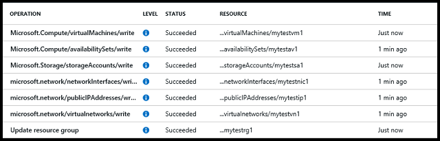

<!-- Ibiza portal: tested -->

<properties
	pageTitle="使用 C# 部署 Azure 资源 | Azure"
	description="了解如何使用 C# 和 Azure Resource Manager 创建 Azure 资源。"
	services="virtual-machines-windows"
	documentationCenter=""
	authors="davidmu1"
	manager="timlt"
	editor="tysonn"
	tags="azure-resource-manager"/>

<tags
	ms.service="virtual-machines-windows"
	ms.date="04/18/2016"
	wacn.date="06/20/2016"/>

# 使用 C 部署 Azure 资源# 

本文说明如何使用 Azure PowerShell 设置身份验证和存储，然后使用 C# 创建 Azure 资源。

若要完成本教程，你还需要：

- [Visual Studio](http://msdn.microsoft.com/zh-cn/library/dd831853.aspx)
- [Windows Management Framework 3.0](http://www.microsoft.com/download/details.aspx?id=34595) 或 [Windows Management Framework 4.0](http://www.microsoft.com/download/details.aspx?id=40855)
- [身份验证令牌](/documentation/articles/resource-group-authenticate-service-principal/)

完成这些步骤大约需要 30 分钟。

## 步骤 1：安装 Azure PowerShell

有关如何安装最新版 Azure PowerShell 的信息，请参阅 [How to install and configure Azure PowerShell（如何安装和配置 Azure PowerShell）](/documentation/articles/powershell-install-configure/)。选择要使用的订阅，然后登录到你的 Azure 帐户。

## 步骤 2：创建 Visual Studio 项目并安装这些库

使用 NuGet 包是安装完成本教程所需的库的最简单方法。你必须安装 Azure 资源管理库、Azure Active Directory 身份验证库和计算机资源提供程序库。若要在 Visual Studio 中获取这些库，请执行以下操作：

1. 单击“文件”>“新建”>“项目”。

2. 在“模板”>“Visual C#”中，选择“控制台应用程序”，输入项目的名称和位置，然后单击“确定”。

3. 在解决方案资源管理器中右键单击项目名称，然后单击“管理 NuGet 包”。

4. 在搜索框中键入 *Active Directory*，单击“Active Directory 身份验证库”包旁边的“安装”，然后根据说明安装该包。

5. 在页面顶部，选择“包括预发行版”。在搜索框中键入 *Microsoft.Azure.Management.Compute*，单击“计算 .NET 库”的“安装”，然后按照说明安装该包。

6. 在搜索框中键入 *Microsoft.Azure.Management.Network*，单击“网络 .NET 库”的“安装”，然后按照说明安装该包。

7. 在搜索框中键入 *Microsoft.Azure.Management.Storage*，单击“存储 .NET 库”的“安装”，然后按照说明安装该包。

8. 在搜索框中键入 *Microsoft.Azure.ResourceManager*，然后单击“资源管理库”旁的“安装”。

现在，你可以开始使用这些库来创建应用程序了。

## 步骤 3：创建用于对请求进行身份验证的凭据

创建 Azure Active Directory 应用程序并安装身份验证库后，你可以将应用程序信息格式化为凭据，以用于对发往 Azure Resource Manager 的请求进行身份验证。执行以下操作：

1. 打开你为项目创建的 Program.cs 文件，然后在该文件的顶部添加以下 using 语句：

        using Microsoft.Azure;
        using Microsoft.IdentityModel.Clients.ActiveDirectory;
        using Microsoft.Azure.Management.Resources;
        using Microsoft.Azure.Management.Resources.Models;
        using Microsoft.Azure.Management.Storage;
        using Microsoft.Azure.Management.Storage.Models;
        using Microsoft.Azure.Management.Network;
        using Microsoft.Azure.Management.Network.Models;
        using Microsoft.Azure.Management.Compute;
        using Microsoft.Azure.Management.Compute.Models;
        using Microsoft.Rest;

2. 将以下方法添加到 Program 类，以获取创建凭据所需的令牌：

        private static string GetAuthorizationHeader()
        {
          ClientCredential cc = new ClientCredential("{application-id}", "{password}");
          var context = new AuthenticationContext("https://login.chinacloudapi.cn/{tenant-id}");
          var result = context.AcquireTokenAsync("https://management.chinacloudapi.cn/", cc);

          if (result == null)
          {
            throw new InvalidOperationException("Failed to obtain the JWT token");
          }

          string token = result.AccessToken;

          return token;
        }

	将 {application-id} 替换为前面记下的应用程序标识符，将 {password} 替换为你为 AD 应用程序选择的密码，将 {tenant-id} 替换为订阅的租户标识符。可以通过运行 Get-AzureRmSubscription 找到租户 ID。

3. 将以下代码添加到 Program.cs 文件中的 Main 方法，以创建凭据：

        var token = GetAuthorizationHeader();
        var credential = new TokenCredentials(token);

4. 保存 Program.cs 文件。

## 步骤 4：添加代码以注册提供程序并创建资源

### 注册提供程序并创建资源组

必须在资源组中包含所有资源。将资源添加到组之前，必须将订阅注册到资源提供程序。

1. 将变量添加到 Program 类的 Main 方法，以便指定需要用于资源的名称、资源的位置（例如“中国北部”）、管理员帐户信息，以及订阅标识符：

        var groupName = "resource group name";
        var ipName = "public ip name";
        var avSetName = "availability set name";
        var nicName = "network interface name";
        var storageName = "storage account name";
        var vmName = "virtual machine name";  
        var vnetName = "virtual network name";
        var subnetName = "subnet name";
        var adminName = "administrator account name";
        var adminPassword = "administrator account password";
        var location = "location name";
        var subscriptionId = "subsciption id";

    将所有变量值替换为你想要使用的名称和标识符。可以通过运行 Get-AzureRmSubscription 查找订阅标识符。

2. 将以下方法添加到 Program 类，以创建资源组：

        public static void CreateResourceGroup(
          TokenCredentials credential,
          string groupName,
          string subscriptionId,
          string location)
        {
          Console.WriteLine("Creating the resource group...");
          var resourceManagementClient = new ResourceManagementClient(credential);
          resourceManagementClient.SubscriptionId = subscriptionId;
          var resourceGroup = new ResourceGroup {
            Location = location
          };
          var rgResult = resourceManagementClient.ResourceGroups.CreateOrUpdate(groupName, resourceGroup);
          Console.WriteLine(rgResult.Properties.ProvisioningState);

          var rpResult = resourceManagementClient.Providers.Register("Microsoft.Storage");
          Console.WriteLine(rpResult.RegistrationState);
          rpResult = resourceManagementClient.Providers.Register("Microsoft.Network");
          Console.WriteLine(rpResult.RegistrationState);
          rpResult = resourceManagementClient.Providers.Register("Microsoft.Compute");
          Console.WriteLine(rpResult.RegistrationState);
        }

3. 将以下代码添加到 Main 方法，以调用你刚刚添加的方法：

        CreateResourceGroup(
          credential,
          groupName,
          subscriptionId,
          location);
        Console.ReadLine();

### 创建存储帐户

需要一个存储帐户来存储为虚拟机创建的虚拟硬盘文件。

1. 将以下方法添加到 Program 类，以创建存储帐户：

        public static void CreateStorageAccount(
          TokenCredentials credential,         
          string storageName,
          string groupName,
          string subscriptionId,
          string location)
        {
          Console.WriteLine("Creating the storage account...");
          var storageManagementClient = new StorageManagementClient(credential);
          storageManagementClient.SubscriptionId = subscriptionId;
          var saResult = storageManagementClient.StorageAccounts.Create(
            groupName,
            storageName,
            new StorageAccountCreateParameters()
            {
              AccountType = AccountType.StandardLRS,
              Location = location
            }
          );
          Console.WriteLine(saResult.ProvisioningState);
        }

2. 将以下代码添加到 Program 类的 Main 方法，以调用你刚刚添加的方法：

        CreateStorageAccount(
          credential,
          storageName,
          groupName,
          subscriptionId,
          location);
        Console.ReadLine();

### 创建公共 IP 地址

与虚拟机通信需要公共 IP 地址。

1. 将以下方法添加到 Program 类，以创建虚拟机的公共 IP 地址：

        public static void CreatePublicIPAddress(
          TokenCredentials credential,
          string ipName,  
          string groupName,
          string subscriptionId,
          string location)
        {
          Console.WriteLine("Creating the public ip...");
          var networkManagementClient = new NetworkManagementClient(credential);
          networkManagementClient.SubscriptionId = subscriptionId;
          var ipResult = networkManagementClient.PublicIPAddresses.CreateOrUpdate(
            groupName,
            ipName,
            new PublicIPAddress
            {
              Location = location,
              PublicIPAllocationMethod = "Dynamic"
            }
          );
          Console.WriteLine(ipResult.ProvisioningState);
        }

2. 将以下代码添加到 Program 类的 Main 方法，以调用你刚刚添加的方法：

        CreatePublicIPAddress(
          credential,
          ipName,
          groupName,
          subscriptionId,
          location);
        Console.ReadLine();

### 创建虚拟网络

使用 Resource Manager 部署模型创建的虚拟机必须位于虚拟网络中。

1. 将以下方法添加到 Program 类，以创建子网和虚拟网络：

        public static void CreateNetwork(
          TokenCredentials credential,
          string vnetName,
          string subnetName,
          string nicName,
          string ipName,
          string groupName,
          string subscriptionId,
          string location)
        {
          Console.WriteLine("Creating the virtual network...");
          var networkManagementClient = new NetworkManagementClient(credential);
          networkManagementClient.SubscriptionId = subscriptionId;
          
          var subnet = new Subnet
          {
            Name = subnetName,
            AddressPrefix = "10.0.0.0/24"
          };
          
          var address = new AddressSpace {
            AddressPrefixes = new List<string> { "10.0.0.0/16" }
          };
          
          var vnResult = networkManagementClient.VirtualNetworks.CreateOrUpdate(
            groupName,
            vnetName,
            new VirtualNetwork
            {
              Location = location,
              AddressSpace = address,
              Subnets = new List<Subnet> { subnet }
            }
          );
          
          Console.WriteLine(vnResult.ProvisioningState);
          
          var subnetResponse = networkManagementClient.Subnets.Get(
            groupName,
            vnetName,
            subnetName
          );

          var pubipResponse = networkManagementClient.PublicIPAddresses.Get(groupName, ipName);

          Console.WriteLine("Updating the network with the nic...");
          var nicResult = networkManagementClient.NetworkInterfaces.CreateOrUpdate(
            groupName,
            nicName,
            new NetworkInterface
            {
              Location = location,
              IpConfigurations = new List<NetworkInterfaceIPConfiguration>
              {
                new NetworkInterfaceIPConfiguration
                {
                  Name = "nicConfig1",
                  PublicIPAddress = pubipResponse,
                  Subnet = subnetResponse
                }
              }
            }
          );
          Console.WriteLine(vnResult.ProvisioningState);
        }

2. 将以下代码添加到 Program 类的 Main 方法，以调用你刚刚添加的方法：

        CreateNetwork(
          credential,
          vnetName,
          subnetName,
          nicName,
          ipName,
          groupName,
          subscriptionId,
          location);
        Console.ReadLine();

### 创建可用性集

可用性集可以方便你管理应用程序所使用的虚拟机的维护。

1. 将以下方法添加到 Program 类，以创建可用性集：

        public static void CreateAvailabilitySet(
          TokenCredentials credential,
          string avsetName,
          string groupName,
          string subscriptionId,
          string location)
        {
          Console.WriteLine("Creating the availability set...");
          var computeManagementClient = new ComputeManagementClient(credential);
          computeManagementClient.SubscriptionId = subscriptionId;
          var avResult = computeManagementClient.AvailabilitySets.CreateOrUpdate(
            groupName,
            avsetName,
            new AvailabilitySet()
            {
              Location = location
            }
          );
        }

2. 将以下代码添加到 Program 类的 Main 方法，以调用你刚刚添加的方法：

        CreateAvailabilitySet(
          credential,
          avSetName,
          groupName,
          subscriptionId,
          location);
        Console.ReadLine();

### 创建虚拟机

创建所有支持的资源后，可以创建虚拟机。

1. 将以下方法添加到 Program 类，以创建虚拟机：

        public static void CreateVirtualMachine(
          TokenCredentials credential,
          string vmName,
          string groupName,
          string nicName,
          string avsetName,
          string storageName,
          string adminName,
          string adminPassword,
          string subscriptionId,
          string location)
        {
          var networkManagementClient = new NetworkManagementClient(credential);
          networkManagementClient.SubscriptionId = subscriptionId;
          var nic = networkManagementClient.NetworkInterfaces.Get(groupName, nicName);

          var computeManagementClient = new ComputeManagementClient(credential);
          computeManagementClient.SubscriptionId = subscriptionId;
          var avSet = computeManagementClient.AvailabilitySets.Get(groupName, avsetName);

          Console.WriteLine("Creating the virtual machine...");
          var vm = computeManagementClient.VirtualMachines.CreateOrUpdate(
            groupName,
            vmName,
            new VirtualMachine
            {
              Location = location,
              AvailabilitySet = new Microsoft.Azure.Management.Compute.Models.SubResource
              {
                Id = avSet.Id
              },
              HardwareProfile = new HardwareProfile
              {
                VmSize = "Standard_A0"
              },
              OsProfile = new OSProfile
              {
                AdminUsername = adminName,
                AdminPassword = adminPassword,
                ComputerName = vmName,
                WindowsConfiguration = new WindowsConfiguration
                {
                  ProvisionVMAgent = true
                }
              },
              NetworkProfile = new NetworkProfile
              {
                NetworkInterfaces = new List<NetworkInterfaceReference>
                {
                  new NetworkInterfaceReference { Id = nic.Id }
                }
              },
              StorageProfile = new StorageProfile
              {
                ImageReference = new ImageReference
                {
                  Publisher = "MicrosoftWindowsServer",
                  Offer = "WindowsServer",
                  Sku = "2012-R2-Datacenter",
                  Version = "latest"
                },
                OsDisk = new OSDisk
                {
                  Name = "mytestod1",
                  CreateOption = DiskCreateOptionTypes.FromImage,
                  Vhd = new VirtualHardDisk
                  {
                    Uri = "http://" + storageName + ".blob.core.chinacloudapi.cn/vhds/mytestod1.vhd"
                  }
                }
              }
            }
          );
          Console.WriteLine(vm.ProvisioningState);
        }

	>[AZURE.NOTE] 本教程创建运行 Windows Server 操作系统版本的虚拟机。若要详细了解如何选择其他映像，请参阅 [Navigate and select Azure virtual machine images with Windows PowerShell and the Azure CLI（使用 Windows PowerShell 和 Azure CLI 来导航和选择 Azure 虚拟机映像）](/documentation/articles/virtual-machines-linux-cli-ps-findimage/)。

2. 将以下代码添加到 Main 方法，以调用你刚刚添加的方法：

        CreateVirtualMachine(
          credential,
          vmName,
          groupName,
          nicName,
          avSetName,
          storageName,
          adminName,
          adminPassword,
          subscriptionId,
          location);
        Console.ReadLine();

##步骤 5：添加代码以删除资源

由于你需要为 Azure 中使用的资源付费，因此，删除不再需要的资源总是一种良好的做法。如果要删除虚拟机和所有支持资源，只需删除资源组。

1. 将以下方法添加到 Program 类，以删除资源组：

        public static void DeleteResourceGroup(
          TokenCredentials credential,
          string groupName)
        {
            Console.WriteLine("Deleting resource group...");
            var resourceGroupClient = new ResourceManagementClient(credential);
            resourceGroupClient.ResourceGroups.DeleteAsync(groupName);
        }

2. 将以下代码添加到 Main 方法，以调用你刚刚添加的方法：

        DeleteResourceGroup(
          credential,
          groupName);
        Console.ReadLine();

## 步骤 6：运行控制台应用程序

1. 若要运行控制台应用程序，请在 Visual Studio 中单击“启动”，然后使用用于订阅的相同用户名和密码登录到 Azure AD。

2. 在返回每个状态代码后，按 **Enter** 创建每个资源。创建虚拟机后，执行下一步骤，然后按 Enter 删除所有资源。

	控制台应用程序从头到尾完成运行大约需要 5 分钟时间。在按 Enter 开始删除资源之前，你可能需要在 Azure 门户预览中花几分钟时间来验证资源的创建。

3. 在 Azure 门户预览中浏览到“审核日志”，以查看资源的状态：

	
    
## 后续步骤

参考 [Deploy an Azure Virtual Machine using C# and a Resource Manager template（使用 C# 和 Resource Manager 模板部署 Azure 虚拟机）](/documentation/articles/virtual-machines-windows-csharp-template/)中的信息，利用模板创建虚拟机

<!---HONumber=Mooncake_0613_2016-->